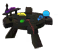
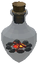

# ⚔️ PHẦN 1 — Jewelcrafting: Bảng Thống Kê Hiệu Ứng Gem

Phân loại theo GemLocation — Nguồn: `Sockets.yml, Groups.yml, Synergy.yml, English.yml`

**Cột "Tham số":** $1/$2/$3 → tên field trong Config struct + giá trị mặc định nếu có [OptionalPower]. Giá trị thực tế được tính từ power range trong YAML (có seed randomization).

## 🗡️ Weapon & ElementalMagic

| Hiệu ứng | Gem | Power | Mô tả ngắn | Mô tả chi tiết | Tham số ($1/$2/$3) |
| --- | --- | --- | --- | --- | --- |
| **Fire Starter** | 🔴 Red | 5 / 10 / 15 | Additional fire damage. | $2% cơ hội gây $1% sát thương lửa | $1 = Power (sát thương%) $2 = Chance (mặc định 20) |
| **Ice Heart** | 🔵 Blue | 5 / 10 / 15 | Additional frost damage. | $2% cơ hội gây $1% sát thương băng | $1 = Power (sát thương%) $2 = Chance (mặc định 20) |
| **Snake Bite** | 🟢 Green | 5 / 10 / 15 | Additional poison damage. | $2% cơ hội gây $1% sát thương độc | $1 = Power (sát thương%) $2 = Chance (mặc định 20) |
| **Shadow Hit** | ⚫ Black | 2 / 3 / 4 | Chance to hit multiple targets. | $1% cơ hội đánh $3 mục tiêu phụ trong $2m | $1 = Power (% cơ hội) $2 = Range (mặc định 5m) $3 = Amount (mặc định 1) |
| **Vampire** | 🟡 Yellow | 6 / 8 / 10 | Chance to steal life when attacking. | $1% cơ hội hút tới $2 máu khi tấn công | $1 = Power (% cơ hội) $2 = MaxHeal (mặc định 6) |
| **Berserk** | 🟣 Purple | 1 / 2 / 3 | Increases attack speed. | Tốc độ đánh tăng $1% | $1 = Power (tốc độ đánh%) |
| **Berserk (corrupted)** | 💀 Corrupted | -10–10 | Increases attack speed. | Tốc độ đánh tăng $1% | $1 = Power (tốc độ đánh%) |
| **Fleeting Life** | 🔷 Cyan | 6 / 8 / 10 | Heal most injured group member. | $1% cơ hội hồi máu đồng đội gần bị thương nhất. Hồi tăng 300% nếu càng gần | $1 = Power (% cơ hội) |
| **Overexertion** (Comfort Tweaks) | 🔵 Blueish (Comfortite) | 10 / 20 / 40 · 1 / 2 / 4 | Overexert your attacks, increasing damage by using your vitality. | $1% sát thương tăng; khi rested: mỗi hit trừ $2% thời gian rested còn lại; không rested: nhận $2% maxHP sát thương | $1 = Power (% damage) $2 = Power (penalty %) |
| **Acceleration** (Comfort Tweaks) | 🔴 Redish (Comfordium) | 2 / 4 / 6 | Increased attack speed while rested. | Khi rested: tốc độ tấn công tăng $1% | $1 = Power (% tốc độ đánh) |

## 🔱 Vũ khí cụ thể

### Spear

| Hiệu ứng | Gem | Power | Mô tả ngắn | Mô tả chi tiết | Tham số |
| --- | --- | --- | --- | --- | --- |
| **Magnetic** | ⚫ Black | 20 / 30 / 40 | Chance to return after throw. | $1% cơ hội phi lao quay lại sau khi ném | $1 = Power (% cơ hội) |

### Axe

| Hiệu ứng | Gem | Power | Mô tả ngắn | Mô tả chi tiết | Tham số |
| --- | --- | --- | --- | --- | --- |
| **Opportunity** | 🔴 Red | 5 / 7 / 9 | Damage vs low health targets. | Lên tới $1% sát thương thêm dựa trên % máu mục tiêu | $1 = Power (% sát thương) |

### Knife

| Hiệu ứng | Gem | Power | Mô tả ngắn | Mô tả chi tiết | Tham số |
| --- | --- | --- | --- | --- | --- |
| **Perforation** | 🟠 Orange | 2 / 4 / 6 | Periodic true damage on special attack. | Gây chảy máu 2s với $1% sát thương chuẩn | $1 = Power (% sát thương chuẩn) |

### Polearm

| Hiệu ứng | Gem | Power | Mô tả ngắn | Mô tả chi tiết | Tham số |
| --- | --- | --- | --- | --- | --- |
| **Thunderclap** | 🟠 Orange | 3 / 5 / 7 | Marks enemy for lightning damage. | Đánh dấu 8s tích lũy $1% sát thương dạng sét; nổ nếu máu dưới ngưỡng | $1 = Power (% sát thương tích lũy) |

## 🔮 Magic & BloodMagic

| Slot | Hiệu ứng | Gem | Power | Mô tả ngắn | Mô tả chi tiết | Tham số |
| --- | --- | --- | --- | --- | --- | --- |
| Magic | **Magical Bargain** | 🟠 Orange | 3 / 5 / 7 | Reduced Eitr cost. | $1% giảm Eitr khi dùng vũ khí phép | $1 = Power (% giảm Eitr) |
| BloodMagic | **Precious Blood** | 🔵 Blue | 3 / 5 / 7 | Decreases health cost. | $1% giảm máu tốn khi dùng blood magic | $1 = Power (% giảm máu) |

## 🛡️ Chest

| Hiệu ứng | Gem | Power | Mô tả ngắn | Mô tả chi tiết | Tham số |
| --- | --- | --- | --- | --- | --- |
| **Defender** | 🔴 Red | 1 / 2 / 3 | Increased armor. | Giáp tăng $1 | $1 = Power (giáp cộng thêm) |
| **Defender (corr.)** | 💀 Corrupted | -10–10 | Increased armor. | Giáp tăng $1 | $1 = Power (giáp cộng thêm) |
| **Vitality** | 🔵 Blue | 3 / 5 / 7 | Additional HP. | Máu cơ bản tăng $1 | $1 = Power (HP cộng thêm) |
| **Regeneration** | 🟢 Green | 1 / 2 / 3 | Additional HP regen. | Hồi máu tăng $1 | $1 = Power (hồi máu cộng thêm) |
| **Mirror** | ⚫ Black | 2 / 4 / 6 | Reflects damage. | $1% cơ hội phản $2% sát thương nhận vào | $1 = Power (% cơ hội) $2 = DamageReflected (mặc định 100%) |
| **Fade** | 🟠 Orange | 1 / 2 / 3 | Invincible after big hit. | Nếu đòn >$2% máu tối đa, bất tử $1s | $1 = Power (thời gian bất tử - giây) $2 = DamageThreshold (mặc định 30% máu) |
| **Safe Haven** | 🔷 Cyan | 1 / 2 / 3 | Reduce group damage taken. | Giảm $1% sát thương đồng đội gần | $1 = Power (% giảm sát thương) |
| **Invigorated** (Comfort Tweaks) | 🔴 Redish (Comfordium) | 10 / 25 / 50 | Increased stamina regeneration while rested. | Khi rested: hồi phục stamina tăng $1% | $1 = Power (% hồi stamina) |

## 🦵 Legs

| Hiệu ứng | Gem | Power | Mô tả ngắn | Mô tả chi tiết | Tham số |
| --- | --- | --- | --- | --- | --- |
| **Sprinter** | 🔴 Red | 3 / 5 / 7 | Increased movement speed. | Tốc độ di chuyển tăng $1% | $1 = Power (% tốc độ) |
| **Sprinter (corr.)** | 💀 Corrupted | -10–10 | Increased movement speed. | Tốc độ di chuyển tăng $1% | $1 = Power (% tốc độ) |
| **Ninja** | ⚫ Black | 12 / 14 / 16 | Increases sneak skill. | Cấp Sneak tăng $1 | $1 = Power (cấp cộng thêm) |
| **Nimble** | 🔵 Blue | 10 / 20 / 30 | Dodge stamina reduction. | $1% giảm stamina khi né | $1 = Power (% giảm stamina) |
| **Marathon** | 🟡 Yellow | 7 / 9 / 11 | Run stamina reduction. | $1% giảm stamina khi chạy | $1 = Power (% giảm stamina) |
| **Mountain Goat** | 🟣 Purple | 10 / 15 / 20 | Climb steeper slopes. | Leo $1% dốc hơn mà không trượt | $1 = Power (% độ dốc) |
| **Lifeguard** | 🟠 Orange | 20 / 25 / 30 | Swimming skill. | Cấp Bơi tăng $1 | $1 = Power (cấp cộng thêm) |
| **Momentum** | 🟢 Green | 5 / 10 / 15 | Stamina on kill. | Hồi $1 stamina khi hạ mục tiêu | $1 = Power (stamina hồi lại) |
| **Cowardice** | 🔷 Cyan | 3 / 4 / 5 | Move speed on damage in group. | $1% tốc độ $2s khi bị đánh, gần đồng đội. Stack $3 lần | $1 = Power (% tốc độ) $2 = Duration (mặc định 20s) $3 = MaxStacks (mặc định 5) |
| **Restless Legs** (Comfort Tweaks) | 🔵 Blueish (Comfortite) | 10 / 25 / 50 | While rested, run stamina drain is reduced. | Khi rested: tiêu hao stamina khi chạy giảm $1% | $1 = Power (% giảm tiêu hao) |
| **Secret Pocket** (Comfort Tweaks) | 🔴 Redish (Comfordium) | 50 / 100 / 150 · 1 / 3 / 5 | Carry weight is increased while rested. | Khi rested: tải trọng +$1kg; nếu tổng cân nặng vượt (maxCarry − $1): comfort giảm $2 | $1 = Power (kg tải) $2 = Uncomfort (comfort trừ) |

## 🎓 Head

| Hiệu ứng | Gem | Power | Mô tả ngắn | Mô tả chi tiết | Tham số |
| --- | --- | --- | --- | --- | --- |
| **Explorer** | 🟢 Green | 10 / 15 / 20 | Discovery radius increased. | $1% tăng bán kính khám phá | $1 = Power (% bán kính) |
| **Student** | 🔴 Red | 2 / 3 / 5 | Experience gain increased. | $1% thêm exp cho mọi kỹ năng | $1 = Power (% exp) |
| **Resilience** | 🟡 Yellow | 5 / 7 / 9 | Reduce durability loss. | $1% giảm hao mòn trang bị | $1 = Power (% giảm hao mòn) |
| **Gourmet** | 🟣 Purple | 10 / 13 / 16 | Reduces food drain. | $1% giảm tốc độ tiêu hao thức ăn | $1 = Power (% giảm tiêu hao) |
| **Merciful Death** | 🔵 Blue | 10 / 15 / 20 | Keep exp on death. | $1% cơ hội không mất exp kỹ năng khi chết | $1 = Power (% cơ hội) |
| **Eitr Surge** | 🟠 Orange | 3 / 5 / 7 | Increased Eitr regen. | $1% tăng hồi Eitr | $1 = Power (% hồi Eitr) |
| **Shared Healing** | 🔷 Cyan | 10 / 20 / 30 | Heal group with potion. | Hồi $1% giá trị potion cho đồng đội gần khi uống potion máu | $1 = Power (% hồi) |
| **Refreshed Mind** (Comfort Tweaks) | 🔵 Blueish (Comfortite) | 5 / 10 / 25 | Increases XP gain while rested. | Khi rested: XP mọi kỹ năng tăng $1% | $1 = Power (% XP) |

## 🏹 Bow

| Hiệu ứng | Gem | Power | Mô tả ngắn | Mô tả chi tiết | Tham số |
| --- | --- | --- | --- | --- | --- |
| **Endless Arrows** | 🔴 Red | 4 / 6 / 8 | Ammo usage reduced. | $1% cơ hội không tốn tên | $1 = Power (% cơ hội) |
| **Master Archer** | 🟣 Purple | 4 / 6 / 8 | Bow skill level. | Cấp Bow tăng $1 | $1 = Power (cấp) |
| **Quick Draw** | ⚫ Black | 3 / 5 / 7 | Increased draw speed. | $1% tăng tốc kéo cung | $1 = Power (% tốc độ) |
| **Archery Mentor** | 🔷 Cyan | 20 / 30 / 40 | Bow skill for group. | Cấp Bow đồng đội tăng $1% của chênh lệch skill | $1 = Power (% chênh lệch) |

## 🎯 Crossbow

| Hiệu ứng | Gem | Power | Mô tả ngắn | Mô tả chi tiết | Tham số |
| --- | --- | --- | --- | --- | --- |
| **Endless Bolts** | 🔴 Red | 4 / 6 / 8 | Ammo usage reduced. | $1% cơ hội không tốn bolt | $1 = Power (% cơ hội) |
| **Master Arbalist** | 🟣 Purple | 4 / 6 / 8 | Crossbow skill level. | Cấp Crossbow tăng $1 | $1 = Power (cấp) |
| **Quick Load** | ⚫ Black | 3 / 5 / 7 | Reduced reload time. | $1% giảm thời gian nạp lại | $1 = Power (% giảm) |
| **Arbalist Mentor** | 🔷 Cyan | 20 / 30 / 40 | Crossbow skill for group. | Cấp Crossbow đồng đội tăng $1% của chênh lệch skill | $1 = Power (% chênh lệch) |

## 🏹🎯 Bow & Crossbow (dùng chung)

| Hiệu ứng | Gem | Power | Mô tả ngắn | Mô tả chi tiết | Tham số |
| --- | --- | --- | --- | --- | --- |
| **Echo** | 🟡 Yellow | 2 / 3 / 4 | Extra projectiles. | $1% cơ hội bắn thêm $2 tên/bolt miễn phí | $1 = Power (% cơ hội) $2 = BonusProjectiles (mặc định 1) |
| **Necromancer** | 🟢 Green | 3 / 5 / 7 | Summon skeleton archers. | $1% cơ hội triệu hồi cung thủ xương $2s | $1 = Power (% cơ hội) $2 = Duration (mặc định 10s) |
| **Ricochet** | 🟠 Orange | 3 / 5 / 7 | Hit second target. | $1% cơ hội nảy trúng mục tiêu thứ 2 trong $2m | $1 = Power (% cơ hội) $2 = Range (mặc định 15m) |
| **Elemental Chaos** | 🔵 Blue | 10 / 15 / 20 | Elemental damage. | $2% cơ hội gây $1% sát thương lửa/băng/sét/độc | $1 = Power (% sát thương) $2 = Chance (mặc định 20) |

## 🧥 Cloak

| Hiệu ứng | Gem | Power | Mô tả ngắn | Mô tả chi tiết | Tham số |
| --- | --- | --- | --- | --- | --- |
| **Glider** | 🟢 Green | 3 / 5 / 7 | Glide while falling. | Khi >$2m trên mặt đất, lướt $1s trước khi rơi | $1 = Power (thời gian lướt - giây) $2 = RequiredHeight (mặc định 3.5m) |
| **Inconspicuous** | ⚫ Black | 10 / 15 / 20 | Decreased detection. | $1% giảm tầm bị kẻ địch phát hiện | $1 = Power (% giảm) |
| **Turtle Shell** | 🟡 Yellow | 8 / 10 / 12 | Back damage reduction. | $1% giảm sát thương khi bị đánh từ sau lưng | $1 = Power (% giảm) |
| **Windwalk** | 🟣 Purple | 5 / 10 / 15 | Run with the wind. | Lên tới $1% tốc độ khi chạy theo hướng gió | $1 = Power (% tốc độ) |
| **Air-Dried** | 🔵 Blue | 10 / 20 / 30 | Dry quicker. | Giảm $1s hiệu ứng ướt | $1 = Power (giây) |
| **Leading Wolf** | 🔷 Cyan | 8 / 10 / 12 | Group move speed. | Tốc độ nhóm tăng $1% nếu bạn chạy đầu | $1 = Power (% tốc độ) |
| **Nourishing** (Comfort Tweaks) | 🔵 Blueish (Comfortite) | 25 / 50 / 100 · 3 / 5 / 10 | Food heals you for a percentage of the health it adds while resting. | Khi đang Resting và comfort ≥ $2: ăn food → hồi $1% lượng HP food cung cấp | $1 = Power (% hồi máu) $2 = Comfort requirement |

## 🛡️ Shield

| Hiệu ứng | Gem | Power | Mô tả ngắn | Mô tả chi tiết | Tham số |
| --- | --- | --- | --- | --- | --- |
| **Unfazed** | 🔵 Blue | 10 / 15 / 20 | Stagger threshold. | $1% sát thương tối đa trước khi bị choáng | $1 = Power (% ngưỡng) |
| **Parry Master** | 🟣 Purple | 50 / 80 / 100 | Parry frame increase. | Khung parry tăng $1ms | $1 = Power (ms) |
| **Avoidance** | 🟡 Yellow | 1 / 2 / 3 | Avoid damage. | $1% cơ hội giảm $2% sát thương khi bị trúng đòn | $1 = Power (% cơ hội) $2 = DamageReduction (mặc định 100% = immune) |
| **Tank** | ⚫ Black | 4 / 6 / 8 | Blocking skill. | Cấp Blocking tăng $1 | $1 = Power (cấp) |
| **Pain Tolerance** | 🔴 Red | 1 / 2 / 3 | Damage reduction. | Sát thương nhận vào giảm $1% | $1 = Power (% giảm) |
| **Pain Tolerance (corr.)** | 💀 Corrupted | -10–10 | Damage reduction. | Sát thương nhận vào giảm $1% | $1 = Power (% giảm) |
| **Fast Reaction** | 🟠 Orange | ParryFrame: 50/85/120 ParryPower: 10/20/30 | Parry frame down, power up. | Khung parry giảm $1ms, sức parry tăng $2% | $1 = ParryFrameDecrease (ms) $2 = ParryPowerIncrease (%) |
| **Vampiric Parry** | 🟢 Green | 1 / 2 / 3 | Heal on parry. | Hồi $1% máu tối đa khi parry thành công | $1 = Power (% máu hồi) |
| **Dedicated Tank** | 🔷 Cyan | 50 / 60 / 70 | Tank mode. | Blocking +100, khiên không giảm tốc. Chỉ gây $1% dmg. Cần đồng đội gần | $1 = Power (% sát thương còn lại) |

## ⛏️ Tool

| Hiệu ứng | Gem | Power | Mô tả ngắn | Mô tả chi tiết | Tham số |
| --- | --- | --- | --- | --- | --- |
| **Unbreakable** | 🟣 Purple | 40 / 50 / 60 | Durability loss decrease. | $1% giảm hao mòn | $1 = Power (% giảm) |
| **Energetic** | 🟡 Yellow | 15 / 25 / 30 | Stamina usage decrease. | $1% giảm stamina | $1 = Power (% giảm) |
| **Frenzy** | ⚫ Black | 5 / 10 / 15 | Usage speed increase. | $1% tăng tốc sử dụng | $1 = Power (% tốc độ) |
| **Lucky Lumberjack** | 🔴 Red | 10 / 15 / 20 | Double wood. | $1% cơ hội nhân đôi gỗ khi đốn | $1 = Power (% cơ hội) |
| **Lucky Miner** | 🟢 Green | 10 / 15 / 20 | Double ore. | $1% cơ hội nhân đôi quặng khi đào | $1 = Power (% cơ hội) |

## 🧰 Utility

| Hiệu ứng | Gem | Power | Mô tả ngắn | Mô tả chi tiết | Tham số |
| --- | --- | --- | --- | --- | --- |
| **Power Recovery** | 🟢 Green | 10 / 12 / 15 | Forsaken cooldown reduced. | $1% giảm hồi chiêu Forsaken | $1 = Power (% giảm CD) |
| **Comfortable** | 🟡 Yellow | 3 / 5 / 7 | Comfort increase. | Comfort khi nghỉ tăng $1 | $1 = Power (comfort) |
| **Hercules** | 🟣 Purple | 10 / 15 / 20 | Carry weight increase. | $1% tăng tải trọng | $1 = Power (% tải trọng) |
| **Glowing Spirit** | 🔵 Blue | 4 / 6 / 8 | Glowing spirit summon. | Triệu hồi linh hồn phát sáng $1 phút khi đêm xuống | $1 = Power (phút) |
| **Dungeon Guide** | ⚫ Black | 2 / 4 / 6 | Dungeon guide summon. | Triệu hồi dẫn đường $1 phút khi vào dungeon | $1 = Power (phút) |
| **Daring** | 🟠 Orange | 10 / 20 / 30 | Level up creatures. | $1% quái gần đó tăng 1 cấp | $1 = Power (% cơ hội) |
| **Wisplight** | 💡 Wisplight | 10 | Clear Mistlands mist. | Xóa $1m sương mù Mistlands | $1 = Power (mét) |
| **Wishbone** | 🦴 Wishbone | 10 | Find hidden things. | $1% tăng tầm ping đồ ẩn | $1 = Power (% tầm) |
| **Relaxed** (Comfort Tweaks) | 🔴 Redish (Comfordium) | 6 / 12 / 30 | Increases the rested time per comfort. | Thời gian rested mỗi cấp comfort +$1s (mặc định 60s/cấp) | $1 = Power (giây/comfort) |

## 📿 Trinket

| Hiệu ứng | Gem | Power | Mô tả ngắn | Mô tả chi tiết | Tham số |
| --- | --- | --- | --- | --- | --- |
| **Raging** | 🟡 Yellow | 5 / 10 / 15 | Double adrenaline. | $1% cơ hội nhân đôi adrenaline | $1 = Power (% cơ hội) |
| **Raging (corr.)** | 💀 Corrupted | -10–10 | Double adrenaline. | $1% cơ hội nhân đôi adrenaline | $1 = Power (% cơ hội) |
| **Protective Trinket** | 🟣 Purple | 6 / 12 / 18 | Damage reduction. | Giảm $1% sát thương trong $2s sau khi kích hoạt | $1 = Power (% giảm) $2 = Duration (mặc định 3s) |
| **Resentful Adrenaline** | 🟢 Green | 15 / 25 / 35 | Slow adrenaline decay. | $1% giảm tốc phân hủy adrenaline | $1 = Power (% giảm) |

## 👑 Boss Gems (Unique — All Slots)

| Hiệu ứng | Prefab | Boss | CD | Dur. | Mô tả ngắn | Mô tả chi tiết | Tham số |
| --- | --- | --- | --- | --- | --- | --- | --- |
| **Lightning Speed** | `Boss_Crystal_7` spawn Boss_Crystal_7 | 🦌 Eikthyr | 90–120s | 8s | Burst of speed. | Di chuyển $1% nhanh hơn, đánh $5% nhanh hơn $4s. Giảm $7% sát thương, giảm $6% stamina (CD $2-$3s) | $1 = MovementSpeed (60) $2 = MinCooldown (90) $3 = MaxCooldown (120) $4 = Duration (8) $5 = AttackSpeed (100%) $6 = Stamina (50%) $7 = DamageReduction (40%) |
| **Rooted Revenge** | `Boss_Crystal_1` spawn Boss_Crystal_1 | 🌿 Elder | 150–240s | 8s | Root enemies. | Bẫy rễ kẻ địch. $1% sát thương thêm lên kẻ đã bị rễ. Phạm vi $5m (CD $2-$3s, $4s) | $1 = BonusDamage (25%) $2 = MinCooldown (150) $3 = MaxCooldown (240) $4 = Duration (8) $5 = Range (10) |
| **Poisonous Drain** | `Boss_Crystal_2` spawn Boss_Crystal_2 | 💀 Bonemass | 180–210s | 8s | Heal increase. | Hồi máu +$1%, 40 sát thương độc, hút 20% máu | $1 = HealingIncrease (100%) $2 = MinCooldown (180) $3 = MaxCooldown (210) $4 = Duration (8) $5 = PoisonDamage (40) $6 = LifeSteal (20%) |
| **Icy Protection** | `Boss_Crystal_4` spawn Boss_Crystal_4 | 🐉 Moder | 180–210s | 8s | Damage protection. | Giảm $1% sát thương trong $4s. Triệu hồi $5 drakes | $1 = DamageReduction (90%) $2 = MinCooldown (180) $3 = MaxCooldown (210) $4 = Duration (8) $5 = Drakes (3) |
| **Fiery Doom** | `Boss_Crystal_5` spawn Boss_Crystal_5 | 👹 Yagluth | 180–240s | 8s | Stagger chance. | $1% thêm cơ hội choáng khi đánh trúng. 200 sát thương lửa (CD $2-$3s, $4s) | $1 = StaggerChance (30%) $2 = MinCooldown (180) $3 = MaxCooldown (240) $4 = Duration (8) $5 = FireDamage (200) |
| **Apotheosis** | `Boss_Crystal_3` spawn Boss_Crystal_3 | 🕷️ Queen | 150–210s | 8s | Magic burst. | Giảm $1% Eitr, tăng $5% sát thương phép, tăng $6% tốc đánh trong $4s (CD $2-$3s) | $1 = EitrReduction (100%) $2 = MinCooldown (150) $3 = MaxCooldown (210) $4 = Duration (8) $5 = MagicDamageIncrease (15%) $6 = AttackSpeed (20%) |
| **Lizard Friendship** | `Boss_Crystal_8` spawn Boss_Crystal_8 | 🦎 Fader | 420–600s | 30s | Summon Asksvin. | Triệu hồi Asksvin trong $7m, $1 sát thương di chuyển, $5% nhanh, $6% thêm máu, $4s (CD $2-$3s) | $1 = MovementDamage (100) $2 = MinCooldown (420) $3 = MaxCooldown (600) $4 = Duration (30) $5 = SpeedIncrease (15%) $6 = HealthIncrease (200%) $7 = SpawnRange (20) |

## 👥 Group Gem (Unique — All Slots)

| Hiệu ứng | Gem | CD | Dur. | Mô tả ngắn | Mô tả chi tiết | Tham số |
| --- | --- | --- | --- | --- | --- | --- |
| **Together Forever** | 🌈 Group | 45–90s | 8s | Buff/Debuff by group proximity. | Gần đồng đội: +$1% speed, +$5% atk speed, +$6% dmg. Xa: -$7% speed, +$8% dmg nhận (CD $2-$3s, $4s) | $1 = MovementSpeed (30%) $2 = MinCooldown (45) $3 = MaxCooldown (90) $4 = Duration (8) $5 = AttackSpeed (20%) $6 = DamageIncrease (10%) $7 = MovementSpeedReduction (50%) $8 = DamageTakenIncrease (100%) |

## 🎯 Item-Specific

| Item | Hiệu ứng | Gem | Power | Mô tả ngắn | Mô tả chi tiết | Tham số |
| --- | --- | --- | --- | --- | --- | --- |
| StaffShield | **Extensive Embrace** | 🔷 Cyan | 2 / 4 / 6 | Shield range increase. | Tầm tối đa hiệu ứng khiên lên đồng đội tăng $1m | $1 = Power (mét) |

## 🚫 Disabled

| Hiệu ứng | Gem | Slot | Power | Mô tả ngắn | Ghi chú |
| --- | --- | --- | --- | --- | --- |
| **Stealth Archer** | ⚫ Black | Bow | [20, 35, 50] | Noise from arrows reduced. | unset — code đã comment. $1% giảm tiếng ồn khi bắn tên |

## 🔗 Synergies (Global — phân bố gem trang bị)

| Synergy | Giá trị | Điều kiện | Mô tả ngắn | Mô tả chi tiết | Tham số |
| --- | --- | --- | --- | --- | --- |
| **Pyromaniac** | 20 | ≥6 Red, 0 Blue | Fire Starter trigger increase. | Fire Starter có $1% thêm cơ hội kích hoạt | $1 = Power |
| **Resonating Echoes** | 20 | Exactly 3 Yellow | Echo trigger increase. | Echo có $1% thêm cơ hội kích hoạt | $1 = Power |
| **Equilibrium** | 3 | Same # all colors (>0) | Balance damage. | Sát thương gây ra tăng $1%, nhận vào giảm $1% | $1 = Power (cả tăng và giảm) |
| **Eternal Student** | 20 | Red > Black+Purple (≥2) | Skill gems stronger. | Gem tăng kỹ năng hiệu quả hơn $1% | $1 = Power |
| **Time Warp** | 10 | Green = Blue (≥2) | Boss gem CD reduction. | CD của boss gem giảm $1% | $1 = Power |
| **Careful Cutting** | 2 | Total ≥12 gems | Less gem break. | $1% thêm cơ hội cắt gem thành công | $1 = Power |
| **Turtle Embrace** | 20 | Yellow = 2× Black (>0) | Turtle Shell front trigger. | $1% cơ hội Turtle Shell kích hoạt khi bị đánh từ trước | $1 = Power |
| **Bloodthirsty** | 10 | Purple most common | Vampire heals more. | Hồi máu từ Vampire tăng $1% | $1 = Power |
| **Never Alone** | 100 | Cyan most common | Reduce loneliness. | Hiệu ứng xấu của loneliness giảm $1% | $1 = Power |

## 🔮 Hệ Thống Fusion Gem

Bỏ 2 gem cùng tier vào **Crystal Fusion Box**, nhấn **Seal**, đợi progress 100% rồi mở hộp lấy kết quả.

### 1. Các loại hộp & tỉ lệ thành công

| Ảnh | Hộp | Drop rate từ quái | Simple gems | Advanced gems | Perfect gems | Progress hoạt động |
| --- | --- | --- | --- | --- | --- | --- |
|  | 🔮 Crystal Fusion Box (Common) | 1:200 | 90% | 40% | **10%** | +3% / phút |
|  | 💠 Blessed Fusion Box (Epic) | 1:500 | 100% | 70% | 35% | +2% / phút |
|  | 🌟 Celestial Fusion Box (Legendary) | 1:1000 | 100% | 90% | **65%** | +1% / phút |

### 2. Progress từ boss kill (%, cần trong bán kính 50m)

| Boss | Crystal | Blessed | Celestial |
| --- | --- | --- | --- |
| 🦌 Eikthyr | 12 | 0.5 | 0 |
| 🌿 The Elder | 15 | 2 | 0.5 |
| 💀 Bonemass | 20 | 4 | 1.5 |
| 🐉 Moder | 28 | 12 | 3 |
| 👹 Yagluth | 40 | 20 | 6 |
| 🕷️ Seeker Queen | 55 | 30 | 9 |
| ❄️ Crystal Reapers (Frost/Flame/Soul) | 57 | 31 | 10 |
| 🦎 Fader | 60 | 33 | 11 |

### 3. Kết quả khi Fusion

| Trường hợp | Thành công | Thất bại |
| --- | --- | --- |
| 2 gem thường cùng tier | Gem hợp nhất 2 màu (vd: "Simple Onyx-Sapphire"), giữ seed power | 2 mảnh shard riêng lẻ của từng gem |
| 2 hộp Crystal (cùng loại) | Nâng cấp thành hộp Blessed (100%) | 2 shard ngẫu nhiên |
| 2 hộp Blessed | Nâng cấp thành hộp Celestial (100%) | 2 shard ngẫu nhiên |
| Eikthyr gem + boss gem khác (bắt buộc hộp Celestial) | Friendship Group Gem (100%, cần Groups mod) | 2× Shattered Cyan Crystal |

### 4. Quy tắc khi Seal (bị từ chối, không mất gem)

| Điều kiện lỗi | Thông báo |
| --- | --- |
| Ít hơn 2 gem trong hộp | You need two gems inside of your gembox, to seal it. |
| 2 gem giống hệt nhau | You cannot socket the same gemstone twice (tự chặn âm thầm) |
| Tier không khớp (Simple + Perfect) | The gems inside of a fusion box have to have the same tier. |
| Fusion 2 hộp khác loại | You can only fuse a fusion box with another fusion box of the same tier. |
| Gem đã hợp nhất | Already fused gems cannot be fused again. |
| Boss gem (trừ Eikthyr) | These unique gems cannot be fused. |
| Boss gem fusion không dùng hộp Celestial | Only a celestial fusion box can fuse these gems. |
| Corrupted gem | You cannot merge corrupted gems. |

### 5. Gem hợp nhất (Merged Gem)

| Đặc điểm | Chi tiết |
| --- | --- |
| Tier | = Tier của 2 gem đầu vào (Simple+Simple → Common merged; Perfect+Perfect → Perfect merged) |
| Màu sắc | Kết hợp 2 màu: mesh Gem_Mesh_High = màu gem 1, Gem_Mesh_Low = màu gem 2 |
| Ý nghĩa | Tính là CẢ 2 loại gem cho hiệu ứng & synergy (Onyx-Sapphire = Black + Blue) |
| Giá trị | Tổng tier của 2 gem (2+2 = 4) |
| Seed | Ghép seed của cả 2 gem — power range được giữ nguyên khi hợp nhất |
| Màu kết hợp | Đủ 8 màu × 8 màu (56 cặp) × 3 tier — thứ tự màu quan trọng (Black-Blue ≠ Blue-Black) |

## 💎 Gem Drop Từ Quái

Mặc định: mỗi loại gem uncut có **1.5%** cơ hội rơi khi giết quái (config "Drop chance for {name} Gemstones"). Quái cũng phải vượt qua roll **20%** (Drop Chance) — hoặc **7%** nếu máu tối đa thấp hơn ngưỡng "low health" của biome.

### 1. Phân bố gem theo biome (bật "Use biome distribution")

| Biome | Màu chính | Các màu còn lại |
| --- | --- | --- |
| 🌿 Meadows | 🟢 Green — 41% | Black, Purple, Blue, Yellow, Red, Orange — mỗi màu 1.5% |
| 🌲 Black Forest | ⚫ Black — 41% | Green, Purple, Blue, Yellow, Red, Orange — mỗi màu 1.5% |
| 🪦 Swamp | 🟣 Purple — 41% | Green, Black, Blue, Yellow, Red, Orange — mỗi màu 1.5% |
| 🏔️ Mountain | 🔵 Blue — 41% | Green, Black, Purple, Yellow, Red, Orange — mỗi màu 1.5% |
| 🌾 Plains | 🟡 Yellow — 41% | Green, Black, Purple, Blue, Red, Orange — mỗi màu 1.5% |
| 🌋 Ash Lands | 🔴 Red — 41% | Green, Black, Purple, Blue, Yellow, Orange — mỗi màu 1.5% |
| 🌫️ Mistlands | 🟠 Orange — 41% | Green, Black, Purple, Blue, Yellow, Red — mỗi màu 1.5% |

### 2. Ngưỡng HP & quái rơi gem theo biome

| Biome | Low health (HP tối đa) | High health | Roll thấp HP (7%) | Roll bình thường (20%) |
| --- | --- | --- | --- | --- |
| 🌿 Meadows | 10 | 50 | Quái < 10 HP | Quái ≥ 10 HP |
| 🌲 Black Forest | 30 | 100 | Quái < 30 HP | Quái ≥ 30 HP |
| 🪦 Swamp | 40 | 150 | Quái < 40 HP | Quái ≥ 40 HP |
| 🏔️ Mountain | 60 | 250 | Quái < 60 HP | Quái ≥ 60 HP |
| 🌾 Plains | 80 | 400 | Quái < 80 HP | Quái ≥ 80 HP |
| 🌫️ Mistlands | 100 | 800 | Quái < 100 HP | Quái ≥ 100 HP |
| 🌊 Ocean | 60 | 150 | Quái < 60 HP | Quái ≥ 60 HP |
| 🌋 Ash Lands | 40 | 120 | Quái < 40 HP | Quái ≥ 40 HP |

### 3. Gem Cyan (Groups mod) theo biome

| Biome | Meadows | Black Forest | Swamp | Mountain | Plains | Ash Lands | Mistlands |
| --- | --- | --- | --- | --- | --- | --- | --- |
| **Tỉ lệ Cyan** | 3% | 4% | 5% | 6% | 7% | 5% | 5% |

### 4. Boss Gems

| Đặc điểm | Chi tiết |
| --- | --- |
| Drop chance | **30%** khi giết boss (config "Drop Chance for Unique Gems") |
| Tăng theo World Level | +0% / world level nếu có Creature Level & Loot Control (config) |
| Loại gem | Boss_Crystal_1→8: Elder, Bonemass, Queen, Moder, Yagluth, (trống), Eikthyr, Fader |
| Công dụng | Eikthyr gem + boss gem khác trong hộp Celestial → Friendship Group Gem |

## ⚒️ Hệ Thống Socket

### 1. Thêm socket vào trang bị

| Đặc điểm | Chi tiết |
| --- | --- |
| Bàn thực hiện | **Gemcutters Table** (op_transmution_table) — tab "Socketing" (có thể bật socket trực tiếp từ inventory: config "Inventory Socketing" mặc định On) |
| Số socket tối đa | Mặc định **3** (config "Maximum number of Sockets", tối đa 10). Config "Limit number of Sockets" (Off): giới hạn theo cấp bàn — bàn cấp i cho tối đa i socket |
| Chế độ chi phí (Socket Cost) | **Item May Break** (mặc định): không tốn vật liệu, nhưng thất bại = mất item • **Costs Items**: tốn vật liệu theo biome (SocketCosts.yml), không mất item • **Break Or Cost**: thành công tốn vật liệu, thất bại mất item • **Break And Cost**: cả 2 |
| Khi thất bại | Item bị phá hủy; gem trong socket bị bắn ra ngoài (trừ gem bị "lock" nếu config "Return locked gems" = Off); hoàn lại **50%** nguyên liệu cơ bản + **100%** nguyên liệu nâng cấp (config "Percentage Recovered"/"Percentage Recovered Upgrades") |
| Vật liệu may mắn | Nếu item có "Blessed Item" (Orb of Misfortune), thất bại chỉ tiêu hao blessing thay vì mất item |
| Skill ảnh hưởng | +15% tỉ lệ thành công ở Jewelcrafting skill 100 (nhân, hoặc cộng nếu bật "Additive Skill Bonus") + bonus từ synergy **Careful Cutting** |
| Gỡ gem (Unsocketing) | Mặc định **All**: mọi gem có hiệu ứng đều gỡ được. Break chance khi gỡ: Simple **0%**, Advanced **0%**, Perfect **0%**, Merged **0%** (config "Simple/Advanced/Perfect/Merged Gem Break Chance") — vỡ thì trả 1 shard. Boss gem không vỡ |
| Blacklist | Config "Socketing Blacklist": danh sách prefab không thể gắn socket |

### 2. Tỉ lệ thành công theo socket (config "Socket Adding Chances")

| Socket thứ | 1 | 2 | 3 | 4 | 5 | 6 | 7 | 8 | 9 | 10 |
| --- | --- | --- | --- | --- | --- | --- | --- | --- | --- | --- |
| **Tỉ lệ %** | 80 | 70 | 60 | 50 | 40 | 30 | 25 | 20 | 15 | 10 |

### 3. Chi phí socket theo biome (chế độ "Costs Items", socket 1→3)

| Biome | Socket 1 | Socket 2 | Socket 3 |
| --- | --- | --- | --- |
| 🌿 Meadows | 3 Flint + 5 Leather Scraps | 5 Flint + 5 Deer Hide | 10 Flint + 5 Bone Fragments |
| 🌲 Black Forest | 3 Bronze + 5 Yellow Mushroom | 5 Bronze + 10 Greydwarf Eye | 10 Bronze + 3 Ancient Seed |
| 🪦 Swamp | 3 Iron + 5 Ooze | 5 Iron + 5 Withered Bone | 10 Iron + 5 Root |
| 🌊 Ocean | 5 Chitin | 10 Chitin | 15 Chitin |
| 🏔️ Mountain | 3 Silver + 5 Wolf Fang | 5 Silver + 5 Freeze Gland | 10 Silver + 5 Wolf Hair Bundle |
| 🌾 Plains | 3 Black Metal + 5 Cloudberries | 5 Black Metal + 5 Needle | 10 Black Metal + 5 Lox Pelt |
| 🌫️ Mistlands | 3 Refined Eitr + 5 Soft Tissue | 5 Refined Eitr + 5 Carapace | 10 Refined Eitr + 5 Mandible |
| 🌋 Ash Lands | 3 Flametal + 5 Asksvin Hide | 5 Flametal + 3 Morgen Sinew | 7 Flametal + 1 Morgen Heart |

## 💠 Cắt & Nâng Cấp Gem

### 1. Chuỗi tier

| Tier | Uncut → Simple | Simple → Advanced | Advanced → Perfect |
| --- | --- | --- | --- |
| **Tỉ lệ thành công** | **33%** | **23%** | **13%** |
| Thất bại | Mất gem gốc, có thể được bù bằng shard (recipe Bad Luck) — thất bại toàn bộ mẻ sẽ trả shard |  |  |

### 2. Các công thức tại Gemcutters Table

| Công thức | Nguyên liệu | Kết quả | Ghi chú |
| --- | --- | --- | --- |
| **Gamble Recipe** | 1 Uncut (hoặc 1 Simple) | 1 gem tier tiếp theo | 33%/23%/13% tùy tier |
| **Mass Recipe** | 5 Uncut (hoặc 5 Simple) | 5 gem tier tiếp theo | Roll riêng từng viên |
| **Bad Luck Recipe** | 12 shard → Simple 35 shard → Advanced | 1 gem chắc chắn | Config "Bad Luck Protection" (On) — số shard cấu hình được từng màu |
| **Perfect trực tiếp** | 1 Advanced | 1 Perfect | Bàn cấp 2, vẫn roll 13% |

### 3. Astral Gemcutter (JC_Gemstone_Furnace)

| Đặc điểm | Chi tiết |
| --- | --- |
| Công thức | 1 Thunderstone + 5 Surtling Core + 10 Bronze |
| Nhiên liệu | Coal (than) |
| Cơ chế | Cắt gem chậm rãi liên tục, **tôn trọng Jewelcrafting skill** của người bỏ quặng vào (lưu skill level vào lò), có cơ hội nhỏ nhảy cóc tier |
| Chức năng | Conversion Uncut→Simple và Simple→Advanced (tương tự Gamble nhưng tự động theo thời gian) |

### 4. Gemstone Formations (mỏ đá gem thế giới)

| Ảnh | Đặc điểm | Chi tiết |
| --- | --- | --- |
|  | Spawning | Khối đá "Raw_<Màu>_Gemstone" sinh rải rác thế giới theo biome (config "Gemstone Formations" On) |
| Phần thưởng | 1 Uncut gem đúng màu (rớt khi phá khối) |  |
| Giant Formation | 3% cơ hội (config) — scale to, 2–10 gem |  |
| Máu & respawn | 20 HP (config), respawn 100 ngày trong game (config) |  |
| Liên quan | Humite Necklace of Attunement (hiện vị trí formation trên map) & Gem Bag (tự nhặt gem vào túi) |  |

### 5. Chuyển đổi gem vanilla (bàn cấp 4)

| Công thức | Kết quả |
| --- | --- |
| 3 Perfect Emerald + 10 Eitr | 1 GemstoneGreen (Jade) |
| 3 Perfect Ruby + 10 Eitr | 1 GemstoneRed (Bloodstone) |
| 3 Perfect Sapphire + 10 Eitr | 1 GemstoneBlue (Iolite) |

## 📈 Kỹ Năng Jewelcrafting

| Đặc điểm | Chi tiết |
| --- | --- |
| Cách lên cấp | • Cắt gem tại Gemcutters Table (mỗi lần craft, tính cả multi-craft) • Thêm socket vào item (config "Adding Sockets grants Experience" On) • Bỏ đá vào Astral Gemcutter |
| Hiệu quả ở cấp 100 | +**15%** tỉ lệ thành công khi thêm socket & cắt gem (config "Success Chance Increase") — mặc định **nhân** (multiplicative), bật "Additive Skill Bonus" sẽ thành cộng |
| Config liên quan | "Skill Experience Gain Factor" (x1), "Skill Experience Loss" (0 khi chết) |
| Ảnh hưởng khác | • Humite Necklace: bán kính hiện gemstone formations theo skill của *người chế tác* • Lucky (Black Necklace / Yellow Ring): số stack tối đa = 25 + 100 × skillFactor • Orange Necklace: chất lượng (quality) khi chế = Jewelcrafting skill (0–100) |

## 💍 Trang Sức (Jewelry)

Tất cả chế tạo tại **Transmution Table** — Necklace: bàn cấp 3, Ring: bàn cấp 2. Công thức chung: **1 Perfect gem đúng màu + 1 Chain** (Orange Necklace thêm **3000 Coins**). Nâng cấp (upgrade) tốn **500 Coins**. Toàn bộ trang sức đều cộng giáp (tính như armor của utility/finger/neck slot). Ring dùng **slot nhẫn riêng**, Necklace dùng **slot cổ riêng** (config `Ring Slot` / `Necklace Slot`, On).

| Item | Hiệu ứng | Mô tả |
| --- | --- | --- |
| 🔴 Ruby Necklace of Awareness | **Awareness** | Hiện icon cảnh báo cạnh thanh stagger: • Icon đỏ "bị tấn công": có quái đang **cảnh giác** (MonsterAI.IsAlerted) trong bán kính **30 m** • Icon vàng "nghe thấy": có quái đã có target trong bán kính Config: `Detection Range` (1–50, mặc định 30) |
| 🟢 Emerald Necklace of Magic Repair | **Magic Repair** | Mỗi **60 s**: cộng **5** độ bền (tối đa = max durability của từng món) cho **toàn bộ trang bị đang đeo**, kèm aura VFX xanh Config: `Repair Amount` (0–100, mặc định 5) |
| 🔵 Aquatic Sapphire Necklace | **Aquatic** | Khi đang **ướt** (SE_Wet): sát thương gây ra **+10%**, kéo dài đúng bằng thời gian còn lại của trạng thái ướt Config: `Damage Increase` (0–100, mặc định 10) |
| 🟡 Sulfur Necklace of the Lumberjack | **Lumberjacking** | Rìu (axe) được tính là **Tool** thay vì vũ khí → kích hoạt được gem Tool (Lucky Lumberjack, Energetic, Frenzy, Unbreakable) Giá trả: sát thương rìu lên sinh vật **×0.5** (hardcode, không config) |
| 🟣 Spinel Necklace of Guidance | **Guidance** | Mỗi **30 s**: hiện beacon chỉ hướng về **World Boss gần nhất** đang hoạt động; nếu không có boss thì chỉ về **Gacha Location** (mỏ đá huyền bí JC). Beacon nổi 2 m trước mặt, xoay về hướng mục tiêu; chỉ hoạt động dưới y<3500 Config: `Effect Cooldown` (mặc định 30) |
| 🟠 Humite Necklace of Attunement | **Attunement** | Hiện **pin gemstone formations** (mỏ đá gem) lên minimap, refresh mỗi **1 s** Bán kính phát hiện = **quality × 1.5 m** — quality khi chế = skill Jewelcrafting của người chế tác (0–100 → tối đa **150 m**) Giáp riêng: 4 |
| ⚫ Necklace of Onyx Luck | **Lucky** | Stack: bắt đầu = 1 khi đeo, **+1 mỗi lần giết quái** (quái có CharacterDrop, do chính tay Player — pet/đồng minh không tính). Max = **25 + 100 × skillFactor** (skillFactor = skill JC ÷ 100 → 0–1 khi skill 0–100; skill JC = 100 → max 125; skill vượt 100 → max cao hơn). Stack **không dừng ở max** — giết quái quá max vẫn +1 (chỉ chịu overflow damage) Mỗi stack: hệ số drop quái **× (1 + 2%)** (chance vượt 100% → nhân số lượng món + roll phần lẻ) Giá trả: sát thương gây ra **−1%/stack** (tối thiểu còn 20%); sát thương nhận **+3%/stack** (tối đa +300%) Vượt max: mỗi **5 s** tự nhận sát thương = (stack − max)/2 (thông báo "luck overflowing") Không có config riêng — phụ thuộc skill Jewelcrafting |
| 🔴 Ruby Ring of Warmth | **Night Warmth** | Ban đêm: **không bị lạnh** + hồi stamina **+10%** Hiệu lực **chỉ khi trời tối** (EnvMan.IsNight) Config: `Stamina Regen` (0–100, mặc định 10) |
| 🔵 Ring of Moder's Sapphire Blessing | **Moder's Blessing** | **Chỉ khi đứng trên thuyền**: cứ **60 s** nhận Moder Power vanilla (gió thuận) trong **15 s**; nếu đang có sẵn thì cộng dồn thêm 15 s Config: `Effect Cooldown` (60), `Effect Duration` (15) |
| 🟢 Emerald Headhunter Ring | **Headhunter** | Đánh trúng boss **lần đầu** (1 lần/boss/người chơi, lưu trên ZDO của boss): sát thương **+30%** trong **20 s** Config: `Damage Increase` (0–100, mặc định 30), `Effect Duration` (mặc định 20) |
| 🟡 Sulfur Ring of Luck | **Lucky** | Giống hệt Necklace of Onyx Luck nhưng có **bộ đếm stack riêng** Đeo cả 2 món: bonus luck lẫn giá trả đều tính độc lập từng món (×2) |
| ⚫ Ring of Onyx Legacy | **Legacy** | Mỗi **30 s**: beacon vòng đen chỉ về **địa điểm kho báu gần nhất** trong: quán **Haldor** (Vendor_BlackForest), **trại Hildir**, **ngục Hildir** (quest pin). Beacon nổi 2 m trước mặt, xoay về hướng mục tiêu; chỉ hoạt động dưới y<3500. Có 3 biến thể beacon riêng theo loại mục tiêu Config: `Effect Cooldown` (mặc định 30) |
| 🟣 Sturdy Spinel Ring | **Sturdy** | Được gắn sẵn **số socket tối đa** (config `Maximum number of Sockets`, mặc định 3) → **không bao giờ phải roll / không vỡ** khi thêm socket Giá trả: sát thương gây ra **−5%** Config: `Damage Reduction` (0–100, mặc định 5) |
| **🔵 Necklace of Comfortable Satiation** (Comfort Tweaks) | Comfortable Satiation | Food timer không giảm khi đang **Resting** (gỡ khi hết resting hoặc bỏ đeo). Craft: Gemcutters Table cấp 3 — Chain ×1 + Perfect blueish socket ×1; nâng cấp 500 Coins. |

## 🔮 Orbs (6 loại)

| Orb | Tác dụng | Nguồn drop (mặc định) |
| --- | --- | --- |
| ✨ **Orb of Divinity** | Reroll power của **1 gem** có power range (không tác dụng gem đã corrupted) | 1% từ giết quái + 5% từ Treasure Chest (1 lần/rương) |
| 🎲 **Orb of Corruption** | Random hóa item không thể đoán trước → item bị **Corrupted** (không thể chỉnh sửa tiếp) | 1% từ quái; **66%** từ Surtling |
| ♻️ **Orb of Whimsicality** | Reroll power **toàn bộ gem** trong item 1 lần | 1% từ quái; 3 quả khi đốn **Leviathan** |
| 💎 **Orb of Finality** | Reroll toàn bộ gem **3 lần** (config), giữ giá trị cao nhất — không thể tệ hơn ban đầu; gem bị **Corrupted** | 1% từ quái, ×3 vào ban đêm |
| 🔮 **Orb of Prophecy** | Thêm "lời tiên tri" cho item — giữ phím (mặc định) để xem trước kết quả Corruption; khóa toàn bộ gem (SocketsLock) | 0.1% từ quái |
| 🍀 **Orb of Misfortune** | Ban phước "Blessed Item": thất bại thêm socket chỉ tiêu hao blessing, không mất item (bị tiêu khi thêm socket thành công) | 0.1% từ quái |

## 🖼️ Frames & Crystal Mirrors

| Item | Tác dụng | Nguồn thu | Ghi chú |
| --- | --- | --- | --- |
| 🔵 **Frame of Chaos** (Blue Crystal Frame) | Random hóa số socket: 0 → số tối đa | Gacha event **Celestial Blessing** (5%) · drop quái (config "Chaos Frame Drop Chance", mặc định 0% = tắt) | Item phải socketable, **không được có gem** bên trong |
| ⚫ **Frame of Chance** (Black Crystal Frame) | **50%** (config "Frame of Chance chance") thêm 1 socket, ngược lại mất 1 socket (tối thiểu 0) | Gacha event **Heavenly Dominance** (5%) · drop quái (config "Chance Frame Drop Chance", mặc định 0% = tắt) | Không được có gem; nếu về 0 socket thì xóa luôn khả năng socket |
| 💠 **Blessed Crystal Mirror** | Nhân bản **bất kỳ gem nào** (giữ nguyên seed power) | Gacha event **Divine Intervention** (3%) | Chỉ áp cho gem; bản sao vẫn có thể dùng mirror lần nữa |
| 🌟 **Celestial Crystal Mirror** | Nhân bản **cả item socketable** gồm socket + gem + seed | Gacha event **Stellar Impact** (1%) | Bản sao đánh dấu "Mirrored Item" — không mirror tiếp (trừ config "Mirror Mirror Images"); blacklist config |

Cả 4 item là Configurability.Recipe — công thức chế tạo tùy chỉnh trong config mod (Jewelcrafting.cfg). Gacha dùng Celestial Coins (giết world boss = 5 coins/người, tối đa 15 coins/lần), event xoay vòng theo config "Default Event Duration". Mirror không bao giờ drop từ quái.

## 🎒 Đồ Lưu Trữ & Bàn Làm Việc

| Ảnh | Item / Công trình | Công thức | Chức năng |
| --- | --- | --- | --- |
|  | 🎒 **Jewelers Bag** (Gem Bag) | 8 Deer Hide + 10 Leather Scraps + 5 Resin + 1 Greydwarf Eye (bàn cấp 1) | Túi chứa gem: mặc định 2×8 ô (config); **tự nhặt gem vào túi** khi pickup (config) |
|  | 📦 **Jewelers Box** (Gem Box) | 15 Fine Wood + 10 Leather Scraps + 5 Resin + 5 Greydwarf Eye (bàn cấp 3) | Hộp chứa trang sức: mặc định 2×2 ô (config) |
|  | 🗄️ **Celestial Gem Cabinet** (JC_Crystal Case) | 25 Fine Wood + 10 Crystal + 30 Iron Nails (Furniture) | Tủ kho **không giới hạn** chứa gem đã cắt; bộ lọc theo tên/tier/corrupted; nút "Store all gems" |
|  | ⚒️ **Gemcutters Table** (op_transmution_table) | 10 Wood + 10 Flint | Bàn chính: cắt gem, thêm socket, compendium hiệu ứng |
|  | 🔥 **Astral Gemcutter** (JC_Gemstone_Furnace) | 1 Thunderstone + 5 Surtling Core + 10 Bronze | Lò cắt gem tự động theo skill, nhiên liệu Coal (xem mục Cắt Gem) |
|  | 🌈 **Spinning Rainbow Gems** (Odins Stone Transmuter) | 10 Uncut mỗi màu: Green, Black, Purple, Blue | Trang trí + mở **Compendium** (tra cứu hiệu ứng gem) |
|  | 💍 **Ring in a Box** (Odins Jewelry Box) | 30 Fine Wood + 15 Iron Nails + 4 Obsidian | Giá trưng bày nhẫn — chỉ hoạt động như station extension khi **có nhẫn được trưng** |
|  | 🔮 **Ball on a Stick** (JC CrystalBall Ext) | 20 Blackwood + 1 GemstoneGreen + 1 GemstoneRed + 1 GemstoneBlue | Station extension chỉ hoạt động **trong vùng bảo vệ của Shield Generator** |

💡 Nguồn Thunderstone: mua từ **Haldor the Trader** với giá **50 Coins** (trader ngẫu nhiên ở Black Forest, icon túi trắng trên map) — item vanilla Valheim, vốn dùng để chế Obliterator.

## 💀 Corruption & Prophecy

### 1. Kết quả Corruption (Orb of Corruption, chọn ngẫu nhiên 1 trong 4)

| # | Kết quả |
| --- | --- |
| 1 | Chất lượng (quality) tăng/giảm 1 cấp |
| 2 | Gỡ 1 gem ngẫu nhiên (nếu có) *hoặc* thêm 1 gem corrupted ngẫu nhiên |
| 3 | Quality ngẫu nhiên 1→max, xóa sạch socket và lấp đầy 1→max socket bằng gem corrupted ngẫu nhiên |
| 4 | Thêm 1 **Corrupted Gem** (JC_Corrupted_Gem) vào socket |

### 2. Trạng thái Corrupted

| Quy tắc | Chi tiết |
| --- | --- |
| Item bị Corrupted | Không thể: nâng cấp item, thêm/gỡ socket, reroll bằng orb (Divinity/Finality/Whimsicality), corruption lần 2, fusion |
| Gem bị Corrupted | Đánh dấu "+" trong seed, không thể thay đổi |
| Prophecy | Orb of Prophecy ghi seed → khi bị corruption, kết quả được quyết định **theo seed** (có thể xem trước bằng phím Run); khóa mọi gem (SocketsLock); không thể nâng cấp item |

## 👑 Gacha & World Boss

### 1. Celestial Coins & Mystical Gemstone

| Ảnh | Đặc điểm | Chi tiết |
| --- | --- | --- |
|  | Celestial Coins | Rơi từ **world boss**: **5 coins/người chơi** (trong bán kính 100m, config "Coins per Boss Kill") |
|  | Mystical Gemstone | 5 địa điểm (Unique) ở biome **Meadows**, cách tâm map 1000–3000m, cao 10–200m; gồm 1 gemstone + các **Celestial Chests** (xanh/cam/tím) |
|  | Cách roll | Nạp tối đa **15 coins/lần** → mỗi coin = 1 lượt roll: trúng prize của event đang diễn ra, còn lại rơi gem (2% Perfect, 3% Advanced, 15% Simple, 80% Uncut) theo phân bố biome |
| Điều kiện | Tất cả chest gần đó phải trống; kết quả event dùng seed theo ngày hết hạn (deterministic, hiển thị 2 prize chính + % trúng) |  |

### 2. Các event Gacha (Jewelcrafting.Gacha.yml)

| Event | Giải chính (2%) | Giải phụ |
| --- | --- | --- |
| Celestial Blessing | Celestial Bone Pickaxe (3× Perfect: Spinel, Sulfur, Onyx) | Frame of Chaos (5%) |
| Astral Serenity | Celestial Bone Battleaxe, Celestial Bone Hammer (3 Perfect) | — |
| Nebulous Aegis | Celestial Bone Tower, Celestial Bone Buckler (3 Perfect) | — |
| Divine Intervention | Celestial Bone Sword (3 Perfect) | Blessed Crystal Mirror (3%) |
| Radiant Echoes | Celestial Bone Shield, Celestial Bone Dagger (3 Perfect) | — |
| Heavenly Dominance | Celestial Bone Bow (3 Perfect) | Frame of Chance (5%) |
| Luminescent Ascendancy | Celestial Bone Great Sword, Celestial Bone Spear (3 Perfect) | — |
| Stellar Impact | Celestial Bone Axe (3 Perfect) | Celestial Crystal Mirror (1%) |
| Nebula Mirage | Celestial Bone Shocker, Celestial Bone Stinger (3 Perfect) | — |
| Empyrean Odyssey | Celestial Bone Mace, Celestial Bone Crossbow (3 Perfect) | — |

### 3. World Boss — Frozen Triumvirate

| Đặc điểm | Chi tiết |
| --- | --- |
| Boss | **Crystal Frost Reaper** (❄️), **Crystal Flame Reaper** (🔥), **Crystal Soul Reaper** (💀) — mỗi con trong 1 cái lồng băng (cage) |
| Sự kiện đặc biệt | **Frozen Triumvirate**: cả 3 Reaper cùng xuất hiện — 10% thay vì boss đơn (config "Event Boss Spawn Chance") |
| Chu kỳ spawn | Mỗi **120 phút** (config "Time between Boss Spawns"), chọn điểm ngẫu nhiên cách tâm 1000–10000m, ≥50m khỏi công trình người chơi; Ashlands chỉ 1/5 và DeepNorth 2/7 cơ hội được chọn, ≥5m khỏi nước |
| Thời gian tồn tại | **60 phút** rồi despawn (config "Time Limit") — đồng hồ đếm ngược hiện trên minimap |
| Balance (mặc định Ashlands) | HP **15000** \| Punch 175 \| Smash 250 \| AoE Fire 230 \| AoE Frost 180 \| AoE Poison 500 |
| Balance Mistlands | HP 10000 \| Punch 140 \| Smash 200 \| Fire 190 \| Frost 140 \| Poison 400 |
| Thưởng | 5 Celestial Coins/người (config "Coins per Boss Kill") + **boss gem** (chỉ khi gem tương ứng tồn tại trong world): hệ thống TrulyUnique — chỉ lần giết đầu tiên của thế giới drop 1 viên; GuaranteedFirst — lần đầu 1 viên/người, sau đó roll 30%; Custom — roll 30% mỗi kill (1 viên/người nếu bật One Per Player; +0%/world level nếu có CLLC) + progress fusion box (57/31/10) |
| Cơ chế chống exploit (config Off) | • Ranged Shield: mỗi đòn đánh xa liên tiếp giảm 10% sát thương boss nhận (tối đa 90%), đánh gần gỡ 1 stack • Range Check Healing: không ai đánh gần trong 10s → boss hồi 10% máu |

### 4. Vũ khí & khiên Celestial (16 món — Forge cấp 1, nâng cấp 5 Celestial Coins)

Tất cả gây **+10% sát thương** lên world boss (config "Celestial Weapon Bonus Damage"); khiên: +10% block power khi chặn đòn world boss. Thống kê thay đổi theo balance (Plains/Mistlands/Ashlands).

| Vũ khí | Điểm nổi bật (Ashlands) |
| --- | --- |
| ⚔️ Celestial Bone Sword | 145 Slash + 10 Fire (+6 Fire/cấp), Block 57 |
| 🪓 Celestial Bone Axe | 140 Slash + 90 Chop, Durability 225 |
| 🏹 Celestial Bone Bow | **Bắn 2 mũi cùng lúc**, 42 Pierce + 6 Frost, draw 2.5s |
| ⛏️ Celestial Bone Pickaxe | Tool tier 3, 57 Pierce, Durability 450 |
| 🪓 Celestial Bone Battleaxe | 150 Slash, tốc độ di chuyển -10% |
| 🔨 Celestial Bone Hammer | 165 Blunt, Block 64, lực đẩy 230 |
| 🗡️ Celestial Bone Great Sword | 170 Slash, Block 64 |
| 🔱 Celestial Bone Spear | 135 Pierce, Backstab ×3.5, Block 57 |
| 🛡️ Celestial Bone Shield | Block 114 |
| 🗡️ Celestial Bone Dagger | 50 Pierce + 50 Slash, Backstab ×6.5 |
| 🎯 Celestial Bone Crossbow | 220 Pierce |
| 🔨 Celestial Bone Mace | 135 Blunt |
| ⚡ Celestial Lightning Staff | Eitr 25/lượt (Ashlands) |
| ☠️ Celestial Poison Staff | Eitr 25/lượt (Ashlands) |
| 🏰 Celestial Bone Tower Shield | Block 140, -10% tốc độ |
| 🛡️ Celestial Bone Buckler | Block 96, Timed Block ×2.7 |

### 5. Asksvin Mounts (Fader gem — Lizard Friendship)

| Mount | Màu gem | Ghi chú |
| --- | --- | --- |
| 🐉 Sapphire Asksvin | 🔵 | Thuần hóa được (Tameable), có yên (saddle) tùy biến; triệu hồi 30s bởi boss gem Fader — 100 Movement Damage, +15% tốc độ, +200% máu |
| 🐉 Ruby Asksvin | 🔴 |  |
| 🐉 Sulfur Asksvin | 🟡 |  |
| 🐉 Spinel Asksvin | 🟣 |  |

## 🎁 Loot Chests & Config Nổi Bật

### 1. Hệ thống loot (config "Loot System" — mặc định Gem Drops)

| Hệ thống | Cơ chế |
| --- | --- |
| **Gem Drops** (mặc định) | Quái rơi Uncut gem: mỗi màu **1.5%** (config); roll chung 20% (7% nếu quái máu thấp theo biome) |
| **Equipment Drops** | Quái rơi trang bị ngẫu nhiên theo biome (resource map YAML) kèm socket/gem ngẫu nhiên |
| **Gem Chests** | Quái rơi **Gem Chest** chứa 2–3 gem (config min/max), mỗi người lấy tối đa **1 gem** rồi chest biến mất |
| **Equipment Chests** | Quái rơi **Equipment Chest** chứa 2–3 trang bị, lấy tối đa **1 món** |

### 2. Các loại chest

| Chest | Nội dung | Beam màu |
| --- | --- | --- |
| 🔵 Gem Chest (Blue) | Simple gems | Cyan |
| 🟣 Blessed Gem Chest (Purple) | Chủ yếu Simple + cơ hội Advanced | Magenta |
| 🟠 Celestial Gem Chest (Orange) | Chủ yếu Advanced + cơ hội Perfect | Orange |
| 🔵 Equipment Chest (Blue Item) | Trang bị thường | Cyan |
| 🟣 Blessed Equipment Chest | Trang bị khá | Magenta |
| 🟠 Celestial Equipment Chest | Trang bị mạnh | Orange |

Chất lượng chest theo "worth factor" của quái (HP quái so với ngưỡng biome + skew 20%); trang bị drop bị giới hạn bởi recipe đã biết (config "Loot Restriction" = Known Recipe).

### 3. Config quan trọng (mặc định)

| Config | Mặc định |
| --- | --- |
| Maximum number of Sockets | 3 (tối đa 10) |
| Socket Cost | Item May Break |
| Socket Adding Chances (socket 1→10) | 80 / 70 / 60 / 50 / 40 / 30 / 25 / 20 / 15 / 10% |
| Percentage Recovered / Upgrades (item vỡ) | 50% / 100% |
| Break Chance khi gỡ gem (Simple/Adv/Perfect/Merged) | 0% / 0% / 0% / 0% |
| Drop System for Unique Gems | TrulyUnique (lần giết đầu tiên của thế giới: 1 viên) — GuaranteedFirst (lần đầu 1/người, sau đó roll 30%) — Custom (roll 30% mỗi kill); +0%/world level nếu có CLLC; 1 gem/người nếu bật One Per Player |
| Drop rate Fusion Box (Common/Blessed/Celestial) | 1:200 / 1:500 / 1:1000 (tăng theo HP quái) |
| Merge Chance (Simple/Adv/Perfect) | 90/40/10 — 100/70/35 — 100/90/65% |
| Activity reward Fusion Box | +3% / +2% / +1% mỗi phút hoạt động |
| Coins per Boss Kill / tối đa roll gacha | 5 / 15 |
| Time between Boss Spawns / Time Limit | 120 phút / 60 phút |
| Event Boss Spawn Chance (Frozen Triumvirate) | 10% |
| Success Chance Increase (skill 100) | +15% (multiplicative) |
| Loot Drop Chance / Low HP Chance / Skew | 20% / 7% / 20% |
| Drop chance mỗi màu Uncut Gem | 1.5% |
| Gemstone Formation: Giant chance / Health / Respawn | 3% / 20 HP / 100 ngày |
| Orb drops (Divinity/Finality/Whims/Prophecy/Corrupt/Misfortune) | 1% / 1% (×3 đêm) / 1% / 0.1% / 1% (Surtling 66%) / 0.1% |

## 📊 Cách Stack Power Của Gem (Cộng Dồn / Lấy Max / Nhân Chéo)

Mỗi field power của gem có một **PowerAttribute** trong code (Jewelcrafting) quyết định cách cộng gộp khi **nhiều viên cùng hiệu ứng** được trang bị trên các mảnh khác nhau (2 viên giống hệt không thể gắn cùng 1 món; còn ràng buộc `unique` xem mục 5.4 PHẦN 5). Công thức `Add(a,b)` áp dụng lần lượt cho từng viên tiếp theo:

| Cách stack | Attribute | Công thức Add(a,b) | Ví dụ |
| --- | --- | --- | --- |
| **Cộng dồn** | AdditivePower | a + b | 2 viên 10% → 20% |
| **Nhân chéo %** | MultiplicativePercentagePower | (1+a/100)(1+b/100) − 1 | 2 viên 50% → 125% |
| **Nhân chéo nghịch** | InverseMultiplicativePercentagePower | 1 − (1−a/100)(1−b/100) | 2 viên giảm 50% → 75% |
| **Lấy max** | MaxPower | max(a, b) | viên 5% + viên 10% → 10% |
| **Lấy min** | MinPower | min(a, b) | CD 30s + CD 20s → 20s |

Ghi chú: field có `OptionalPower` chỉ định nghĩa giá trị mặc định (không phải kiểu stack); field không attribute = giá trị cố định. "Lấy max" nghĩa là chỉ viên mạnh nhất có hiệu lực — gắn thêm viên yếu hơn vô ích. Cooldown thường dùng **lấy min** (hồi nhanh nhất thắng).

### 3.1 Jewelcrafting — Gem Effects (~113 field theo effect)

| Màu gem | Slot | Hiệu ứng | Config type | Field | Attribute / Cách stack |
| --- | --- | --- | --- | --- | --- |
| 🔵 Blue | 🧥 | **Air-Dried** (Airdried) | AirDried | Power | **Cộng dồn** (AdditivePower) 2 viên 10% → 20% |
| 🕷️ Queen | 👑 | **Apotheosis** (Apotheosis) | DefaultPower | Power | **Cộng dồn** (AdditivePower) 2 viên 10% → 20% |
| 🔷 Cyan | 🎯 | **Arbalist Mentor** (Arbalistmentor) | ArbalistMentor | Power | **Nhân chéo nghịch** (InverseMultiplicativePercentagePower) 2 viên giảm 50% → 75% |
| 🔷 Cyan | 🏹 | **Archery Mentor** (Archerymentor) | ArcheryMentor | Power | **Nhân chéo nghịch** (InverseMultiplicativePercentagePower) 2 viên giảm 50% → 75% |
| 🟡 Yellow | 🛡️ | **Avoidance** (Avoidance) | Avoidance | Power | **Nhân chéo nghịch** (InverseMultiplicativePercentagePower) 2 viên giảm 50% → 75% |
| 🟡 Yellow | 🛡️ | **Avoidance** (Avoidance) | Avoidance | DamageReduction | **Lấy max** (MaxPower) viên 5% + viên 10% → 10% |
| 🟣 Purple | ⚔️ | **Berserk** (Berserk) | Berserk | Power | **Nhân chéo %** (MultiplicativePercentagePower) 2 viên 50% → 125% |
| ⚪ | ⚪ chưa rõ | **Bloodthirsty** (Bloodthirsty) | DefaultPower | Power | **Cộng dồn** (AdditivePower) 2 viên 10% → 20% |
| 🪵 Tool | ⛏️ | **Carefulcutting** (Carefulcutting) | DefaultPower | Power | **Cộng dồn** (AdditivePower) 2 viên 10% → 20% |
| 🟡 Yellow | 🧰 | **Comfortable** (Comfortable) | DefaultPower | Power | **Cộng dồn** (AdditivePower) 2 viên 10% → 20% |
| 🔷 Cyan | 🦵 | **Cowardice** (Cowardice) | Cowardice | Power | **Nhân chéo %** (MultiplicativePercentagePower) 2 viên 50% → 125% |
| 🔷 Cyan | 🦵 | **Cowardice** (Cowardice) | Cowardice | Duration | **Lấy max** (MaxPower) viên 5% + viên 10% → 10% |
| 🔷 Cyan | 🦵 | **Cowardice** (Cowardice) | Cowardice | MaxStacks | **Lấy max** (MaxPower) viên 5% + viên 10% → 10% |
| 🟠 Orange | 🧰 | **Daring** (Daring) | DefaultPower | Power | **Cộng dồn** (AdditivePower) 2 viên 10% → 20% |
| 🔷 Cyan | 🛡️ | **Dedicated Tank** (Dedicatedtank) | DedicatedTank | Power | **Nhân chéo %** (MultiplicativePercentagePower) 2 viên 50% → 125% |
| 🔴 Red | 🦺 | **Defender** (Defender) | DefaultPower | Power | **Cộng dồn** (AdditivePower) 2 viên 10% → 20% |
| ⚫ Black | 🧰 | **Dungeon Guide** (Dungeonguide) | DefaultPower | Power | **Cộng dồn** (AdditivePower) 2 viên 10% → 20% |
| 🟡 Yellow | Bow+Crossbow | **Echo** (Echo) | Echo | Power | **Cộng dồn** (AdditivePower) 2 viên 10% → 20% |
| 🟡 Yellow | Bow+Crossbow | **Echo** (Echo) | Echo | BonusProjectiles | **Lấy max** (MaxPower) viên 5% + viên 10% → 10% |
| 🟠 Orange | 🎓 | **Eitr Surge** (Eitrsurge) | EitrSurge | Power | **Nhân chéo %** (MultiplicativePercentagePower) 2 viên 50% → 125% |
| 🔵 Blue | Bow+Crossbow | **Elemental Chaos** (Elementalchaos) | ElementalChaos | Power | **Cộng dồn** (AdditivePower) 2 viên 10% → 20% |
| 🔵 Blue | Bow+Crossbow | **Elemental Chaos** (Elementalchaos) | ElementalChaos | Chance | **Lấy max** (MaxPower) viên 5% + viên 10% → 10% |
| 🔴 Red | 🏹 | **Endless Arrows** (Endlessarrows) | EndlessArrows | Power | **Nhân chéo nghịch** (InverseMultiplicativePercentagePower) 2 viên giảm 50% → 75% |
| 🔴 Red | 🎯 | **Endless Bolts** (Endlessbolts) | EndlessBolts | Power | **Nhân chéo nghịch** (InverseMultiplicativePercentagePower) 2 viên giảm 50% → 75% |
| 🟡 Yellow | ⛏️ | **Energetic** (Energetic) | Energetic | Power | **Nhân chéo nghịch** (InverseMultiplicativePercentagePower) 2 viên giảm 50% → 75% |
| ⚪ | ⚪ chưa rõ | **Equilibrium** (Equilibrium) | Equilibrium | Power | **Nhân chéo nghịch** (InverseMultiplicativePercentagePower) 2 viên giảm 50% → 75% |
| 🔮 Magic | 🔮 | **Eternalstudent** (Eternalstudent) | DefaultPower | Power | **Cộng dồn** (AdditivePower) 2 viên 10% → 20% |
| 🟢 Green | 🎓 | **Explorer** (Explorer) | Explorer | Power | **Nhân chéo %** (MultiplicativePercentagePower) 2 viên 50% → 125% |
| ⚪ | ⚪ chưa rõ | **Extensiveembrace** (Extensiveembrace) | ExtensiveEmbrace | Power | **Cộng dồn** (AdditivePower) 2 viên 10% → 20% |
| 🟠 Orange | 🦺 | **Fade** (Fade) | Fade | Power | **Cộng dồn** (AdditivePower) 2 viên 10% → 20% |
| 🟠 Orange | 🦺 | **Fade** (Fade) | Fade | DamageThreshold | **Lấy min** (MinPower) CD 30s + CD 20s → 20s |
| 🟠 Orange | 🛡️ | **Fast Reaction** (Fastreaction) | FastReaction | ParryFrameDecrease | **Lấy max** (MaxPower) viên 5% + viên 10% → 10% |
| 🟠 Orange | 🛡️ | **Fast Reaction** (Fastreaction) | FastReaction | ParryPowerIncrease | **Nhân chéo %** (MultiplicativePercentagePower) 2 viên 50% → 125% |
| 🦺 Chest | 🦺 | **Fiery Doom** (Fierydoom) | DefaultPower | Power | **Cộng dồn** (AdditivePower) 2 viên 10% → 20% |
| 🔴 Red | ⚔️ | **Fire Starter** (Firestarter) | FireStarter | Power | **Cộng dồn** (AdditivePower) 2 viên 10% → 20% |
| 🔴 Red | ⚔️ | **Fire Starter** (Firestarter) | FireStarter | Chance | **Lấy max** (MaxPower) viên 5% + viên 10% → 10% |
| 🔷 Cyan | ⚔️ | **Fleeting Life** (Fleetinglife) | FleetingLife | Power | **Nhân chéo nghịch** (InverseMultiplicativePercentagePower) 2 viên giảm 50% → 75% |
| ⚫ Black | ⛏️ | **Frenzy** (Frenzy) | Frenzy | Power | **Nhân chéo %** (MultiplicativePercentagePower) 2 viên 50% → 125% |
| 🟢 Green | 🧥 | **Glider** (Glider) | Glider | Power | **Cộng dồn** (AdditivePower) 2 viên 10% → 20% |
| 🟢 Green | 🧥 | **Glider** (Glider) | Glider | RequiredHeight | **Lấy min** (MinPower) CD 30s + CD 20s → 20s |
| 🔵 Blue | 🧰 | **Glowing Spirit** (Glowingspirit) | DefaultPower | Power | **Cộng dồn** (AdditivePower) 2 viên 10% → 20% |
| 🟣 Purple | 🎓 | **Gourmet** (Gourmet) | Gourmet | Power | **Nhân chéo nghịch** (InverseMultiplicativePercentagePower) 2 viên giảm 50% → 75% |
| 🟣 Purple | 🧰 | **Hercules** (Hercules) | Hercules | Power | **Nhân chéo %** (MultiplicativePercentagePower) 2 viên 50% → 125% |
| 🔵 Blue | ⚔️ | **Ice Heart** (Iceheart) | IceHeart | Power | **Cộng dồn** (AdditivePower) 2 viên 10% → 20% |
| 🔵 Blue | ⚔️ | **Ice Heart** (Iceheart) | IceHeart | Chance | **Lấy max** (MaxPower) viên 5% + viên 10% → 10% |
| 🦺 Chest | 🦺 | **Icy Protection** (Icyprotection) | DefaultPower | Power | **Cộng dồn** (AdditivePower) 2 viên 10% → 20% |
| ⚫ Black | 🧥 | **Inconspicuous** (Inconspicuous) | Inconspicuous | Power | **Nhân chéo nghịch** (InverseMultiplicativePercentagePower) 2 viên giảm 50% → 75% |
| 🔷 Cyan | 🧥 | **Leading Wolf** (Leadingwolf) | LeadingWolf | Power | **Nhân chéo %** (MultiplicativePercentagePower) 2 viên 50% → 125% |
| 🟠 Orange | 🦵 | **Lifeguard** (Lifeguard) | DefaultPower | Power | **Cộng dồn** (AdditivePower) 2 viên 10% → 20% |
| 🦵 Legs | 🦵 | **Lightning Speed** (Lightningspeed) | DefaultPower | Power | **Cộng dồn** (AdditivePower) 2 viên 10% → 20% |
| 🦎 Fader | 👑 | **Lizard Friendship** (Lizardfriendship) | DefaultPower | Power | **Cộng dồn** (AdditivePower) 2 viên 10% → 20% |
| 🔴 Red | ⛏️ | **Lucky Lumberjack** (Luckylumberjack) | LuckyLumberjack | Power | **Cộng dồn** (AdditivePower) 2 viên 10% → 20% |
| 🟢 Green | ⛏️ | **Lucky Miner** (Luckyminer) | LuckyMiner | Power | **Cộng dồn** (AdditivePower) 2 viên 10% → 20% |
| ⚪ | ⚪ chưa rõ | **Magicalbargain** (Magicalbargain) | MagicalBargain | Power | **Nhân chéo nghịch** (InverseMultiplicativePercentagePower) 2 viên giảm 50% → 75% |
| ⚫ Black | ⚪ chưa rõ | **Magnetic** (Magnetic) | Magnetic | Power | **Nhân chéo nghịch** (InverseMultiplicativePercentagePower) 2 viên giảm 50% → 75% |
| 🟡 Yellow | 🦵 | **Marathon** (Marathon) | Marathon | Power | **Nhân chéo nghịch** (InverseMultiplicativePercentagePower) 2 viên giảm 50% → 75% |
| 🟣 Purple | 🎯 | **Master Arbalist** (Masterarbalist) | DefaultPower | Power | **Cộng dồn** (AdditivePower) 2 viên 10% → 20% |
| 🟣 Purple | 🏹 | **Master Archer** (Masterarcher) | DefaultPower | Power | **Cộng dồn** (AdditivePower) 2 viên 10% → 20% |
| 🔵 Blue | 🎓 | **Merciful Death** (Mercifuldeath) | MercifulDeath | Power | **Nhân chéo nghịch** (InverseMultiplicativePercentagePower) 2 viên giảm 50% → 75% |
| ⚫ Black | 🦺 | **Mirror** (Mirror) | Mirror | Power | **Nhân chéo nghịch** (InverseMultiplicativePercentagePower) 2 viên giảm 50% → 75% |
| ⚫ Black | 🦺 | **Mirror** (Mirror) | Mirror | DamageReflected | **Lấy max** (MaxPower) viên 5% + viên 10% → 10% |
| 🟢 Green | 🦵 | **Momentum** (Momentum) | DefaultPower | Power | **Cộng dồn** (AdditivePower) 2 viên 10% → 20% |
| 🟣 Purple | 🦵 | **Mountain Goat** (Mountaingoat) | MountainGoat | Power | **Nhân chéo nghịch** (InverseMultiplicativePercentagePower) 2 viên giảm 50% → 75% |
| 🟢 Green | Bow+Crossbow | **Necromancer** (Necromancer) | Necromancer | Power | **Nhân chéo nghịch** (InverseMultiplicativePercentagePower) 2 viên giảm 50% → 75% |
| 🟢 Green | Bow+Crossbow | **Necromancer** (Necromancer) | Necromancer | Duration | **Lấy max** (MaxPower) viên 5% + viên 10% → 10% |
| 👥 Group | 👥 | **Neveralone** (Neveralone) | DefaultPower | Power | **Cộng dồn** (AdditivePower) 2 viên 10% → 20% |
| 🔵 Blue | 🦵 | **Nimble** (Nimble) | Nimble | Power | **Nhân chéo nghịch** (InverseMultiplicativePercentagePower) 2 viên giảm 50% → 75% |
| ⚫ Black | 🦵 | **Ninja** (Ninja) | DefaultPower | Power | **Cộng dồn** (AdditivePower) 2 viên 10% → 20% |
| 🔴 Red | ⚪ chưa rõ | **Opportunity** (Opportunity) | Opportunity | Power | **Nhân chéo %** (MultiplicativePercentagePower) 2 viên 50% → 125% |
| 🔴 Red | 🛡️ | **Pain Tolerance** (Paintolerance) | PainTolerance | Power | **Nhân chéo nghịch** (InverseMultiplicativePercentagePower) 2 viên giảm 50% → 75% |
| 🟣 Purple | 🛡️ | **Parry Master** (Parrymaster) | DefaultPower | Power | **Cộng dồn** (AdditivePower) 2 viên 10% → 20% |
| 🟠 Orange | ⚪ chưa rõ | **Perforation** (Perforation) | Perforation | Power | **Nhân chéo nghịch** (InverseMultiplicativePercentagePower) 2 viên giảm 50% → 75% |
| 🦵 Legs | 🦵 | **Poisonous Drain** (Poisonousdrain) | DefaultPower | Power | **Cộng dồn** (AdditivePower) 2 viên 10% → 20% |
| 🟢 Green | 🧰 | **Power Recovery** (Powerrecovery) | PowerRecovery | Power | **Nhân chéo nghịch** (InverseMultiplicativePercentagePower) 2 viên giảm 50% → 75% |
| ⚪ | ⚪ chưa rõ | **Preciousblood** (Preciousblood) | PreciousBlood | Power | **Nhân chéo nghịch** (InverseMultiplicativePercentagePower) 2 viên giảm 50% → 75% |
| 🟣 Purple | 📿 | **Protective Trinket** (Protectivetrinket) | ProtectiveTrinket | Power | **Nhân chéo %** (MultiplicativePercentagePower) 2 viên 50% → 125% |
| 🟣 Purple | 📿 | **Protective Trinket** (Protectivetrinket) | ProtectiveTrinket | Duration | **Lấy max** (MaxPower) viên 5% + viên 10% → 10% |
| ⚪ | ⚪ chưa rõ | **Pyromaniac** (Pyromaniac) | Pyromaniac | Power | **Nhân chéo nghịch** (InverseMultiplicativePercentagePower) 2 viên giảm 50% → 75% |
| ⚫ Black | 🏹 | **Quick Draw** (Quickdraw) | QuickDraw | Power | **Nhân chéo %** (MultiplicativePercentagePower) 2 viên 50% → 125% |
| ⚫ Black | 🎯 | **Quick Load** (Quickload) | QuickLoad | Power | **Nhân chéo nghịch** (InverseMultiplicativePercentagePower) 2 viên giảm 50% → 75% |
| 🟡 Yellow | 📿 | **Raging** (Raging) | Raging | Power | **Cộng dồn** (AdditivePower) 2 viên 10% → 20% |
| 🟢 Green | 🦺 | **Regeneration** (Regeneration) | DefaultPower | Power | **Cộng dồn** (AdditivePower) 2 viên 10% → 20% |
| 🟢 Green | 📿 | **Resentful Adrenaline** (Resentfuladrenaline) | ResentfulAdrenaline | Power | **Cộng dồn** (AdditivePower) 2 viên 10% → 20% |
| 🟡 Yellow | 🎓 | **Resilience** (Resilience) | Resilience | Power | **Nhân chéo nghịch** (InverseMultiplicativePercentagePower) 2 viên giảm 50% → 75% |
| ⚪ | ⚪ chưa rõ | **Resonatingechoes** (Resonatingechoes) | ResonatingEchoes | Power | **Nhân chéo nghịch** (InverseMultiplicativePercentagePower) 2 viên giảm 50% → 75% |
| 🟠 Orange | Bow+Crossbow | **Ricochet** (Ricochet) | Ricochet | Power | **Nhân chéo nghịch** (InverseMultiplicativePercentagePower) 2 viên giảm 50% → 75% |
| 🟠 Orange | Bow+Crossbow | **Ricochet** (Ricochet) | Ricochet | Range | **Lấy max** (MaxPower) viên 5% + viên 10% → 10% |
| 🦵 Legs | 🦵 | **Rooted Revenge** (Rootedrevenge) | DefaultPower | Power | **Cộng dồn** (AdditivePower) 2 viên 10% → 20% |
| 🔷 Cyan | 🦺 | **Safe Haven** (Safehaven) | SafeHaven | Power | **Nhân chéo nghịch** (InverseMultiplicativePercentagePower) 2 viên giảm 50% → 75% |
| ⚫ Black | ⚔️ | **Shadow Hit** (Shadowhit) | ShadowHit | Power | **Nhân chéo nghịch** (InverseMultiplicativePercentagePower) 2 viên giảm 50% → 75% |
| ⚫ Black | ⚔️ | **Shadow Hit** (Shadowhit) | ShadowHit | Range | **Lấy max** (MaxPower) viên 5% + viên 10% → 10% |
| ⚫ Black | ⚔️ | **Shadow Hit** (Shadowhit) | ShadowHit | Amount | **Lấy max** (MaxPower) viên 5% + viên 10% → 10% |
| 🔷 Cyan | 🎓 | **Shared Healing** (Sharedhealing) | SharedHealing | Power | **Nhân chéo %** (MultiplicativePercentagePower) 2 viên 50% → 125% |
| 🟢 Green | ⚔️ | **Snake Bite** (Snakebite) | SnakeBite | Power | **Cộng dồn** (AdditivePower) 2 viên 10% → 20% |
| 🟢 Green | ⚔️ | **Snake Bite** (Snakebite) | SnakeBite | Chance | **Lấy max** (MaxPower) viên 5% + viên 10% → 10% |
| 🔴 Red | 🦵 | **Sprinter** (Sprinter) | Sprinter | Power | **Nhân chéo %** (MultiplicativePercentagePower) 2 viên 50% → 125% |
| ⚫ Black | 🚫 | **Stealth Archer** (Stealtharcher) | StealthArcher | Power | **Nhân chéo nghịch** (InverseMultiplicativePercentagePower) 2 viên giảm 50% → 75% |
| 🔴 Red | 🎓 | **Student** (Student) | Student | Power | **Nhân chéo %** (MultiplicativePercentagePower) 2 viên 50% → 125% |
| ⚫ Black | 🛡️ | **Tank** (Tank) | DefaultPower | Power | **Cộng dồn** (AdditivePower) 2 viên 10% → 20% |
| 🟠 Orange | ⚪ chưa rõ | **Thunderclap** (Thunderclap) | DefaultPower | Power | **Cộng dồn** (AdditivePower) 2 viên 10% → 20% |
| 🔮 Magic | 🔮 | **Timewarp** (Timewarp) | DefaultPower | Power | **Cộng dồn** (AdditivePower) 2 viên 10% → 20% |
| 🌈 Group | 👥 | **Together Forever** (Togetherforever) | DefaultPower | Power | **Cộng dồn** (AdditivePower) 2 viên 10% → 20% |
| 🟡 Yellow | 🧥 | **Turtle Shell** (Turtleshell) | TurtleShell | Power | **Nhân chéo nghịch** (InverseMultiplicativePercentagePower) 2 viên giảm 50% → 75% |
| 🛡️ Shield | 🛡️ | **Turtleembrace** (Turtleembrace) | DefaultPower | Power | **Cộng dồn** (AdditivePower) 2 viên 10% → 20% |
| 🟣 Purple | ⛏️ | **Unbreakable** (Unbreakable) | Unbreakable | Power | **Nhân chéo nghịch** (InverseMultiplicativePercentagePower) 2 viên giảm 50% → 75% |
| 🔵 Blue | 🛡️ | **Unfazed** (Unfazed) | Unfazed | Power | **Nhân chéo %** (MultiplicativePercentagePower) 2 viên 50% → 125% |
| 🟡 Yellow | ⚔️ | **Vampire** (Vampire) | Vampire | Power | **Nhân chéo nghịch** (InverseMultiplicativePercentagePower) 2 viên giảm 50% → 75% |
| 🟡 Yellow | ⚔️ | **Vampire** (Vampire) | Vampire | MaxHeal | **Lấy max** (MaxPower) viên 5% + viên 10% → 10% |
| 🟢 Green | 🛡️ | **Vampiric Parry** (Vampiricparry) | VampiricParry | Power | **Cộng dồn** (AdditivePower) 2 viên 10% → 20% |
| 🔵 Blue | 🦺 | **Vitality** (Vitality) | DefaultPower | Power | **Cộng dồn** (AdditivePower) 2 viên 10% → 20% |
| 🟣 Purple | 🧥 | **Windwalk** (Windwalk) | Windwalk | Power | **Nhân chéo %** (MultiplicativePercentagePower) 2 viên 50% → 125% |
| 🦴 Wishbone | 🧰 | **Wishbone** (Wishbone) | Wishbone | Power | **Nhân chéo %** (MultiplicativePercentagePower) 2 viên 50% → 125% |
| 💡 Wisplight | 🧰 | **Wisplight** (Wisplight) | DefaultPower | Power | **Cộng dồn** (AdditivePower) 2 viên 10% → 20% |

### 3.2 Comfort Tweaks (8 gem — chèn vào Jewelcrafting)

| Màu gem | Slot | Hiệu ứng | Field | Attribute / Cách stack |
| --- | --- | --- | --- | --- |
| 🔴 Redish | ⚔️ | **Acceleration** | Power | **Nhân chéo nghịch** (InverseMultiplicativePercentagePower) 2 viên giảm 50% → 75% |
| 🔴 Redish | 🦺 | **Invigorated** | Power | **Nhân chéo nghịch** (InverseMultiplicativePercentagePower) 2 viên giảm 50% → 75% |
| 🔵 Blueish | 🧥 | **Nourishing** | Health | **Lấy max** (MaxPower) viên 5% + viên 10% → 10% |
| 🔵 Blueish | 🧥 | **Nourishing** | ComfortRequirement | **Lấy max** (MaxPower) viên 5% + viên 10% → 10% |
| 🔵 Blueish | ⚔️ | **Overexertion** | DamageIncrease | **Cộng dồn** (AdditivePower) 2 viên 10% → 20% |
| 🔵 Blueish | ⚔️ | **Overexertion** | Penalty | **Cộng dồn** (AdditivePower) 2 viên 10% → 20% |
| 🔵 Blueish | 🎓 | **Refreshed Mind** | Power | **Nhân chéo nghịch** (InverseMultiplicativePercentagePower) 2 viên giảm 50% → 75% |
| 🔴 Redish | 🧰 | **Relaxed** | Power | **Cộng dồn** (AdditivePower) 2 viên 10% → 20% |
| 🔵 Blueish | 🦵 | **Restless Legs** | Power | **Nhân chéo nghịch** (InverseMultiplicativePercentagePower) 2 viên giảm 50% → 75% |
| 🔴 Redish | 🦵 | **Secret Pocket** | Power | **Nhân chéo nghịch** (InverseMultiplicativePercentagePower) 2 viên giảm 50% → 75% |
| 🔴 Redish | 🦵 | **Secret Pocket** | Uncomfort | **Cộng dồn** (AdditivePower) 2 viên 10% → 20% |

## 📊 Tổng quan

| Loại | Số lượng |
| --- | --- |
| Hiệu ứng Normal | 48 |
| Boss Gems | 7 |
| Group Gem | 1 |
| Synergies | 9 |
| Disabled | 1 |
| Trang sức (Jewelry) | 13 |
| Orbs | 6 |
| Frames & Mirrors | 4 |
| Vũ khí/khiên Celestial | 16 |
| Event Gacha | 10 |
| World Boss | 3 (+1 event Triumvirate) |
| Asksvin Mounts | 4 |
| Loot Chests | 6 |
| **Tổng cộng** | **129** |

| Slot | Số hiệu ứng | Gem có sẵn |
| --- | --- | --- |
| Weapon / ElementalMagic | 8 | Red, Blue, Green, Black, Yellow, Purple, Corrupted, Cyan |
| Spear / Axe / Knife / Polearm | 4 | Black, Red, Orange |
| Magic / BloodMagic | 2 | Orange, Blue |
| Chest | 7 | Red, Corrupted, Blue, Green, Black, Orange, Cyan |
| Legs | 9 | Red, Corrupted, Black, Blue, Yellow, Purple, Orange, Green, Cyan |
| Head | 7 | Green, Red, Yellow, Purple, Blue, Orange, Cyan |
| Bow | 4 | Red, Purple, Black, Cyan |
| Crossbow | 4 | Red, Purple, Black, Cyan |
| Bow & Crossbow | 4 | Yellow, Green, Orange, Blue |
| Cloak | 6 | Green, Black, Yellow, Purple, Blue, Cyan |
| Shield | 9 | Blue, Purple, Yellow, Black, Red, Corrupted, Orange, Green, Cyan |
| Tool | 5 | Purple, Yellow, Black, Red, Green |
| Utility | 8 | Green, Yellow, Purple, Blue, Black, Orange, Wisplight, Wishbone |
| Trinket | 4 | Yellow, Corrupted, Purple, Green |
| Boss (All) | 7 | Eikthyr, Elder, Bonemass, Moder, Yagluth, Queen, Fader |
| Group (All) | 1 | Group |

## 🍾 Resting Potions — Comfort Tweaks (v3.3.10)

Mod **Comfort Tweaks** (Smoothbrain) mở rộng hệ thống comfort/rested và bổ sung cho **Jewelcrafting** 2 loại gem mới: **Comfortite** (blueish) & **Comfordium** (redish) — nguồn của 8 gem effects đã chèn vào các bảng phía trên (Weapon/Chest/Legs/Head/Cloak/Utility). Bộ 3 **Resting Potion** dưới đây cho rested buff ngay cả khi không có giường/lửa; nâng cấp theo chuỗi Campfire → Bonfire → Livingroom.

| Icon | Tên | Recipe | Rested time | Cooldown | Ghi chú |
| :---: | --- | --- | --- | --- | --- |
|  | **Campfire in a Bottle** (ct_campfireinabottle) | [Cauldron cấp 1] Queen's Jam ×1 | **480s (8:00)** | 1s | Comfort 1 khi dùng |
|  | **Bonfire in a Bottle** (ct_bonfireinabottle) | [Cauldron cấp 2] Nâng cấp: Campfire in a Bottle ×1 + Onion Soup ×1 (hoặc Queen's Jam ×1 + Onion Soup ×1) | **780s (13:00)** | 1s | Comfort 6 khi dùng |
|  | **Livingroom in a Bottle** (ct_livingroominabottle) | [Cauldron cấp 3] Nâng cấp: Bonfire in a Bottle ×1 + Barley Wine Base ×1 (hoặc Queen's Jam ×1 + Onion Soup ×1 + Barley Wine Base ×1) | **1080s (18:00)** | 1s | Comfort 11 khi dùng · có cooldown icon |

**Nguồn dữ liệu:** decompile `ComfortTweaks.dll` v3.3.10 (AllGems.cs, ComfortTweaks.gems/*, RestedPotionsSetup.cs, ComfortTweaks.cs) + `xyz.alcan.comfortcalc.cfg` (default). Potion chỉ hoạt động khi mod bật (config "Mod Enabled"). Các gem effects yêu cầu cài **Jewelcrafting** (qua API.AddGemEffect); power 3 cấp tương ứng cấp gem (tier 1/2/3).

**Nguồn:** Jewelcrafting mod — `Effects/Jewelcrafting.Sockets.yml`, `Effects/Jewelcrafting.Groups.yml`, `Synergy/Jewelcrafting.Synergy.yml`, `Setup/Jewelcrafting.SocketCosts.yml`, `WorldBosses/Jewelcrafting.Gacha.yml`, `LootSystem/Jewelcrafting.Loot.yml`, `translations/English.yml`, source code (.cs). Soulcatcher JC KG Additions v4.5.9 — `Jewelcrafting.Sockets_Soulcatcher_KG_JC_Additions.yml`, `Soulcatcher.cfg`, `translations.English.yml` (nhúng trong DLL), prefab gem.

**Cách đọc tham số:** $1, $2, $3... tương ứng với các field trong Config struct của effect, theo thứ tự khai báo trong file .cs (đọc qua reflection `configType.GetFields()`). Giá trị mặc định ghi trong `[OptionalPower(x)]`. Giá trị thực tế lấy từ power range trong YAML, có seed randomization. Với Soulcatcher: 5 giá trị Power = 5 cấp gem (Gem / Ascend / Immortal / Godlike / Odin's Wrath).

© Jewelcrafting mod + Soulcatcher JC KG Additions — 2026-07-31 (Wiki đầy đủ: Gem Effects · Fusion · Drops · Socket · Cutting · Skill · Jewelry · Orbs · Frames · Storage · Corruption · Gacha · World Boss · Loot · Soulcatcher)
