# 🏹 PHẦN 2 — Hunter Legacy: Trang Bị Theo Lối Chơi

Hướng dẫn đầy đủ cho mod **Hunter Legacy** (Dreanegade, v1.0.8): 12 bộ giáp chia theo **3 lối chơi** (Archer / Crossbowman / Assassin), 2 lộ trình vũ khí **EVO** (tiến hóa từ vũ khí trước) và **Classic** (chế tạo độc lập theo biome), kèm nguyên liệu chế tạo & nâng cấp, chỉ số và hiệu ứng set bonus.

## 🛠️ 1. Crafting Stations & Extensions

**Hunter's Table** là bàn chính — tối đa **cấp 6** nhờ 5 mảnh mở rộng (mỗi mảnh +1 cấp). **Munitions Bench** là bàn phụ chế tạo đạn dược (không có mở rộng).

| Icon | Tên | Craft Cost | Ghi chú |
| --- | --- | --- | --- |
|  | **Hunter's Table** (HunterTableDO) — Bàn chế tạo | Bronze x10 • Core Wood x30 • Bronze Nails x40 • Resin x15 |  |
|  | **Munitions Bench** (MunitionsBenchDO) — Bàn chế tạo phụ | Bronze x10 • Core Wood x20 • Bronze Nails x20 • Wood x20 |  |
|  | **Aiming Target** (HunterTableExt1DO) — Mảnh mở rộng | Wood x15 • Iron x3 • Resined Leather x6 |  |
| 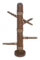 | **Melee Training Post** (HunterTableExt2DO) — Mảnh mở rộng | Core Wood x25 • Coarse Thread x8 • Silver x4 |  |
|  | **Leather Armor Dummy** (HunterTableExt3DO) — Mảnh mở rộng | Frosted Leather x16 • Fine Wood x16 • Linen Thread x10 • Black Metal x10 |  |
|  | **Dagger Display Stand** (HunterTableExt4DO) — Mảnh mở rộng | Yggdrasil Wood x15 • Silver x10 • Black Metal x15 • Sapped Leather x10 |  |
|  | **Demon Hunter's Trophies** (HunterTableExt5DO) — Mảnh mở rộng | Black Marble x30 • Flametal x6 • Fallen Valkyrie Trophy x1 • Morgen Trophy x1 |  |

## 🧵 2. Nguyên Liệu

Chuỗi **6 loại da chế biến** theo tiến trình biome; **Draw Lever** và **Eternal Bowstring** là linh kiện khởi đầu của chuỗi EVO; **Celestine / Cryolite** tìm thấy trong rương Charred Fortress (Ashlands).

| Icon | Tên | Chế tạo | Ghi chú |
| --- | --- | --- | --- |
|  | **Draw Lever** (DrawLeverDO) — Nguyên liệu | [Hunter's Table] Bronze x4 • Bronze Nails x10 • Resined Leather x2 |  |
|  | **Eternal Bowstring** (EternalBowstringDO) — Nguyên liệu | [Hunter's Table] Coarse Thread x10 • Resined Leather x3 • Ancient seed x1 |  |
|  | **Coarse Thread** (CoarseThreadDO) — Nguyên liệu | [Hunter's Table] Thistle x2 • Dandelion x4 • Resin x3 |  |
| 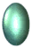 | **Celestine** (GemstoneCelestineDO) — Đá quý | Can be found in Charred Fortress chests |  |
|  | **Cryolite** (GemstoneCryoliteDO) — Đá quý | Can be found in Charred Fortress chests |  |
| 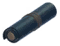 | **Resined Leather** (LeatherResinedDO) — Nguyên liệu | [Hunter's Table] Deer hide x1 • Resin x3 |  |
| 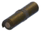 | **Greased Leather** (LeatherGreasedDO) — Nguyên liệu | [Hunter's Table] Troll hide x1 • Raw meat x2 |  |
| 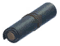 | **Frosted Leather** (LeatherFrostedDO) — Nguyên liệu | [Hunter's Table] Wolf pelt x1 • Freeze Gland x2 |  |
| 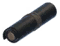 | **Tarred Leather** (LeatherTarredDO) — Nguyên liệu | [Hunter's Table] Lox pelt x1 • Tar x1 |  |
| 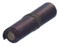 | **Sapped Leather** (LeatherSappedDO) — Nguyên liệu | [Hunter's Table] Scale hide x1 • Sap x2 |  |
| 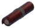 | **Charred Leather** (LeatherCharredDO) — Nguyên liệu | [Hunter's Table] Ask hide x1 • Charcoal Resin x2 |  |

## 🎯 3. Đạn & Ammo

### 3.1 Bolts (phi tiêu nỏ)

| Icon | Tên | Chế tạo | Stats | Ghi chú |
| --- | --- | --- | --- | --- |
|  | **Flint Bolt** (BoltFlintDO) — Phi tiêu nỏ | [Munitions Bench] Flint x2 • Wood x8 • Feathers x2 | Pierce: 27 |  |
|  | **Stone Bolt** (BoltStoneDO) — Phi tiêu nỏ | [Munitions Bench] Stone x4 • Core Wood x8 • Feathers x2 | Pierce: 25 Blunt: 6 |  |
|  | **Bone Bolt** (BoltBoneDO) — Phi tiêu nỏ | [Munitions Bench] Withered bone x2 • Elder bark x2 • Feathers x2 | Pierce: 25 Spirit: 25 |  |
|  | **Obsidian Bolt** (BoltObsidianDO) — Phi tiêu nỏ | [Munitions Bench] Obsidian x4 • Wood x8 • Feathers x2 | Pierce: 44 Slash: 10 |  |
|  | **Crystal Bolt** (BoltCrystalDO) — Phi tiêu nỏ | [Munitions Bench] Crystal x2 • Wood x8 • Feathers x2 | Pierce: 60 |  |
|  | **Marble Bolt** (BoltMarbleDO) — Phi tiêu nỏ | [Munitions Bench] Black Marble x2 • Wood x8 • Feathers x2 | Pierce: 60 Blunt: 14 |  |
|  | **Poison Syringe Bolt** (BoltSyringePoisonDO) — Phi tiêu nỏ (thứ 7) | — (chưa xác minh) | Poison: ? | ⚠ Bolt 7 — mới phát hiện khi audit (README mod đếm "7 crossbow bolts" nhưng bảng cũ chỉ 6). Số liệu sát thương/công thức chưa kiểm chứng (prefab `projectile_bolt_syringe_poison_DO`); mô tả in-game: *"A needle of refined cruelty, its venom seeps in silence, turning every wound into slow oblivion."* |

### 3.2 Pellets (đạn cao su)

| Icon | Tên | Chế tạo | Stats |
| --- | --- | --- | --- |
|  | **Stone Pellet** (PelletStoneDO) — Đạn cao su | [Workbench] • Stone x4 | Blunt: 22 |
|  | **Obsidian Pellet** (PelletObsidianDO) — Đạn cao su | [Munitions Bench] • Obsidian x2 | Blunt: 42 |
|  | **Marble Pellet** (PelletMarbleDO) — Đạn cao su | [Munitions Bench] • Black Marble x2 | Blunt: 58 |
| 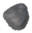 | **Grausten Pellet** (PelletGraustenDO) — Đạn cao su | [Munitions Bench] • Grausten x4 | Blunt: 66 |

## 🔱 4. Slingshots (Súng cao su)

Vũ khí tầm xa mới: sát thương **blunt**, lên đạn nhanh; phụ công bắn 3 viên. Trải từ Meadows → Ashlands. Rough Slingshot chế tại Workbench (cấp 1), số còn lại tại Hunter's Table.

| Icon | Tên | Chế tạo | Nâng cấp | Stats | Hiệu ứng |
| --- | --- | --- | --- | --- | --- |
| 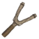 | **Rough Slingshot** (SlingshotWoodDO) — Súng cao su | [Workbench] • Wood x8 • Leather Scraps x6 | • Wood x4 • Leather Scraps x3 | Blunt: 19-28 Stamina Use: 3 | Secondary Attack: Fires three pellets at once with slightly reduced accuracy, offering strong performance at medium-to-close range. |
| 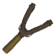 | **Sturdy Slingshot** (SlingshotCorewoodDO) — Súng cao su | [Hunter's Table] • Core Wood x8 • Resined Leather x4 | • Core Wood x4 • Resined Leather x2 | Blunt: 28-37 Stamina Use: 4 |  |
| 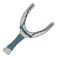 | **Iron Slingshot** (SlingshotIronDO) — Súng cao su | [Hunter's Table] • Iron x10 • Greased Leather x6 | • Iron x5 • Greased Leather x3 | Blunt: 35-44 Stamina Use: 6 |  |
| 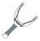 | **Silver Slingshot** (SlingshotSilverDO) — Súng cao su | [Hunter's Table] • Silver x12 • Frosted Leather x6 | • Silver x6 • Frosted Leather x3 | Blunt: 40-49 Spirit: 4-16 Stamina Use: 8 |  |
| 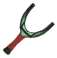 | **Blackmetal Slingshot** (SlingshotBlackmetalDO) — Súng cao su | [Hunter's Table] • Black Metal x16 • Tarred Leather x6 | • Black Metal x8 • Tarred Leather x3 | Blunt: 54-63 Stamina Use: 10 |  |
| 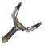 | **Mistwhisper** (SlingshotCompositeMistlandsDO) — Súng cao su | [Hunter's Table] • Iron x12 • Bronze x12 • Sapped Leather x8 | • Iron x6 • Bronze x6 • Sapped Leather x4 | Blunt: 60-72 Stamina Use: 12 |  |
| 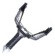 | **Ashensong** (SlingshotCompositeAshlandsDO) — Súng cao su | [Hunter's Table] • Flametal x10 • Silver x14 • Charred Leather x8 | • Flametal x5 • Silver x7 • Charred Leather x4 | Blunt: 70-82 Spirit: 5-20 Stamina Use: 12 |  |

## 🔪 5. Vũ Khí Ném

| Icon | Tên | Chế tạo | Stats | Hiệu ứng |
| --- | --- | --- | --- | --- |
| 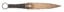 | **Bronze Throwing Knife** (ThrowingKnifeCoreBronzeDO) — Dao ném | [Munitions Bench] Bronze x1 • Resined Leather x1 | Pierce: 20 Stamina Use: 7 |  |
|  | **Iron Throwing Knife** (ThrowingKnifeCoreIronDO) — Dao ném | [Munitions Bench] Iron x1 • Greased Leather x1 | Pierce: 30 Stamina Use: 8 |  |
|  | **Silver Throwing Knife** (ThrowingKnifeCoreSilverDO) — Dao ném | [Munitions Bench] Silver x1 • Frosted Leather x1 | Pierce: 40 Spirit: 5 Stamina Use: 9 |  |
|  | **Black Metal Throwing Knife** (ThrowingKnifeCoreBlackmetalDO) — Dao ném | [Munitions Bench] Black Metal x1 • Tarred Leather x1 | Pierce: 50 Stamina Use: 10 |  |
|  | **Flametal Throwing Knife** (ThrowingKnifeCoreFlametalDO) — Dao ném | [Munitions Bench] Flametal x1 • Charred Leather x1 | Pierce: 90 Stamina Use: 12 |  |
|  | **Bronze Whirlstar** (ThrowingWhirlstarCoreBronzeDO) — Phi tiêu sao | [Munitions Bench] Bronze x1 • Resined Leather x1 | Slash: 20 Stamina Use: 7 |  |
|  | **Iron Whirlstar** (ThrowingWhirlstarCoreIronDO) — Phi tiêu sao | [Munitions Bench] Iron x1 • Greased Leather x1 | Slash: 30 Stamina Use: 8 |  |
|  | **Silver Whirlstar** (ThrowingWhirlstarCoreSilverDO) — Phi tiêu sao | [Munitions Bench] Silver x1 • Frosted Leather x1 | Slash: 40 Spirit: 5 Stamina Use: 9 |  |
|  | **Black Metal Whirlstar** (ThrowingWhirlstarCoreBlackmetalDO) — Phi tiêu sao | [Munitions Bench] Black Metal x2 • Tarred Leather x1 | Slash: 50 Stamina Use: 10 |  |
|  | **Flametal Whirlstar** (ThrowingWhirlstarCoreFlametalDO) — Phi tiêu sao | [Munitions Bench] Flametal x1 • Charred Leather x1 | Slash: 90 Stamina Use: 12 |  |
| 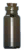 | **Smoke Escape** (BombSmokeEscapeDO) — Bom | [Munitions Bench] Smoke Puff x1 • Crystal x1 • Charred Bone x5 | Stamina Use: 8 | Applies Smoke Escape effect:  Stamina Regen: +50% Movement Speed: +30% Run Stamina Usage: -20% Duration: 4s |

## 🏹 6. Chuỗi EVO — Cung Tiến Hóa (8)

Mỗi cung dùng **cung trước đó làm lõi**: **Bloodbane** → **Verdant Recurve** → **Thunderstring** → **Mistlands Vow** → **Plains Horizon** → 3 nhánh cuối: **Mountain Arc** / **Swamp Serpent** / **Forest Draw**

| Icon | Tên | Chế tạo (lõi EVO in đậm) | Nâng cấp | Stats | Hiệu ứng |
| --- | --- | --- | --- | --- | --- |
| 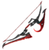 | **Bloodbane** (BowEvoCoreAshlandsBloodDO) | **Mistlands Vow** x1; Flametal x6; Bloodstone x1 | Flametal x4; Bloodstone x1 | Pierce: 101 - 113 Health Use: 10% Draw Stamina Use: 4/s | Damage increased Per Health Missing:  0.5% |
| 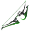 | **Verdant Recurve** (BowEvoCoreAshlandsNatureDO) | **Mistlands Vow** x1; Flametal x6; Jade x1 | Flametal x4; Jade x1 | Pierce: 94 - 103 Spirit: 12 - 15 Block Armor: 115 - 133 Draw Stamina Use: 15/s | Chance to apply Immobilized effect:  30% |
| 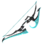 | **Thunderstring** (BowEvoCoreAshlandsLightningDO) | **Mistlands Vow** x1; Flametal x6; Iolite x1 | Flametal x5; Iolite x1 | Lightning: 50 - 59 Eitr Use: 24 | Chance to apply Chain Lightning effect:  20% |
| 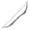 | **Mistlands Vow** (BowEvoCoreMistlandsDO) | **Plains Horizon** x1; Carapace x6; Sapped Leather x2; Linen thread x1 | Carapace x2; Linen thread x2 | Pierce: 78 - 90 Draw Stamina Use: 14/s |  |
|  | **Plains Horizon** (BowEvoCorePlainsDO) | **Mountain Arc** x1; Black metal x6; Tarred Leather x2; Linen thread x1 | Black metal x2; Linen thread x2 | Pierce: 65 - 74 Draw Stamina Use: 12/s |  |
|  | **Mountain Arc** (BowEvoCoreMountainDO) | **Swamp Serpent** x1; Silver x6; Frosted Leather x2; Coarse Thread x1 | Silver x2; Coarse Thread x2 | Pierce: 50 - 59 Draw Stamina Use: 10/s |  |
| 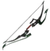 | **Swamp Serpent** (BowEvoCoreSwampDO) | **Forest Draw** x1; Elder bark x6; Greased Leather x2; Coarse Thread x1 | Iron x2; Elder bark x2 | Pierce: 44 - 53 Draw Stamina Use: 8/s |  |
|  | **Forest Draw** (BowEvoCoreBlackforestDO) | Bronze x6; Fine wood x6; Resined Leather x2; Eternal Bowstring x1 | Bronze x2; Fine wood x2 | Pierce: 34 - 43 Draw Stamina Use: 6/s |  |

## 🎯 7. Chuỗi EVO — Nỏ Tiến Hóa (8)

Lộ trình song song với cung EVO: **Bloodreign** → **Verdant Bastion** → **Thunderpiercer** → **Mistlands Sentinel** → **Plains Strider** → 3 nhánh cuối: **Mountain Crest** / **Swamp Viper** / **Forest Warden**

| Icon | Tên | Chế tạo (lõi EVO in đậm) | Nâng cấp | Stats | Hiệu ứng |
| --- | --- | --- | --- | --- | --- |
|  | **Bloodreign** (CrossbowEvoCoreAshlandsBloodDO) | **Mistlands Sentinel** x1; Flametal x6; Bloodstone x1 | Flametal x4; Bloodstone x1 | Pierce: 270 - 282 Health Use: 15% | Damage increased Per Health Missing:  0.4% |
|  | **Verdant Bastion** (CrossbowEvoCoreAshlandsNatureDO) | **Mistlands Sentinel** x1; Flametal x6; Jade x1 | Flametal x4; Jade x1 | Pierce: 250 - 259 Spirit: 15 - 18 Block Armor: 115 - 133 | Chance to apply Immobilized effect:  30% |
|  | **Thunderpiercer** (CrossbowEvoCoreAshlandsLightningDO) | **Mistlands Sentinel** x1; Flametal x6; Iolite x1 | Flametal x4; Iolite x1 | Lightning: 80 - 89 Eitr Use: 30 | Chance to apply Chain Lightning effect:  15% |
|  | **Mistlands Sentinel** (CrossbowEvoCoreMistlandsDO) | **Plains Strider** x1; Carapace x9; Sapped Leather x3; Linen thread x2 | Carapace x3; Linen thread x3 | Pierce: 210 - 219 |  |
|  | **Plains Strider** (CrossbowEvoCorePlainsDO) | **Mountain Crest** x1; Black metal x9; Tarred Leather x3; Linen thread x2 | Black metal x3; Linen thread x3 | Pierce: 150 - 159 |  |
|  | **Mountain Crest** (CrossbowEvoCoreMountainDO) | **Swamp Viper** x1; Silver x9; Frosted Leather x3; Coarse Thread x2 | Silver x3; Coarse Thread x3 | Pierce: 120 - 129 |  |
| 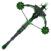 | **Swamp Viper** (CrossbowEvoCoreSwampDO) | **Forest Warden** x1; Elder bark x9; Greased Leather x3; Coarse Thread x2 | Iron x3; Elder bark x3 | Pierce: 90 - 99 |  |
|  | **Forest Warden** (CrossbowEvoCoreBlackforestDO) | Bronze x9; Core wood x9; Resined Leather x3; Draw Lever x1 | Bronze x3; Core wood x3 | Pierce: 60 - 69 |  |

## 💀 8. Chuỗi Renegade — Nỏ Độc (7)

Nhánh phụ hệ **poison**, dùng linh kiện riêng từ Black Forest: **Soultrace** → **Cryobite** → **Venom Reaper** → **Poison Prototype** → **Toxic Pulse** → 2 nhánh cuối: **Hardened Spine** / **Field Construct**

| Icon | Tên | Chế tạo (lõi in đậm) | Nâng cấp | Stats | Hiệu ứng |
| --- | --- | --- | --- | --- | --- |
| 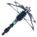 | **Soultrace** (CrossbowEvoRenegadeAshlandsSpiritDO) | **Venom Reaper** x1; Flametal x6; Celestine x1 | Flametal x4; Celestine x1 | Pierce: 125 - 134 Spirit: 150 - 162 | HP gain on hit: 10 |
| 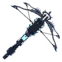 | **Cryobite** (CrossbowEvoRenegadeAshlandsFrostDO) | **Venom Reaper** x1; Flametal x6; Cryolite x1 | Flametal x4; Cryolite x1 | Pierce: 125 - 134 Frost: 150 - 162 | Heat Resistance when equipped: +20% |
| 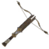 | **Venom Reaper** (CrossbowEvoRenegadeMistlandsDO) | **Poison Prototype** ×1; Carapace ×9; Eitr ×9; Sapped Leather ×3 | Carapace ×3; Eitr ×3 | Pierce: 100 - 109 Poison: 200 - 212 | Poison AoE explosion triggered by each fired bolt on impact. |
| 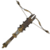 | **Poison Prototype** (CrossbowEvoRenegadePlainsDO) | **Toxic Pulse** ×1; Black metal ×9; Needle ×9; Tarred Leather ×3 | Black metal ×3; Needle ×3 | Pierce: 75 - 84 Poison: 150 - 162 |  |
| 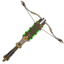 | **Toxic Pulse** (CrossbowEvoRenegadeMountainDO) | **Hardened Spine** ×1; Silver ×9; Guck ×9; Frosted Leather ×3 | Silver ×3; Guck ×3 | Pierce: 60 - 69 Poison: 120 - 132 |  |
| 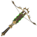 | **Hardened Spine** (CrossbowEvoRenegadeSwampDO) | **Field Construct** ×1; Iron ×9; Core wood ×9; Greased Leather ×3 | Iron ×3; Core wood ×3 | Pierce: 70 - 79 Slash: 18 |  |
|  | **Field Construct** (CrossbowEvoRenegadeBlackforestDO) | Draw Lever ×1; Bronze ×9; Wood ×9; Resined Leather ×3 | Bronze ×3; Wood ×3 | Pierce: 46 - 55 Slash: 12 |  |

## 🏹 9. Giáp Archer (6 bộ)

Hai nhánh: **Light-Medium** (cơ động, tiết kiệm stamina) và **Medium-Heavy Hybrid** (thủ vững hơn, vẫn hỗ trợ bắn cung). Mỗi bộ có cung signature riêng (dòng Classic).

#### FOREST SENTINEL

| Icon | Mảnh | Chế tạo | Nâng cấp | Armor / Stats | Hiệu ứng / Set Bonus |
| --- | --- | --- | --- | --- | --- |
| 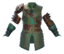 | **Forest Sentinel Vest** (ArmorForestSentinelChestDO) — Ngực | [Hunter's Table] Bronze x2; Resined Leather x6; Coarse Thread x4 | Bronze x2; Resined Leather x4 | Armor: 7 - 13 | Movement Speed: +4% Bows: +4 Pierce: +3% |
| 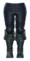 | **Forest Sentinel Trousers** (ArmorForestSentinelLegsDO) — Chân | [Hunter's Table] Bronze x2; Resined Leather x6; Coarse Thread x4 | Bronze x2; Resined Leather x4 | Armor: 7 - 13 |  |
|  | **Forest Sentinel Hat** (ArmorForestSentinelHelmetDO) — Mũ | [Hunter's Table] Bronze x2; Resined Leather x6; Coarse Thread x4 | Bronze x2; Resined Leather x4 | Armor: 7 - 13 |  |
|  | **Forest Sentinel Cloak** (ArmorForestSentinelCapeDO) — Áo choàng | [Hunter's Table] Bronze x1; Resined Leather x4; Coarse Thread x3 | Resined Leather x1; Coarse Thread x2 | Armor: 2 - 5 | Applies Canopy Veil:  Max Carry Weight: +50 |
| 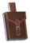 | **Forest Sentinel Pouch** (ArmorForestSentinelBeltDO) — Thắt lưng | [Hunter's Table] Resined Leather x10; Greased Leather x8; Greydwarf Shaman trophy x1; Coins x100 |  |  | Applies Forest Pouch Buff:  Max Carry Weight: +150 Movement Speed: +3% Run Stamina Usage: -5% |
| 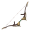 | **Greenwatch** (BowForestSentinelDO) — Cung (vũ khí bộ) | [Hunter's Table] Bronze x9; Core wood x18; Resined Leather x3; Coarse Thread x2 | Bronze x3; Core wood x9 | Pierce: 26 - 32 Spirit: 15 - 18 Draw Stamina Use: 6/s |  |

#### FROSTPEAK HARRIER

| Icon | Mảnh | Chế tạo | Nâng cấp | Armor / Stats | Hiệu ứng / Set Bonus |
| --- | --- | --- | --- | --- | --- |
|  | **Frostpeak Harrier Wrap** (ArmorFrostpeakHarrierChestDO) — Ngực | [Hunter's Table] Silver x4; Frosted Leather x12; Coarse Thread x8 | Silver x2; Frosted Leather x4 | Armor: 16 - 22 | Resistant vs Frost Run Stamina Usage: -10% Bows: +8 Pierce: +5% |
| 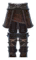 | **Frostpeak Harrier Trousers** (ArmorFrostpeakHarrierLegsDO) — Chân | [Hunter's Table] Silver x4; Frosted Leather x12; Coarse Thread x8 | Silver x2; Frosted Leather x4 | Armor: 16 - 22 |  |
|  | **Frostpeak Harrier Helm** (ArmorFrostpeakHarrierHelmetDO) — Mũ | [Hunter's Table] Silver x4; Frosted Leather x12; Coarse Thread x8 | Silver x2; Frosted Leather x4 | Armor: 16 - 22 |  |
| 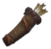 | **Frostpeak Harrier Quiver** (ArmorFrostpeakHarrierCapeDO) — Áo choàng | [Hunter's Table] Silver x1; Frosted Leather x4; Coarse Thread x3; Wood x4 | Frosted Leather x1; Coarse Thread x2 | Armor: 2 - 5 | Applies Blizzard's Precision:  Max Carry Weight: +50 Slightly Resistant vs Frost Jump Stamina Usage: -10% |
|  | **Frostpeak Harrier Necklace** (ArmorFrostpeakHarrierTrinketDO) — Bùa hộ mệnh | [Hunter's Table] Coarse Thread x10; Wolf Fang x9; Fenris claw x3; Wolf trophy x1 |  |  | Applies Fangbound Spirit:  Passive - Run Stamina Usage: -5%  Activation Effects:  Stamina Gain: 25 Pierce: +15% Duration: 30s Adrenaline Cost: 40 |
|  | **Predator Maw** (BowFrostpeakHarrierDO) — Cung (vũ khí bộ) | [Hunter's Table] Silver x9; Fine wood x18; Frosted Leather x3; Coarse Thread x2 | Silver x3; Fine wood x9 | Slash: 10 Pierce: 26 - 32 Frost: 15 - 18 Draw Stamina Use: 10/s |  |

#### GOLDEN STRIDER

| Icon | Mảnh | Chế tạo | Nâng cấp | Armor / Stats | Hiệu ứng / Set Bonus |
| --- | --- | --- | --- | --- | --- |
|  | **Golden Strider Vest** (ArmorGoldenStriderChestDO) — Ngực | [Hunter's Table] Black metal x5; Tarred Leather x15; Linen thread x10 | Black metal x3; Tarred Leather x6 | Armor: 21 - 27 | Attack Stamina Usage: -10% Bows: +10 Pierce: +7% |
|  | **Golden Strider Trousers** (ArmorGoldenStriderLegsDO) — Chân | [Hunter's Table] Black metal x5; Tarred Leather x15; Linen thread x10 | Black metal x3; Tarred Leather x6 | Armor: 21 - 27 |  |
|  | **Golden Strider Adornment** (ArmorGoldenStriderHelmetDO) — Mũ | [Hunter's Table] Black metal x5; Tarred Leather x15; Linen thread x10 | Black metal x3; Tarred Leather x6 | Armor: 21 - 27 |  |
|  | **Golden Strider Quiver** (ArmorGoldenStriderCapeDO) — Áo choàng | [Hunter's Table] Black metal x1; Tarred Leather x4; Linen thread x3; Fine wood x6 | Tarred Leather x1; Linen thread x2 | Armor: 2 - 5 | Applies Horizon's Reach:  Stamina Regen: +10% Max Carry Weight: +50 |
| 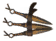 | **Golden Strider Belt** (ArmorGoldenStriderBeltDO) — Thắt lưng | [Hunter's Table] Tarred Leather x15; Bronze x12; Fuling Shaman trophy x1; Deathsquito trophy x1 |  |  | Applies Burden of the Road:  Max Carry Weight: +150 Knives: +5 Pierce: +5% |
| 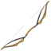 | **Twinspan** (BowGoldenStriderDO) — Cung (vũ khí bộ) | [Hunter's Table] Black metal x9; Fine wood x27; Tarred Leather x3; Linen thread x2 | Black metal x3; Fine wood x12 | Pierce: 70 - 82 Draw Stamina Use: 11/s |  |

#### SAPPHIRE FALCON

| Icon | Mảnh | Chế tạo | Nâng cấp | Armor / Stats | Hiệu ứng / Set Bonus |
| --- | --- | --- | --- | --- | --- |
| 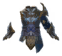 | **Sapphire Falcon Chestguard** (ArmorSapphireFalconChestDO) — Ngực | [Hunter's Table] Carapace x6; Sapped Leather x18; Linen thread x12 | Carapace x3; Sapped Leather x6 | Armor: 30 - 36 | Resistant vs Pierce Bows: +12 Pierce: +9% |
| 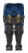 | **Sapphire Falcon Greaves** (ArmorSapphireFalconLegsDO) — Chân | [Hunter's Table] Carapace x6; Sapped Leather x18; Linen thread x12 | Carapace x3; Sapped Leather x6 | Armor: 30 - 36 |  |
|  | **Sapphire Falcon Helm** (ArmorSapphireFalconHelmetDO) — Mũ | [Hunter's Table] Carapace x6; Sapped Leather x18; Linen thread x12 | Carapace x3; Sapped Leather x6 | Armor: 30 - 36 |  |
| 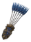 | **Sapphire Falcon Quiver** (ArmorSapphireFalconCapeDO) — Áo choàng | [Hunter's Table] Carapace x2; Sapped Leather x6; Linen thread x3; Yggdrasil wood x6 | Carapace x2; Sapped Leather x3 | Armor: 2 - 5 | Applies Falcon's Focus:  Max Carry Weight: +50 Fall Damage: -50% Jump Stamina Usage: -20% |
|  | **Sapphire Falcon Core** (ArmorSapphireFalconTrinketDO) — Bùa hộ mệnh | [Hunter's Table] Sapped Leather x10; Eitr x12; Bile bag x3; Dvergr trophy x1 |  |  | Applies Falcon's Rush:  Passive - Max Carry Weight: +20 Jump Height: +10%  Activation Effects:  Stamina Gain: 35 Movement Speed: +40% Duration: 10s Adrenaline Cost: 30 |
|  | **Azure Flight** (BowSapphireFalconDO) — Cung (vũ khí bộ) | [Hunter's Table] Carapace x20; Eitr x8; Sapped Leather x3; Linen thread x2 | Carapace x7; Eitr x4 | Pierce: 75 - 87 Spirit: 7 - 10 Draw Stamina Use: 14/s | Applies Azure Grace when equipped:  Limit Fall Speed: 5m/s Fall Damage: -100% |

#### NOCTURNE ARROW

| Icon | Mảnh | Chế tạo | Nâng cấp | Armor / Stats | Hiệu ứng / Set Bonus |
| --- | --- | --- | --- | --- | --- |
|  | **Nocturne Arrow Vestments** (ArmorNocturneArrowChestDO) — Ngực | [Hunter's Table] Carapace x4; Sapped Leather x22; Linen thread x12 | Carapace x2; Sapped Leather x8 | Armor: 26 - 32 | Jump Stamina Usage: -10% Run Stamina Usage: -10% Bows: +12 Sneak: +20 Pierce: +9% |
|  | **Nocturne Arrow Treads** (ArmorNocturneArrowLegsDO) — Chân | [Hunter's Table] Carapace x4; Sapped Leather x22; Linen thread x18 | Carapace x2; Sapped Leather x8 | Armor: 26 - 32 |  |
|  | **Nocturne Arrow Hood** (ArmorNocturneArrowHelmetDO) — Mũ | [Hunter's Table] Carapace x4; Sapped Leather x22; Linen thread x18 | Carapace x2; Sapped Leather x8 | Armor: 26 - 32 |  |
|  | **Nocturne Arrow Cloak** (ArmorNocturneArrowCapeDO) — Áo choàng | [Hunter's Table] Carapace x4; Sapped Leather x22; Linen thread x18; Yggdrasil wood x12 | Carapace x2; Sapped Leather x8 | Armor: 2 - 5 | Applies Nocturne Wind:  Max Carry Weight: +50 Fall Damage: -30% Jump Height: +10% Bows: +5 |
| 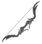 | **Wraithbranch** (BowNocturneArrowDO) — Cung (vũ khí bộ) | [Hunter's Table] Yggdrasil wood x20; Black core x1; Sapped Leather x6; Linen thread x2 | Yggdrasil wood x10; Sapped Leather x3 | Pierce: 74 - 86 Poison: 10 - 22 Draw Stamina Use: 13/s |  |

#### ASHEN EXILE

| Icon | Mảnh | Chế tạo | Nâng cấp | Armor / Stats | Hiệu ứng / Set Bonus |
| --- | --- | --- | --- | --- | --- |
|  | **Ashen Exile Cuirass** (ArmorAshenExileChestDO) — Ngực | [Hunter's Table] Flametal x6; Eitr x6; Charred Leather x18; Linen thread x12 |  | Armor: 34 - 40 Movement Speed: -4% Eitr Regen: +30% Heat Resistance: +10% | Resistant vs Slash Bows: +15 Pierce: +10% Lightning: +10% |
|  | **Ashen Exile Greaves** (ArmorAshenExileLegsDO) — Chân | [Hunter's Table] Flametal x6; Eitr x6; Charred Leather x18; Linen thread x12 | Flametal x2; Charred Leather x4 | Armor: 34 - 40 Movement Speed: -4% Eitr Regen: +30% Heat Resistance: +10% |  |
|  | **Ashen Exile Helm** (ArmorAshenExileHelmetDO) — Mũ | [Hunter's Table] Flametal x6; Eitr x6; Charred Leather x18; Linen thread x12 | Flametal x2; Charred Leather x4 | Armor: 34 - 40 Eitr Regen: +15% |  |
| 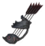 | **Ashen Exile Quiver** (ArmorAshenExileCapeDO) — Áo choàng | [Hunter's Table] Flametal x2; Charred Leather x6; Linen thread x4; Blackwood x4 | Flametal x1; Charred Leather x3 | Armor: 3 - 6 | Applies Scorched Volley:  Max Carry Weight: +50 Bows: +10 Pierce: +5% Lightning: +5% |
|  | **Ashen Exile Prayer Beads** (ArmorAshenExileTrinketDO) — Bùa hộ mệnh | [Hunter's Table] Bloodstone x1; Proustite powder x20; Fallen Valkyrie trophy x1 |  |  | Applies Burden of Sins:  Passive - Health Regen: +5%  Activation Effects:  Health Gain: 100 Armor: +40 Very Resistant vs Fire Duration: 45s Adrenaline Cost: 70 |
|  | **Chimeric Doom** (BowAshenExileDO) — Cung (vũ khí bộ) | [Hunter's Table] Flametal x9; Eitr x18; Charred Leather x3; Morgen sinew x2 | Flametal x3; Eitr x6 | Pierce: 83 - 95 Fire: 9 - 12 Draw Stamina Use: 14/s | Fire AoE explosion triggered by each fired arrow on impact. Heat Resistance: +5% |

## 🎯 10. Giáp Crossbowman (3 bộ)

Giáp trung bình, cân bằng cho chiến đấu nỏ ổn định.

#### GRAVE MERCENARY

| Icon | Mảnh | Chế tạo | Nâng cấp | Armor / Stats | Hiệu ứng / Set Bonus |
| --- | --- | --- | --- | --- | --- |
| 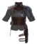 | **Grave Mercenary Vest** (ArmorGraveMercenaryChestDO) — Ngực | [Hunter's Table] Iron x6; Greased Leather x12; Coarse Thread x4 | Iron x3; Greased Leather x3 | Armor: 12 - 18 Movement Speed: -2% | Slightly Resistant vs Poison Run Stamina usage: -5% Crossbows: +6 Pierce: +4% |
| 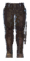 | **Grave Mercenary Boots** (ArmorGraveMercenaryLegsDO) — Chân | [Hunter's Table] Iron x6; Greased Leather x12; Coarse Thread x4 | Iron x3; Greased Leather x3 | Armor: 12 - 18 Movement Speed: -2% |  |
|  | **Grave Mercenary Helmet** (ArmorGraveMercenaryHelmetDO) — Mũ | [Hunter's Table] Iron x6; Greased Leather x12; Coarse Thread x4 | Iron x3; Greased Leather x3 | Armor: 12 - 18 |  |
| 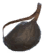 | **Grave Mercenary Bag** (ArmorGraveMercenaryCapeDO) — Áo choàng | [Hunter's Table] Iron x2; Greased Leather x4; Coarse Thread x2 | Iron x2; Greased Leather x2 | Armor: 3 - 6 | Applies Silent Loot:  Max Carry Weight: +100 |

#### DREAD RENEGADE

| Icon | Mảnh | Chế tạo | Nâng cấp | Armor / Stats | Hiệu ứng / Set Bonus |
| --- | --- | --- | --- | --- | --- |
|  | **Dread Renegade Coat** (ArmorDreadRenegadeChestDO) — Ngực | [Hunter's Table] Black metal x8; Tarred Leather x16; Linen thread x6 | Black metal x3; Tarred Leather x3 | Armor: 23 - 29 Movement Speed: -2% Eitr Regen: +20% | Slightly Resistant vs Pierce Run Stamina Usage: -10% Crossbows: +10 Pierce: +7% |
| 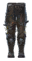 | **Dread Renegade Trousers** (ArmorDreadRenegadeLegsDO) — Chân | [Hunter's Table] Black metal x8; Tarred Leather x16; Linen thread x6 | Black metal x3; Tarred Leather x3 | Armor: 23 - 29 Movement Speed: -2% Eitr Regen: +20% |  |
|  | **Dread Renegade Hat** (ArmorDreadRenegadeHelmetDO) — Mũ | [Hunter's Table] Black metal x8; Tarred Leather x16; Linen thread x6 | Black metal x3; Tarred Leather x3 | Armor: 23 - 29 Eitr Regen: +10% |  |
|  | **Dread Renegade Chains** (ArmorDreadRenegadeCapeDO) — Áo choàng | [Hunter's Table] Black metal x3; Tarred Leather x6; Linen thread x3 | Black metal x2; Tarred Leather x2 | Armor: 4 - 7 | Applies Unchained:  Max Carry Weight: +70 Slightly Resistant vs Slash |

#### DEMON HUNTER

| Icon | Mảnh | Chế tạo | Nâng cấp | Armor / Stats | Hiệu ứng / Set Bonus |
| --- | --- | --- | --- | --- | --- |
|  | **Demon Hunter Coat** (ArmorDemonHunterChestDO) — Ngực | [Hunter's Table] Flametal x10; Eitr x6; Charred Leather x18; Linen thread x8 | Flametal x3; Charred Leather x3 | Armor: 32 - 38 Movement Speed: -2% Eitr Regen: +30% Heat Resistance: +10% | Slightly Resistant vs Slash Run Stamina Usage: -10% Crossbows: +15 Pierce: +10% Lightning: +10% |
| 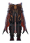 | **Demon Hunter Trousers** (ArmorDemonHunterLegsDO) — Chân | [Hunter's Table] Flametal x10; Eitr x6; Charred Leather x18; Linen thread x8 | Flametal x3; Charred Leather x3 | Armor: 32 - 38 Movement Speed: -2% Eitr Regen: +30% Heat Resistance: +10% |  |
| 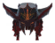 | **Demon Hunter Hat** (ArmorDemonHunterHelmetDO) — Mũ | [Hunter's Table] Flametal x10; Eitr x6; Charred Leather x18; Linen thread x8 | Flametal x3; Charred Leather x3 | Armor: 32 - 38 Eitr Regen: +15% Resistant vs Fire |  |
|  | **Demon Hunter Quiver** (ArmorDemonHunterCapeDO) — Áo choàng | [Hunter's Table] Flametal x6; Eitr x2; Charred Leather x12; Linen thread x4 | Flametal x2; Charred Leather x2 | Armor: 3 - 6 | Applies Oath of the Hunt:  Max Carry Weight: +50 Crossbows: +10 Pierce: +5% Lightning: +5% |
| 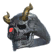 | **Kaerzul's Ring** (ArmorDemonHunterTrinketDO) — Bùa hộ mệnh | [Hunter's Table] Bloodstone x2; Flametal x6; Eitr x12; Morgen trophy x1 |  |  | Applies Kaerzul's Legacy:  Passive - Stamina Regen: +5%  Activation Effects:  Stamina Regen: +35% Eitr Regen: +50% Movement Speed: +20% Pierce: +20% Duration: 50s Adrenaline Cost: 85 |
|  | **Blightburner** (CrossbowDemonHunterDO) — Nỏ (vũ khí bộ) | [Hunter's Table] Flametal ×12; Eitr ×15; Charred Leather ×3; Morgen Sinew ×2 | Flametal ×4; Eitr ×5 | Pierce: 230 - 239 Fire: 15 - 18 | Fire AoE explosion triggered by each fired bolt on impact. Heat Resistance: +5% |

## 🗡️ 11. Giáp Assassin (3 bộ)

Bộ mở rộng cho lối chơi tàng hình & cận chiến nhanh: Silent Thorn (Black Forest) → Snow Talon (Mountain) → Nocturne Blade (Mistlands).

#### SILENT THORN

| Icon | Mảnh | Chế tạo | Nâng cấp | Armor / Stats | Hiệu ứng / Set Bonus |
| --- | --- | --- | --- | --- | --- |
|  | **Silent Thorn Vest** (ArmorSilentThornChestDO) — Ngực | [Hunter's Table] Bronze x2; Resined Leather x10; Coarse Thread x6 | Bronze x2; Resined Leather x6 | Armor: 7 - 13 | Movement Speed: +4% Knives: +4 Slash: +2% Pierce: +2% |
|  | **Silent Thorn Leggings** (ArmorSilentThornLegsDO) — Chân | [Hunter's Table] Bronze x2; Resined Leather x10; Coarse Thread x6 | Bronze x2; Resined Leather x6 | Armor: 7 - 13 |  |
|  | **Silent Thorn Wrap** (ArmorSilentThornHelmetDO) — Mũ | [Hunter's Table] Bronze x2; Resined Leather x10; Coarse Thread x6 | Bronze x2; Resined Leather x6 | Armor: 7 - 13 |  |
|  | **Crossthorn** (DaggerSilentThornDO) — Dao găm | [Hunter's Table] Bronze x8; Resined Leather x2; Wood x4 | Bronze x5; Resined Leather x1 | Slash: 6 - 9 Pierce: 28 - 31 Attack Stamina Use: 7 |  |
|  | **Feral Pair** (DaggerDualSilentThornDO) — Dao găm đôi | [Hunter's Table] Bronze x12; Resined Leather x4; Wood x8 | Bronze x6; Resined Leather x2 | Slash: 30 - 33 Pierce: 12 - 15 Attack Stamina Use: 7 |  |

#### SNOW TALON

| Icon | Mảnh | Chế tạo | Nâng cấp | Armor / Stats | Hiệu ứng / Set Bonus |
| --- | --- | --- | --- | --- | --- |
|  | **Snow Talon Vestments** (ArmorSnowTalonChestDO) — Ngực | [Hunter's Table] Silver x3; Frosted Leather x15; Coarse Thread x10 | Silver x2; Frosted Leather x8 | Armor: 16 - 22 | Resistant vs Frost Movement Speed: +8% Knives: +8 Slash: +3% Pierce: +3% |
|  | **Snow Talon Leggings** (ArmorSnowTalonLegsDO) — Chân | [Hunter's Table] Silver x3; Frosted Leather x15; Coarse Thread x10 | Silver x2; Frosted Leather x8 | Armor: 16 - 22 |  |
|  | **Snow Talon Hood** (ArmorSnowTalonHelmetDO) — Mũ | [Hunter's Table] Silver x3; Frosted Leather x15; Coarse Thread x10 | Silver x2; Frosted Leather x8 | Armor: 16 - 22 |  |
|  | **Snow Talon Cloak** (ArmorSnowTalonCapeDO) — Áo choàng | [Hunter's Table] Silver x3; Frosted Leather x8; Coarse Thread x6 | Silver x1; Frosted Leather x4 | Armor: 2 - 5 | Applies White Veil:  Resistant vs Frost Attack Stamina Usage: -5% Run Stamina Usage: -5% |
|  | **Silencepiercer** (DaggerSnowTalonDO) — Dao găm | [Hunter's Table] Silver x12; Frosted Leather x4; Obsidian x4 | Silver x6; Frosted Leather x2 | Slash: 16 - 19 Pierce: 28 - 31 Frost: 8 - 11 Attack Stamina Use: 10 |  |
|  | **Snowdancers** (DaggerDualSnowTalonDO) — Dao găm đôi | [Hunter's Table] Silver x16; Frosted Leather x6; Obsidian x4 | Silver x8; Frosted Leather x3 | Slash: 40 - 43 Pierce: 20 - 23 Spirit: 15 - 18 Attack Stamina Use: 10 |  |

#### NOCTURNE BLADE

| Icon | Mảnh | Chế tạo | Nâng cấp | Armor / Stats | Hiệu ứng / Set Bonus |
| --- | --- | --- | --- | --- | --- |
|  | **Nocturne Blade Vestments** (ArmorNocturneBladeChestDO) — Ngực | [Hunter's Table] Carapace x4; Silver x4; Sapped Leather x18; Linen thread x12 | Silver x3; Sapped Leather x8 | Armor: 26 - 32 | Movement Speed: +8% Attack Stamina Usage: -10% Knives: +12 Dodge: +20 Slash: +5% Pierce: +5% |
|  | **Nocturne Blade Treads** (ArmorNocturneBladeLegsDO) — Chân | [Hunter's Table] Carapace x4; Silver x4; Sapped Leather x18; Linen thread x12 | Silver x3; Sapped Leather x8 | Armor: 26 - 32 |  |
|  | **Nocturne Blade Hood** (ArmorNocturneBladeHelmetDO) — Mũ | [Hunter's Table] Carapace x4; Silver x4; Sapped Leather x18; Linen thread x12 | Silver x3; Sapped Leather x8 | Armor: 26 - 32 |  |
|  | **Nocturne Blade Cloak** (ArmorNocturneBladeCapeDO) — Áo choàng | [Hunter's Table] Carapace x2; Silver x2; Sapped Leather x12; Linen thread x8 | Silver x2; Sapped Leather x6 | Armor: 2 - 5 | Applies Nocturne Wind:  Fall Damage: -30% Jump Height: +10% Attack Stamina Usage: -5% Knives: +5 |
|  | **Voidrend** (DaggerNocturneBladeDO) — Dao găm | [Hunter's Table] Black metal x12; Sapped Leather x6; Yggdrasil wood x8 | Black metal x6; Sapped Leather x3 | Slash: 22 - 25 Pierce: 60 - 63 Attack Stamina Use: 13 |  |
|  | **Nightshredders** (DaggerDualNocturneBladeDO) — Dao găm đôi | [Hunter's Table] Black metal x18; Sapped Leather x8; Yggdrasil wood x12 | Black metal x9; Sapped Leather x4 | Slash: 80 - 83 Pierce: 16 - 19 Attack Stamina Use: 13 |  |

## 🪑 12. Đồ Trang Trí (Decor)

Các mảnh trang trí trong category *Distant Origins Decor* — build bằng Hammer (khi đứng gần Hunter's Table / Munitions Bench).

| Icon | Tên (prefab) | Craft Cost |
| --- | --- | --- |
|  | **Copper Armour Stand** (ArmorStandCopperDO) | Copper 2, Resin 4 |
|  | **Corewood Armour Stand** (ArmorStandCorewoodDO) | RoundLog 10, Bronze Nails 5 |
|  | **Marble Armour Stand** (ArmorStandMarbleDO) | BlackMarble 5 |
|  | **Tar Armour Stand** (ArmorStandTarDO) | FineWood 6, Tar 2, Iron Nails 5 |
|  | **Wood Armour Stand** (ArmorStandWoodDO) | Wood 15, Bronze Nails 5 |
|  | **Copper Item Stand** (ItemStandCopperDO) | Copper 1, Resin 2 |
|  | **Corewood Item Stand** (ItemStandCorewoodDO) | RoundLog 3, Bronze Nails 2 |
|  | **Marble Item Stand** (ItemStandMarbleDO) | BlackMarble 2 |
|  | **Tar Item Stand** (ItemStandTarDO) | FineWood 2, Tar 1, Iron Nails 2 |
|  | **Wood Item Stand** (ItemStandWoodDO) | Wood 5, Bronze Nails 2 |
|  | **Giant Showcase V1** (ShowcaseHunterGiantV1DO) | RoundLog 25, Crystal 10, Iron Nails 20 |
|  | **Giant Showcase V2** (ShowcaseHunterGiantV2DO) | RoundLog 25, Crystal 8, Iron Nails 20 |
|  | **Large Showcase V1** (ShowcaseHunterLargeV1DO) | RoundLog 15, Crystal 8, Iron Nails 15 |
|  | **Large Showcase V2** (ShowcaseHunterLargeV2DO) | RoundLog 20, Crystal 6, Iron Nails 15 |
|  | **Medium Showcase** (ShowcaseHunterMediumV1DO) | RoundLog 10, Crystal 6, Iron Nails 10 |
|  | **Small Showcase V1** (ShowcaseHunterSmallV1DO) | RoundLog 6, Crystal 3, Iron Nails 5 |
|  | **Small Showcase V2** (ShowcaseHunterSmallV2DO) | RoundLog 5, Crystal 4, Iron Nails 5 |

**Nguồn:** Google Sheets chính thức của tác giả Dreanegade (tab "Hunter Legacy", cập nhật lần cuối 2026-08-06) + config `Dreanegade.Hunter_Legacy.cfg` + IL decompile `Hunter_Legacy.dll` v1.0.8 (prefab names, icon sprites từ asset bundle nhúng).

Giá trị craft/upgrade trong bảng là **mặc định mod**; server có thể override qua config. Icons trích trực tiếp từ asset bundle của mod.
