# 🧙 PHẦN 3 — MagicPlugin: Wiki Chi Tiết (v2.1.9)

Wiki từ **decompile MagicPlugin.dll** (tác giả *blacks7ar*) — mod không có wiki chính thức. Số liệu = **default của config** `MagicPlugin.cfg`. Ký hiệu: `(C)` = config default, `(H)` = hardcode trong code, `(A)` = nằm trong asset bundle (not trong code).

**Cài đặt:** bỏ `MagicPlugin.dll` vào `BepInEx/plugins/`. Sau khi update nếu lỗi → **xóa `config/MagicPlugin.cfg`** để mod sinh lại. Dùng ServerSync + config watcher (config được sync mặc định trừ khi bị khóa server).

## 1. Tổng quan & tính năng chính

- Vũ khí magic từ sớm → cuối game: 3 staff early, 5 staff mid, 4 wand + sách early; 3 scepter cuối game có **đòn phụ**.

- **2 vũ khí Heritage** từ boss: Moders Heritage (mưa băng) & Yagluths Heritage (mưa sao băng).

- **Totems triệu hồi** (11 loại summon đơn) + **chiến thú Asksvin (mount cưỡi đánh nhau)**.

- **6 bộ giáp magic** (Meadows → Ashlands), **6 đai**, **5 khuyên tai**, **5 nhẫn + 5 vòng cổ** (nhẫn/vòng cần Jewelcrafting), **6 món ăn Eitr**.

- **Khe trang bị sách + khuyên tai** riêng (đòi `AzuExtendedPlayerInventory`) — +2 khe trang bị không chạm vào 6 khe thường.

- Skill dùng: **ElementalMagic** cho staffs/scepters/Heritage, **BloodMagic** cho HealStaff/summons; đạn mọi vũ khí magic được khuếch đại Velocity ×2 / accuracy ×0 (trừ Arctic).

| Icon | Config toàn cục | Default | Khoảng | Hiệu lực |
| --- | --- | --- | --- | --- |
| Velocity Multiplier | 2.0 | 1–5 | Nhân tốc độ đạn vũ khí magic (trừ scepter / Flame / Thunder) |  |
| Accuracy Multiplier | 0 | 0–1 | Độ lệch ngẫu nhiên đạn (0 = bắn chính xác thẳng) |  |
| Enable Slow Fall | On | On/Off | Bật "rơi chậm" + miễn sát thương rơi trên áo choàng 4 set |  |
| Enable Tome Slot / Earring Slot | On | On/Off | Bật khe sách / khe khuyên tai (MagicSlot) |  |
| Blood Magic / Elemental Magic EXP Multiplier | 1.0 | 0.1–10 | Nhân kinh nghiệm skill tương ứng |  |
| Unsummon Key | J | phím | Thu hồi toàn bộ summon đang có |  |

## 2. Staff (gậy)

Mọi staff bắn đạn: Velocity ×2, Accuracy ×0; bán kính AoE đạn = config + 2 × skillFactor(ElementalMagic) — cấp skill càng cao vùng nổ càng rộng.

| Icon | Staff | Công dụng / Giá trị (C) | Bàn chế | Craft → nâng cấp |
| --- | --- | --- | --- | --- |
| 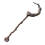 | **Beginner Staff** (BMP_BeginnerStaff) | Staff khởi đầu — dùng từ đầu game | Workbench lv1 | BoneFragments×2, Resin×4, Wood×12 → Resin×2, Wood×6 |
| 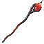 | **Surtling Staff** (BMP_SurtlingStaff) | Đạn lửa; AoE 3(C); **(H)** chặt cây: damage chop → toolTier = quality, +skill Wood Cutting 0.2 | Forge lv1 | SurtlingCore×1, RoundLog×12, Copper×6, Coal×6 → RoundLog×6, Copper×3, Coal×3 |
|  | **Eikthyrs Staff** (BMP_EikthyrsStaff) | Đạn sét; AoE 3(C); **(H)** đập đá: pickaxe → toolTier = quality, +skill Pickaxes 0.2 | Workbench lv1 | TrophyEikthyr×1, HardAntler×3, Wood×25, Flint×10 → HardAntler×1, Wood×12, Flint×5 |
| 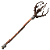 | **Lightning Staff** (BMP_LightningStaff) | Đạn sét; AoE 3(C); cùng cơ chế pickaxe như Eikthyrs | Workbench lv1 | Giống Eikthyrs Staff |
|  | **Arctic Staff** (BMP_ArcticStaff) | Băng; AoE 3(C); **(H)** projectile 1.2×, accuracy 0 (không nhân velocity config); tạo tường băng chặn | Forge lv1 | DragonTear×2, ElderBark×22, FreezeGland×16, Silver×22 → ElderBark×11, FreezeGland×8, Silver×11 |
|  | **Staff of Healing** (BMP_HealStaff) | **Heal:** 50 HP / 20 tick = 2.5 HP mỗi 0.5s trong 10s; **CD** 10s; dùng BloodMagic | Forge lv1 | AncientSeed×10, Guck×16, Iron×12, ElderBark×10 → Guck×8, Iron×6, ElderBark×5 |
|  | **Poison Staff** (BMP_PoisonStaff) | Đạn độc AoE 3(C); đòn phụ bắn băng dính (stickies) | Forge lv1 | YmirRemains×5, Guck×16, Iron×22, ElderBark×20 → Guck×8, Iron×11, ElderBark×10 |
|  | **Flame Staff** (BMP_FlameStaff) | Bản đổi màu của vanilla; không bị ảnh hưởng bởi patch velocity/accuracy | MageTable lv1 | SurtlingCore×5, TrophySurtling×3, BlackMetal×16, YggdrasilWood×22 → Eitr×18, Mandible×8, YggdrasilWood×11 |
|  | **Thunder Staff** (BMP_ThunderStaff) | Bản đổi màu của vanilla; không bị ảnh hưởng bởi patch velocity/accuracy | MageTable lv1 | Thunderstone×5, Eitr×36, Mandible×10, Iron×42 → Eitr×18, Mandible×5, Iron×21 |

## 3. Scepters — cuối game (ElementalMagic)

Mỗi scepter có **đòn chính + đòn phụ**. Magic Source (nguồn năng): mặc định **Eitr** — có thể đổi Stamina / Both. Eitr/đòn **(C)**: chính = 35, phụ = 80 (phạm vi 5–300).

| Icon | Scepter | Đòn phụ | Chế (MageTable lv1) | Nâng cấp |
| --- | --- | --- | --- | --- |
| 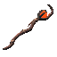 | **Flame Scepter** | Clusterbomb nổ AoE | TrophySurtling×5, BlackCore×5, YggdrasilWood×24, Eitr×36 | Eitr×18, Softtissue×12, Mandible×12, YggdrasilWood×12 |
| 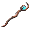 | **Ice Scepter** | Nova quanh người chơi | DragonTear×5, BlackCore×5, YggdrasilWood×24, Eitr×36 | Giống Flame |
| 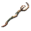 | **Lightning Scepter** | Đạn rút (nhuyễn) | Thunderstone×5, BlackCore×5, YggdrasilWood×24, Eitr×36 | Giống Flame |

## 4. Wands (early game)

Chế tại **Workbench lv1**; nâng cấp theo quality (Q2→Q5): Q2 mọi wand giống nhau (core/mắt), Q3 lấy nguyên liệu zone tương ứng, Q4/Q5 dùng Eitr + Mandible + BlackCore/Softtissue.

| Icon | Wand | Chế | Nâng cấp Q3 |
| --- | --- | --- | --- |
| 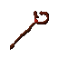 | **Flame Wand** | Resin×12, Wood×8 | TrophySurtling×5, Root×4 |
|  | **Ice Wand** | GreydwarfEye×6, Wood×8 | FreezeGland×18, Crystal×12 |
| 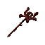 | **Lightning Wand** | GreydwarfEye×6, Wood×8 | Thunderstone×5, Iron×12 |
| 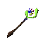 | **Poison Wand** | NeckTail×12, Wood×8 | YmirRemains×5, Iron×12 |

Nâng cấp khác dùng chung: Q2 = SurtlingCore×5 + AncientSeed×6; Q4 = Eitr×32 + Mandible×16; Q5 = BlackCore×5 + Softtissue×18.

## 5. Books / Tomes (khe sách)

| Icon | Sách | +Eitr (C) | Recipe |
| --- | --- | --- | --- |
| 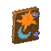 | **Beginner's Magic Book** | +24 | GreydwarfEye×6, Resin×4, Feathers×6, Wood×12 |
|  | **Advanced Magic Book** | +48 | YmirRemains×2, SurtlingCore×5, Crystal×52, AncientSeed×12 |
| 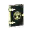 | **Druids Tome** | +62 | GoblinTotem×3, LoxPelt×12, LinenThread×16, ElderBark×8 |

▸ Craft Workbench lv1; SE `AddEitr`. Hoạt động khi có *AzuExtendedPlayerInventory*.

## 6. Giáp Magic (6 bộ × 4 mảnh)

Cả 6 bộ craft tại **Workbench lv1**. Armor value nằm trong asset (A). Mỗi mảnh: +Eitr (C) + eitr regen/s (C). **Cape 5** set (Sorcerers→Crimson, trừ Tattered) còn có SE *SlowFallAndEitr* — rơi chậm (tốc độ ≤ 5 m/s) + miễn 100% sát thương rơi.

| Icon | Bộ | Cape | Chest | Helm/Hat | Legs | Eitr Regen | Ghi chú |
| --- | --- | --- | --- | --- | --- | --- | --- |
|  | **1. Tattered** (Rootweave) | +10 | +12 | +10 | +12 | 0.07 | Set đầu game (Meadows — thực ra đòi Root/Deer) |
| 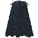 | **2. Sorcerers** (Shadowleaf) | +14 ⭐ | +16 | +14 | +16 | 0.12 | BlackForest+ |
| 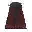 | **3. Warlocks** (Arcane Weavers) | +22 ⭐ | +24 | +22 | +24 | 0.22 | Swamp |
| 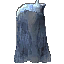 | **4. Polar Wolf** (Frostfang) | +18 ⭐ | +20 | +18 | +20 | 0.17 | **Set bonus (H):** Arctic — miễn nhiễm Cold / Freezing |
| 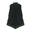 | **5. Seeker** (Scarab) | +26 ⭐ | +28 | +26 | +28 | 0.27 | Mistlands |
| 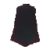 | **6. Crimson** (Inferno) | +30 ⭐ | +32 | +30 | +32 | 0.32 | Ashlands |

## 7. Đai (Belts)

| Icon | Đai | Hiệu ứng (C) | Recipe (ArtisanTable) |
| --- | --- | --- | --- |
|  | **Dvergrs Belt** | +1.0 (100%) eitr regen | Thunderstone×6, Amber×10, BlackMetal×12, YggdrasilWood×18 |
|  | **Wizards Belt** (Eitr Belt) | SE AddEitr **+72** eitr | Thunderstone×6, AmberPearl×10, BlackMetal×12, Eitr×18 |
|  | **Elementalist Belt** | +30 ElementalMagic skill | Thunderstone×6, Ruby×10, BlackMetal×12, ElderBark×18 |
|  | **Hogwarts Belt** | Damage hệ nguyên tố **×(1 + skillFactor×3)** | Thunderstone×6, Ruby×10, BlackMetal×12, Eitr×18 |
| 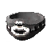 | **Necromancers Belt** | +30 BloodMagic skill | YmirRemains×6, Eitr×18, BlackMetal×12, YggdrasilWood×18 |
| 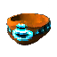 | **Haldors Belt** (Light Belt) | — (không SE) | Workbench: SurtlingCore×4, GreydwarfEye×20, Bronze×22, Resin×28 |

**(H)** Hogwarts: patch `ItemData.GetDamage` nhân damage lửa/băng/sét/độc/tinh thần với `1 + skillF(Elemental)×3`.

## 8. Khuyên tai, Nhẫn, Vòng cổ

### Khuyên tai (magic slot)

| Icon | Earring | Hiệu ứng | Recipe (Forge lv1) |
| --- | --- | --- | --- |
|  | Dvergr Earring | Stat từ asset (A) | BlackCore×1, Eitr×16, BlackMetal×4, Iron×4 |
|  | Eitr Earring | +48 eitr (C) | Giống Dvergr |
| 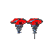 | Fire Res Earring | Very Resistant Fire | TrophySurtling×2, Ruby×2, AncientSeed×2, Iron×4 |
|  | Frost Res Earring | Very Resistant Frost | Thunderstone×2, Crystal×2, FreezeGland×2, Silver×4 |
|  | Poison Res Earring | Very Resistant Poison | YmirRemains×2, Guck×2, AncientSeed×2, Iron×4 |

### Nhẫn & vòng cổ (Jewelcrafting — GemcuttersTable lv3)

- **Dvergr (Blue):** +0.25 eitr regen/s (H)

- **Eitr (Purple):** +46 eitr (nhẫn) / +42 eitr (vòng) (C)

- **Fire / Frost / Poison Resist:** Very Resistant tương ứng

- Nền: socket gem màu + Chain×2; maxQuality = 1.

## 9. Heritage Staff (vũ khí boss)

| Icon | Vũ khí | Damage (C) | AoE | Drain / CD | Recipe → upgrade |
| --- | --- | --- | --- | --- | --- |
| 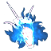 | **Moders Heritage** (mưa băng) | Frost 120+120×skill; Chop 50; Pick 50; Pierce 40 | 5+2×skill | Eitr 100 / Stam 30; CD 15s | Forged lv1: TrophyDragonQueen×1, DragonTear×2, Silver×32, WolfFang×16 → FreezeGland×10, Silver×16, WolfFang×8 |
|  | **Yagluths Heritage** (mưa sao băng) | Fire 120+120×skill; Blunt 40; Chop 50; Pick 50 | 5+2×skill | Eitr 100 / Stam 30; CD 15s | Forged lv1: TrophyGoblinKing×1, Wisp×10, BlackMetal×32, ElderBark×16 → Wisp×5, BlackMetal×16, ElderBark×8 |

### 9.1 Heritage Arms — súng ma thuật tầm xa (3 món, mới phát hiện khi audit)

⚠ Bổ sung từ audit DLL (MagicPlugin v2.1.9): 3 vũ khí tầm xa *ranged magic firearms* chưa từng xuất hiện trong wiki cũ. Mô tả in-game mở đầu bằng *"Forged in … this arcane **firearm** channels …"* — kênh 3 loại nguyên tố (lửa/băng/độc). Số liệu sát thương/công thức chưa kiểm chứng (cần decompile/asset bundle).

| Vũ khí | Prefab | Nguyên tố | Ghi chú |
| --- | --- | --- | --- |
| **Blaze Arm** | `bmr_blaze_arm` | 🔥 Fire (chưa rõ chi tiết) | Arcane firearm — chưa xác minh stats |
| **Frost Arm** | `bmr_frost_arm` | ❄️ Frost (chưa rõ chi tiết) | Arcane firearm — chưa xác minh stats |
| **Venom Arm** | `bmr_venom_arm` | ☠️ Poison (chưa rõ chi tiết) | Arcane firearm — chưa xác minh stats |

## 10. Totem triệu hồi + Summons

(C) = Health summon mặc định; cooldown toàn bộ totem = 60s (5–300). Summons thuộc tính (H): started tamed, gỡ khi chủ logout >120s, +skill BloodMagic 0.5 khi gọi.

| Icon | Totem | Summon | HP (C) | Yêu cầu | Bàn chế + Recipe gọn |
| --- | --- | --- | --- | --- | --- |
|  | Neck Totem | Neck (Summon) | 160 | — | WB: TrophyNeck×2, AncientSeed×4, NeckTail×8, Resin×20 |
| 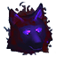 | Wolf Totem | Fenring Cultist (Summon)* | 350 | BloodMagic lv20 | WB: TrophyWolf×2, YmirRemains×5, WolfPelt×22, Silver×18 |
|  | Crystal Totem | Armored Skeleton | 500 | — | Forge: DragonTear×2, BlackMetal×24, Silver×22, Iron×20 |
|  | Skull Totem | Armored Skellies ×3 | 500 | — | MageT: YmirRemains×6, TrophySkeleton×8, TrophySkeletonPoison×8, Eitr×30 |
|  | Asksvin Totem | Asksvin (mount) | 900 | — | MageT: TrophyAsksvin×1, AskHide×8, FlametalNew×6, Eitr×32 |
|  | Charred Totem | Charred Melee + Archer | 700 / 350 | — | MageT: TrophyCharredMelee×1, FlametalNew×6, CharredBone×8, Eitr×32 |
|  | Drake Totem | Drake | 250 | BloodMagic 15 | WB: TrophyHatchling×1, FreezeGland×8, Silver×32, AncientSeed×6 |
|  | Seeker Totem | Seeker Brute | 1600 | — | MageT: TrophySeekerBrute×1, Mandible×6, BlackMetal×8, Eitr×32 |
|  | Fallen Totem | Fallen Valkyrie (Summon) | 1600 | — | MageT: TrophyFallenValkyrie×1, CelestialFeather×6, FlametalNew×8, Eitr×32 |
|  | Bjorn Totem | Bjorn | 900 | — | WB: TrophyBjorn×1, SurtlingCore×5, BjornPaw×6, AncientSeed×2 |
|  | Vile Totem | Vile (Unbjorn) | 1300 | — | WB: TrophyBjornUndead×1, BlackMetal×15, UndeadBjornRibcage×6, GoblinTotem×2 |

- Slime summons (từ Toxic/Fiery/Frosty/Lightning Totem — nếu có): HP 200, Breath damage 90 theo hệ (Poison/Fire/Frost/Lightning) — `(C)`.

- Scale (H): Neck 1.0–1.6, Fenring Cultist 1.0–1.2, Asksvin 1.0–1.2, Drake 1.0–1.6, Valkyrie/Bjorn/Vile 0.5–0.8...

## 11. Chiến cương Asksvin (Mount)

- W: chạy tự động; A/D: rẽ; S: dừng; Space: nhảy; (tấn công chính) cắn; (tấn phụ) đâm trán; (block) nhảy tấn công; E: cưỡi/xuống.

- Mỗi đòn tấn công tiêu tốn stamina của thú, tỉ lệ nhân theo kỹ năng Riding.

- HP 900 (C); thuộc nhóm `AsksvinFriendly` (tamed, tự loại khi chủ kho 120s).

## 12. Thức ăn Eitr

| Icon | Món | Recipe (Cauldron lv1) |
| --- | --- | --- |
| 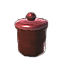 | **Mushroom Jam** | MushroomYellow×8, Mushroom×4, Blueberries×4, Thistle×2 |
|  | **Sauted Meat N Mushroom** | MushroomYellow×6, DeerMeat×3, Dandelion×6, RawMeat×3 |
| 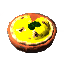 | **Mushroom Pie** | MushroomYellow×14, Mushroom×10, Blueberries×6, Raspberry×10 |
| 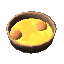 | **Mountain Soup** | CookedWolfMeat×4, Onion×6, Carrot×6, MushroomYellow×10 |
|  | **Mountain Stew** | WolfMeat×8, Onion×6, Carrot×6, MushroomYellow×10 |
| 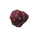 | **Mushroom Puff** (hồi máu nhanh) | Honey×1, Mushroom×5, Raspberry×5, Dandelion×5 (tựa craft inventory) |

Số HP/Stamina/Eitr/duration của đồ ăn nằm trong asset (A); config cho phép sửa Health/Stamina/Eitr/Duration/Health Regen theo prefab.

## 13. Ghi chú kỹ thuật

- Toàn bộ Eitr bonus/hồi phục skill của staff/scepter/totem được cấu hình trong nhóm `ItemAppendix`; giá trị damage thô của vũ khí nằm trong asset bundle (không thể trích từ code).

- Patch đáng chú ý: `MineRock/MineRock5/Destructible + Surtling/Eikthyr/Lightning staff` — toolTier theo quality giúp staff phá đá/chặt cây như riệu đồ đúng cấp; `PrimitiveUpdateEnv` xóa Cold/Freezing khi đeo đủ bộ PolarWolf.

- ServerSync: config mặc định sync tới client; bật `_serverConfigLocked` để khóa.

**Nguồn:** decompile `MagicPlugin.dll` v2.1.9 (blacks7ar) — file gốc không có wiki; số liệu default config + hardcode trong mã, damage vũ khí từ asset bundle (không trích được).
