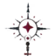
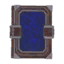
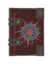
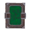
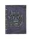
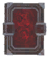
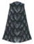
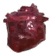
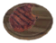

# 🧟 PHẦN 4 — Vikings Summoner: Wiki Chi Tiết (v1.4.5)

Wiki từ **decompile Vikings_Summoner.dll** (tác giả *radamanto*) — mod necromancer dựa trên skill **BloodMagic**. Ký hiệu: `(C)` = config default, `(H)` = hardcode, `(A)` = giá trị thật trích từ asset bundle `rd_armor`.

**Cài đặt:** bỏ `Vikings_Summoner.dll` vào `BepInEx/plugins/`. Dùng ServerSync + config watcher; mặc định server khóa cấu hình (`Lock Configuration` = On).

## 1. Tổng quan & tính năng chính

- **11 summon** theo biome (Meadows → Ashlands), mỗi summon gắn **1 totem riêng**; triệu hồi bằng **7 staff** (1 mỗi biome) hoặc **11 totem**.

- **Gate theo BloodMagic** (BM): chưa đủ BM → không cast được; sao summon cấp theo BM (3 sao tối đa).

- **Giáp Necromancer 7 bộ × 4 mảnh** (Meadows → Ashlands) + set bonus 3 mảnh (hồi máu, +BM, kháng hệ).

- **6 grimoire**: 3 sách thuần (buff tĩnh) + 3 sách summon (buff extra summons), dùng qua **khe Tome slot** (đòi `AzuExtendedPlayerInventory`).

- **6 món ăn** (2 craft giotéo inventory, 4 cauldron), mỗi lần craft ra **5**.

- **2 bàn chế tạo necromancer** + 7 extension, build trên Workbench (category "Vikings Mastery").

- **Thời gian sống** (TTL) rồi suy thoái; summon follow chủ, tự hủy khi chủ chết/teleport; HUD icon riêng; **voice override** EN/Brazilian.

| Icon | Config toàn cục (C) | Default | Khoảng | Hiệu lực |
| :---: | --- | --- | --- | --- |
| Health Regen Debuff | On | On/Off | Mỗi summon đang có trừ **1%** HP regen của chủ |  |
| Summon Decay Health | 80% | 0–100 | 80% đầu đời giữ nguyên HP; 20% cuối giảm dần về 1% |  |
| Summon Decay Tick | 0.5s | 0.1–10 | Nhịp trừ máu theo decay |  |
| Voice Override | Off | On/Off | Thay tiếng summon bằng voice EN/Brazilian (bật = dùng tiếng mod) |  |
| Voice Language | English | EN/PTBR | Ngôn ngữ voice override |  |
| Voice Sound Interval / Chance | 45s / 0.7 | ≥0.01 / 0–1 | Nhịp + xác suất phát âm thanh idle |  |
| Tome Slot | On | On/Off | Khe trang bị sách grimoire (đòi Advanced) |  |

## 2. Bàn chế tạo Necromancer (2 bàn + 7 extension)

Craft trên **Workbench vanilla**. Bàn `RD_necromancer_table` (cấp Meadows→Mountain, levelcraft 1–2 theo extension) và `RD_necromancer_table_02` (Plains+). Tất cả nguyên liệu `recover: true` (trả lại khi thu hồi).

| Icon | Bàn | Recipe (C) | Nâng cấp bàn |
| :---: | --- | --- | --- |
|  | **Necromancer Table I** (RD_necromancer_table) | Resin×10, Wood×20, DeerHide×10 | — |
|  | Extension 01 | GreydwarfEye×10, Wood×10, DeerHide×5 | Bàn lv2 |
|  | Extension 02 | Bronze×10, FineWood×10, Feathers×5 | Bàn lv2 |
|  | Extension 03 | Iron×10, ElderBark×15, Entrails×10 | Bàn lv2 |
|  | Extension 04 | Silver×10, FineWood×10, FreezeGland×6 | Bàn lv2 |
|  | **Necromancer Table II** (RD_necromancer_table_02) | BlackMetal×20, FineWood×20, GoblinTotem×2 | — |
|  | Extension 2.1 | BlackMetal×10, FineWood×10, GoblinTotem×1 | Bàn lv2 |
|  | Extension 2.2 | Eitr×10, FineWood×10, BlackCore×1 | Bàn lv2 |
|  | Extension 2.3 | Eitr×8, Blackwood×10, FlametalNew×10 | Bàn lv2 |

## 3. Staff (Pháp trượng — 7)

Staff kích hoạt `SpawnAbility` → triệu hồi đúng con summon của biome tương ứng (xem bảng 6). Stats damage/stamina nằm trong asset `(A)`; maxQuality = 4 `(A)`. Mọi staff config được recipe + stats.

| Icon | Staff | Triệu hồi | Bàn chế | Craft → nâng cấp |
| :---: | --- | --- | --- | --- |
|  | **Staff Meadows** (RD_inv_staff_meadows) | Skeleton Meadows | Bàn I lv1 | TrophyBoar×1, Wood×16, GreydwarfEye×10, Flint×10 → Wood×8, GreydwarfEye×4, Flint×4 |
|  | **Staff Black Forest** (RD_inv_staff_bforest) | Skeleton Black Forest | Bàn I lv2 | TrophySkeleton×1, RoundLog×12, SurtlingCore×5, Bronze×6 → RoundLog×8, SurtlingCore×5, Bronze×2 |
|  | **Staff Swamp** (RD_inv_staff_swamp) | Draugr Swamp | Bàn I lv2 | YmirRemains×5, Guck×16, Iron×20, ElderBark×14 → Guck×8, Iron×10, TrophySkeleton×6 |
|  | **Staff Mountain** (RD_inv_staff_mountain) | Draugr Mountain | Bàn I lv2 | DragonEgg×1, ElderBark×22, FreezeGland×16, Silver×14 → ElderBark×11, FreezeGland×8, Silver×8 |
|  | **Staff Plains** (RD_inv_staff_plains) | Skeleton Plains | Bàn II lv1 | GoblinTotem×2, LoxPelt×22, RoundLog×16, BlackMetal×20 → LoxPelt×11, RoundLog×8, BlackMetal×8 |
|  | **Staff Mistlands** (RD_inv_staff_mistlands) | Skeleton Mistlands (Bow) | Bàn II lv1 | BlackCore×2, YggdrasilWood×22, Eitr×14, GiantBloodSack×4 → YggdrasilWood×11, Eitr×6, GiantBloodSack×1 |
|  | **Staff Ashlands** (RD_inv_staff_ashlands) | Skeleton Ashlands / Mage | Bàn II lv1 | ShieldCore×2, YggdrasilWood×24, FlametalNew×12, CharredBone×12 → YggdrasilWood×11, FlametalNew×6, CharredBone×6 |

## 4. Grimoire / Tome (6)

Tất cả đều là **Tome** (đặt khe sách, đòi AzuEPI), craft tại bảng, không nâng cấp. Sách **summons** (`RD_grimoire_summons_0x`) trừ tốc độ di chuyển người dùng `(A)` (m_movementModifier): g1 -5%, g2 -10%, g3 -15%.

| Icon | Grimoire | Hiệu ứng (A) | Recipe (C) |
| :---: | --- | --- | --- |
|  | **Grimoire I** (Summoning I) | +2 BloodMagic skill; HP regen ×1.02; +1% spirit dmg | DeerHide×20, LeatherScraps×10, Feathers×15, GreydwarfEye×10 |
|  | **Grimoire Summons I** | +1 summon tối đa; cost HP summon +5%; MaxHP −5% (C) | TrophyAbomination×1, DeerHide×20, Iron×2, Guck×15 |
|  | **Grimoire II** (Summoning II) | +4 BM; Regen ×1.02; +2% spirit | WolfPelt×10, WolfFang×4, Crystal×5, Resin×15 |
|  | **Grimoire Summons II** | +2 Summons; cost HP +10%; MaxHP −10% (C) | TrophyGoblinShaman×1, LoxPelt×20, BlackMetal×2, Tar×15 |
|  | **Grimoire III** (Summoning III) | +6 BM; Regen ×1.05; +3% spirit | YmirRemains×10, DeerHide×20, BlackCore×5, Eitr×15 |
|  | **Grimoire Summons III** | +3 Summons; cost +15%; MaxHP −15% (C) | TrophyCharredMage×1, AskHide×10, FlametalNew×2, CelestialFeather×5 |

## 5. Giáp Necromancer (28 mảnh — 7 bộ)

7 bộ theo biome, mỗi bộ 4 mảnh (Helmet/Chest/Legs/Cape), maxQuality = 4 `(A)`. Mặc **set 3 mảnh** kích SE: **+HP/tick** khi đủ level + regen ×% + **BMI skill** + kháng hệ `(A)`. Chest/Legs Ashlands có `heatResistance` 0.15 và kháng Pierce `(1)`.

| Icon | Bộ | Cape | Chest | Helmet | Legs | Set bonus (A) |
| :---: | --- | --- | --- | --- | --- | --- |
|  | **Meadows** | 1 | 2 | 2 | 2 | +1 HP/tick; regen ×1.02; BM +2 |
|  | **Black Forest** | 1 | 7 | 7 | 7 | +2 HP/tick; ×1.03; BM +2 |
|  | **Swamp** | 1 | 11 | 11 | 11 | +3 HP/tick; ×1.04; BM +4; Poison Res |
|  | **Mountain** | 1 | 14 | 14 | 14 | +4 HP/tick; ×1.06; BM +6; Frost+Poison Res |
|  | **Plains** | 1 | 19 | 19 | 19 | +5 HP/tick; ×1.08; BM +8; Stam regen ×1.01 |
|  | **Mistlands** | 1 | 22 | 22 | 22 | +6 HP/tick; ×1.12; BM +16; slow fall (cơ chế giới hạn tốc độ rơi `m_maxMaxFallSpeed=5` — giảm sát thương rơi thực tế, không phải modifier −100%) |
|  | **Ashlands** | 1 | 27 | 27 | 27 | +7 HP/tick; ×1.15; BM +20; slow fall |

Armor value = armor `(A)` (trường hợp Cape: armor 1–4; các mảnh còn lại +2/level). Recipe (C) chi tiết trong mô tả game — ví dụ: Chest Ashlands: **GemstoneRed×1, AskHide×28, CharredBone×16, FlametalNew×26**; Helmet Ashlands: GemstoneRed×1, AskHide×8, CelestialFeather×4, FlametalNew×8; các bậc dưới tương tự giảm dần.

## 6. Totem triệu hồi + Summons (11)

`(A)` Health = % máu tối đa mất để summon (asset/prefab mặc định, override qua config), `Eitr` = eitr trừ tương ứng (xem bảng 8.1). Totem nâng cấp (quality) kéo dài thời gian sống +10s/lvl (Meadows→Plains) / +15s/lvl (Mistlands+). Summon tất cả of bộ đặt được `Player Statistic "creatures summoned" +1` khi triệu hồi `(H)`.

| Icon | Totem | Summon | Gate BM | HP base (A) | Health/Eitr cost (A) | Recipe → upgrade |
| :---: | --- | --- | --- | --- | --- | --- |
|  | Totem Meadows | **Skeleton Meadows** | 10 | 50 | 5% / 5 | TrophyDeer×1, LeatherScraps×20, BoneFragments×20 → LS×5, BF×5 |
|  | Totem Black Forest | **Skeleton Black Forest** | 20 | 100 | 7% / 7 | TrophySkeletonPoison×1, LeatherScraps×25, Bronze×20, BF×20 → LS×7, B×5, BF×5 |
|  | Totem Ghost | **Ghost** | 30 | 80 | 7% / 7 | TrophyGhost×1, DeerHide×25, Bronze×20, BF×20 → DH×7, B×5, BF×5 |
|  | Totem Swamp | **Draugr Swamp** | 30 | 200 | 10% / 10 | TrophyDraugr×1, Root×6, Iron×20, BF×20 → Root×2, Iron×5, BF×5 |
|  | Totem Mountain | **Draugr Mountain** | 40 | 300 | 12% / 12 | TrophyDraugrElite×1, FreezeGland×8, Silver×20, WolfFang×10 → FG×2, S×5, WF×4 |
|  | Totem Valkyrie | **Valkyrie (bay)** | 40 | 350 | 12% / 12 | TrophySGolem×1, FreezeGland×10, Silver×20, Feathers×50 → FG×2, S×5, F×10 |
|  | Totem Plains | **Skeleton Plains** | 50 | 400 | 15% / 15 | TrophySkeletonHildir×1, GoblinTotem×4, BlackMetal×20, BF×20 → GT×1, BM×5, BF×5 |
|  | Totem Bear (Unbjorn) | **Unbjorn (gấu)** | 50 | 450 | 15% / 15 | TrophyBjornUndead×1, RottenMeat×8, BlackMetal×20, UBRibcage×6 → RM×2, BM×5, UBR×2 |
|  | Totem Mistlands | **Skeleton Mistlands (Archer)** | 60 | 600 | 18% / 18 | BlackCore×2, Ygg×22, Eitr×14, GiantBloodSack×4 → YW×11, E×6, GB1 |
|  | Totem Ashlands | **Skeleton Ashlands (Melee Đại)** | 70 | 800 | 20% / 20 | ShieldCore×2, YggdrasilWood×24, FlametalNew×12, CharredBone×12 → YW×11, FN×6, CB×6 |
|  | Totem Ashlands Mage | **Skeleton Mage (Ashlands)** | 70 | 500 | 20% / 20 | Giống Totem Ashlands |

HP base `(A)` = asset/prefab mặc định (override qua config `Summon Health`); HP thực tế = base × (1 + 0.25/star). Health `%` = % max HP của người chơi, trừ kèm Eitr.

### 6.1 Vũ khí / sát thương summon `(A)`

| Summon | Weapon (inventory prefab) | Damage (asset, lần hồi) |
| --- | --- | --- |
| Skeleton Meadows | RD_skeleton_bronze_sword_inv / bronze_mace_inv | Slash 10 + Pierce 10 + Spirit 10 / Blunt 20 + Spirit 10 |
| Skeleton Black Forest | RD_skeleton_iron_sword_inv / iron_mace_inv | Slash 25 + Poison 25 + Spirit 10 / Blunt 25 + Poison 25 + Spirit 10 |
| Ghost | Ghost_attack_bforest | Slash 35 |
| Draugr Swamp | RD_draugr_bow_inv | Pierce 40 + Poison 20 + Spirit 20 |
| Draugr Mountain | RD_draugrelite_sword / mace_inv | Slash 40 + Frost 20 + Spirit 20 / Blunt 50 + Frost 20 + Spirit 20 |
| Valkyrie | valkyrie_claws | Slash 40 + Pierce 40 + Lightning 10 + Spirit 10 |
| Skeleton Plains | RD_skeleton_hildir_sword / firenova | Slash 50 + Fire 25 + Spirit 25 / Fire 20 + Spirit 80 |
| Unbjorn | unbjorn_bite/claws/slam | Pierce 130 + Slash 20; Claw Slash 130 + Chop 40; Slam Blunt 150 + Chop 40 + Pickaxe 40 |
| Skeleton Mistlands | charred_bow / volley | Pierce 60 + Fire 40 + Spirit 40 |
| Ashlands Melee | charred_greatsword tre/feint/thrust | Slash 80+Fire 50+Spirit 50; Thrust Pierce 90 + Fire 60 + Spirit 60 |
| Ashlands Mage | charred_magestaff | Pierce 100 |

HP base trong bảng 6 = muzzle HP `(A)` (m_health); setLevel chỉnh theo star: HP = base × (1 + 0.25 × stars).

### 6.2 Bảng tham chiếu Prefab → Tên in-game (HUD) — bổ sung khi audit DLL v1.4.5

⚠ Các bảng phía trên dùng nhãn prefab (vd "Staff Meadows"). Đây là **tên hiển thị thật trong game** (trích từ localization nhúng trong DLL) để tra cứu khi giao dịch/mua bán.

| Nhóm | Prefab / key | Tên in-game (HUD) |
| --- | --- | --- |
| Staff | item_RD_inv_staff_meadows | Funeral Dawn Staff |
| item_RD_inv_staff_bforest | Fallen Spirit Staff |  |
| item_RD_inv_staff_swamp | Unholy Swamp Staff |  |
| item_RD_inv_staff_mountain | Glacial Shadow Staff |  |
| item_RD_inv_staff_plains | Cursed Moon Staff |  |
| item_RD_inv_staff_mistlands | Spectral Veil Staff |  |
| item_RD_inv_staff_ashlands | Profane Furnace Staff |  |
| Totem | item_RD_totem_inv_meadows | Skull Totem |
| item_RD_totem_inv_bforest | Rotting Skull Totem |  |
| item_RD_totem_inv_bforest_ghost | Spectral Skull Totem |  |
| item_RD_totem_inv_swamp | Bleeding Heart Totem |  |
| item_RD_totem_inv_mountain | Frost Head Totem |  |
| item_RD_totem_inv_mountain_valkyrie | Fallen Valkyrie Totem |  |
| item_RD_totem_inv_plains | Ancestral Skull Totem |  |
| item_RD_totem_inv_plains_bear | Vile Skull Totem |  |
| item_RD_totem_inv_mistlands | Memorial Archer Totem |  |
| item_RD_totem_inv_ashlands | Memorial Warrior Totem |  |
| item_RD_totem_inv_ashlands_mage | Memorial Mage Totem |  |
| Extension bàn (2 bàn + 7 extension) | piece_RD_* (Cursed Book…) | Cursed Book, Essence of Death, Summoning Pentagram, Coffin, Cauldron, Blood Altar, Table of Sacrifice |
| Giáp (bộ theo biome) | Meadows | Hat Reborn / Chest Reborn / Legs Reborn / Cape Reborn |
| Swamp | Bone Helmet / Bone Chest / Bone Legs / Bone Cape |  |
| Mountain | Sanguine Helm / Sanguine Chest / Sanguine Legs / Sanguine Cape |  |
| Plains | Pale Helmet / Pale Chest / Pale Legs / Pale Cape |  |
| Mistlands | Decrepit Helmet / Decrepit Chest / Decrepit Legs / Decrepit Cape |  |
| Grimoire | item_RD_grimoire_01 | Grimoire Morthbok |
| item_RD_grimoire_02 | Grimoire Draugrbok |  |
| item_RD_grimoire_03 | Grimoire Eldrun |  |
| item_RD_grimoire_summons_01/02/03 | Grimoire Summoning I / II / III |  |
| se_book_grimoire_extra_01/02/03 | Conjuration Grimoire I / II / III |  |
| item_RD_*_inv (summons) | Skeleton · Spiteful Carcass · Specter · Bloody Archer · Frozen Corpse · Corrupted Valkyrie · Ancestral Skeleton · Vile · Memorial Archer · Memorial Warrior · Memorial Mage |  |

Ghi chú: tên giáp Ashlands chưa trích đầy đủ khi audit (truncated trong dump); set Đồng cỏ (Meadows) hiển thị "…Reborn".

## 7. Thức ăn (Food — 6)

Craft nhận **5 con/mẻ** (CraftAmount = 5). Giá trị dinh dưỡng `(A)` (lấy từ asset):

| Icon | Món | HP | Stamina | Eitr | Regen | BurnTime | Recipe (C) |
| :---: | --- | --- | --- | --- | --- | --- | --- |
|  | **Hamburger** (RD_meat_patty) | 14 | 9 | 25 | 2 | 1200 | Inventory: RawMeat×2, Dandelion×4 |
|  | **Fruit Mead** (RD_fruit_mead) | 8 | 16 | 24 | 2 | 1200 | Inventory: Blueberries×4, Raspberry×4, Mushroom×4 |
|  | **Roasted Meat** (RD_roast_meat) | 18 | 12 | 30 | 2 | 1200 | Cauldron: DeerMeat×2, Dandelion×4, Thistle×4 |
|  | **Blood Sausage** | 28 | 19 | 39 | 2 | 1200 | Cauldron: Entrails×4, RawMeat×1, Bloodbag×2 |
|  | **Meat Stew** | 33 | 23 | 49 | 2 | 1200 | Cauldron: WolfMeat×6, Onion×4, Carrot×4, M.Yellow×2 |
|  | **Meatballs in Red Sauce** | 39 | 25 | 56 | 3 | 1200 | Cauldron: LoxMeat×2, BarleyFlour×4, Cloudberry×2, Raspberry×2 |

## 8. Cơ chế triệu hồi & Buffs

- **Gate BM**: cần BM ≥ gate (bảng 6) — dưới mức → thông báo `$vs_bm_gate_msg`, attack không setup `(H)`.

- **Progression** (C): định nghĩa sao + max summons theo khoảng BM (vd Meadows: 10-19:1★:2; 20-29:2★:2; 30-39:3★:2; 40+:3★:3). Sao = `SetLevel`, max = ZDO `vs_maxInstances` + bonus grimoire.

- **HP cost** (Chỉ totem, không staff): % max HP × (1 + grimoire cost multiplier), kiểm tra đủ máu + không flash máu đỏ khi trừ `(H)`.

- **TTL + decay** `(C)`: decay 80%/tick 0.5s — 80% đầu nguyên HP, còn 20% máu giảm tuyến tính xuống 1%; hết hạn → `vfx_unspawn_*` + `sfx_unspawn` + Destroy.

- **Owner death/teleport**: gỡ toàn bộ summon của player (reason OwnerDeath/OwnerTeleport); chủ offline >120s (Tameable) hoặc ra khỏi 150m → unsummon.

- **Debuff chủ** `(C)`: mỗi summon active trừ hệ số regen ×(1 − 0.01×N) (icon ico_debuff, tooltip hiện số).

- **Follow AI**: ground dừng ≤6m; bay giữ độ cao 2.5m / ≤10m ngang.

- **Hud**: hover hiện `[Use] Unsummon` (chủ sở hữu), icon combat riêng `ico_summon_combat`, ít khi hiện alerted.

- **CLLC**: summon bị tước affix/infusion (ZDO values 0) khi spawn.

### 8.1 Bảng cost mặc định (C):

| Summon tier | 5% | 7% | 10% | 12% | 15% | 18% | 20% |
| --- | --- | --- | --- | --- | --- | --- | --- |
| Summons | Meadows | BF/Skeleton+Ghost | Draugr Swamp | Draugr Mt + Valkyrie | Plains + Bear | Mistlands | Ashlands + Ash Mage |

## 9. Ghi chú kỹ thuật

- 196 GameObjects đăng ký (fx/sfx/dựt nhiên), 35 summon weapons **không craft** được (registry disabled).

- Menu preview summon khi vào game (mô hình clone).

- Tất cả stats damage/stamina của vũ khí nằm trong asset bundle — nếu config cho sửa sẽ dùng trực tiếp từ prefab.

- Không có skillcost `consumed_energy`; không có debug flag. Gate không đủ → chỉ block, không spam log.

#soulcatcher-wiki { page-break-before: always; }
#soulcatcher-wiki h2 { color: #16213e; border-bottom: 2px solid #e94560; padding-bottom: 5px; margin-top: 25px; page-break-after: avoid; }
#soulcatcher-wiki h3 { color: #0f3460; margin-top: 20px; page-break-after: avoid; }
#soulcatcher-wiki table tr { page-break-inside: avoid; }
#soulcatcher-wiki blockquote { margin: 8px 0; padding: 8px 12px; background: #f4f4f8; border-left: 4px solid #0f3460; color: #555; font-size: 9pt; }
#soulcatcher-wiki code { background: #eee; padding: 1px 4px; border-radius: 3px; font-size: 8.5pt; }
#soulcatcher-wiki pre { background: #f4f4f8; padding: 8px; border-radius: 4px; font-size: 8.5pt; overflow: hidden; }
#soulcatcher-wiki img { vertical-align: middle; }
#soulcatcher-wiki ul, #soulcatcher-wiki ol { margin: 6px 0 6px 22px; }
