# 👻 PHẦN 5 — Soul Gem (Soulcatcher): Wiki Chi Tiết (v4.5.9)

**Nguồn dữ liệu:** wiki này được đối chiếu trực tiếp từ mã nguồn đã decompile của `Soulcatcher_KG_JC_Additions.dll`, file dịch `translations.English.yml` nhúng trong DLL, assetbundle `soulcatcher` (Unity 2020.3.33f1) và các file cấu hình đang chạy.

**Phiên bản:** code bên trong DLL ghi `v4.5.8` (`[BepInPlugin("Soulcatcher", "Soulcatcher", "4.5.8")]`, `Soulcatcher.cfg` ghi v4.5.8) — manifest.json trên r2modman ghi `4.5.9`. Nếu có khác biệt nhỏ, lấy 4.5.8 làm chuẩn code.

## Mục lục

- [Tổng quan & cài đặt](#1-tổng-quan--cài-đặt)

- [Hướng dẫn chơi](#2-hướng-dẫn-chơi)

- [Bảng 43 viên gem linh hồn](#3-bảng-43-viên-gem-linh-hồn)

- [Cấu hình (Config)](#4-cấu-hình-config)

- [Kỹ thuật cho modder](#5-kỹ-thuật-cho-modder)

- [Bug & mod fix](#6-bug--mod-fix)

- [FAQ](#7-faq)

- [PlantEasily — hướng dẫn nhanh](#toc-65)

## 1. Tổng quan & cài đặt

### 1.1 Mod này là gì

Soulcatcher thêm một hệ thống **bắt linh hồn quái vật** vào Valheim:

- Khi bạn giết quái (với đèn **Lantern** trang bị trong tay), quái có thể rơi ra **hồn** — một bóng ma nhỏ bằng đúng hình con quái vừa chết.

- Nhìn về phía hồn và **giữ chặn (block)** trong vòng bán kính để **hút hồn** vào đèn.

- Hồn dùng để **chế tạo gem** tại **Soul Altar** (bàn tế hồn) — mỗi loại hồn cho một loại gem riêng, 5 cấp: gem nền (không hậu tố) → `Ascend` → `Immortal` → `Godlike` → `Odin's Wrath`.

- Gem gắn vào trang bị qua cơ chế **Jewelcrafting** (đục lỗ bằng bàn Gemcutter).

### 1.2 Yêu cầu

- **BepInEx 5.x** (plugin được viết cho BepInEx 5, `BaseUnityPlugin`).

- **Jewelcrafting 2.0.1** (bắt buộc — mod đăng ký gem và kỹ năng qua `Jewelcrafting.API`).

- **ServerSync** đi kèm trong DLL (config tự đồng bộ server ↔ client).

### 1.3 Cài đặt

Cài qua r2modman/Thunderstore hoặc bỏ thư mục mod vào `BepInEx/plugins/`. Các file chính của mod:

| File | Vai trò |
| --- | --- |
| `Soulcatcher_KG_JC_Additions.dll` | Plugin chính (đã được ILRepack gộp các thư viện đi kèm) |
| `Soulcatcher_KG_JC_Additions.libs.soulcatcher` | Assetbundle Unity (model, VFX, âm thanh, UI, prefab 43 gem) |
| `Soulcatcher_KG_JC_Additions.translations.English.yml` | Bản dịch tiếng Anh (mô tả gem + UI) |
| `Soulcatcher_KG_JC_Additions.libs.SoulcatcherScripts.dll` | Thư viện phụ (được load runtime cho UI bàn tế) |
| `Soulcatcher_KG_JC_Additions.icons.icon.png` | Icon kỹ năng Soulcatcher |

Sau lần chạy đầu tiên, mod sinh 2 file cấu hình:

- `BepInEx/config/Soulcatcher.cfg` — chi phí/thời gian chế tạo gem, trang sức, MaxSouls…

- `BepInEx/config/Jewelcrafting.Sockets_Soulcatcher_KG_JC_Additions.yml` — số liệu hiệu lực của 43 gem (do Jewelcrafting đọc).

- `BepInEx/config/Soulcatcher_Custom_SoulSpawn.cfg` — file ánh xạ hồn tùy biến (xem mục 4.4).

⚠️ Nếu gặp lỗi *"The power must be a list of exactly 4 numbers denoting the strength of the effect..."*, hãy xóa file `BepInEx/Config/Jewelcrafting.Sockets_Soulcatcher_KG_JC_Additions.yml` rồi khởi động lại game (thông báo này được in trực tiếp bởi mod khi load).

## 2. Hướng dẫn chơi

### 2.1 Luyện tập kỹ năng "Soulcatcher"

Mod đăng ký kỹ năng **Soulcatcher** (mô tả: *"Catch souls faster"*) qua API của Jewelcrafting. Kỹ năng lên level bằng cách **bắt hồn**:

- Mỗi hồn bắt được = **+4 XP** (`RaiseSkill("Soulcatcher", 4f)`).

- Level 100: mỗi hồn mang lại **+5% tỉ lệ rơi hồn** và **giảm thời gian hút** (chi tiết bên dưới).

### 2.2 Đèn lồng hút hồn (Soulcatcher Lantern)

**Chế tạo** (Bàn chế tạo — Forge, không hoàn lại nguyên liệu):

| Nguyên liệu | Số lượng |
| --- | --- |
| GreydwarfEye | 50 |
| Crystal | 20 |
| SurtlingCore | 20 |
| Iron | 10 |

**Cách dùng:**

- Trang bị đèn vào tay (tay phải hoặc tay trái đều được nhận diện).

- Hồn rơi ra khi giết quái; đứng trong bán kính **20 m** (hoặc **40 m** nếu đeo **Soul Ring**), trong góc nhìn **60°** trước mặt.

- **Giữ chặn (block)** — chỉ khi đang chặn đèn mới kích hoạt hút; hiệu ứng lốc xoáy (tornado) xuất hiện kéo hồn về.

- Thời gian hút mỗi hồn: `4s − (skill × 2s)` → skill 100 = **2 s**.

- Hồn **vàng (gold soul)** = hồn đặc biệt, khi hút được tính **x2** hồn; tỉ lệ xuất hiện hồn vàng = `skill × 15%` (tối đa 15% ở skill 100). Hồn vàng có màu vàng thay vì màu đặc trưng.

- Giới hạn chứa: **500 hồn** (config `MaxSouls`) — vượt quá sẽ báo *"You can't hold more souls"*.

- Rê chuột lên đèn để xem danh sách hồn (tối đa 30 dòng hiển thị, màu theo từng loài). Khói trên đèn sáng dần theo số hồn (độ trong suốt = count/500).

- Hồn lưu trên chính ItemData của đèn (dạng JSON trong `m_customData`), nên **đèn giữ hồn khi cất rương / nhặt lại**.

### 2.3 Tỉ lệ rơi hồn (soul spawn chance)

Khi một con quái chết **do bạn gây sát thương gần nhất** (mod theo dõi ai đánh cuối), người giết (chủ sở hữu) nhận sự kiện và mod tính tỉ lệ rơi hồn:

`spawn chance % = 10 + level của quái + skill × 5 + (Soul Necklace ? 10 : 0)
`

Ví dụ: quái cấp 1, skill 0 → 11%; quái cấp 2, skill 100, đeo vòng cổ → 27%. Với `Player.m_debugMode` (cheat mode) → **luôn rơi hồn 100%**.

- Hồn sinh ở vị trí quái chết + 1.5 m, tự tìm đường về đèn (bay, có animation giống quái gốc, vật liệu màu hồn).

- Chỉ rơi hồn nếu bạn đang **cầm đèn** (`HasLantern`), và loại quái **có trong danh sách** `SoulConvertions` hoặc file custom spawn.

- Dverger: mod phân biệt mage theo trạng thái (`CheckDverger`) để cho đúng hồn Dverger / Fire Mage / Blood Mage / Ice Mage.

### 2.4 Bàn tế hồn (Soul Altar)

**Công trình** (búa, mục Building — có hoàn lại nguyên liệu khi phá):

| Nguyên liệu | Số lượng |
| --- | --- |
| Stone | 50 |
| GreydwarfEye | 25 |
| Crystal | 20 |
| Iron | 20 |

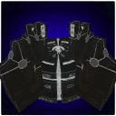

**Cách dùng:**

- Tương tác với bàn tế → mở giao diện **SoulAltarUI** (danh sách công thức hồn → gem).

- Chọn loại gem muốn chế tạo; mod tự trừ **đúng số hồn theo config** (mặc định **30 hồn** mỗi gem — chỉ nhận đúng loại hồn tương ứng).

- Bàn tế bắt đầu "đúc": thời gian mặc định **600 giây (10 phút)** mỗi gem (config `[Gems Craft Time]`), hiển thị % tiến trình trên bàn tế, có hiệu ứng màu theo loại hồn.

- Khi đủ thời gian, bàn tế nổ hiệu ứng và sinh ra viên gem **cấp T1** (gem nền, không hậu tố).

- Gem cấp cao hơn không chế tạo trực tiếp — dùng bàn **Gemcutter** của Jewelcrafting để nâng cấp gem như bình thường.

Mẹo: cấu hình `Soulcatcher.cfg` có thể chỉnh `[Gems Craftable]` (bật/tắt từng gem) và `[Gems Cost Amount]`/`[Gems Craft Time]` cho từng gem riêng.

### 2.5 Gắn gem vào trang bị

- Dùng bàn **Gemcutter (Jewelcrafting)** để khoan lỗ và gắn gem. Slot hợp lệ tùy gem (xem bảng mục 3).

- Hiệu lực gem quyết định bởi cấp gem, theo thứ tự T1 → T5: gem nền → `Ascend` → `Immortal` → `Godlike` → `Odin's Wrath`. 5 giá trị trong mỗi mục `power` (mục 3) tương ứng T1 → T5; cấp càng cao, giá trị càng lớn.

- Gem có cờ `unique` (xem 5.4) giới hạn số gem cùng loại được gắn.

- Tooltip mô tả hiệu ứng gem lấy từ file dịch `translations.English.yml` (các key `jc_effect_*_soul_power_desc_detail` với tham số $1/$2).

### 2.6 Trang sức (Jewelry)

Mod thêm 2 món trang sức (chế tạo tại **Gemcutter's Table cấp 3**, yêu cầu **Coins 1000**, nâng cấp **Coins 1500/lv**):

| Món | Tác dụng | Hiệu lực phụ |
| --- | --- | --- |
| **Soul Necklace** (vòng cổ) | +10% tỉ lệ rơi hồn | Giáp 10 (+5/lv), +5% tốc độ di chuyển |
| **Soul Ring** (nhẫn) | Tăng bán kính hút hồn 20 m → 40 m | Giáp 10 (+5/lv), +5% tốc độ di chuyển |

Trang sức hoạt động qua status effect đeo `SE_JewelryEffect` (tên status: `SoulNecklace`/`SoulRing` — mod code kiểm tra trực tiếp tên status này).

### 2.7 Nền tảng hồn (Soul Platform)

Công trình trang trí/trưng bày:

- Tương tác với **đèn trên tay** → đặt **1 hồn** (loại hồn hiện chọn trong đèn) lên nền, hiển thị con hồn ảo xoay theo hướng người chơi (lưu qua ZDO, đồng bộ mọi người).

- **Giữ Shift + tương tác** → chuyển loại hồn hiển thị.

- **Ngồi xổm (crouch) + tương tác** → xoay hồn đang trưng bày.

- Bấm ESC đóng UI khi đang mở.
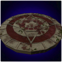

### 2.8 Lệnh admin (cheat, chỉ dùng khi bật cheat mode)

Gõ trong chat (chỉ hoạt động khi `debugmode` bật):

| Lệnh | Tác dụng |
| --- | --- |
| `/sc souls` | Thêm **100 hồn mỗi loại** vào đèn đang cầm |
| `/sc soul <prefab> <số>` | Thêm số hồn loại `prefab` (vd `/sc soul Wolf 50`) |
| `/sc altar time` | Hoàn thành ngay thời gian đúc của mọi bàn tế trong bán kính 20 m |
| `/sc update convertions` | Làm mới lại UI danh sách công thức bàn tế |

## 3. Bảng 43 viên gem linh hồn

Số liệu = giá trị mặc định trong `Jewelcrafting.Sockets_Soulcatcher_KG_JC_Additions.yml`. 5 giá trị tương ứng 5 cấp gem (T1→T5). `value` = giá trị hiệu lực; `cd` = cooldown (giây); `chance` = %; `dur` = thời gian hiệu ứng (giây).
**Slot:** `all` = mọi vị trí; `weapon` = vũ khí; `shield` = khiên; `head/chest/legs/cloak` = trang bị tương ứng.
Mô tả tiếng Việt dựa trên phân tích mã nguồn decompile của mod (cơ chế chính xác theo code) kết hợp số liệu từ `translations.English.yml`.

### ⚔️ Weapon

**Tương thích vũ khí (xác minh từ DLL v4.5.8):** mọi đòn đánh — cận chiến, mũi tên, đạn staff, bolt nỏ — đều gọi `Character.Damage` trên mục tiêu, nên các gem hook đúng chỗ này (Leech, Bat, Fenring, Goblin, Deathsquito, Surtling) hoạt động với **mọi loại vũ khí, gồm cả Staff / Bow / Crossbow**. Riêng **Troll** (code loại trừ `hit.m_ranged`) và **Hatchling** (hook `Attack.DoMeleeAttack`) chỉ hiệu lực khi đánh **cận chiến**. **Hare** chỉ tác dụng với nỏ và cần mod fix Gerbesh (class trống trong mod gốc).

### Cách Stack Power Theo Gem (43 soul gem)

Khi gắn nhiều viên **cùng loại soul gem** trên các mảnh khác nhau, power được gộp theo attribute tương ứng (xem bảng attribute ở PHẦN 1 — mục "Cách Stack Power Của Gem"). Field **Cooldown** dùng lấy min (thời gian hồi ngắn nhất thắng).

| Icon | Slot | Gem (Soul Power) | Field | Attribute / Cách stack |
| --- | --- | --- | --- | --- |
| 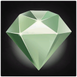 | ✨ | **Abomination Soul Power** | Value | **Lấy max** (MaxPower) viên 5% + viên 10% → 10% |
|  | ✨ | **Abomination Soul Power** | Cooldown | **Lấy min** (MinPower) CD 30s + CD 20s → 20s |
| 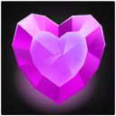 | ⚔️ | **Bat Soul Power** | Value | **Nhân chéo nghịch** (InverseMultiplicativePercentagePower) 2 viên giảm 50% → 75% |
| 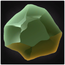 | 🦵 | **Blob Soul Power** | Value | **Nhân chéo %** (MultiplicativePercentagePower) 2 viên 50% → 125% |
| 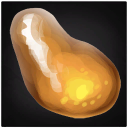 | ✨ | **Boar Soul Power** | Value | **Nhân chéo %** (MultiplicativePercentagePower) 2 viên 50% → 125% |
| 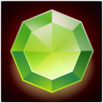 | ✨ | **Bonemass Soul Power** | Value | **Cộng dồn** (AdditivePower) 2 viên 10% → 20% |
| 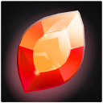 | 🎓 | **Cultist Soul Power** | Value | **Lấy max** (MaxPower) viên 5% + viên 10% → 10% |
|  | 🎓 | **Cultist Soul Power** | Cooldown | **Lấy min** (MinPower) CD 30s + CD 20s → 20s |
| 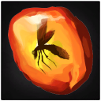 | ⚔️ | **Deathsquito Soul Power** | Value | **Lấy max** (MaxPower) viên 5% + viên 10% → 10% |
| 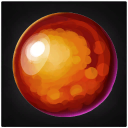 | 🦵 | **Deer Soul Power** | Value | **Nhân chéo %** (MultiplicativePercentagePower) 2 viên 50% → 125% |
| 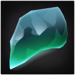 | 🛡️ | **Draugr Soul Power** | Value | **Lấy max** (MaxPower) viên 5% + viên 10% → 10% |
| 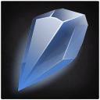 | ✨ | **Dverger Soul Power** | Value | **Cộng dồn** (AdditivePower) 2 viên 10% → 20% |
| 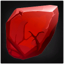 | ✨ | **Dverger_BloodMage Soul Power** | Value | **Cộng dồn** (AdditivePower) 2 viên 10% → 20% |
| 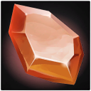 | ✨ | **Dverger_FireMage Soul Power** | Value | **Cộng dồn** (AdditivePower) 2 viên 10% → 20% |
| 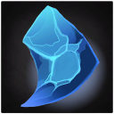 | ✨ | **Dverger_IceMage Soul Power** | Value | **Cộng dồn** (AdditivePower) 2 viên 10% → 20% |
| 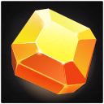 | ✨ | **Eikthyr Soul Power** | Value | **Lấy max** (MaxPower) viên 5% + viên 10% → 10% |
| 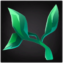 | ✨ | **Elder Soul Power** | Value | **Lấy min** (MinPower) CD 30s + CD 20s → 20s |
| 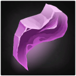 | ⚔️ | **Fenring Soul Power** | Value | **Cộng dồn** (AdditivePower) 2 viên 10% → 20% |
| 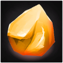 | ✨ | **Gjall Soul Power** | Value | **Cộng dồn** (AdditivePower) 2 viên 10% → 20% |
| 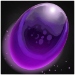 | ⚔️ | **Goblin Soul Power** | Value | **Lấy max** (MaxPower) viên 5% + viên 10% → 10% |
| 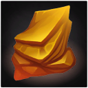 | 🎓 🦺 🦵 🧥 | **GoblinBrute Soul Power** | Value | **Lấy max** (MaxPower) viên 5% + viên 10% → 10% |
| 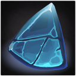 | 🎓 🦺 🦵 🧥 | **GoblinShaman Soul Power** | Value | **Lấy max** (MaxPower) viên 5% + viên 10% → 10% |
| 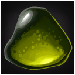 | ✨ | **Greydwarf Soul Power** | Value | **Cộng dồn** (AdditivePower) 2 viên 10% → 20% |
|  | ✨ | **Greydwarf Soul Power** | Cooldown | **Lấy min** (MinPower) CD 30s + CD 20s → 20s |
| 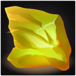 | ✨ | **GreydwarfBrute Soul Power** | Value | **Lấy max** (MaxPower) viên 5% + viên 10% → 10% |
| 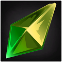 | ✨ | **GreydwarfShaman Soul Power** | Value | **Lấy min** (MinPower) CD 30s + CD 20s → 20s |
| 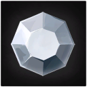 | ⚔️ | **Hare Soul Power** | Value | **Cộng dồn** (AdditivePower) 2 viên 10% → 20% |
| 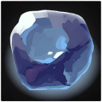 | ⚔️ | **Hatchling Soul Power** | Value | **Cộng dồn** (AdditivePower) 2 viên 10% → 20% |
| 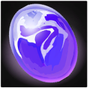 | ⚔️ | **Leech Soul Power** | Value | **Nhân chéo nghịch** (InverseMultiplicativePercentagePower) 2 viên giảm 50% → 75% |
| 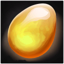 | 🎓 🦺 🦵 ⚔️ 🧥 | **Lox Soul Power** | Value | **Lấy max** (MaxPower) viên 5% + viên 10% → 10% |
| 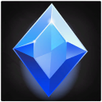 | ✨ | **Moder Soul Power** | Value | **Lấy max** (MaxPower) viên 5% + viên 10% → 10% |
| 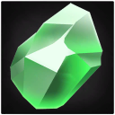 | 🦵 | **Neck Soul Power** | Value | **Nhân chéo %** (MultiplicativePercentagePower) 2 viên 50% → 125% |
| 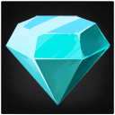 | ✨ | **Seeker Soul Power** | Value | **Cộng dồn** (AdditivePower) 2 viên 10% → 20% |
| 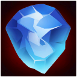 | ✨ | **Seeker_Brute Soul Power** | Value | **Cộng dồn** (AdditivePower) 2 viên 10% → 20% |
| 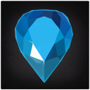 | 🛡️ | **Serpent Soul Power** | Value | **Lấy max** (MaxPower) viên 5% + viên 10% → 10% |
| 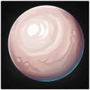 | ✨ | **Skeleton Soul Power** | Chance | **Lấy max** (MaxPower) viên 5% + viên 10% → 10% |
|  | ✨ | **Skeleton Soul Power** | Value | **Lấy min** (MinPower) CD 30s + CD 20s → 20s |
| 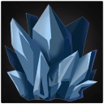 | ✨ | **StoneGolem Soul Power** | Value | **Lấy max** (MaxPower) viên 5% + viên 10% → 10% |
| 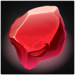 | ⚔️ | **Surtling Soul Power** | Value | **Cộng dồn** (AdditivePower) 2 viên 10% → 20% |
|  | ⚔️ | **Surtling Soul Power** | Cooldown | **Lấy min** (MinPower) CD 30s + CD 20s → 20s |
| 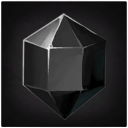 | ✨ | **TarBlob Soul Power** | Duration | **Lấy max** (MaxPower) viên 5% + viên 10% → 10% |
|  | ✨ | **TarBlob Soul Power** | Cooldown | **Lấy min** (MinPower) CD 30s + CD 20s → 20s |
| 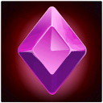 | ✨ | **TheQueen Soul Power** | Value | **Cộng dồn** (AdditivePower) 2 viên 10% → 20% |
| 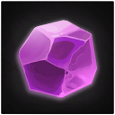 | ✨ | **Tick Soul Power** | Value | **Cộng dồn** (AdditivePower) 2 viên 10% → 20% |
| 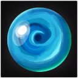 | ⚔️ | **Troll Soul Power** | Value | **Cộng dồn** (AdditivePower) 2 viên 10% → 20% |
|  | ⚔️ | **Troll Soul Power** | Chance | **Lấy max** (MaxPower) viên 5% + viên 10% → 10% |
| 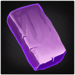 | ✨ | **Ulv Soul Power** | Cooldown | **Lấy min** (MinPower) CD 30s + CD 20s → 20s |
| 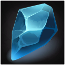 | 🎓 🦺 🦵 ⚔️ | **Wolf Soul Power** | Value | **Cộng dồn** (AdditivePower) 2 viên 10% → 20% |
|  | ✨ | **Wraith Soul Power** | Cooldown | **Lấy min** (MinPower) CD 30s + CD 20s → 20s |
| 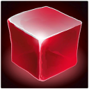 | ✨ | **Yagluth Soul Power** | Value | **Cộng dồn** (AdditivePower) 2 viên 10% → 20% |

| Hiệu ứng | Gem | Power (5 tier) | Cooldown | Unique | Mô tả chi tiết | Tham số |
| --- | --- | --- | --- | --- | --- | --- |
| **Troll Soul Power** | **Troll Soul Gem**   | 5 / 10 / 15 / 20 / 25 | — | None | $2% cơ hội khi đánh cận chiến: toàn bộ kẻ địch trong bán kính 4m quanh mục tiêu nhận thêm $1% sát thương của đòn (AoE) | $1 = Power (sát thương%) $2 = Chance (30–50) |
| **Leech Soul Power** | **Leech Soul Gem**  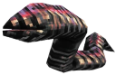 | 1 / 1.5 / 2 / 2.5 / 3 | — | None | Khi đánh trúng: hồi thêm $1% sát thương (mô phỏng) vào stamina ✅ mọi vũ khí (kể cả staff/bow/crossbow) | $1 = Power (% hồi) |
| **Bat Soul Power** | **Bat Soul Gem**  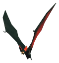 | 1 / 1.5 / 2 / 2.5 / 3 | — | None | Khi đánh trúng: hồi máu bằng $1% sát thương (mô phỏng) gây ra ✅ mọi vũ khí (kể cả staff/bow/crossbow) | $1 = Power (% hồi) |
| **Fenring Soul Power** | **Fenring Soul Gem**  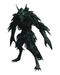 | 1 / 2 / 3 / 4 / 5 | — | None | Đánh trúng: kẻ địch chịu thêm +$1% sát thương, cộng dồn theo số đòn trong 6 giây ✅ mọi vũ khí (kể cả staff/bow/crossbow) | $1 = Power (% cộng dồn mỗi đòn) |
| **Hatchling Soul Power** | **Hatchling Soul Gem**  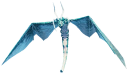 | 150 / 200 / 250 / 300 / 350 | 20s cố định | Gem | Mỗi 20s khi tấn công ❌ chỉ khi đánh cận chiến (hook Attack.DoMeleeAttack): phóng dòng năng lượng về hướng nhìn (bay 2 giây), kẻ địch trúng phải lãnh $1% tổng sát thương vũ khí | $1 = Power (% vũ khí) |
| **Goblin Soul Power** | **Goblin Soul Gem**   | 5 / 10 / 15 / 20 / 25 | — | Gem | Đánh vào sau lưng kẻ địch (góc sau lưng ≤ 50°): gây thêm $1% sát thương, hiện chữ BACKSTAB ✅ mọi vũ khí (kể cả staff/bow/crossbow) | $1 = Power (sát thương%) |
| **Deathsquito Soul Power** | **Deathsquito Soul Gem**  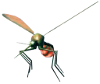 | 5 / 7 / 9 / 11 / 13 | — | Gem | $1% cơ hội mỗi đòn gây chí mạng: nhân đôi toàn bộ sát thương, hiện chữ CRIT ✅ mọi vũ khí (kể cả staff/bow/crossbow) | $1 = Power (% cơ hội) |
| **Surtling Soul Power** | **Surtling Soul Gem**   | 5 / 10 / 15 / 20 / 25 | 60 / 50 / 45 / 40 / 35 | Gem | Khi đánh trúng: 10% cơ hội đặt "vùng lửa" bán kính 5,5m gây $1% sát thương vũ khí mỗi giây (8 đợt trong 8 giây); hồi $2 giây ✅ mọi vũ khí (kể cả staff/bow/crossbow) | $1 = Power (sát thương%) $2 = Cooldown |
| **Hare Soul Power** | **Hare Soul Gem**   | 4 / 8 / 12 / 16 / 20 | — | None | Tăng $1% sát thương nỏ 🎯 chỉ nỏ — hoạt động nhờ Gerbesh Crossbow Fix (class trống trong mod gốc) | $1 = Power (sát thương%) |

### 🛡️ Shield

| Hiệu ứng | Gem | Power (5 tier) | Cooldown | Unique | Mô tả chi tiết | Tham số |
| --- | --- | --- | --- | --- | --- | --- |
| **Draugr Soul Power** | **Draugr Soul Gem**   | 20 / 30 / 40 / 50 / 60 | — | Gem | Tăng sức chặn (block power) $1% nhưng mọi sát thương bạn gây ra giảm (bằng 1/3 hiệu lực %) | $1 = Power (block %) |
| **Serpent Soul Power** | **Serpent Soul Gem**  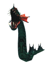 | 25 / 50 / 75 / 100 / 125 | — | Gem | Chặn hoàn hảo (block hoàn hảo/parry): trả lại $1% tổng sát thương chặn được của vũ khí lên kẻ tấn công | $1 = Power (sát thương%) |

### 🎓 Head

| Hiệu ứng | Gem | Power (5 tier) | Cooldown | Unique | Mô tả chi tiết | Tham số |
| --- | --- | --- | --- | --- | --- | --- |
| **Cultist Soul Power** | **Cultist Soul Gem**   | 20 / 35 / 50 / 65 / 80 | 35 / 30 / 25 / 20 / 15 | Gem | Khi tấn công ❌ chỉ khi đánh cận chiến (hook Attack.DoMeleeAttack) (qua CD $2 giây): mũi tên máu lửa phun phía trước ~6 giây, mỗi đợt gây $1% sát thương vũ khí dạng lửa lên kẻ địch trúng | $1 = Power (sát thương%) $2 = Cooldown |

### 🦵 Legs

| Hiệu ứng | Gem | Power (5 tier) | Cooldown | Unique | Mô tả chi tiết | Tham số |
| --- | --- | --- | --- | --- | --- | --- |
| **Deer Soul Power** | **Deer Soul Gem**   | 10 / 15 / 20 / 25 / 30 | — | None | Máu càng thấp, tốc độ chạy/jog càng cao (tối đa thêm ≈$1×1.1%) và hao stamina khi chạy giảm dần (tối đa −40%) khi máu thấp | $1 = Power (hệ số tốc độ — chạy/jog) |
| **Neck Soul Power** | **Neck Soul Gem**   | 5 / 10 / 15 / 20 / 25 | — | None | Tăng tốc độ bơi lặn (nhân $1/10 tốc độ gốc) | $1 = Power (tốc độ bơi — %) |
| **Blob Soul Power** | **Blob Soul Gem**   | 0.3 / 0.8 / 1.5 / 2.2 / 2.9 | — | None | Nhảy cao/xa hơn (lực đẩy tỉ lệ $1) và bỏ sát thương rơi ⚠ cần mod fix | $1 = Power (lực nhảy) |

### 🧥 Cloak / Đa slot

| Hiệu ứng | Gem | Slot | Power (5 tier) | Unique | Mô tả chi tiết | Tham số |
| --- | --- | --- | --- | --- | --- | --- |
| **Wolf Soul Power** | **Wolf Soul Gem**   | head / chest / legs / weapon | 9 / 12 / 15 / 18 / 21 | Item | Thú cưng trong 15m: gây thêm (2 × $1)% sát thương (giảm theo số thú trong đàn) và chỉ nhận (100 − $1)% sát thương | $1 = Power (% thú cưng nhận) $1 = Power (% giảm theo số thú) |
| **Lox Soul Power** | **Lox Soul Gem**   | head / chest / legs / weapon / cloak | 10 / 20 / 30 / 40 / 50 | Gem | Giảm $1% tốc độ di chuyển nhưng tăng sát thương tấn công (1/2 hiệu lực) ✅ mọi vũ khí (kể cả staff/bow/crossbow) | $1 = Power (giảm tốc%) |
| **Goblin Brute Soul Power** | **Goblin Brute Soul Gem**   | head / chest / legs / cloak | 15 / 20 / 25 / 30 / 35 | Gem | Giảm $1% toàn bộ stamina tiêu thụ | $1 = Power (% giảm) |
| **Goblin Shaman Soul Power** | **Goblin Shaman Soul Gem**   | head / chest / legs / cloak | 10 / 15 / 20 / 25 / 30 | Gem | Giảm $1% sát thương đòn đánh xa nhận vào | $1 = Power (% giảm) |

### ✨ All Slots

| Hiệu ứng | Gem | Power (5 tier) | Cooldown / Duration | Unique | Mô tả chi tiết | Tham số |
| --- | --- | --- | --- | --- | --- | --- |
| **Boar Soul Power** | **Boar Soul Gem**   | 3 / 5 / 7 / 9 / 11 | — | None | Tăng $1% hồi stamina | $1 = Power (% hồi) |
| **Greydwarf Soul Power** | **Greydwarf Soul Gem**   | 3 / 6 / 9 / 12 / 15 | Cooldown 60 / 50 / 45 / 40 / 35 | Item | Mỗi $2 giây (khi máu của bạn chưa đầy): hồi cho đồng minh trong 20m một lượng bằng $1% máu tối đa của BẠN | $1 = Power (% máu max) $2 = Cooldown |
| **Greydwarf Elite Soul Power** | **Greydwarf Elite Soul Gem**   | 0.4 / 0.7 / 1 / 1.3 / 1.6 | — | Gem | Cộng thẳng $1 vào hệ số choáng (stagger) của đòn tấn công (hệ số 1 + $1) | $1 = Power (hệ số) |
| **Greydwarf Shaman Soul Power** | **Greydwarf Shaman Soul Gem**   | 26 / 25 / 24 / 23 / 20 | — | Gem | Mỗi $1 giây (khi có kẻ địch trong 9m): ném lựu đạn nổ làm choáng mọi kẻ địch trong bán kính 10m | $1 = Power (giây) |
| **Skeleton Soul Power** | **Skeleton Soul Gem**   | Chance 7 / 9 / 11 / 13 / 15 Value 3 / 2 / 2 / 1 / 0 | — | Gem | $1% cơ hội khi giết sinh vật hoang (chưa thuần hóa, có thể thuần hóa): sau 2 giây nó hồi sinh tại chỗ, tự thuần hóa thành thú cưng và giảm $2 cấp | $1 = Chance $2 = Value (cấp giảm) |
| **Wraith Soul Power** | **Wraith Soul Gem**   | — | Cooldown 30 / 26 / 22 / 18 / 14 | Gem | Mỗi $1 giây khi né: dịch chuyển tới nơi bạn đang nhìn (tối đa 40m) | $1 = Cooldown |
| **Abomination Soul Power** | **Abomination Soul Gem**   | 30 / 40 / 50 / 60 / 70 | Cooldown 30 / 28 / 26 / 24 / 22 | Gem | Mỗi $2 giây khi ngồi xổm: "da cứng" trong 6 giây giảm $1% sát thương pierce / slash / blunt / chop nhận vào | $1 = Power (giảm%) $2 = Cooldown |
| **Ulv Soul Power** | **Ulv Soul Gem**   | — | Cooldown 20 / 18 / 16 / 14 / 12 | Gem | Mỗi $1 giây khi né: dịch chuyển sau lưng kẻ địch đang nhắm (tối đa 40m) và gây sát thương sét = 150% tổng sát thương vũ khí | $1 = Cooldown |
| **Stone Golem Soul Power** | **Stone Golem Soul Gem**   | 5 / 10 / 15 / 20 / 25 | — | Gem | Tăng $1% giáp nhưng giảm sát thương tấn công (1/2 hiệu lực) | $1 = Power (giáp%) |
| **Tar Blob Soul Power** | **Tar Blob Soul Gem**   | — | Duration 6 / 7 / 8 / 9 / 10 Cooldown 32 / 30 / 28 / 26 / 24 | Gem | Ngồi xổm: hóa "blob" trong $1 giây (kẻ địch không thấy/không nghe thấy bạn); hồi $2 giây | $1 = Duration $2 = Cooldown |
| **Dvergr Soul Power** | **Dvergr Soul Gem**   | 5 / 10 / 15 / 20 / 25 | — | Item | Giảm $1% thời gian nạp đạn nỏ 🎯 chỉ nỏ — hoạt động nhờ Gerbesh Crossbow Fix (class trống trong mod gốc) | $1 = Power (giảm%) |
| **Dvergr Fire Mage Soul Power** | **Dvergr Fire Mage Soul Gem**   | 5 / 10 / 15 / 20 / 25 | — | Item | Nhân (1+$1%) sát thương **lửa** của đòn đánh (code: `hitData.m_damage.m_fire *= 1+$1/100` — chỉ áp khi đòn CÓ thành phần lửa, không thêm lửa cho đòn vật lý thuần; không nhất thiết phải từ Eitr) | $1 = Power (sát thương%) |
| **Dvergr Blood Mage Soul Power** | **Dvergr Blood Mage Soul Gem**   | 10 / 15 / 20 / 25 / 30 | — | Item | Cộng thẳng $1 bậc cấp kỹ năng Blood Magic vào kỹ năng của bạn ⚠ cần mod fix | $1 = Power (cấp kỹ năng) |
| **Dvergr Frost Mage Soul Power** | **Dvergr Frost Mage Soul Gem**   | 5 / 10 / 15 / 20 / 25 | — | Item | Nhân (1+$1%) sát thương **băng** của đòn đánh (code: `hitData.m_damage.m_frost *= 1+$1/100` — chỉ áp khi đòn CÓ thành phần băng, không thêm băng cho đòn vật lý thuần; không nhất thiết phải từ Eitr) | $1 = Power (sát thương%) |
| **Tick Soul Power** | **Tick Soul Gem**   | 5 / 10 / 15 / 20 / 25 | — | Item | Tăng $1% hồi Eitr ✅ bất kỳ vũ khí — hoạt động nhờ Gerbesh Tick/Blob Fix (class trống trong mod gốc) | $1 = Power (% hồi) |
| **Gjall Soul Power** | **Gjall Soul Gem**   | 3 / 6 / 9 / 12 / 15 | — | Item | Tăng $1% HP / Stamina / Eitr nhận từ thức ăn | $1 = Power (% nhận) |
| **Seeker Soul Power** | **Seeker Soul Gem**   | 5 / 10 / 15 / 20 / 25 | — | Item | Giảm $1% sát thương choáng nhận vào | $1 = Power (giảm%) |
| **Seeker Brute Soul Power** | **Seeker Brute Soul Gem**   | 1 (cố định) | — | Gem | Không thể bị đẩy lùi (knockback) | 1 giá trị duy nhất, không có tier |

### 👑 Boss Gems (All Slots)

| Hiệu ứng | Gem | Power | Unique | Mô tả chi tiết | Tham số |
| --- | --- | --- | --- | --- | --- |
| **Eikthyr Soul Power** | **Eikthyr Soul Gem**   | 1 / 2 / 3 / 4 / 5 | Gem | +$1 lần nhảy thêm (tổng tối đa $1+1 lần nhảy liên tiếp giữa không trung) | $1 = Power (số lần) |
| **Elder Soul Power** | **Elder Soul Gem**   | 25 / 24 / 23 / 22 / 21 | Gem | Mỗi ~$1 giây: đóng băng (khóa chân) mọi kẻ địch trong 13m trong 4 giây | $1 = Power (giây) |
| **Moder Soul Power** | **Moder Soul Gem**   | 20 / 30 / 40 / 50 / 60 | Gem | Mọi kẻ địch trong 15m bị chậm tốc độ di chuyển còn (100 − $1)% (duy trì liên tục) | $1 = Power (giảm%) |
| **Bonemass Soul Power** | **Bonemass Soul Gem**   | 40 (cố định) | Gem | Giảm $1% sát thương độc nhận vào | 1 giá trị duy nhất |
| **Yagluth Soul Power** | **Yagluth Soul Gem**   | 40 (cố định) | Gem | Giảm $1% sát thương lửa nhận vào | 1 giá trị duy nhất |
| **The Queen Soul Power** | **The Queen Soul Gem**   | 20 (cố định) | Gem | Giảm $1% sát thương vật lý (blunt / slash / pierce) nhận vào | 1 giá trị duy nhất |

⚠️ Ảnh quái **GreydwarfBrute** (Greydwarf Elite) dùng hình Greydwarf thường — Elite cùng mô hình, màu đậm hơn (fandom không có ảnh riêng cho Elite).

Ghi chú: `unique: Item` = chỉ 1 gem loại này trong cùng 1 món đồ; `unique: Gem` = toàn bộ trang bị đang mặc chỉ được mang 1 viên loại này; `None` = không giới hạn (chỉ không gắn 2 viên y hệt nhau vào cùng 1 món) — chi tiết mục 5.4.
Boss gems (Eikthyr→The Queen) có `value` dạng số đơn (vd `40`) vì dùng hệ thống power-range của Jewelcrafting (giá trị ngẫu nhiên quanh mức đó) — với Bonemass/Yagluth/The Queen thì thực chất là hằng số.

## 4. Cấu hình (Config)

### 4.1 `BepInEx/config/Soulcatcher.cfg`

Tất cả config được đăng ký qua **ServerSync** → **server là thẩm quyền cuối**; khi host lên server, giá trị config sẽ đồng bộ xuống client. File được **tự nạp lại khi sửa (hot reload)** nhờ FileSystemWatcher (cách nhau tối thiểu 5 giây).

| Section | Key | Mặc định | Ý nghĩa |
| --- | --- | --- | --- |
| `[Gems Cost Amount]` | `<Gem>Cost Amount` (43 gem) | 30 | Số hồn cần để đúc 1 gem tại bàn tế |
| `[Gems Craft Time]` | `<Gem>Craft Time` (43 gem) | 600 | Thời gian đúc (giây) |
| `[Gems Craftable]` | `<Gem>Craftable` (43 gem) | true | Cho phép chế tạo gem hay không |
| `[Lantern Soul Combination Fee]` | `Fee` | 30 | Phí (%) khi gộp 2 đèn lồng (UI Combinator): hồn bên đèn nguồn chuyển sang bị hao hụt phần trăm này |
| `[Souls]` | `MaxSouls` | 500 | Giới hạn hồn chứa trong 1 đèn |
| `[Sprites]` | `UseCachedSprites` | true | Dùng sprite đã cache (thư mục `BepInEx/config/Soulcatcher_CachedSprites_v2/`) thay vì tạo lại mỗi lần |
| `[Soul Necklace]` / `[Soul Ring]` | — | — | Các tùy chọn trang sức: bàn chế tạo mặc định `op_transmution_table` (Custom), cấp 3, giá `Coins:1000`, nâng cấp `Coins:1500`, không bán ở trader |

### 4.2 `BepInEx/config/Jewelcrafting.Sockets_Soulcatcher_KG_JC_Additions.yml`

File do mod sinh lần đầu (nội dung mẫu được dựng sẵn trong code `InitGems()`). Cấu trúc từng mục:

Deer Soul Power:
 slot: legs # vị trí gắn được: all | weapon | shield | head | chest | legs | cloak | [a, b, c]
 gem: Deer Soul Gem # gem liên kết
 power:
 value: [10, 15, 20, 25, 30] # 5 cấp gem
 cooldown: [60, 50, 45, 40, 35] # giây (nếu có)
 chance: [30, 35, 40, 45, 50] # % (nếu có)
 duration: [6, 7, 8, 9, 10] # giây (nếu có)
 unique: None # None | Item | Gem

- `power` cũng chấp nhận giá trị số đơn (`value: 40`) → mọi cấp dùng chung mức đó.

- Sửa file này để chỉnh balance; mod đọc lại mỗi lần khởi động. Nếu sai cú pháp sẽ có thông báo lỗi rõ ràng ở console (vd lỗi unique/slot/effect không hợp lệ).

### 4.3 Custom Soul Spawn (`Soulcatcher_Custom_SoulSpawn.cfg`)

File nằm ở `BepInEx/config/`, mỗi dòng định dạng:

`<prefab quái bị giết>:<prefab hồn được tạo>
`

Ví dụ gắn hồn Wolf cho quái lợn: `Boar:Wolf` — khi giết Boar, hồn Wolf xuất hiện.

- File **chỉ có server (host) mới load**; thay đổi được phát tới client qua RPC nén `Soulcatcher_Custom_SoulSpawn`.

- Ánh xạ chỉ có hiệu lực nếu prefab đích nằm trong danh sách hồn hợp lệ của mod.

- Ký tự khoảng trắng bị bỏ qua; dòng không đúng định dạng `key:value` bị bỏ qua.

### 4.4 Config đồng bộ

Mọi config của mod đều đi qua `configSync.AddConfigEntry(entry).SynchronizedConfig = true` → khi vào server, giá trị từ host thay thế giá trị client. Đây là lý do `Soulcatcher.cfg` của client không quan trọng khi chơi multiplayer (trừ MaxSouls… đều sync).

### 4.5 Phong-SoulcatcherTweaks (mod đồng hành — bổ sung khi audit)

⚠ Không nằm trong mod gốc: **Phong-SoulcatcherTweaks** (GUID `phong.soulcatcher.tweaks`, "Soulcatcher Tweaks by Phong v1.3.3") là mod riêng đi kèm, **chưa từng được nhắc trong wiki cũ**. Các mô tả trích từ DLL (giá trị mặc định là hằng số IL — chưa trích được):

- **[Skip Tier] Skip Chance (%)** — "Chance that the Gemstone Furnace skips a gem tier (e.g. Uncut smelts straight into Advanced, Simple smelts straight into Perfect)." (bỏ 1 bậc tier khi nung gem)

- **Movement speed bonus per equipped item** (`1.0 = 100%`) — "Stacks additively." — cộng dồn tốc độ theo số món trang bị hồn đang đeo.

- **IncludeNecklace** — "Soul Necklace counts toward the bonus." (Soul Necklace tính vào bonus)

- **IncludeRing** — "Soul Ring counts toward the bonus." (Soul Ring tính vào bonus)

- **Log Skip Events** — "Log every tier skip event to the BepInEx log (for verification)."

- **Point To Haldor Before Visit** — "The Legacy beacon points toward the nearest possible Haldor location even before the trader has been visited." (đèn hiệu trỏ Haldor sớm)

## 5. Kỹ thuật cho modder

### 5.1 Kiến trúc

- Plugin: `Soulcatcher : BaseUnityPlugin`, GUID `Soulcatcher`, version `4.5.8`, Harmony ID `"Soulcatcher"` (`new Harmony("Soulcatcher").PatchAll()` trong `Awake`).

- Thứ tự khởi tạo trong `Awake()`:
 1. Bind config `UseCachedSprites`; load cache sprite nếu bật
 2. Cấu hình `fastJSON` (dùng cho lưu dữ liệu hồn)
 3. `GetAssetBundle("soulcatcher")` → load assetbundle nhúng (resource `...libs.soulcatcher`)
 4. `Localizer.Load()` → nạp `translations.English.yml`
 5. `PrepareSoulComponent()` → prefab `Soulcatcher-Soul` + material `SoulcatcherMat`/`SoulcatcherMatTest` + `SoulcatcherTornado` + `SoulcatcherImpact`
 6. `PrepareLantern()` → prefab `LanternSoulcatcher`, gắn `LanternComponent` (lớp `ItemData` mở rộng — dữ liệu hồn lưu JSON trong `Value`)
 7. `PrepareAltar()` → **load runtime `SoulcatcherScripts.dll`** (nhúng), prefab `SoulAltarStation` + `SoulAltarExplosion`
 8. `InitGems()` → khai báo 43 gem + hiệu lực (dựng luôn nội dung mẫu YAML)
 9. `InitSoulcatcherSkill()` → đăng ký kỹ năng qua Jewelcrafting `Skill` API (icon `icon.png`)
 10. `InitSoulPlatform()`, `InitJewelry()` (Soul Necklace/Ring), `SoulAltarUI.Init()`, `SetupWatcher()` (hot-reload cfg), `InitCustomConvertions()` (file custom spawn + watcher), `CursedDoll` (item độc đáo, có `BreakHandler` đăng ký qua `API.OnItemBreak`) 
 11. `PatchAll()` + in banner lỗi YAML gợi ý

- Dữ liệu hồn không dùng ZDO mà **lưu trên ItemData** (`LanternComponent.Load/Save` ↔ JSON) → đèn giữ hồn xuyên rương/đổi tay; riêng phần nhân bản/hiệu ứng đồng bộ qua RPC `SoulcatcherKG UpdateLanternEffect` (gửi `leftHand` + `SoulCount`, dùng cho khói trên đèn).

### 5.2 Harmony patches (toàn bộ)

| Phương thức vanilla | Lớp patch (gem chủ) | Mục đích |
| --- | --- | --- |
| `Character.RPC_Damage` | (global) | Ghi nhận ai đánh cuối (`CharacterLastDamageList`) |
| `Character.ApplyDamage` | (global) | Khi máu ≤ 0 → gửi RPC `Soulcatcher HookKill` tới chủ sở hữu (kèm prefab/pos/level, `CheckDverger` phân loại mage) |
| `Character.OnDestroy` | (global) | Dọn danh sách đánh cuối |
| `ZNetScene.Awake` | (global, `..._QuestsInit`) | Đăng ký RPC `Soulcatcher HookKill` |
| `Chat.InputText` | `Cheat_Commands` | Lệnh `/sc ...` (debug mode) |
| `AudioMan.Awake` | (global) | Nạp clip `AltarClick`/`AltarStartSound` từ assetbundle cho bàn tế |
| `Player.Start` | (global) | Đăng ký RPC `SoulcatcherKG UpdateLanternEffect` |
| `Humanoid.EquipItem` / `VisEquipment.AttachItem` | (global) | Cập nhật hiệu ứng đèn khi đổi tay; xoay đèn khi đeo sau lưng |
| `ItemDrop.GetHoverText` | (global) | Tooltip danh sách hồn trên đèn |
| `ItemStand.CanAttach` | (global) | Cho phép treo đèn lên giá vũ khí |
| `Player.SetCrouch` | `Abomination` | Bật/tắt "da cứng" (SE `SE_SoulcatcherAbomination`, giảm pierce/slash/blunt/chop theo `Reduction`) |
| `SEMan.ModifySkillLevel` | `Dverger_BloodMage` | Tăng kỹ năng Blood Magic |
| `SEMan.ModifyAttack` | `Dverger_FireMage` / `Dverger_IceMage` | +% sát thương Eitr Hỏa/Băng |
| `FootStep.OnFoot` | (Dverger nhóm) | Hiệu ứng bước chân |
| `Player.GetTotalFoodValue` | `Gjall` | +% HP/Stamina/Eitr từ thức ăn |
| `Player.RPC_UseStamina` | `GoblinBrute` | −% tiêu hao stamina |
| `Character.Damage` | `GoblinShaman`, `GreydwarfBrute`, `Leech`, `Bat`, `Deathsquito`, `Draugr`, `Fenring`, `Goblin`, `Lox` | Đòn xa trúng người giảm %; stagger tấn công; hút stamina theo sát thương (Leech); hút máu (Bat); % x2 sát thương (Deathsquito); block/damage (Draugr); cộng dồn sát thương (Fenring); đánh lưng (Goblin); +sát thương −tốc độ (Lox) |
| `Character.ApplyPushback` | `Seeker_Brute` | Chống knockback |
| `Character.AddStaggerDamage` | `Seeker` | Giảm % sát thương choáng |
| `BaseAI.CanSeeTarget` / `CanHearTarget` | `TarBlob` | Blob mode: kẻ địch không thấy/nghe |
| `Attack.Start` + `Player.SetCrouch` | `TarBlob` | Kích hoạt blob mode khi crouch |
| `SEMan.OnDamaged` | `TheQueen` | −% sát thương vật lý |
| `ZSyncAnimation.SetTrigger` | `Ulv` | Teleport sau lưng khi né |
| `Character.UpdateGroundContact` / `Character.Jump` | `Blob` | Nhảy xa + xóa sát thương rơi |
| `SEMan.ModifyStaminaRegen` | `Boar` | +% hồi stamina |
| `Character.ApplyDamage` | `Bonemass` | −% sát thương độc |
| `Attack.DoMeleeAttack` | `Cultist`, `Hatchling` | Phun lửa / sóng sát thương khi tấn công |
| `ItemData.GetBlockPower` | `Draugr` | +lực chặn |
| `Character.Jump` | `Eikthyr` | +số lần nhảy |
| `Player.GetJogSpeedFactor` / `GetRunSpeedFactor` / `SEMan.ModifyRunStaminaDrain` | `Deer` | Tốc độ khi máu thấp |
| `SEMan.ApplyStatusEffectSpeedMods` | `Lox` | −tốc độ di chuyển |
| `ZNetScene.Awake` (nhiều) | (từng gem có VFX) | Đăng ký prefab VFX + thêm gem vào `ObjectDB` |
| `ObjectDB.Awake` / `ObjectDB.CopyOtherDB` | (từng gem) | Chèn gem (5 biến thể tier) vào database khi load / copy |
| `Player.SetLocalPlayer` | (gem có SE) | Gán status effect local cho gem có aura |
| `ZNet.RPC_PeerInfo` | (global) | Gửi file custom spawn (JSON nén) cho client mới nối |

### 5.3 RPC & ZDO keys

**RPC (ZRoutedRpc):**

| RPC | Hướng | Nội dung |
| --- | --- | --- |
| `Soulcatcher HookKill` | kẻ giết → owner | string prefab, Vector3 pos, int level |
| `Soulcatcher_Custom_SoulSpawn` | server → client | ZPackage nén JSON `_soulcatcher_soulspawn_additions` |
| `Soulcatcher CraftStart` / `Soulcatcher CraftEnd` | everybody | ZPackage (resultPrefab, time, color) / không tham số |
| `SoulPlatform Insert` | everybody | string prefab, float rotationY |
| `SoulcatcherKG UpdateLanternEffect` | everybody | bool leftHand, int soulCount |

**ZDO keys:** `Prefab` (SoulComponent), `SoulPlatform CurrentInsert` + `SoulPlatform CurrentRotation` (Soul Platform), `IsCrafting`/`StartTime`/`RequestedTime`/`ResultPrefab`/`Conversion_Color` (Soul Altar), `Soulcatcher TarBlob` (SE TarBlob).

### 5.4 Ý nghĩa cờ `unique` (theo mã Jewelcrafting 2.0.1 đang chạy)

Lấy trực tiếp từ `Jewelcrafting.GemEffects.Uniqueness` và `GemStones.CanAddUniqueSocket`:

| Giá trị | Luật | Thông báo lỗi |
| --- | --- | --- |
| `None` | Mọi gem đều **không được gắn 2 viên giống hệt nhau (cùng loại + cùng cấp) vào 1 món đồ**; được gắn cùng loại khác cấp hoặc trên nhiều món | *"You cannot socket the same gemstone twice into one item, even if they are merged."* |
| `Item` | Chỉ được **1 gem thuộc loại này (mọi cấp)** trong cùng 1 món đồ | *"You can only socket one $2 into the same item."* |
| `Gem` | Toàn bộ trang bị đang mặc chỉ được **1 gem thuộc loại này (mọi cấp)** — kiểm tra mọi món đã trang bị | *"You can only have one $2 equipped."* |

(Có thêm `All`/`Tier` dành riêng cho hệ "unique gems" của Jewelcrafting — Soulcatcher không dùng.)

### 5.5 Assetbundle `soulcatcher` (Unity 2020.3.33f1)

Tổng 7.672 object. Nội dung chính:

- **Prefab gem:** mỗi loại gem có 5 biến thể `XGem`, `XGem_Ascend`, `XGem_Immortal`, `XGem_Godlike`, `XGem_Odinwrath` (43 loại = 43 gem; riêng `DvergerGemBloodMage/FireMage/IceMage`, `SeekerBruteGem`, `TheQueenGem`, `TickGem`, `GjallGem` chỉ có bản cơ bản trong bundle).

- **Prefab chức năng:** `LanternSoulcatcher`, `Soulcatcher-Soul`, `SoulcatcherTornado`, `SoulcatcherImpact`, `SoulAltarStation`, `SoulAltarExplosion`, `SoulPlatform`, `Soulcatcher_CursedDoll`, `SoulcatcherUI`, `SoulcatcherUI_Combinator`, `SoulcatcherCraftElement`, `SoulcatcherInfoElement`.

- **VFX theo gem:** `Abomination_VFX`, `BlobGem_VFX`, `Bonemass_VFX`, `Cultist_VFX`, `Eikthyr_VFX`, `Elder_VFX`, `Elder_VFX2`, `Fenring_VFX`, `GreydwarfGem_VFX(2)`, `GreydwarfShaman_VFX(2)`, `Hatchling_VFX(2)`, `Moder_VFX`+`Moder_Main_VFX`, `Serpent_VFX`, `Skeleton_VFX`, `StoneGolemBuff_VFX`, `Surtling_VFX`, `TarBlob_VFX`, `TrollGem_VFX`, `Ulv_VFX`, `WolfGem_VFX`, `Wraith_VFX(2)`, `Yagluth_VFX`, `BowlAttack_VFX`.

- **AudioClip:** `AltarClick`, `AltarStartSound` + ~30 clip VFX (lửa, sét, tornado...).

- **AnimatorController:** `LanternAnimator`, `SoulAltarAnimator`, `SoulAnimator`, `Spartanshield`; AnimationClip `Crafting`, `LanternAnimation`, `Spartans`, `Take 001`.

- Còn lại: hàng nghìn GameObject particle (Ball, flames, rings...) + Transform đi kèm.

### 5.6 Chi tiết cơ chế hút hồn (chỉ số chính xác từ code)

- Bán kính hút: `20f`; nếu `m_seman` có SE `SoulRing` → `40f`. Điều kiện góc: `Vector3.Angle(forward, dir) = MaxSouls`; hiển thị MessageHud *"You captured a x2 soul(s) of X"*.

- Hồn vàng: `DoubleSoul = Random(0,100) ` (Jewelcrafting) để đọc hiệu lực gem kiểu dữ liệu như `Deer_Soul_Power.Config` — các attribute `[AdditivePower]`, `[InverseMultiplicativePercentagePower]`, `[MaxPower]`, `[MinPower]` định nghĩa cách tính.

- Lệnh hook RPC `Soulcatcher HookKill` để bắt sự kiện giết quái có hồn; hoặc dùng `CharacterLastDamageList` (internal).

- Khi thêm loài mới vào `SoulConvertions`, hồn sẽ tự hoạt động (animation lấy từ prefab của loài, material thay bằng `SoulcatcherMat`).

- File `Soulcatcher_Custom_SoulSpawn.cfg` là cơ chế chính thức để mod khác ghép hồn tùy biến (server-side).

## 6. Bug & mod fix

### 6.1 Bug đã biết của mod gốc

- **Lỗi YAML "power must be a list of exactly 4 numbers"** — khi file `Jewelcrafting.Sockets_Soulcatcher_KG_JC_Additions.yml` cũ (từ bản mod cũ) va chạm với cấu trúc gem mới. Fix: xóa file config để mod tạo lại (mod tự in hướng dẫn này khi load).

- **Dverger nỏ (crossbow) không tăng sát thương** — gem Hare "Increases Crossbow Damage" gắn nhầm vào `SEMan.ModifyAttack` nhưng sát thương nỏ không đi qua đúng nhánh này (bị lỗi logic trong mod gốc).

- **Utility stones (đá phụ trợ) không hoạt động đúng** — các gem Tick (Eitr regen), Blob (nhảy), Dverger Blood Mage (kỹ năng) patch sai điểm/transpiler trong mod gốc.

- **Gem Ulv/Wraith** đôi khi teleport qua địa hình (không check layer đúng) — liên quan mask trong `Wraith_Soul_Power.JumpMask`.

- **Lỗi khớp nối UI bàn tế khi đổi language** — translation chỉ có `English.yml`; bản dịch khác sẽ hiện raw key.

### 6.2 Mod fix (Gerbesh) — khuyên dùng

Cài thêm 2 mod fix sau nếu chơi Mistlands/Hỗn:

- **Gerbesh-Soulcatcher_Crossbow_Fix** (`SoulcatcherCrossbowFix.dll`)

- Patch `SEMan.ModifyAttack` để gem **Hare** (sát thương nỏ) áp đúng.

- Patch `ItemData.GetWeaponLoadingTime` để gem **Dvergr** (giảm thời gian nạp nỏ) áp đúng.

- Patch `StatusEffect.GetTooltipString` (khôi phục tooltip mod gốc bị ghi đè).

- **Gerbesh-Soulcatcher_tility_stones_fix** (`SoulcatcherUtilityStonesFix.dll`)

- Patch `Player.GetEquipmentEitrRegenModifier` — gem **Tick** hồi Eitr hoạt động.

- Patch `Character.Jump` + **self-unpatch** transpiler sai của mod gốc — gem **Blob** nhảy đúng (trước đây bị lỗi ghi đè Jump).

- Patch `SEMan.ModifySkillLevel` — gem **Dverger Blood Mage** tăng kỹ năng đúng.

- Patch `TextsDialog.AddActiveEffects` — hiển thị đủ hiệu ứng trong compendium.

Lưu ý: các mod fix này *sửa hành vi* của mod gốc; nếu sau này bản gốc vá lỗi, nên gỡ mod fix để tránh xung đột patch.

**Đã xác minh từ decompile (2026-08-15):** cả 2 mod fix đều hoạt động đúng như mô tả — `SoulcatcherCrossbowFix.dll` v1.0.1 implement lại **Hare** (nhân damage nỏ × (1 + Hare%/100) trong `SEMan.ModifyAttack`) và **Dverger** (giảm thời gian nạp nỏ qua `ItemData.GetWeaponLoadingTime`, tối thiểu 0,3s — config `MinReloadTime`), vì 2 class này trong Soulcatcher gốc là *trống* (chỉ có Config, không có Harmony patch). `SoulcatcherTickBlobFix.dll` v1.0.0 implement **Tick** (+Eitr regen qua `Player.GetEquipmentEitrRegenModifier`), **unpatch transpiler sai** của Soulcatcher trên `Character.Jump` rồi thay bằng Postfix sạch cho **Blob** (lực nhảy = up × 0,5 × Power + forward × 6 × Power), và sửa **Dverger Blood Mage** (bug gốc `if (!m_character)` khiến skill không bao giờ được cộng).

## 7. FAQ

**Q: Tôi cài mod rồi nhưng không thấy gem rơi?**
A: Gem không rơi — **hồn** mới rơi, và chỉ khi bạn **đang cầm đèn** và con quái chết do đòn cuối của bạn. Sau đó phải đem hồn ra **bàn tế** để đúc thành gem. Kiểm tra file custom spawn và `Soulcatcher.cfg`.

**Q: Tại sao hồn vàng rất hiếm?**
A: Tỉ lệ = skill Soulcatcher × 15% (tối đa 15%). Lên skill 100 + đeo Soul Necklace để tối ưu.

**Q: Sao đèn không hút hồn?**
A: Đứng trong 20 m (40 m nếu đeo Soul Ring), hướng mặt vào hồn trong góc 60° và **giữ chặn**. Kiểm tra đèn đã đầy chưa (500 hồn).

**Q: Gem cấp cao làm sao có?**
A: Bàn tế chỉ đúc gem cấp T1 (gem nền). Nâng cấp lên Ascend/Immortal/Godlike/Odin's Wrath bằng bàn Gemcutter (Jewelcrafting) như gem thường.

**Q: Chơi multiplayer, config của tôi bị đổi là sao?**
A: Mod dùng ServerSync — config từ host sẽ đồng bộ xuống tất cả client khi vào game.

**Q: Lệnh `/sc` báo không hoạt động?**
A: Các lệnh `/sc` chỉ chạy khi bật cheat (debugmode). Dùng lệnh console `devcommands` rồi thử lại.

**Q: Mod có làm hỏng save không?**
A: Dữ liệu hồn lưu trong `m_customData` của ItemData đèn — nếu gỡ mod, đèn sẽ mất phần hồn nhưng item vẫn tồn tại. Gem đã gắn là item Jewelcrafting chuẩn.

**Q: Tôi có cần bản dịch tiếng Việt không?**
A: Mod chỉ có translation tiếng Anh. Mô tả gem/bảng số liệu trong wiki này là đầy đủ nhất hiện có (đối chiếu trực tiếp DLL).
