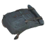
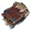
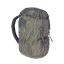
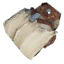
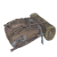
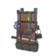

# 🎒 PHẦN 7 — Adventure Backpacks: Wiki Chi Tiết (v1.9.13)

**Nguồn dữ liệu:** wiki này được đối chiếu trực tiếp từ mã nguồn `AdventureBackpacks` (Vapok), file cấu hình đang chạy `vapok.mods.adventurebackpacks.cfg` (bản 1.9.13), chuỗi tiếng Anh **nhúng trực tiếp trong DLL metadata** (⚠ sửa khi audit: *không tồn tại file `Translations/English.json`* — chỉ có các file dịch ngôn ngữ khác `Translations/AdventureBackpacks.*.json`) và assetbundle nhúng trong DLL (8 bundle: 6 theo biome + `vapokbackpacks` + `chebsbackpack`).

## 1. Giới thiệu & cài đặt

**Adventure Backpacks** (Vapok) bổ sung 6 loại ba lô xuyên suốt tiến trình game, mỗi loại gắn với 1 biome, có kích thước túi, hiệu ứng và công thức chế tạo riêng. Đây là mod **client-side AND server-side** — phải cài trên **cả client lẫn dedicated server**:

- Plugin GUID: `vapok.mods.adventurebackpacks` · Phiên bản: 1.9.13 · Deps: **Jotunn** + **YamlDotNet** (tự kéo khi cài qua R2ModMan).

- **Network Compatibility Enforcement**: mọi người trong server phải có mod (bản khớp Patch) — tránh mất đồ khi người không có mod mở chest chứa ba lô.

- Toàn bộ cấu hình sync được giữa server & client; admin (cấu hình trong mod) sẽ ép config server xuống client.

## 2. Cách sử dụng & phím tắt

Mặc định phím `I` mở ba lô đang đeo. Các phím đổi được trong `[Local Config]` và hỗ trợ **controller**:

| Phím | Chức năng |
| --- | --- |
| **I** (Open Backpack) | Mở inventory của ba lô đang đeo |
| **Y** (Quickdrop Backpack) | Ném ba lô ra sau lưng xuống đất — chỉ hoạt động khi bật **Outward Mode** (⚠ sửa khi audit: tên config thật là *"Outward Mode"*, không phải "Outward Run Away Mode"; mặc định **tắt**) và đang di chuyển |
| **L** (Wisplight Effect Key) | Bật/tắt hiệu ứng Demister (Wisplight) khi đeo Explorers Wisppack đủ cấp — chỉ áp dụng khi đang ở Mistlands nếu bật **Wisplight Biome Logic** (mặc định bật) |
| **Right-click** trên item/stack | Quick Transfer giữa Player Inventory và mọi container đang mở (tích hợp sẵn **Fast Item Transfer** — không cần cài mod rời) |
| Open with Inventory / Hover | Tuỳ chọn: mở ba lô cùng lúc với Inventory, hoặc mở khi hover + nhấn phím mở (tính năng này ghi đè Open with Inventory) |

## 3. Cơ chế chính

### 3.1 Kích thước túi theo cấp độ (Quality Level)

Mỗi ba lô có kích thước grid riêng cho từng cấp 1–4 (config được mỗi cấp). Nâng cấp ba lô ở bàn chế tạo sẽ **mở rộng túi** và **mở khoá thêm hiệu ứng** theo progression của biome đó.

### 3.2 Carry, trọng lượng & tốc độ

- **Carry Bonus × cấp**: mỗi ba lô cộng tối đa carry weight, nhân với cấp độ item (vd +5/cấp → cấp 4 = +20).

- **Weight Multiplier 0.5**: đồ trong ba lô chỉ tính nửa trọng lượng (đặt 1.0 để tắt giảm trọng lượng).

- **Speed Modifier −0.15**: đeo ba lô chậm hơn 15%; mỗi cấp độ giảm độ chậm (chia cho cấp: −0.15 → −0.075 → −0.05 → −0.0375), không bao giờ hết hẳn.

- Ba lô đeo vào vị trí **Backpack** (rương lưng) — dùng chung slot với Smoothbrain's Backpacks (AzuEPI).

### 3.3 Thor Inventory Protection ("Thor bảo vệ đồ")

- **Cấm ba lô lồng ba lô** (backpack trong backpack) — tính năng **duy nhất không config được**. Nếu cố đặt, thông báo *"That backpack had stuff in it. Thor saved it for you."* / *"Thor has stripped you of your powers!!"*

- **Portal an toàn**: kiểm tra qua `Inventory.IsTeleportable()` nên item bị cấm mang qua cổng trong ba lô sẽ bị chặn như trong túi chính (hỗ trợ vanilla + Advanced Portals, AnyPortal, XPortal).

- **Yard Sale / chết hoặc thoát game đột ngột**: đồ trong ba lô được Thor cứu, ném ra thế giới 1 lần (*"You dropped a backpack!"*) — không mất đồ.

- **Chìa khoá tự động**: keys để trong ba lô đang đeo vẫn mở được cửa khóa (vd Swamp Key mở Crypt).

- Tương thích inventory mods đã kiểm chứng: Quick Stack Store, Fast Item Transfer (tích hợp), Multi-User-Chest.

## 4. Sáu ba lô chính

| Ba lô (icon) | Biome | Kích thước L1 → L4 | Carry (+/cấp) | Bàn chế tạo (cấp tối đa) | Công thức chế tạo | Công thức nâng cấp | Drops (mặc định OFF) |
| :---: | --- | --- | --- | --- | --- | --- | --- |
|  **Satchel** | Meadows | 3×1 → 4×1 → 5×1 → 6×1 | +5 | Workbench cấp 2 (tối đa 3) | CapeDeerHide ×1 + DeerHide ×8 + BoneFragments ×2 | LeatherScraps ×5 + DeerHide ×3 | Greyling 0.2% · Eikthyr 4% |
|  **Rugged Backpack** | BlackForest | 3×2 → 4×2 → 5×2 → 6×2 | +10 | Forge cấp 1 (tối đa 3) | CapeTrollHide ×1 + Copper ×5 | TrollHide ×3 + Bronze ×3 | Greydwarf 0.2% · Elite/Shaman 0.4% · Troll 1% · Bjorn 4% · gd_king 8% |
|  **Bloodbag Wetpack** | Swamp | 2×3 → 3×3 → 4×3 → 5×3 | +15 | Workbench cấp 2 (tối đa 5) | Bloodbag ×10 + Root ×4 + Guck ×4 | Bloodbag ×2 + Iron ×5 | Draugr 0.2% · Ranged/Elite 0.4% · Abomination 0.8% · Bonemass 4% |
|  **Arctic Sherpa Pack** | Mountains | 3×3 → 4×3 → 5×3 → 6×3 | +20 | Forge cấp 3 (tối đa 7) | CapeWolf ×1 + WolfHairBundle ×10 | WolfPelt ×5 + Silver ×5 | Fenring_Cultist 0.2% · Ulv 0.1% · Fenring 0.8% · Dragon 4% |
|  **Lox Hide Knappsack** | Plains | 3×4 → 4×4 → 5×4 → 6×4 | +25 | Forge cấp 3 (tối đa 7) | CapeLox ×1 + Tar ×5 + BlackMetal ×5 | LoxPelt ×2 + BlackMetal ×5 | Goblin/Archer/Brute/Shaman 0.2% · Unbjorn 2% · GoblinKing 4% |
|  **Explorers Wisppack** | Mistlands | 8×2 → 5×4 → 6×4 → 7×4 | +30 | BlackForge cấp 1 (tối đa 2) | CapeFeather ×1 + ScaleHide ×5 + Eitr ×10 | ScaleHide ×4 + Eitr ×2 + Softtissue ×5 | Dverger (5 loại) 0.2% · SeekerQueen 8% |

**Lưu ý:** Drops của ba lô **mặc định TẮT** (kể từ v1.6.3) — chế độ drop và tỉ lệ cấu hình được ở mỗi section ba lô trong config. Icon của Rugged Backpack và Arctic Sherpa Pack được mod tái sử dụng từ icon ba lô Iron/Silver legacy trong asset bundle.

## 5. Hiệu ứng theo biome & cấp mở khoá (mặc định)

Mỗi ba lô được khoá hiệu ứng theo biome của nó; hiệu ứng kích hoạt khi ba lô đủ **Effective Quality Level** (cấu hình được, giá trị 0 = tắt hiệu ứng cho biome đó).

| Hiệu ứng | Mô tả | Ba lô + cấp mở khoá mặc định |
| --- | --- | --- |
| **Cold Immunity** | Không bị lạnh (không chống **đóng băng**) | Satchel (Meadows) **L3** · Rugged (BF) **L1** · Wetpack (Swamp) **L1** · Sherpa (Mt) **L1** · Knappsack (Plains) **L1** · Wisppack (Mist) **L1** |
| **Frost Resistance** | Giữ ấm khi đóng băng, loại bỏ debuff freezing | Arctic Sherpa (Mountains) **L1** · Lox Knappsack (Plains) **L3** · Wisppack (Mistlands) **L2** |
| **Water Resistance** | Không ướt khi mưa (vẫn ướt khi bơi) | Bloodbag Wetpack (Swamp) **L2** |
| **Troll Armor Set** | Đóng vai mảnh *Shoulder* của bộ Troll — hoàn bộ set để có hiệu ứng Sneak | Rugged Backpack (BlackForest) **L2** |
| **Feather Fall** | Rơi chậm, không sát thương khi rơi từ cao | Arctic Sherpa (Mountains) **L4** · Wisppack (Mistlands) **L3** |
| **Demister** (Wisplight) | Giống đèn Wisplight — xua sương mù quanh người ở Mistlands (bật/tắt phím `L`) | Explorers Wisppack (Mistlands) **L4** |

Mô tả hiệu ứng trích từ mã nguồn `EffectsFactory.cs`: Cold Immunity — *"keeps you from feeling cold. Does not prevent freezing."*; Frost Resistance — *"stay warm in freezing conditions, negating the freezing debuff."*; Feather Fall — *"slow fall gracefully and without damage from high elevations."*

## 6. Ba lô Legacy (Old Arctic / Old Rugged)

Hai ba lô cũ từ các bản trước, cố định 1 kích thước (6×3), không có biome (Biome = None — không nhận hiệu ứng biome).

| Ba lô (icon) | Kích thước | Carry | Chống đóng băng (Prevent freezing/cold) |
| :---: | --- | --- | --- |
|  **Old Arctic Backpack** | 6×3 (cố định) | +45 | **Có** (mặc định true) |
|  **Old Rugged Backpack** | 6×3 (cố định) | +25 | Không (mặc định false) |

## 7. Cấu hình

File `BepInEx/config/vapok.mods.adventurebackpacks.cfg` (tạo sau lần chạy game đầu tiên). Các nhóm cấu hình chính:

- `[Backpack: ]` — 1 section cho mỗi ba lô: *Backpack Biome*, *Backpack Size - Level 1..4* (rộng × cao, tối đa 8 ô rộng), *Show Status Effect*, *Custom Effect Name*, *Weight Multiplier*, *Carry Bonus*, *Speed Modifier* (0 → −1), legacy có thêm *Prevent freezing/cold?*. Recipe & drop cấu hình được (Configurability.Recipe | Drop).

- `[Effect: ...]` — 1 section mỗi hiệu ứng (Cold Immunity, Demister, Feather Fall, Frost Resistance, Troll Armor Set, Water Resistance): *Effect Enabled* + *Effective Quality Level: * (0–5, mặc định 0 = tắt cho biome đó).

- `[Local Config]` — phím: *Open Backpack* (I), *Quickdrop Backpack* (Y), *Open with Inventory* (false), *Open with Interactive Hover* (false).

- `[Wisplight Client Settings]` — phím toggle Wisplight (L), *Wisplight Biome Logic* (true — tự tắt khi ra khỏi Mistlands).

- `[Log Output Configuration]` / `[General]` — log & settings sync.

Hầu hết settings đều **[Synced with Server]** — server giữ config gốc và ép xuống client.

## 8. Tương thích

- **Verified**: Epic Loot 0.9.3+, Extra Slots, Advanced Portals, AnyPortal, XPortal, Quick Stack Store, Auto Split Stack, AzuCraftyBoxes, Multi-User-Chests, Fast Item Transfer, Jewelcrafting, Shield Me Bruh!, Cheb's Necromancy (Spectral Shroud of Holding Backpack + Necromancy Armor SE + skill modifier).

- **Không tương thích**: **JotunnBackpacks** (đánh dấu BepInIncompatibility — quy đổi qua lại an toàn, không mất đồ).

- **Slot Backpack dùng chung** với Smoothbrain's Backpacks (AzuEPI) — chỉ đeo được 1 ba lô; tích hợp API `ABAPI.dll` (⚠ sửa khi audit: file zip kèm theo tên `AdventureBackpacksAPI-1.2.0.zip`, nhưng assembly bên trong là **APIManager v1.0.0.0**) cho phép mod khác đăng ký ba lô/hiệu ứng riêng.

- Lưu ý: mod rời **Fast Item Transfer** sẽ tự bị vô hiệu khi cài Adventure Backpacks (tính năng đã tích hợp).

## 9. FAQ

**Q: Gỡ mod có mất ba lô/đồ không?**
A: Đồ trong ba lô được Thor cứu: trước khi gỡ, mở từng ba lô chuyển đồ ra. Mod chặn để rơi mất đồ qua cơ chế Yard Sale — khi chết hoặc mất kết nối, ba lô được ném ra thế giới kèm đồ bên trong.

**Q: Đặt ba lô vào ba lô khác được không?**
A: Không — đây là quy tắc duy nhất không thể tắt trong config (*"Backpacks in Backpacks is not allowed and the only feature that is not configurable."*).

**Q: Tại sao tôi bị chậm khi đeo ba lô? Tắt được không?**
A: Speed Modifier mặc định −0.15 chủ ý cân bằng; có thể tăng về 0 trong config (0 = không chậm). Mỗi cấp độ ba lô giảm độ chậm (chia theo cấp) nhưng không về 0 nếu giữ mặc định.

**Q: Có cần cài trên server không?**
A: Có — mod phải cài cả client lẫn server; Network Compatibility Enforcement sẽ chặn vào server nếu client **có** mod mà server **không** có (tránh mất đồ), và ngược lại.
