# ⚔️ PHẦN 8 — Warfare: Wiki Chi Tiết (v1.8.9)

Mod **Warfare** (Therzie, GUID `Therzie.Warfare`) bổ sung **107 vũ khí, 8 khiên, 13 mũi tên/bolt, 3 mead, 1 bom, 2 cúp** và 1 cape, cùng bàn chế tạo mới **Fletcher table**. Vũ khí boss-drop được đánh dấu ⭐. Số liệu lấy từ prefab ItemDrop trong asset bundle của mod (giá trị default) + config `Therzie.Warfare.cfg` (chi phí chế tạo). Damage hiển thị dạng `nền+bonus/lvl` (Q1 = nền, Q5 = nền + 4×bonus). **Mọi bảng sắp theo thời kỳ**: Meadows → Black Forest → Swamp → Mountain → Plains → Mistlands → Ashlands.

## 🛠️ 1. Bàn Chế Tạo & Mở Rộng

**Fletcher table** là bàn chính cho cung/nỏ/đạn — tối đa **cấp 5** nhờ 4 mảnh mở rộng (Bow rack, Target dummy, Bow vise, Wood lathe), mỗi mảnh +1 cấp. **Black anvil** & **Eitr-infused sharpening stone** là mảnh mở rộng của Black Forge (mở vũ khí cấp cao).

| Icon | Tên | Chế tạo | Ghi chú |
| --- | --- | --- | --- |
| 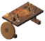 | **Fletcher table** (FletcherTable_TW) | [Workbench] Feathers ×6, RoundLog ×10, Leather Scraps ×6, Deer Hide ×4 | Bàn cung/nỏ/đạn |
| 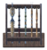 | **Bow rack** (FletcherTable_ext1_TW) | [FletcherTable_TW] Bronze ×4, Fine Wood ×12, Bronze Nails ×20, Deer Hide ×4 | Fletcher table +1 cấp |
|  | **Target dummy** (FletcherTable_ext2_TW) | [FletcherTable_TW] Bronze Nails ×20, RoundLog ×8, Troll Hide ×10, Troll Bone ×2 | Fletcher table +1 cấp |
| 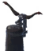 | **Bow vise** (FletcherTable_ext3_TW) | [FletcherTable_TW] Iron ×10, Elder Bark ×10, Iron Nails ×40, Rotten Pelt ×4 | Fletcher table +1 cấp |
| 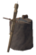 | **Wood lathe** (FletcherTable_ext4_TW) | [FletcherTable_TW] Silver ×14, Fine Wood ×10, Obsidian ×8, Wolf Pelt ×4 | Fletcher table +1 cấp |
|  | **Black anvil** (BlackForge_ext4_TW) | [Black Forge] Iron ×20, Black Marble ×25, Yggdrasil Wood ×10, Black Core ×5 | Black Forge +1 cấp |
| 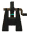 | **Eitr-infused sharpening stone** (BlackForge_ext3_TW) | [Black Forge] Eitr ×10, Flametal ×16, Grausten ×12, Black Marble ×12 | Black Forge +1 cấp |

## 🧵 2. Nguyên Liệu

Nguyên liệu mới dùng cho vũ khí/giáp của bộ Therzie mods (Warfare + Armory). **Đá quý** mua từ thương nhân (Haldor/Hildir): Onyx 30 vàng, Diamond 45, Emerald 60, Amethyst 80, Sapphire 100, Topaz 100. **Runes** hiện chưa được dùng (UNUSED theo README).

| Icon | Tên (prefab) | Chế tạo / Nguồn | Ghi chú |
| --- | --- | --- | --- |
|  | **Onyx** (Onyx_TW) |  | A valuable gem stone, the trader will pay a pretty price for this. |
|  | **Topaz** (Topaz_TW) |  | A valuable gem stone, the trader will pay a pretty price for this. |
|  | **Sapphire** (Sapphire_TW) |  | A valuable gem stone, the trader will pay a pretty price for this. |
|  | **Emerald** (Emerald_TW) |  | A valuable gem stone, the trader will pay a pretty price for this. |
|  | **Diamond** (Diamond_TW) |  | A valuable gem stone, the trader will pay a pretty price for this. |
|  | **Amethyst** (Amethyst_TW) |  | A valuable gem stone, the trader will pay a pretty price for this. |
| 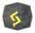 | **Jara rune** (RuneJara_TW) |  | A magical rune, used for enchanting powerful keys. |
|  | **Dagaz rune** (RuneDagaz_TW) |  | A magical rune, used for enchanting powerful keys. |
| 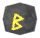 | **Ber rune** (RuneBer_TW) |  | A magical rune, used for enchanting powerful keys. |
| 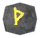 | **Thurisaz rune** (RuneThurisaz_TW) |  | A magical rune, used for enchanting powerful keys. |
|  | **Raidho rune** (RuneRaidho_TW) |  | A magical rune, used for enchanting powerful keys. |
|  | **Eihwaz rune** (RuneEihwaz_TW) |  | A magical rune, used for enchanting powerful keys. |
|  | **Algiz rune** (RuneAlgiz_TW) |  | A magical rune, used for enchanting powerful keys. |
|  | **Othala rune** (RuneOthala_TW) |  | A magical rune, used for enchanting powerful keys. |
|  | **Fehu rune** (RuneFehu_TW) |  | A magical rune, used for enchanting powerful keys. |
|  | **Perth rune** (RunePerth_TW) |  | A magical rune, used for enchanting powerful keys. |
|  | **Mannaz rune** (RuneMannaz_TW) |  | A magical rune, used for enchanting powerful keys. |

| Icon | Tên (prefab) | Chế tạo / Nguồn | Ghi chú |
| --- | --- | --- | --- |
|  | **Ancient Artifact** (AncientArtifact_TW) |  | Rare ancient artifact, the trader might be interested in this! |
|  | **Ancient Scroll** (AncientScroll_TW) |  | An ancient scroll that's said to increase ones skill in the ways of magic. |
|  | **Black Bear Pelt** (BlackBearPelt_TW) |  | A thick black pelt of a black bear. |
|  | **Black Dye** (DyeBlack_TW) | Blueberries ×2, Coal ×2 | Dark as the night itself. |
|  | **Essence of Freyja** (FreyjaEssence_TW) |  | A rare life-breathing magical essence. |
| 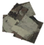 | **Goblin Scraps** (GoblinScraps_TW) |  | Scraps of goblin clothing, just don't look at the stains. |
| 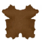 | **Grizzly Pelt** (GrizzlyBearPelt_TW) |  | A thick brown pelt of a grizzly bear. |
| 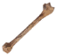 | **Lox Bone** (LoxBone_TW) |  | Bloody and heavy, there's still something to chew off left. |
| 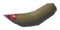 | **Prowler Fang** (ProwlerFang_TW) |  | Still dripping with blood from it's last victim.. |
|  | **Razorback Leather** (RazorbackLeather_TW) |  | Dark boar leather that can be used for crafting. |
|  | **Razorback Tusk** (RazorbackTusk_TW) |  | Sharp and mean, you're lucky not be gored by these. |
| 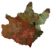 | **Rotten Pelt** (RottenPelt_TW) |  | A disgusting pelt filled with maggots. |
| 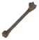 | **Troll Bone** (TrollBone_TW) |  | A heavy, old troll bone. It has a moldy stench to it. |
|  | **Venomous Fang** (VenomousFang_TW) |  | A fang still dripping with venom. |
|  | **Dark Crystal** (DarkCrystal_TW) |  | A dark pulsing crystal from the shadow realm. |
| 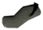 | **Black Jute** (JuteBlack_TW) | JuteBlue ×1, Black Dye ×3 | Dark woven fabrics. |

## ⚔️ 3. Vũ Khí (21 Nhóm)

Damage dạng `nền+bonus/lvl`; mỗi nhóm sắp theo thời kỳ. ⭐ = vũ khí rớt từ boss (tỉ lệ trong ngoặc). Tất cả vũ khí có 2 đòn đánh (chính + phụ).

### 3.1 Kiếm 1 Tay (Sword)

| Icon | Tên (prefab) | Stats | Chế tạo | Nâng cấp | Hiệu ứng |
| --- | --- | --- | --- | --- | --- |
| 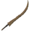 | **Abyssal Sword** (SwordChitin_TW) | ⚔️ 45+6/lvl Slash 🛡️ Block armor 20+1/lvl Block 17 · Deflection 20+5/lvl Knockback 40 Backstab ×3 Skill: Swords Stamina 9 · Range 2.4m · Speed 0.3× Alt: Stamina 18 · Range 2.4m · Speed 0.2× Weight 0.8 Durability 150 Movement -5% | Chitin ×20, Bronze ×12, Elder Bark ×8 | Chitin ×10, Bronze ×6, Elder Bark ×4 | A sharp chitin sword to stab your enemies with. |
| 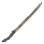 | **Bone Sword** (SwordBone_TW) | ⚔️ 7+2/lvl Blunt 28+4/lvl Slash 🛡️ Block armor 20+1/lvl Block 12 · Deflection 20+5/lvl Knockback 40 Backstab ×3 Skill: Swords Stamina 8 · Range 2.4m · Speed 0.3× Alt: Stamina 16 · Range 2.4m · Speed 0.2× Weight 0.8 Durability 150 Movement -5% | Bone Fragments ×10, RoundLog ×8, Tin ×8 | Bone Fragments ×5, RoundLog ×4, Tin ×4 | A sharp bone sword to stab your enemies with. |
| 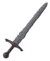 | **Flint Sword** (SwordFlint_TW) | ⚔️ 15+6/lvl Slash 🛡️ Block armor 20+1/lvl Block 3 · Deflection 20+5/lvl Knockback 40 Backstab ×3 Skill: Swords Stamina 6 · Range 2.4m · Speed 0.3× Alt: Stamina 12 · Range 2.4m · Speed 0.2× Weight 0.8 Durability 150 Movement -5% | Flint ×8, Wood ×6, Greydwarf Eye ×1, Leather Scraps ×2 | Flint ×4, Wood ×3 | A sharp flint sword to stab your enemies with. |
| 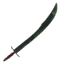 | **Blackmetal Scimitar** (SwordScimitar_TW) | ⚔️ 96+6/lvl Slash 🛡️ Block armor 20+1/lvl Block 39 · Deflection 20+5/lvl Knockback 40 Backstab ×3 Skill: Swords Stamina 14 · Range 2.4m · Speed 0.3× Alt: Stamina 28 · Range 1.8m Weight 0.8 Durability 200 Movement -5% | Fine Wood ×15, Black Metal ×25, Linen Thread ×10, Fuling Trophy ×1 | Fine Wood ×8, Black Metal ×12, Linen Thread ×5 | A sharp blackmetal sword to stab your enemies with. |
| 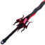 | **Doombringer** (BladeYagluth_TW) ⭐ Rớt 7% từ Yagluth | ⚔️ 106+4/lvl Slash 6+1/lvl Fire 6+1/lvl Lightning 🛡️ Block armor 20+1/lvl Block 52 · Deflection 50+10/lvl Knockback 55 Backstab ×3 Skill: Swords Stamina 18 · Range 2.6m · Speed 0.3× Alt: Stamina 55 · Range 3m · Speed 0.3× · Proj 10 m/s · Accuracy 10° Weight 4 Durability 200 Movement -5% | Black Metal ×60, Goblin Totem ×12, Yagluth Drop ×12, TrophyGoblinKing ×1 | Black Metal ×30, Goblin Totem ×6, Yagluth Drop ×6, TrophyGoblinKing ×1 | An evil blade, enchanted with the wicked magic of Yagluth himself. |

### 3.2 Bastard Sword (Kiếm 2 Tay)

| Icon | Tên (prefab) | Stats | Chế tạo | Nâng cấp | Hiệu ứng |
| --- | --- | --- | --- | --- | --- |
| 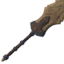 | **Abyssal Bastard Sword** (BastardChitin_TW) | ⚔️ 56+6/lvl Slash 🛡️ Block armor 20+1/lvl Block 22 · Deflection 50+10/lvl Knockback 55 Backstab ×3 Skill: Swords Stamina 13 · Range 2.6m · Speed 0.3× Alt: Stamina 26 · Range 3m · Speed 0.2× Weight 4 Durability 150 Movement -5% | Elder Bark ×14, Chitin ×30, Bronze ×12 | Elder Bark ×7, Chitin ×15, Bronze ×6 | A savage sword made of chitin. Used to slash and decapitate your enemies with. |
| 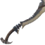 | **Bone Bastard Sword** (BastardBone_TW) | ⚔️ 30+2/lvl Blunt 16+4/lvl Slash 🛡️ Block armor 20+1/lvl Block 16 · Deflection 50+10/lvl Knockback 55 Backstab ×3 Skill: Swords Stamina 10 · Range 2.6m · Speed 0.3× Alt: Stamina 20 · Range 3m · Speed 0.2× Weight 4 Durability 150 Movement -5% | Bone Fragments ×14, Copper ×8, Skeleton Trophy ×1 | Bone Fragments ×7, Copper ×4 | A huge sword made of bone. Used to slash and decapitate your enemies with. |
| 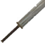 | **Flint Bastard Sword** (BastardFlint_TW) | ⚔️ 26+4/lvl Slash 🛡️ Block armor 20+1/lvl Block 4 · Deflection 50+10/lvl Knockback 55 Backstab ×3 Skill: Swords Stamina 8 · Range 2.6m · Speed 0.3× Alt: Stamina 18 · Range 3m · Speed 0.2× Weight 4 Durability 150 Movement -5% | Flint ×12, RoundLog ×6, Greydwarf Eye ×1, Leather Scraps ×2 | Flint ×6, RoundLog ×3 | A heavy sword made of flint. Used to slash and decapitate your enemies with. |
| 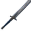 | **Silver Bastard Sword** (BastardSilver_TW) | ⚔️ 86+6/lvl Slash 30 Spirit 🛡️ Block armor 20+1/lvl Block 40 · Deflection 50+10/lvl Knockback 55 Backstab ×3 Skill: Swords Stamina 16 · Range 2.6m · Speed 0.3× Alt: Stamina 32 · Range 3m · Speed 0.2× Weight 4 Durability 200 Movement -5% | Silver ×25, Elder Bark ×25, Wolf Fang ×10, Fenring Trophy ×1 | Silver ×12, Elder Bark ×12, Wolf Fang ×5 | A purified sword made of silver. Used to cleanse and decapitate your enemies with. |
| 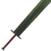 | **Blackmetal Bastard Sword** (BastardBlackmetal_TW) | ⚔️ 106+6/lvl Slash 🛡️ Block armor 20+1/lvl Block 52 · Deflection 50+10/lvl Knockback 55 Backstab ×3 Skill: Swords Stamina 18 · Range 2.6m · Speed 0.3× Alt: Stamina 34 · Range 3m · Speed 0.2× Weight 4 Durability 200 Movement -5% | Black Metal ×30, Tar ×16, Lox Bone ×6, Fuling Brute Trophy ×1 | Black Metal ×15, Tar ×8, Lox Bone ×3 | A brutal sword made of blackmetal. Used to slash and decapitate your enemies with. |
| 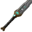 | **Dwarven Bastard Sword** (BastardDvergr_TW) | ⚔️ 130+6/lvl Slash 12 Lightning 🛡️ Block armor 20+1/lvl Block 64 · Deflection 50+10/lvl Knockback 55 Backstab ×3 Skill: Swords Stamina 20 · Range 2.6m · Speed 0.3× Alt: Stamina 40 · Range 3m · Speed 0.2× Weight 4 Durability 200 Movement -5% | Carapace ×25, Eitr ×15, Venomous Fang ×10, Gjall Trophy ×1 | Carapace ×10, Eitr ×5, Venomous Fang ×5 | A dwarven sword infused with eitr. Used to shock and decapitate your enemies with. |
| 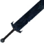 | **Flametal Bastard Sword** (BastardFlametal_TW) | ⚔️ 170+6/lvl Slash 🛡️ Block armor 20+1/lvl Block 64 · Deflection 50+10/lvl Knockback 55 Backstab ×3 Skill: Swords Stamina 22 · Range 2.6m · Speed 0.3× Alt: Stamina 44 · Range 3m · Speed 0.2× Weight 4 Durability 200 Movement -5% | Flametal ×30, Charred Bone ×12, Ask Hide ×10, Bonemaw Serpent Trophy ×1 | Flametal ×15, Charred Bone ×6, Ask Hide ×5, Bonemaw Serpent Trophy ×1 | A heavy flametal bastard sword. Used to slash and decapitate your enemies. |

### 3.3 Claymore (Đại Kiếm)

| Icon | Tên (prefab) | Stats | Chế tạo | Nâng cấp | Hiệu ứng |
| --- | --- | --- | --- | --- | --- |
| 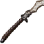 | **Abyssal Claymore** (ClaymoreChitin_TW) | ⚔️ 56+6/lvl Slash 🛡️ Block armor 20+1/lvl Block 22 · Deflection 50+10/lvl Knockback 55 Backstab ×3 Skill: Swords Stamina 13 · Range 2.6m · Speed 0.3× Alt: Stamina 26 · Range 3m · Speed 0.2× Weight 4 Durability 150 Movement -5% | Chitin ×30, Bronze ×16, Elder Bark ×16 | Chitin ×15, Bronze ×8, Elder Bark ×8 | A savage claymore made out of chitin. Used to slash your enemies in half with. |
| 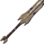 | **Bone Claymore** (ClaymoreBone_TW) | ⚔️ 30+2/lvl Blunt 15+4/lvl Slash 🛡️ Block armor 20+1/lvl Block 16 · Deflection 50+10/lvl Knockback 55 Backstab ×3 Skill: Swords Stamina 10 · Range 2.6m · Speed 0.3× Alt: Stamina 20 · Range 3m · Speed 0.3× Weight 4 Durability 150 Movement -5% | Bone Fragments ×14, Copper ×8, Skeleton Trophy ×1 | Bone Fragments ×7, Copper ×4 | A huge claymore made out of bone. Used to slash your enemies in half with. |
| 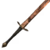 | **Bronze Claymore** (ClaymoreBronze_TW) | ⚔️ 46+6/lvl Slash 🛡️ Block armor 20+1/lvl Block 16 · Deflection 50+10/lvl Knockback 55 Backstab ×3 Skill: Swords Stamina 12 · Range 2.6m · Speed 0.3× Alt: Stamina 24 · Range 3m · Speed 0.2× Weight 4 Durability 150 Movement -5% | RoundLog ×10, Bronze ×12, Greydwarf Brute Trophy ×1 | RoundLog ×5, Bronze ×6 | A sharp claymore made out of bronze. Used to slash your enemies in half with. |
| 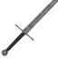 | **Iron Claymore** (ClaymoreIron_TW) | ⚔️ 66+6/lvl Slash 🛡️ Block armor 20+1/lvl Block 28 · Deflection 50+10/lvl Knockback 55 Backstab ×3 Skill: Swords Stamina 14 · Range 2.6m · Speed 0.3× Alt: Stamina 28 · Range 3m · Speed 0.2× Weight 4 Durability 200 Movement -5% | Elder Bark ×20, Iron ×25, Draugr Elite Trophy ×1 | Elder Bark ×10, Iron ×12 | A solid claymore made out of iron. Used to slash your enemies in half with. |
| 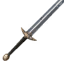 | **Silver Claymore** (ClaymoreSilver_TW) | ⚔️ 86+6/lvl Slash 30 Spirit 🛡️ Block armor 20+1/lvl Block 40 · Deflection 50+10/lvl Knockback 55 Backstab ×3 Skill: Swords Stamina 16 · Range 2.6m · Speed 0.3× Alt: Stamina 32 · Range 3m · Speed 0.2× Weight 4 Durability 200 Movement -5% | Elder Bark ×25, Silver ×30, Crystal ×12, Cultist Trophy ×1 | Elder Bark ×10, Silver ×15, Crystal ×6 | A purified claymore made out of silver. Used to slash your enemies in half with. |
| 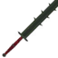 | **Blackmetal Claymore** (ClaymoreBlackmetal_TW) | ⚔️ 106+6/lvl Slash 🛡️ Block armor 20+1/lvl Block 52 · Deflection 50+10/lvl Knockback 55 Backstab ×3 Skill: Swords Stamina 18 · Range 2.6m · Speed 0.3× Alt: Stamina 36 · Range 3m · Speed 0.2× Weight 4 Durability 200 Movement -5% | Black Metal ×30, Fine Wood ×25, Linen Thread ×14, Fuling Shaman Trophy ×1 | Black Metal ×15, Fine Wood ×12, Linen Thread ×7 | A brutal claymore made out of blackmetal. Used to slash your enemies in half with. |
| 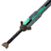 | **Dwarven Claymore** (ClaymoreDvergr_TW) | ⚔️ 130+6/lvl Slash 12 Lightning 🛡️ Block armor 20+1/lvl Block 64 · Deflection 50+10/lvl Knockback 55 Backstab ×3 Skill: Swords Stamina 20 · Range 2.6m · Speed 0.3× Alt: Stamina 40 · Range 3m · Speed 0.2× Weight 4 Durability 200 Movement -5% | Carapace ×20, Eitr ×15, Dark Crystal ×8, Seeker Brute Trophy ×1 | Carapace ×10, Eitr ×5, Dark Crystal ×4 | A dwarven claymore infused with eitr. Used to slash and shock your enemies in half with. |

### 3.4 Kiếm Đôi (Dual Sword)

| Icon | Tên (prefab) | Stats | Chế tạo | Nâng cấp | Hiệu ứng |
| --- | --- | --- | --- | --- | --- |
|  | **Blackmetal Scimitar Swords** (DualSwordScimitar_TW1) | ⚔️ 105+3/lvl Slash 🛡️ Block armor 20+1/lvl Block 66 · Deflection 40+5/lvl Knockback 40 Backstab ×3 Skill: Swords Stamina 16 · Range 2.2m · Speed 0.3× Alt: Stamina 48 · Range 1.8m · Speed 0.2× Weight 0.3 Durability 200 | Fine Wood ×20, Black Metal ×40, Linen Thread ×15, Fuling Shaman Trophy ×1 | Fine Wood ×10, Black Metal ×20, Linen Thread ×8 | A sharp pair of blackmetal scimitar swords to make quick work of your enemies with. |
| 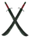 | **Blackmetal Scimitar Swords** (DualSwordScimitar_TW) | ⚔️ 105+3/lvl Slash 🛡️ Block armor 20+1/lvl Block 48 · Deflection 40+5/lvl Knockback 40 Backstab ×3 Skill: Swords Stamina 16 · Range 2.2m · Speed 0.3× Alt: Stamina 48 · Range 1.8m · Speed 0.2× Weight 0.3 Durability 200 | Fine Wood ×20, Black Metal ×40, Linen Thread ×15, Fuling Shaman Trophy ×1 | Fine Wood ×10, Black Metal ×20, Linen Thread ×8 | A sharp pair of blackmetal scimitar swords to make quick work of your enemies with. |

### 3.5 Dao Găm (Knife)

| Icon | Tên (prefab) | Stats | Chế tạo | Nâng cấp | Hiệu ứng |
| --- | --- | --- | --- | --- | --- |
| 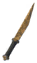 | **Bronze Knife** (KnifeBronze_TW) | ⚔️ 16+1/lvl Slash 16+1/lvl Pierce 🛡️ Block armor 20+1/lvl Block 2 · Deflection 10+5/lvl Knockback 10 Backstab ×6 Skill: Knives Stamina 7 · Range 1.8m · Speed 0.3× Alt: Stamina 20 · Range 1.8m Weight 0.3 Durability 200 | Bone Fragments ×5, Bronze ×10, TrophyGreydwarfShaman ×1 | Bone Fragments ×3, Bronze ×5 | A sharp bronze knife used to stab your enemies with. |
| 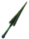 | **Viper** (KnifeViper_TW) ⭐ Rớt 6% từ Asmodeus (Monstrum) | ⚔️ 13+1/lvl Slash 13+1/lvl Pierce 5 Poison 🛡️ Block armor 20+1/lvl Block 2 · Deflection 10+5/lvl Knockback 10 Backstab ×6 Skill: Knives Stamina 6 · Range 1.8m · Speed 0.3× Alt: Stamina 18 · Range 1.8m Weight 0.3 Durability 200 | Bronze ×22, Hard Antler ×12, Surtling Core ×4, TrophyGreydwarfShaman ×1 | Bronze ×11, Hard Antler ×6, Surtling Core ×2, TrophyGreydwarfShaman ×1 | A magical knife imbued with the Viper lord's venom. Used to stab and poison your enemies with. |
| 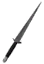 | **Iron Knife** (KnifeIron_TW) | ⚔️ 22+1/lvl Slash 22+1/lvl Pierce 🛡️ Block armor 20+1/lvl Block 2 · Deflection 10+5/lvl Knockback 10 Backstab ×6 Skill: Knives Stamina 8 · Range 1.8m · Speed 0.3× Alt: Stamina 24 · Range 1.8m Weight 0.3 Durability 200 | Elder Bark ×12, Iron ×20, Leech Trophy ×1 | Elder Bark ×6, Iron ×10 | A sharp iron knife used to stab your enemies with. |
| 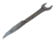 | **Knifewrench** (KnifeWrench_TW) | ⚔️ 17+2/lvl Blunt 17 Pierce 🛡️ Block armor 20+1/lvl Block 2 · Deflection 10+5/lvl Knockback 10 Backstab ×6 Skill: Knives Stamina 10 · Range 1.8m · Speed 0.3× Alt: Stamina 25 · Range 1.8m Weight 0.3 Durability 200 | Iron ×18, Iron Nails ×60, Draugr Trophy ×1 | Iron ×9, Iron Nails ×30 | Practical and safe! For kids! |

### 3.6 Dao Đôi (Dual Knife / Daggers)

| Icon | Tên (prefab) | Stats | Chế tạo | Nâng cấp | Hiệu ứng |
| --- | --- | --- | --- | --- | --- |
| 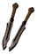 | **Bone Daggers** (DualKnifeBone_TW) | ⚔️ 12+1/lvl Slash 12+1/lvl Pierce 🛡️ Block armor 20+1/lvl Block 4 · Deflection 10+5/lvl Knockback 10 Backstab ×6 Skill: Knives Tool tier 1 Stamina 6 · Range 1.8m · Speed 0.3× Alt: Stamina 20 · Range 1.8m Weight 0.3 Durability 200 | Bone Fragments ×8, Copper ×10, Wood ×6 | Bone Fragments ×2, Copper ×3 | A sharp pair of bone daggers to slice your enemies with! |
| 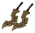 | **Chitin Daggers** (DualKnifeChitin_TW) | ⚔️ 18+1/lvl Slash 18+1/lvl Pierce 🛡️ Block armor 20+1/lvl Block 8 · Deflection 10+5/lvl Knockback 10 Backstab ×6 Skill: Knives Tool tier 1 Stamina 7 · Range 1.8m · Speed 0.3× Alt: Stamina 24 · Range 1.8m Weight 0.3 Durability 200 | Elder Bark ×10, Chitin ×25, Bronze ×8 | Elder Bark ×4, Chitin ×12, Bronze ×4 | A sharp pair of chitin daggers to slice your enemies with! |
| 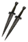 | **Iron Daggers** (DualKnifeIron_TW) | ⚔️ 22+1/lvl Slash 22+1/lvl Pierce 🛡️ Block armor 20+1/lvl Block 12 · Deflection 10+5/lvl Knockback 10 Backstab ×6 Skill: Knives Tool tier 2 Stamina 8 · Range 1.8m · Speed 0.3× Alt: Stamina 28 · Range 1.8m Weight 0.3 Durability 200 | Root ×8, Iron ×20, Draugr Elite Trophy ×1 | Root ×4, Iron ×10 | A sharp pair of iron daggers to slice your enemies with! |
| 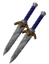 | **Silver Daggers** (DualKnifeSilver_TW) | ⚔️ 26+1/lvl Slash 26+1/lvl Pierce 12 Spirit 🛡️ Block armor 20+1/lvl Block 16 · Deflection 10+5/lvl Knockback 10 Backstab ×6 Skill: Knives Tool tier 3 Stamina 10 · Range 1.8m · Speed 0.3× Alt: Stamina 32 · Range 1.8m Weight 0.3 Durability 200 | Elder Bark ×15, Crystal ×6, Silver ×25, Cultist Trophy ×1 | Elder Bark ×6, Crystal ×3, Silver ×12 | A sharp pair of silver daggers to slice your enemies with! |
| 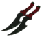 | **Blackmetal Daggers** (DualKnifeBM_TW) | ⚔️ 35+1/lvl Slash 35+1/lvl Pierce 🛡️ Block armor 20+1/lvl Block 20 · Deflection 10+5/lvl Knockback 10 Backstab ×6 Skill: Knives Tool tier 3 Stamina 12 · Range 1.8m · Speed 0.3× Alt: Stamina 38 · Range 1.8m Weight 0.3 Durability 200 | Fine Wood ×18, Linen Thread ×12, Black Metal ×25, Fuling Shaman Trophy ×1 | Fine Wood ×8, Linen Thread ×4, Black Metal ×12 | A sharp pair of blackmetal daggers to slice your enemies with! |
| 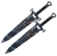 | **Flametal Daggers** (DualKnifeFlametal_TW) | ⚔️ 55+1/lvl Slash 55+1/lvl Pierce 🛡️ Block armor 28+1/lvl Block 20 · Deflection 10+5/lvl Knockback 10 Backstab ×6 Skill: Knives Tool tier 5 Stamina 16 · Range 1.8m · Speed 0.3× Alt: Stamina 46 · Range 1.8m Weight 0.3 Durability 200 | Blackwood ×16, Flametal ×16, Charred Bone ×12, Charred Mage Trophy ×1 | Blackwood ×8, Flametal ×8, Charred Bone ×6, Charred Mage Trophy ×1 | A sharp pair of flametal daggers to slice your enemies! |

### 3.7 Liềm (Scythe)

| Icon | Tên (prefab) | Stats | Chế tạo | Nâng cấp | Hiệu ứng |
| --- | --- | --- | --- | --- | --- |
| 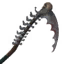 | **Blood Drinker** (ScytheVampiric_TW) ⭐ Rớt 6% từ Vrykolathas (Monstrum) | ⚔️ 42+4/lvl Slash 42+4/lvl Pierce 🛡️ Block armor 15+1/lvl Block 40 · Deflection 40+5/lvl Knockback 30 Backstab ×3 Skill: Polearms Stamina 16 · Range 3.2m · Speed 0.2× Alt: Stamina 46 · Range 3m · Speed 0.2× Weight 2.5 Durability 300 Movement -5% | Iron ×40, Withered Bone ×18, Blood Bag ×16, Bonemass Trophy ×1 | Iron ×20, Withered Bone ×9, Blood Bag ×8, Bonemass Trophy ×1 | A cursed ancient weapon forged by evil that does not sleep. |
|  | **Blood Thirster** (DualScytheBloodthirst_TW) ⭐ Rớt 6% từ Vrykolathas (Monstrum) | ⚔️ 62+5/lvl Slash 🛡️ Block armor 20+1/lvl Block 28 · Deflection 40+5/lvl Knockback 50 Backstab ×3 Skill: Polearms Tool tier 3 Stamina 14 · Range 2.2m · Speed 0.3× Alt: Stamina 38 · Range 2.2m · Speed 0.3× Weight 0.3 Durability 300 | Iron ×40, Rotten Pelt ×20, Blood Bag ×20, Bonemass Trophy ×1 | Iron ×20, Rotten Pelt ×10, Blood Bag ×10, Bonemass Trophy ×1 | Cursed ancient weapons forged by evil that hungers for blood. |

### 3.8 Rìu (Axe)

| Icon | Tên (prefab) | Stats | Chế tạo | Nâng cấp | Hiệu ứng |
| --- | --- | --- | --- | --- | --- |
| 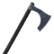 | **Silver Axe** (AxeSilver_TW) | ⚔️ 80+5/lvl Slash 60+3/lvl Chop 30 Spirit 🛡️ Block armor 20+1/lvl Block 30 · Deflection 20+5/lvl Knockback 50 Backstab ×3 Skill: Axes Tool tier 3 Stamina 12 · Range 2.2m · Speed 0.2× Alt: Stamina 24 · Range 2.2m · Speed 0.2× Weight 2 Durability 175 Movement -5% | Elder Bark ×12, Silver ×25, Wolf Fang ×6, Wolf Trophy ×1 | Elder Bark ×6, Silver ×12, Wolf Fang ×3 | An axe made out of pure silver, that'll lift some spirits! |
| 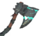 | **Dwarven Axe** (AxeDvergr_TW) | ⚔️ 105+5/lvl Slash 70+3/lvl Chop 12 Lightning 🛡️ Block armor 20+1/lvl Block 48 · Deflection 20+5/lvl Knockback 50 Backstab ×3 Skill: Axes Tool tier 5 Stamina 16 · Range 2.2m · Speed 0.2× Alt: Stamina 32 · Range 2.2m · Speed 0.2× Weight 2 Durability 300 Movement -5% | Yggdrasil Wood ×20, Eitr ×12, Venomous Fang ×10, Tick Trophy ×1 | Yggdrasil Wood ×10, Eitr ×4, Venomous Fang ×5 | A dwarven axe infused with eitr. Used to chop and shock your enemies with. |
| 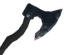 | **Flametal Axe** (AxeFlametal_TW) | ⚔️ 140+5/lvl Slash 80+3/lvl Chop 🛡️ Block armor 20+1/lvl Block 58 · Deflection 20+5/lvl Knockback 50 Backstab ×3 Skill: Axes Tool tier 6 Stamina 18 · Range 2.2m · Speed 0.2× Alt: Stamina 36 · Range 2.2m · Speed 0.2× Weight 2 Durability 300 Movement -5% | Blackwood ×16, Flametal ×14, Bonemaw Serpent Tooth ×4, Bonemaw Serpent Trophy ×1 | Blackwood ×8, Flametal ×7, Bonemaw Serpent Tooth ×2, Bonemaw Serpent Trophy ×1 | A flametal axe. Used to chop a tree or your enemies. |

### 3.9 Rìu Chiến (Battleaxe)

| Icon | Tên (prefab) | Stats | Chế tạo | Nâng cấp | Hiệu ứng |
| --- | --- | --- | --- | --- | --- |
| 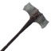 | **Flint Battleaxe** (BattleaxeFlint_TW) | ⚔️ 30+6/lvl Slash 20+2.5/lvl Chop 🛡️ Block armor 15+1/lvl Block 16 · Deflection 70+5/lvl Knockback 35 Backstab ×3 Skill: Axes Tool tier 1 Stamina 12 · Range 2.5m · Speed 0.1× Alt: Stamina 16 · Range 2.5m · Speed 0.2× Weight 2.5 Durability 150 Movement -10% | Flint ×10, Wood ×15, Leather Scraps ×2 | Flint ×6, Wood ×8, Leather Scraps ×2 | A battleaxe made of flint used to chop your enemies or trees with. |
|  | **Bronze Battleaxe** (BattleaxeBronze_TW) | ⚔️ 50+6/lvl Slash 30+2.5/lvl Chop 🛡️ Block armor 15+1/lvl Block 16 · Deflection 70+5/lvl Knockback 50 Backstab ×3 Skill: Axes Tool tier 2 Stamina 14 · Range 2.5m · Speed 0.1× Alt: Stamina 20 · Range 2.5m · Speed 0.2× Weight 2.5 Durability 150 Movement -10% | RoundLog ×16, Bronze ×12, Greydwarf Brute Trophy ×1 | RoundLog ×8, Bronze ×6 | A battleaxe made of bronze used to chop your enemies or trees with. |
|  | **Iron battleaxe** (BattleaxeIron_TW) | ⚔️ 70+6/lvl Slash 40+2.5/lvl Chop 🛡️ Block armor 15+1/lvl Block 28 · Deflection 70+5/lvl Knockback 70 Backstab ×3 Skill: Axes Tool tier 3 Stamina 16 · Range 2.5m · Speed 0.1× Alt: Stamina 24 · Range 2.5m · Speed 0.2× Weight 2.5 Durability 200 Movement -10% | Elder Bark ×15, Iron ×25, Draugr Elite Trophy ×1 | Elder Bark ×8, Iron ×12 | A battleaxe made of iron used to chop your enemies or trees with. |
|  | **Crystal Battleaxe** (BattleaxeCrystal_TW) | ⚔️ 90+6/lvl Slash 50+2.5/lvl Chop 30 Spirit 🛡️ Block armor 15+1/lvl Block 40 · Deflection 70+5/lvl Knockback 70 Backstab ×3 Skill: Axes Tool tier 3 Stamina 18 · Range 2.5m · Speed 0.1× Alt: Stamina 9 · Range 2.5m · Speed 0.1× Weight 2.5 Durability 200 Movement -10% | Elder Bark ×40, Silver ×30, Crystal ×10 | Elder Bark ×5, Silver ×15, Crystal ×3 |  |
|  | **Silver Battleaxe** (BattleaxeSilver_TW) | ⚔️ 90+6/lvl Slash 50+2.5/lvl Chop 30 Spirit 🛡️ Block armor 15+1/lvl Block 40 · Deflection 70+5/lvl Knockback 70 Backstab ×3 Skill: Axes Tool tier 3 Stamina 18 · Range 2.5m · Speed 0.1× Alt: Stamina 28 · Range 2.5m · Speed 0.2× Weight 2.5 Durability 200 Movement -10% | Elder Bark ×25, Silver ×30, Wolf Fang ×8, Fenring Trophy ×1 | Elder Bark ×12, Silver ×15, Wolf Fang ×4 | A battleaxe made of silver used to chop and purify your enemies or trees with. |
|  | **Blackmetal Battleaxe** (BattleaxeBlackmetal_TW) | ⚔️ 110+6/lvl Slash 60+2.5/lvl Chop 🛡️ Block armor 15+1/lvl Block 52 · Deflection 70+5/lvl Knockback 70 Backstab ×3 Skill: Axes Tool tier 4 Stamina 20 · Range 2.5m · Speed 0.1× Alt: Stamina 32 · Range 2.5m · Speed 0.2× Weight 2.5 Durability 200 Movement -10% | Fine Wood ×30, Black Metal ×30, Linen Thread ×14, Lox Trophy ×1 | Fine Wood ×12, Black Metal ×15, Linen Thread ×7 | A battleaxe made of blackmetal used to chop your enemies or trees with. |
|  | **Emerald Crystal Battleaxe** (BattleaxeCrystalEmerald_TW) | ⚔️ 110+6/lvl Slash 60+2.5/lvl Chop 🛡️ Block armor 15+1/lvl Block 52 · Deflection 70+5/lvl Knockback 70 Backstab ×3 Skill: Axes Tool tier 4 Stamina 20 · Range 2.5m · Speed 0.1× Alt: Stamina 13 · Range 2.5m · Speed 0.1× Weight 2.5 Durability 200 Movement -10% | Fine Wood ×30, Black Metal ×30, Lox Bone ×8, Emerald ×3 | Fine Wood ×15, Black Metal ×15, Lox Bone ×4 | A emerald gem set in a deadly, blackmetal battleaxe. Used to chop and poke your enemies or a tree with. |
|  | **Amethyst Crystal Battleaxe** (BattleaxeCrystalAmethyst_TW) | ⚔️ 135+6/lvl Slash 70+2.5/lvl Chop 15 Lightning 🛡️ Block armor 15+1/lvl Block 64 · Deflection 70+5/lvl Knockback 70 Backstab ×3 Skill: Axes Tool tier 5 Stamina 22 · Range 2.5m · Speed 0.1× Alt: Stamina 17 · Range 2.5m · Speed 0.1× Weight 2.5 Durability 300 Movement -10% | Yggdrasil Wood ×25, Eitr ×15, Dark Crystal ×8, Amethyst ×3 | Yggdrasil Wood ×12, Eitr ×5, Dark Crystal ×4 | A amethyst gem set in a deadly, eitr-infused battleaxe. Used to chop and shock your enemies or a tree with. |
|  | **Dwarven Battleaxe** (BattleaxeDvergr_TW) | ⚔️ 135+6/lvl Slash 70+2.5/lvl Chop 12 Lightning 🛡️ Block armor 15+1/lvl Block 64 · Deflection 70+5/lvl Knockback 70 Backstab ×3 Skill: Axes Tool tier 5 Stamina 22 · Range 2.5m · Speed 0.1× Alt: Stamina 36 · Range 2.5m · Speed 0.2× Weight 2.5 Durability 300 Movement -10% | Soft Tissue ×25, Eitr ×15, Dark Crystal ×8, Gjall Trophy ×1 | Soft Tissue ×12, Eitr ×8, Dark Crystal ×4 | A dwarven battleaxe infused with eitr. Used to chop and shock your enemies or a tree with. |
|  | **Flametal Battleaxe** (BattleaxeFlametal_TW) | ⚔️ 174+6/lvl Slash 100+2.5/lvl Chop 🛡️ Block armor 15+1/lvl Block 52 · Deflection 70+5/lvl Knockback 70 Backstab ×3 Skill: Axes Tool tier 6 Stamina 24 · Range 2.5m · Speed 0.1× Alt: Stamina 40 · Range 2.5m · Speed 0.2× Weight 2.5 Durability 200 Movement -10% | Flametal ×30, Charred Bone ×12, Bonemaw Serpent Tooth ×10, TrophyFallenValkyrie ×1 | Flametal ×15, Charred Bone ×6, Bonemaw Serpent Tooth ×5, TrophyFallenValkyrie ×1 |  |

### 3.10 Rìu Ném (Throwing Axe)

| Icon | Tên (prefab) | Stats | Chế tạo | Nâng cấp | Hiệu ứng |
| --- | --- | --- | --- | --- | --- |
|  | **Flint Throwing Axe** (ThrowAxeFlint_TW) | ⚔️ 10 Slash 10 Chop 🛡️ Block armor 1+1/lvl Block 1 Knockback 8 Backstab ×3 Skill: Axes Stamina 8 · Range 1m · Speed 0.3× · Proj 18 m/s Alt: Stamina 20 · Range 1.5m · Speed 0.5× · Proj 21 m/s Weight 0.1 Durability 1 Movement -5% | Wood ×8, Flint ×2 |  | An alternative flint axe, can be thrown at your enemies to split a skull or two! |
|  | **Bronze Throwing Axe** (ThrowAxeBronze_TW) | ⚔️ 20 Slash 20 Chop 🛡️ Block armor 1+1/lvl Block 1 Knockback 10 Backstab ×3 Skill: Axes Tool tier 1 Stamina 10 · Range 1m · Speed 0.3× · Proj 19 m/s Alt: Stamina 24 · Range 1.5m · Speed 0.5× · Proj 23 m/s Weight 0.1 Durability 1 Movement -5% | RoundLog ×8, Bronze ×2 |  | An alternative bronze axe, can be thrown at your enemies to split a skull or two! |
|  | **Iron Throwing Axe** (ThrowAxeIron_TW) | ⚔️ 30 Slash 30 Chop 🛡️ Block armor 1+1/lvl Block 1 Knockback 12 Backstab ×3 Skill: Axes Tool tier 2 Stamina 12 · Range 1m · Speed 0.3× · Proj 20 m/s Alt: Stamina 28 · Range 1.5m · Speed 0.5× · Proj 24 m/s Weight 0.1 Durability 1 Movement -5% | Elder Bark ×8, Iron ×3 |  | An alternative iron axe, can be thrown at your enemies to split a skull or two! |
|  | **Silver Throwing Axe** (ThrowAxeSilver_TW) | ⚔️ 40 Slash 40 Chop 4 Spirit 🛡️ Block armor 1+1/lvl Block 1 Knockback 14 Backstab ×3 Skill: Axes Tool tier 3 Stamina 14 · Range 1m · Speed 0.3× · Proj 21 m/s Alt: Stamina 32 · Range 1.5m · Speed 0.5× · Proj 25 m/s Weight 0.1 Durability 1 Movement -5% | Fine Wood ×8, Silver ×3 |  | An alternative silver axe, can be thrown at your enemies to split a skull or two! |
|  | **Blackmetal Throwing Axe** (ThrowAxeBlackmetal_TW) | ⚔️ 50 Slash 50 Chop 🛡️ Block armor 1+1/lvl Block 1 Knockback 16 Backstab ×3 Skill: Axes Tool tier 4 Stamina 16 · Range 1m · Speed 0.3× · Proj 22 m/s Alt: Stamina 36 · Range 1.5m · Speed 0.5× · Proj 26 m/s Weight 0.1 Durability 1 Movement -5% | Fine Wood ×10, Linen Thread ×1, Black Metal ×3 |  | An alternative blackmetal axe, can be thrown at your enemies to split a skull or two! |
|  | **Dwarven Throwing Axe** (ThrowAxeDvergr_TW) | ⚔️ 70 Slash 60 Chop 4 Lightning 🛡️ Block armor 1+1/lvl Block 1 Knockback 18 Backstab ×3 Skill: Axes Tool tier 5 Stamina 18 · Range 1m · Speed 0.3× · Proj 23 m/s Alt: Stamina 40 · Range 1.5m · Speed 0.5× · Proj 27 m/s Weight 0.1 Durability 1 Movement -5% | Yggdrasil Wood ×10, Carapace ×4, Eitr ×2 |  | An alternative dwarven axe, can be thrown at your enemies to split a skull or two! |

### 3.11 Chùy · Mace · Cudgel

| Icon | Tên (prefab) | Stats | Chế tạo | Nâng cấp | Hiệu ứng |
| --- | --- | --- | --- | --- | --- |
|  | **Flint Mace** (MaceFlint_TW) | ⚔️ 20+6/lvl Blunt 🛡️ Block armor 20+1/lvl Block 3 · Deflection 20+5/lvl Knockback 70 Backstab ×3 Skill: Clubs Stamina 6 · Range 2.4m · Speed 0.3× Alt: Stamina 12 · Range 2.5m · Speed 0.2× Weight 2 Durability 100 Movement -5% | Wood ×6, Flint ×8 | Wood ×3, Flint ×4, Leather Scraps ×2 | A flint mace to smash your enemies with. |
|  | **Giant Club** (GreatClub_TW) | ⚔️ 20+6/lvl Blunt 🛡️ Block armor 20+1/lvl Block 8 · Deflection 40+5/lvl Knockback 50 Backstab ×3 Skill: Clubs Stamina 12 · Range 2.7m · Speed 0.1× Alt: Stamina 20 · Range 2.7m · Speed 0.1× Weight 4 Durability 150 Movement -10% | Wood ×20 | Wood ×10 | A heavy club to smash your enemies with. |
|  | **Abyssal Hammer** (MaceChitin_TW) | ⚔️ 30+6/lvl Blunt 15 Pierce 🛡️ Block armor 20+1/lvl Block 18 · Deflection 20+5/lvl Knockback 70 Backstab ×3 Skill: Clubs Stamina 9 · Range 2.4m · Speed 0.3× Alt: Stamina 18 · Range 2.5m · Speed 0.2× Weight 2 Durability 200 Movement -5% | Elder Bark ×10, Chitin ×20, Bronze ×8 | Elder Bark ×5, Chitin ×10, Bronze ×4 | A brutal hammer made of chitin to smash your enemies with. |
|  | **Bronze Spiked Cudgel** (CudgelBronze_TW) | ⚔️ 20+4/lvl Blunt 15+2/lvl Pierce 🛡️ Block armor 20+1/lvl Block 12 · Deflection 20+5/lvl Knockback 80 Backstab ×3 Skill: Clubs Stamina 8 · Range 2.4m · Speed 0.3× Alt: Stamina 16 · Range 2.5m · Speed 0.2× Weight 2 Durability 200 Movement -5% | RoundLog ×6, Bronze ×8, Troll Hide ×2 | RoundLog ×3, Bronze ×4, Troll Hide ×1 | A savage cudgel with bronze spikes attached to smash and pierce your enemies with. |
|  | **Iron Spiked Cudgel** (CudgelIron_TW) | ⚔️ 30+4/lvl Blunt 25+2/lvl Pierce 🛡️ Block armor 20+1/lvl Block 21 · Deflection 20+5/lvl Knockback 90 Backstab ×3 Skill: Clubs Stamina 10 · Range 2.4m · Speed 0.3× Alt: Stamina 20 · Range 2.5m · Speed 0.2× Weight 2 Durability 200 Movement -5% | Elder Bark ×8, Iron ×20, Rotten Pelt ×4 | Elder Bark ×4, Iron ×10, Rotten Pelt ×2 | A savage cudgel with iron spikes attached to smash and pierce your enemies with. |
|  | **Dwarven Mallet** (MaceDvergr_TW) | ⚔️ 105+6/lvl Blunt 12 Lightning 🛡️ Block armor 20+1/lvl Block 47 · Deflection 30+5/lvl Knockback 90 Backstab ×3 Skill: Clubs Stamina 16 · Range 2.4m · Speed 0.3× Alt: Stamina 32 · Range 2.5m · Speed 0.2× Weight 2 Durability 300 Movement -5% | Yggdrasil Wood ×25, Carapace ×15, Eitr ×12, Dvergr Trophy ×2 | Yggdrasil Wood ×12, Carapace ×8, Eitr ×4 | A dwarven mallet infused with eitr. Used to smash and shock your enemies with. |

### 3.12 Sledge · Battlehammer

| Icon | Tên (prefab) | Stats | Chế tạo | Nâng cấp | Hiệu ứng |
| --- | --- | --- | --- | --- | --- |
|  | **SledgeStagbreaker_TW** (SledgeStagbreaker_TW) ⭐ Rớt 7% từ Eikthyr | ⚔️ 20+6/lvl Blunt 5 Lightning 🛡️ Block armor 20+1/lvl Block 4 · Deflection 50+10/lvl Knockback 40 Backstab ×2 Skill: Clubs Stamina 12 · Range 2.5m · Speed 0.3× Alt: Stamina 12 · Range 2m · Speed 0.3× Weight 4 Durability 100 Movement -15% |  |  |  |
|  | **Bronze Sledgehammer** (SledgeBronze_TW) | ⚔️ 45+6/lvl Blunt 🛡️ Block armor 20+1/lvl Block 16 · Deflection 50+10/lvl Knockback 40 Backstab ×2 Skill: Clubs Stamina 14 · Range 2.5m · Speed 0.3× Alt: Stamina 16 · Range 2m · Speed 0.3× Weight 4 Durability 100 Movement -15% | RoundLog ×10, Bronze ×12, Greydwarf Brute Trophy ×1 | RoundLog ×5, Bronze ×6 | A glimmering sledgehammmer made of bronze used to crush your enemies. |
|  | **Cranium Basher** (BattlehammerElder_TW) ⭐ Rớt 4% từ Elder | ⚔️ 52+6/lvl Blunt 10+1/lvl Spirit 🛡️ Block armor 20+1/lvl Block 28 · Deflection 70+5/lvl Knockback 50 Backstab ×3 Skill: Clubs Stamina 14 · Range 2.5m · Speed 0.3× Alt: Stamina 22 · Range 2.5m · Speed 0.3× Weight 4 Durability 200 Movement -10% | Elder Bark ×30, Stone ×40, Greydwarf Eye ×20, Elder Trophy ×1 | Elder Bark ×15, Stone ×20, Greydwarf Eye ×10, Elder Trophy ×1 | A magical battlehammer forged from the heart of the forest. Used to smash and cleanse your enemies with. |
|  | **Trollbone Battlehammer** (BattlehammerTrollbone_TW) | ⚔️ 48+6/lvl Blunt 🛡️ Block armor 20+1/lvl Block 16 · Deflection 70+5/lvl Knockback 50 Backstab ×3 Skill: Clubs Stamina 14 · Range 2.5m · Speed 0.3× Alt: Stamina 22 · Range 2.5m · Speed 0.3× Weight 4 Durability 150 Movement -10% | Troll Bone ×6, Bronze ×10, Frost Troll Trophy ×1 | Troll Bone ×3, Bronze ×5 | A heavy trollbone battlehammer to bash your enemies with. |
|  | **Iron Battlehammer** (BattlehammerIron_TW) | ⚔️ 68+6/lvl Blunt 🛡️ Block armor 20+1/lvl Block 28 · Deflection 70+5/lvl Knockback 50 Backstab ×3 Skill: Clubs Stamina 16 · Range 2.5m · Speed 0.3× Alt: Stamina 26 · Range 2.5m · Speed 0.3× Weight 4 Durability 200 Movement -10% | Elder Bark ×15, Iron ×30, Draugr Elite Trophy ×1 | Elder Bark ×8, Iron ×15 | A solid iron battlehammer used to bash your enemies with. |
|  | **Iron Sledge** (SledgeIron_TW) | ⚔️ 60+6/lvl Blunt 🛡️ Block armor 20+1/lvl Block 28 · Deflection 50+10/lvl Knockback 50 Backstab ×2 Skill: Clubs Stamina 16 · Range 2.5m · Speed 0.3× Alt: Stamina 20 · Range 2m · Speed 0.3× Weight 4 Durability 100 Movement -15% | Elder Bark ×10, Iron ×30, Ymir Remains ×4, Draugr Elite Trophy ×1 | Elder Bark ×2, Iron ×15, Ymir Remains ×2 |  |
|  | **Skullcrusher** (SledgeBonemass_TW) ⭐ Rớt 5% từ Bonemass | ⚔️ 64+6/lvl Blunt 15+3/lvl Poison 🛡️ Block armor 20+1/lvl Block 40 · Deflection 50+10/lvl Knockback 50 Backstab ×2 Skill: Clubs Stamina 18 · Range 2.5m · Speed 0.3× Alt: Stamina 22 · Range 2m · Speed 0.3× Weight 4 Durability 200 Movement -15% | Iron ×40, Guck ×30, Ooze ×20, Bonemass Trophy ×1 | Iron ×20, Guck ×15, Ooze ×10, Bonemass Trophy ×1 | A sickening sledgehammer dripping with disease. Unleashes a horrifying pestilience on your enemies. |
|  | **Silver Battlehammer** (BattlehammerSilver_TW) | ⚔️ 88+6/lvl Blunt 30 Spirit 🛡️ Block armor 20+1/lvl Block 40 · Deflection 70+5/lvl Knockback 50 Backstab ×3 Skill: Clubs Stamina 18 · Range 2.5m · Speed 0.3× Alt: Stamina 30 · Range 2.5m · Speed 0.3× Weight 4 Durability 200 Movement -10% | Elder Bark ×25, Silver ×30, Crystal ×10, Stone Golem Trophy ×1 | Elder Bark ×12, Silver ×15, Crystal ×5 | A silver hammer used to bash and purify your enemies with. |
|  | **Silver Sledgehammer** (SledgeSilver_TW) | ⚔️ 75+6/lvl Blunt 30 Spirit 🛡️ Block armor 20+1/lvl Block 40 · Deflection 50+10/lvl Knockback 50 Backstab ×2 Skill: Clubs Stamina 18 · Range 2.5m · Speed 0.3× Alt: Stamina 24 · Range 2m · Speed 0.3× Weight 4 Durability 200 Movement -15% | Elder Bark ×20, Silver ×25, Wolf Fang ×10, Cultist Trophy ×1 | Elder Bark ×10, Silver ×12, Wolf Fang ×5 | A purified sledgehammer made of silver used to crush your enemies. |
|  | **Blackmetal Battlehammer** (BattlehammerBlackmetal_TW) | ⚔️ 108+6/lvl Blunt 🛡️ Block armor 20+1/lvl Block 52 · Deflection 70+5/lvl Knockback 50 Backstab ×3 Skill: Clubs Stamina 20 · Range 2.5m · Speed 0.3× Alt: Stamina 34 · Range 2.5m · Speed 0.3× Weight 4 Durability 200 Movement -10% | Fine Wood ×20, Black Metal ×30, Lox Bone ×8, Fuling Brute Trophy ×1 | Fine Wood ×10, Black Metal ×15, Lox Bone ×4 | A brutal blackmetal battlehammer used to bash your enemies with. |
|  | **Blackmetal Sledgehammer** (SledgeBlackmetal_TW) | ⚔️ 90+6/lvl Blunt 10 Pierce 🛡️ Block armor 20+1/lvl Block 52 · Deflection 50+10/lvl Knockback 50 Backstab ×2 Skill: Clubs Stamina 20 · Range 2.5m · Speed 0.3× Alt: Stamina 28 · Range 2m · Speed 0.3× Weight 4 Durability 175 Movement -15% | Fine Wood ×25, Black Metal ×30, Linen Thread ×14, Fuling Brute Trophy ×1 | Fine Wood ×12, Black Metal ×15, Linen Thread ×7 | A brutal sledgehammer made of blackmetal used to crush your enemies. |
|  | **Demolisher** (SledgeDemolisher_TW) | ⚔️ 150+6/lvl Blunt 🛡️ Block armor 20+1/lvl Block 52 · Deflection 50+10/lvl Knockback 50 Backstab ×2 Skill: Clubs Stamina 22 · Range 2.5m · Speed 0.3× Alt: Stamina 32 · Range 2m · Speed 0.3× Weight 4 Durability 200 Movement -15% | Yggdrasil Wood ×10, Iron ×20, Eitr ×10 | Yggdrasil Wood ×2, Iron ×15, Eitr ×2 |  |
|  | **Dwarven Battlehammer** (BattlehammerDvergr_TW) | ⚔️ 133+7/lvl Blunt 12 Lightning 🛡️ Block armor 20+1/lvl Block 64 · Deflection 70+5/lvl Knockback 50 Backstab ×3 Skill: Clubs Stamina 22 · Range 2.5m · Speed 0.3× Alt: Stamina 38 · Range 2.5m · Speed 0.3× Weight 4 Durability 400 Movement -10% | Carapace ×25, Eitr ×15, Dark Crystal ×8, Seeker Brute Trophy ×1 | Carapace ×12, Eitr ×5, Dark Crystal ×4 | A dwarven battlehammer infused with eitr. Used to bash and shock your enemies with. |
|  | **Flametal Sledgehammer** (SledgeFlametal_TW) | ⚔️ 170+6/lvl Blunt 🛡️ Block armor 20+1/lvl Block 52 · Deflection 50+10/lvl Knockback 50 Backstab ×2 Skill: Clubs Stamina 24 · Range 2.5m · Speed 0.3× Alt: Stamina 36 · Range 2m · Speed 0.3× Weight 4 Durability 200 Movement -15% | Flametal ×30, Bonemaw Serpent Tooth ×12, Ask Hide ×10, TrophyMorgen ×1 | Flametal ×15, Bonemaw Serpent Tooth ×6, Ask Hide ×5, TrophyMorgen ×1 |  |

### 3.13 Atgeir (Kích)

| Icon | Tên (prefab) | Stats | Chế tạo | Nâng cấp | Hiệu ứng |
| --- | --- | --- | --- | --- | --- |
|  | **Flint Atgeir** (AtgeirFlint_TW) | ⚔️ 25+6/lvl Pierce 🛡️ Block armor 15+1/lvl Block 4 · Deflection 40+5/lvl Knockback 30 Backstab ×3 Skill: Polearms Stamina 10 · Range 3.2m · Speed 0.2× Alt: Stamina 20 · Range 3m · Speed 0.2× Weight 2.5 Durability 200 Movement -5% | Flint ×8, Wood ×10, Leather Scraps ×4 | Flint ×4, Wood ×5 | A primitive atgeir made of flint used to pierce your enemies with. |
|  | **Silver Atgeir** (AtgeirSilver_TW) | ⚔️ 85+6/lvl Pierce 30 Spirit 🛡️ Block armor 15+1/lvl Block 40 · Deflection 40+5/lvl Knockback 30 Backstab ×3 Skill: Polearms Stamina 16 · Range 3.2m · Speed 0.2× Alt: Stamina 32 · Range 3m · Speed 0.2× Weight 2.5 Durability 200 Movement -5% | Elder Bark ×25, Silver ×25, Wolf Claw ×8, Cultist Trophy ×1 | Elder Bark ×12, Silver ×12, Wolf Claw ×4 | A purified atgeir made of silver used to pierce your enemies with. |

### 3.14 War Pike (Thương Chiến)

| Icon | Tên (prefab) | Stats | Chế tạo | Nâng cấp | Hiệu ứng |
| --- | --- | --- | --- | --- | --- |
|  | **Abyssal War Pike** (WarpikeChitin_TW) | ⚔️ 48+6/lvl Pierce 🛡️ Block armor 15+1/lvl Block 17 · Deflection 20+5/lvl Knockback 20 Backstab ×3 Skill: Spears Stamina 11 · Range 2.7m · Speed 0.2× Alt: Stamina 26 · Range 1m Weight 1.5 Durability 150 Movement -5% | Elder Bark ×14, Chitin ×20, Bronze ×8 | Elder Bark ×7, Chitin ×10, Bronze ×4 | A thrustworthy pike made of chitin. Used to pierce your enemies or jumping into battle with. |
|  | **Bone War Pike** (WarpikeBone_TW) | ⚔️ 38+6/lvl Pierce 🛡️ Block armor 15+1/lvl Block 12 · Deflection 20+5/lvl Knockback 20 Backstab ×3 Skill: Spears Stamina 8 · Range 2.7m · Speed 0.2× Alt: Stamina 20 · Range 1m Weight 1.5 Durability 150 Movement -5% | Bone Fragments ×15, Copper ×10, Skeleton Trophy ×1 | Bone Fragments ×8, Copper ×5 | A thrustworthy pike made of bone. Used to pierce your enemies or jumping into battle with. |
|  | **Heartrender** (WarpikeElder_TW) ⭐ Rớt 4% từ Elder | ⚔️ 52+6/lvl Pierce 10+1/lvl Spirit 🛡️ Block armor 15+1/lvl Block 20 · Deflection 20+5/lvl Knockback 20 Backstab ×3 Skill: Spears Stamina 11 · Range 2.7m · Speed 0.2× Alt: Stamina 26 · Range 1m Weight 1.5 Durability 200 Movement -5% | Elder Bark ×30, Bronze ×25, Ancient Seed ×8, Elder Trophy ×1 | Elder Bark ×15, Bronze ×12, Ancient Seed ×4, Elder Trophy ×1 | A magical pike forged from the heart of the forest. Used to pierce and cleanse your enemies or jumping into battle with. |
|  | **Obsidian War Pike** (WarpikeObsidian_TW) | ⚔️ 78+6/lvl Pierce 🛡️ Block armor 15+1/lvl Block 30 · Deflection 20+5/lvl Knockback 20 Backstab ×3 Skill: Spears Stamina 12 · Range 2.7m · Speed 0.2× Alt: Stamina 28 · Range 1m Weight 1.5 Durability 200 Movement -5% | Elder Bark ×25, Obsidian ×20, Silver ×12, Stone Golem Trophy ×1 | Elder Bark ×12, Obsidian ×10, Silver ×6 | A thrustworthy pike made of obsidian. Used to pierce your enemies or jumping into battle with. |
|  | **Blackmetal War Pike** (WarpikeBlackmetal_TW) | ⚔️ 98+6/lvl Pierce 🛡️ Block armor 15+1/lvl Block 39 · Deflection 20+5/lvl Knockback 20 Backstab ×3 Skill: Spears Stamina 14 · Range 2.7m · Speed 0.2× Alt: Stamina 32 · Range 1m Weight 1.5 Durability 200 Movement -5% | Fine Wood ×25, Black Metal ×25, Lox Bone ×8, Fuling Brute Trophy ×1 | Fine Wood ×15, Black Metal ×12, Lox Bone ×4 | A thrustworthy pike made of blackmetal. Used to pierce your enemies or jumping into battle with. |
|  | **Dwarven War Pike** (WarpikeDvergr_TW) | ⚔️ 103+6/lvl Pierce 15 Lightning 🛡️ Block armor 15+1/lvl Block 48 · Deflection 20+5/lvl Knockback 20 Backstab ×3 Skill: Spears Stamina 14 · Range 2.7m · Speed 0.2× Alt: Stamina 36 · Range 1m Weight 1.5 Durability 200 Movement -5% | Yggdrasil Wood ×30, Eitr ×12, Venomous Fang ×10, Tick Trophy ×1 | Yggdrasil Wood ×15, Eitr ×4, Venomous Fang ×5 | A thrustworthy pike infused with eitr. Used to shock and pierce your enemies or jumping into battle with. |
|  | **Flametal War Pike** (WarpikeFlametal_TW) | ⚔️ 138+6/lvl Pierce 🛡️ Block armor 15+1/lvl Block 57 · Deflection 20+5/lvl Knockback 20 Backstab ×3 Skill: Spears Stamina 18 · Range 2.7m · Speed 0.2× Alt: Stamina 40 · Range 1m Weight 1.5 Durability 200 Movement -5% | Blackwood ×20, Flametal ×18, Charred Bone ×10, Charred Melee Trophy ×1 | Blackwood ×10, Flametal ×9, Charred Bone ×5, Charred Melee Trophy ×1 | A thrustworthy warpike made with Flametal. Used to pierce your enemies or jumping into battle. |

### 3.15 Lance · Trident

| Icon | Tên (prefab) | Stats | Chế tạo | Nâng cấp | Hiệu ứng |
| --- | --- | --- | --- | --- | --- |
|  | **Blackmetal Lance** (LanceBlackmetal_TW) | ⚔️ 111+6/lvl Pierce 🛡️ Block armor 15+1/lvl Block 52 · Deflection 40+5/lvl Knockback 90 Backstab ×3 Skill: Polearms Stamina 16 · Range 3.3m · Speed 0.2× Alt: Stamina 32 · Range 3.3m · Speed 0.2× Weight 2.5 Durability 200 Movement -5% | Fine Wood ×40, Black Metal ×25, Lox Bone ×10, Lox Trophy ×1 | Fine Wood ×20, Black Metal ×12, Lox Bone ×5 | A blackmetal lance. Used to thrust and pierce your enemies with from a distance. |
|  | **Blackmetal Trident** (TridentBlackmetal_TW) | ⚔️ 106+6/lvl Pierce 🛡️ Block armor 15+1/lvl Block 52 · Deflection 40+5/lvl Knockback 30 Backstab ×3 Skill: Polearms Stamina 18 · Range 3.2m · Speed 0.4× Alt: Stamina 16 · Range 1m · Speed 0.2× · Proj 20 m/s · Accuracy 1° Weight 2.5 Durability 175 Movement -5% | Fine Wood ×25, Black Metal ×25, Chitin ×30, Lox Trophy ×1 | Fine Wood ×12, Black Metal ×12, Chitin ×15 | A deadly trident made of blackmetal used to poke or throw at your enemies with. |
|  | **Dwarven Lance** (LanceDvergr_TW) | ⚔️ 135+6/lvl Pierce 12 Lightning 🛡️ Block armor 15+1/lvl Block 64 · Deflection 40+5/lvl Knockback 90 Backstab ×3 Skill: Polearms Stamina 20 · Range 3.3m · Speed 0.2× Alt: Stamina 40 · Range 3.3m · Speed 0.2× Weight 2.5 Durability 300 Movement -5% | Yggdrasil Wood ×40, Eitr ×15, Dark Crystal ×8, Gjall Trophy ×1 | Yggdrasil Wood ×20, Eitr ×5, Dark Crystal ×4 | A dwarven lance infused with eitr. Used to thrust and shock your enemies with from a distance. |

### 3.16 Giáo (Spear)

| Icon | Tên (prefab) | Stats | Chế tạo | Nâng cấp | Hiệu ứng |
| --- | --- | --- | --- | --- | --- |
|  | **Blackmetal Spear** (SpearBlackmetal_TW) | ⚔️ 95+6/lvl Pierce 🛡️ Block armor 15+1/lvl Block 39 · Deflection 20+5/lvl Knockback 20 Backstab ×3 Skill: Spears Stamina 14 · Range 1.9m · Speed 0.2× Alt: Stamina 16 · Range 1m · Speed 0.3× · Proj 20 m/s · Accuracy 1° Weight 1.5 Durability 150 Movement -5% | Fine Wood ×30, Black Metal ×20, Needle ×12, Lox Trophy ×1 | Fine Wood ×15, Black Metal ×10, Needle ×6 | A pointy spear made of blackmetal used to poke and throw at your enemies. |

### 3.17 Tay Không (Fist · Claws · Katars)

| Icon | Tên (prefab) | Stats | Chế tạo | Nâng cấp | Hiệu ứng |
| --- | --- | --- | --- | --- | --- |
|  | **Flint Claws** (FistFlint_TW) | ⚔️ 10+4/lvl Slash 🛡️ Block armor 20+1/lvl Block 1+1/lvl · Deflection 10+5/lvl Knockback 15 Backstab ×6 Skill: Unarmed Stamina 4 · Range 2m · Speed 0.3× Alt: Stamina 26 · Range 2.1m · Speed 0.2× Weight 2 Durability 200 | Flint ×10, Wood ×6, Deer Hide ×2 | Flint ×5, Deer Hide ×1 | Sharp flint stone claws to slash and stab your enemies in the face with. |
|  | **Abyssal Katars** (FistChitin_TW) | ⚔️ 30+4/lvl Slash 🛡️ Block armor 20+1/lvl Block 4+1/lvl · Deflection 10+5/lvl Knockback 20 Backstab ×6 Skill: Unarmed Stamina 7 · Range 2m · Speed 0.3× Alt: Stamina 22 · Range 2.5m Weight 2 Durability 250 | Deer Hide ×6, Chitin ×20, Bronze ×8 | Deer Hide ×4, Chitin ×9, Bronze ×4 | Deadly chitin katars used to bleed your prey out with. |
|  | **Bronze Knuckles** (FistBronze_TW) | ⚔️ 20+4/lvl Blunt 🛡️ Block armor 20+1/lvl Block 1+1/lvl · Deflection 10+5/lvl Knockback 20 Backstab ×6 Skill: Unarmed Stamina 6 · Range 2m · Speed 0.3× Alt: Stamina 30 · Range 2.1m · Speed 0.2× Weight 2 Durability 250 | Deer Hide ×4, Bronze ×12, Greydwarf Trophy ×1 | Deer Hide ×2, Bronze ×6 | Deadly bronze fist knuckles to bash some teeth with. |
|  | **Iron knuckles** (FistIron_TW) | ⚔️ 40+4/lvl Blunt 🛡️ Block armor 20+1/lvl Block 3+1/lvl · Deflection 10+5/lvl Knockback 20 Backstab ×6 Skill: Unarmed Stamina 8 · Range 2m · Speed 0.3× Alt: Stamina 34 · Range 2.1m · Speed 0.2× Weight 2 Durability 250 | Rotten Pelt ×8, Iron ×20, Abomination Trophy ×1 | Rotten Pelt ×4, Iron ×10 | Deadly iron fist knuckles to bash some teeth with. |
|  | **Silver Claws** (FistSilver_TW) | ⚔️ 60+4/lvl Slash 20 Spirit 🛡️ Block armor 20+1/lvl Block 5+1/lvl · Deflection 10+5/lvl Knockback 20 Backstab ×6 Skill: Unarmed Stamina 10 · Range 2m · Speed 0.3× Alt: Stamina 30 · Range 2.5m Weight 2 Durability 250 | Wolf Hair Bundle ×10, Wolf Claw ×10, Silver ×25, Ulv Trophy ×1 | Wolf Hair Bundle ×6, Wolf Claw ×6, Silver ×12 | Deadly silver claws to hunt your enemies with. |
|  | **Blackmetal Claws** (FistBlackmetal_TW) | ⚔️ 80+4/lvl Slash 🛡️ Block armor 20+1/lvl Block 12+1/lvl · Deflection 10+5/lvl Knockback 20 Backstab ×6 Skill: Unarmed Stamina 12 · Range 2m · Speed 0.3× Alt: Stamina 36 · Range 2.5m Weight 2 Durability 300 | Black Metal ×25, Lox Bone ×6, Needle ×12, Deathsquito Trophy ×1 | Black Metal ×12, Lox Bone ×3, Needle ×6 | Deadly blackmetal claws to hunt your enemies with. |
|  | **Dwarven Fists** (FistDvergr_TW) | ⚔️ 105+4/lvl Blunt 10+2/lvl Lightning 🛡️ Block armor 20+1/lvl Block 19+1/lvl · Deflection 10+5/lvl Knockback 20 Backstab ×6 Skill: Unarmed Stamina 16 · Range 2m · Speed 0.3× Alt: Stamina 48 · Range 2.5m Weight 2 Durability 300 | Soft Tissue ×25, Eitr ×12, Venomous Fang ×10, Seeker Trophy ×1 | Soft Tissue ×12, Eitr ×4, Venomous Fang ×5 | Deadly dwarven fist weapons infused with eitr. Used to bash and shock your enemies with. |
|  | **Hunger** (FistQueen_TW) ⭐ Rớt 8% từ Seeker Queen | ⚔️ 108+6/lvl Slash 12+1/lvl Poison 🛡️ Block armor 20+1/lvl Block 19+1/lvl · Deflection 10+5/lvl Knockback 20 Backstab ×6 Skill: Unarmed Stamina 16 · Range 2m · Speed 0.25× Alt: Stamina 48 · Range 2.5m Weight 2 Durability 300 | Carapace ×60, Dark Crystal ×25, Venomous Fang ×20, TrophySeekerQueen ×1 | Carapace ×30, Dark Crystal ×12, Venomous Fang ×10, TrophySeekerQueen ×1 | Monstrous venom tipped claw weapons to shred your prey to pieces with. |
|  | **Flametal Claws** (FistFlametal_TW) | ⚔️ 135+4/lvl Slash 🛡️ Block armor 20+1/lvl Block 26+1/lvl · Deflection 10+5/lvl Knockback 20 Backstab ×6 Skill: Unarmed Stamina 18 · Range 2m · Speed 0.3× Alt: Stamina 48 · Range 2.5m Weight 2 Durability 300 | Flametal ×30, Bonemaw Serpent Tooth ×12, Ask Hide ×8, Asksvin Trophy ×1 | Flametal ×15, Bonemaw Serpent Tooth ×6, Ask Hide ×5, Asksvin Trophy ×1 | Deadly flametal claw weapons. Used to slash and shred your enemies. |

### 3.18 Rìu Đôi (Dual Axe — Cleavers)

| Icon | Tên (prefab) | Stats | Chế tạo | Nâng cấp | Hiệu ứng |
| --- | --- | --- | --- | --- | --- |
|  | **Hellblade Cleavers** (DualAxeDemonic_TW) ⭐ Rớt 7% từ Svält (Monstrum) | ⚔️ 47+5/lvl Slash 60+3/lvl Chop 9+1/lvl Fire 🛡️ Block armor 20+1/lvl Block 22 · Deflection 40+5/lvl Knockback 50 Backstab ×3 Skill: Axes Tool tier 3 Stamina 12 · Range 2.2m · Speed 0.3× Alt: Stamina 36 · Range 2.2m · Speed 0.3× Weight 0.3 Durability 300 | Iron ×30, Surtling Core ×15, Blood Bag ×15, Draugr Elite Trophy ×1 | Iron ×15, Surtling Core ×8, Blood Bag ×8, Draugr Elite Trophy ×1 | A demonic pair of axes from the burning realm of Surtr. |

### 3.19 Cung (Bow)

| Icon | Tên (prefab) | Stats | Chế tạo | Nâng cấp | Hiệu ứng |
| --- | --- | --- | --- | --- | --- |
|  | **Trollbone Bow** (BowTrollBone_TW) | ⚔️ 37+3/lvl Pierce 🛡️ Block armor 15+1/lvl Block 3 Knockback 20 Backstab ×3 Skill: Bows Range 1m · Speed 0.3× · Reload 2s · Draw 2.5s Alt: Stamina 20 · Range 1.5m · Speed 0.2× Weight 1.5 Durability 100 Movement -5% | Troll Bone ×5, Bone Fragments ×6, Bronze ×6 | Troll Bone ×2, Bone Fragments ×3 | A sturdy bow made out of troll bones and bronze. Used to shoot arrows with at your enemies. |
|  | **Blackmetal Bow** (BowBlackmetal_TW) | ⚔️ 62+3/lvl Pierce 🛡️ Block armor 15+1/lvl Block 3 Knockback 20 Backstab ×3 Skill: Bows Range 1m · Speed 0.3× · Reload 2s · Draw 2.5s Alt: Stamina 20 · Range 1.5m · Speed 0.2× Weight 1.5 Durability 100 Movement -5% | Fine Wood ×30, Black Metal ×25, Needle ×20, Deathsquito Trophy ×1 | Fine Wood ×15, Black Metal ×12, Needle ×10 | A deadly bow made of blackmetal. Used to shoot arrows with at your enemies. |

### 3.20 Greatbow (Cung Lớn)

| Icon | Tên (prefab) | Stats | Chế tạo | Nâng cấp | Hiệu ứng |
| --- | --- | --- | --- | --- | --- |
|  | **Skystrike** (GreatbowModer_TW) ⭐ Rớt 6% từ Moder | ⚔️ 25+4/lvl Pierce 60+6/lvl Frost 🛡️ Block armor 15+1/lvl Block 6 Knockback 70 Backstab ×4 Skill: Bows Range 1m · Speed 2× · Reload 2s · Draw 5s Alt: Stamina 20 · Range 1.5m · Speed 0.2× Weight 3 Durability 100 Movement -5% | Silver ×50, Crystal ×30, Freeze Gland ×20, Dragon Queen Trophy ×1 | Silver ×25, Crystal ×15, Freeze Gland ×10, Dragon Queen Trophy ×1 | A heavy pulled greatbow invoked with Moder's magic. On hit: 4s · Speed -50% |
|  | **Blackmetal Greatbow** (GreatbowBlackmetal_TW) | ⚔️ 87+4/lvl Pierce 🛡️ Block armor 15+1/lvl Block 6 Knockback 70 Backstab ×4 Skill: Bows Range 1m · Speed 2× · Reload 2s · Draw 5s Alt: Stamina 20 · Range 1.5m · Speed 2× Weight 3 Durability 100 Movement -5% | Fine Wood ×40, Black Metal ×30, Lox Bone ×10, Fuling Brute Trophy ×1 | Fine Wood ×20, Black Metal ×15, Lox Bone ×5 | A heavy pulled greatbow made out of blackmetal that can shoot large distances. On hit: 1s |
|  | **Dwarven Greatbow** (GreatbowDvergr_TW) | ⚔️ 100+4/lvl Pierce 12+4/lvl Lightning 🛡️ Block armor 15+1/lvl Block 6 Knockback 80 Backstab ×4 Skill: Bows Range 1m · Speed 2× · Reload 2s · Draw 5s Alt: Stamina 20 · Range 1.5m · Speed 0.2× Weight 3 Durability 100 Movement -5% | Yggdrasil Wood ×40, Eitr ×15, Venomous Fang ×10, Gjall Trophy ×1 | Yggdrasil Wood ×20, Eitr ×5, Venomous Fang ×5 | A heavy pulled greatbow infused with Eitr that can shoot arrows with additional lightning damage at large distances. On hit: 1s |

### 3.21 Nỏ (Crossbow)

| Icon | Tên (prefab) | Stats | Chế tạo | Nâng cấp | Hiệu ứng |
| --- | --- | --- | --- | --- | --- |
|  | **Buckshot** (CrossbowEikthyr_TW) ⭐ Rớt 4% từ Eikthyr | ⚔️ 38+3/lvl Pierce 3+2/lvl Lightning 🛡️ Block armor 15+1/lvl Block 3 Knockback 95 Backstab ×3 Skill: Crossbows Range 1m · Speed 0.3× · Reload 3.5s Alt: Stamina 20 · Range 1.5m · Speed 0.2× Weight 1.5 Durability 100 Movement -5% | RoundLog ×30, Hard Antler ×16, Deer Hide ×16, Eikthyr Trophy ×1 | RoundLog ×15, Hard Antler ×8, Deer Hide ×8, Eikthyr Trophy ×1 | A brutal crossbow to shoot long distance bolts and destroy your enemies with, this magic weapon collects stacks of charged energy over time that can stack up to 3 stacks maximum. Equipped: 1s |
|  | **Crude Crossbow** (CrossbowWood_TW) | ⚔️ 30+3/lvl Pierce 🛡️ Block armor 15+1/lvl Block 3 Knockback 50 Backstab ×3 Skill: Crossbows Range 1m · Speed 0.3× · Reload 4s Alt: Stamina 20 · Range 1.5m · Speed 0.2× Weight 1.5 Durability 50 Movement -5% | Wood ×12, Deer Hide ×6 | Wood ×6, Deer Hide ×3, Leather Scraps ×2 | A basic and slow wooden crossbow to shoot bolts with at your enemies. |
|  | **Bronze Crossbow** (CrossbowBronze_TW) | ⚔️ 50+3/lvl Pierce 🛡️ Block armor 15+1/lvl Block 3 Knockback 80 Backstab ×3 Skill: Crossbows Range 1m · Speed 0.3× · Reload 3.5s Alt: Stamina 20 · Range 1.5m · Speed 0.2× Weight 1.5 Durability 75 Movement -5% | RoundLog ×12, Bronze ×12, TrophyGreydwarfShaman ×1 | RoundLog ×6, Bronze ×6 | A slow but deadly bronze crossbow to shoot long distance bolts with at your enemies. |
|  | **Chitin Crossbow** (CrossbowChitin_TW) | ⚔️ 65+3/lvl Pierce 🛡️ Block armor 15+1/lvl Block 3 Knockback 95 Backstab ×3 Skill: Crossbows Range 1m · Speed 0.3× · Reload 3.5s Alt: Stamina 20 · Range 1.5m · Speed 0.2× Weight 1.5 Durability 75 Movement -5% | Elder Bark ×14, Bronze ×14, Chitin ×20, Frost Troll Trophy ×1 | Elder Bark ×7, Bronze ×7, Chitin ×10 | A slow but deadly chitin crossbow to shoot long distance bolts with at your enemies. |
|  | **Iron Crossbow** (CrossbowIron_TW) | ⚔️ 80+3/lvl Pierce 🛡️ Block armor 15+1/lvl Block 3 Knockback 110 Backstab ×3 Skill: Crossbows Range 1m · Speed 0.3× · Reload 3.5s Alt: Stamina 20 · Range 1.5m · Speed 0.2× Weight 1.5 Durability 75 Movement -5% | Elder Bark ×20, Iron ×20, Withered Bone ×4, Wraith Trophy ×1 | Elder Bark ×10, Iron ×10, Withered Bone ×2 | A slow but deadly iron crossbow to shoot long distance bolts with at your enemies. |
|  | **Blackmetal Crossbow** (CrossbowBlackmetal_TW) | ⚔️ 140+3/lvl Pierce 🛡️ Block armor 15+1/lvl Block 3 Knockback 175 Backstab ×3 Skill: Crossbows Range 1m · Speed 0.3× · Reload 3.5s Alt: Stamina 20 · Range 1.5m · Speed 0.2× Weight 1.5 Durability 100 Movement -5% | Fine Wood ×30, Black Metal ×30, Lox Bone ×8, Fuling Brute Trophy ×1 | Fine Wood ×15, Black Metal ×15, Lox Bone ×4 | A slow but deadly blackmetal crossbow to shoot long distance bolts with at your enemies. |
|  | **Silver Crossbow** (CrossbowSilver_TW) | ⚔️ 110+3/lvl Pierce 5 Spirit 🛡️ Block armor 15+1/lvl Block 3 Knockback 140 Backstab ×3 Skill: Crossbows Range 1m · Speed 0.3× · Reload 3.5s Alt: Stamina 20 · Range 1.5m · Speed 0.2× Weight 1.5 Durability 100 Movement -5% | Elder Bark ×25, Silver ×25, Red Jute ×8, Cultist Trophy ×1 | Elder Bark ×12, Silver ×12, Red Jute ×4 | A slow but deadly silver crossbow to shoot purifiying long distance bolts with at your enemies. |

### 3.22 Cúp (Pickaxe)

| Icon | Tên (prefab) | Stats | Chế tạo | Nâng cấp | Hiệu ứng |
| --- | --- | --- | --- | --- | --- |
|  | **Silver Pickaxe** (PickaxeSilver_TW) | ⚔️ 41+5/lvl Pierce 41+5/lvl Pickaxe 🛡️ Block armor 20+1/lvl Block 2 · Deflection 20+5/lvl Knockback 50 Backstab ×3 Skill: Pickaxes Tool tier 2 Stamina 10 · Range 1.8m · Speed 0.1× Alt: Stamina 20 · Range 1.5m · Speed 0.2× Weight 2 Durability 180 Movement -5% | Silver ×10, Elder Bark ×10 | Silver ×5, Elder Bark ×5 | A durable pickaxe made of silver used, to mine ores and stone. |
|  | **Flametal Enchanted Pickaxe** (PickaxeFader_TW) | ⚔️ 65+5/lvl Pierce 65+5/lvl Pickaxe 🛡️ Block armor 20+1/lvl Block 2 · Deflection 20+5/lvl Knockback 50 Backstab ×3 Skill: Pickaxes Tool tier 6 Stamina 10 · Range 1.8m · Speed 0.1× Alt: Stamina 20 · Range 1.5m · Speed 0.2× Weight 2 Durability 300 Movement -5% | Flametal ×15, Fader Drop ×2 | Flametal ×8, Fader Drop ×2 | A magical flametal pickaxe forged with the Fader relic. |

## 🛡️ 4. Khiên (sắp theo thời kỳ)

| Icon | Tên (prefab) | Stats | Chế tạo | Nâng cấp | Hiệu ứng |
| --- | --- | --- | --- | --- | --- |
|  | **Barnacle Shield** (ShieldChitin_TW) | ⚔️ 5 Blunt 🛡️ Block armor 200+1/lvl Block 33+6/lvl · Deflection 30+5/lvl Knockback 40 Backstab ×4 Skill: Blocking Stamina 20 · Range 2.4m · Speed 0.2× Alt: Stamina 20 · Range 1.5m · Speed 0.2× Weight 5 Durability 200 Movement -5% | Chitin ×15, Elder Bark ×12, Bronze ×10 | Chitin ×8, Elder Bark ×6, Bronze ×5 | A solid shield made of sharp, old barnacles, watch your fingers! |
|  | **Bronze Banded Shield** (ShieldBronzeBanded_TW) | ⚔️ 5 Blunt 🛡️ Block armor 200+1/lvl Block 24+6/lvl · Deflection 30+5/lvl Knockback 40 Backstab ×4 Skill: Blocking Stamina 20 · Range 2.4m · Speed 0.2× Alt: Stamina 20 · Range 1.5m · Speed 0.2× Weight 5 Durability 200 Movement -5% | RoundLog ×10, Bronze ×12, Deer Hide ×2 | RoundLog ×5, Bronze ×6 | Banded with hoops of bronze, a true adventurers companion.. |
|  | **Bronze Tower Shield** (ShieldBronzeTower_TW) | 🛡️ Block armor 100+1/lvl Block 34+6/lvl · Deflection 100+5/lvl Knockback 40 Backstab ×4 Skill: Blocking Stamina 20 · Range 2.4m · Speed 0.2× Alt: Stamina 20 · Range 1.5m · Speed 0.2× Weight 4 Durability 200 Movement -20% | RoundLog ×12, Bronze ×14, Deer Hide ×2 | RoundLog ×6, Bronze ×7 | A tall shield of strong bronze. |
|  | **Chitin Buckler** (ShieldChitinBuckler_TW) | 🛡️ Block armor 150+1/lvl Block 22+6/lvl · Deflection 30 Knockback 40 Backstab ×4 Skill: Blocking Stamina 20 · Range 2.4m · Speed 0.2× Alt: Stamina 20 · Range 1.5m · Speed 0.2× Weight 4 Durability 200 Movement -5% | Chitin ×25, Elder Bark ×10, Bronze ×10 | Chitin ×12, Elder Bark ×5, Bronze ×5 | A chitin buckler shield that can be used to turn your foes blows against them.. |
|  | **Chitin Tower Shield** (ShieldChitinTower_TW) | 🛡️ Block armor 100+1/lvl Block 43+6/lvl · Deflection 100+5/lvl Knockback 40 Backstab ×4 Skill: Blocking Stamina 20 · Range 2.4m · Speed 0.2× Alt: Stamina 20 · Range 1.5m · Speed 0.2× Weight 4 Durability 200 Movement -20% | Chitin ×18, Elder Bark ×14, Bronze ×10 | Chitin ×9, Elder Bark ×7, Bronze ×5 | A tall, sturdy shield made of chitin and bronze. |
|  | **Silver Buckler** (ShieldSilverBuckler_TW) | 🛡️ Block armor 150+1/lvl Block 40+6/lvl · Deflection 30 Knockback 40 Backstab ×4 Skill: Blocking Stamina 20 · Range 2.4m · Speed 0.2× Alt: Stamina 20 · Range 1.5m · Speed 0.2× Weight 4 Durability 200 Movement -5% | Silver ×10, Fine Wood ×6, Crystal ×6, Stone Golem Trophy ×1 | Silver ×5, Fine Wood ×3, Crystal ×3 | A silver buckler shield that can be used to turn your foes blows against them.. |
|  | **Blackmetal Buckler** (ShieldBlackmetalBuckler_TW) | 🛡️ Block armor 175+1/lvl Block 59+6/lvl · Deflection 40 Knockback 40 Backstab ×4 Skill: Blocking Stamina 20 · Range 2.4m · Speed 0.2× Alt: Stamina 20 · Range 1.5m · Speed 0.2× Weight 4 Durability 200 Movement -5% | Black Metal ×20, Fine Wood ×12, Linen Thread ×6, Lox Trophy ×1 | Black Metal ×10, Fine Wood ×6, Linen Thread ×3 | A blackmetal buckler shield that can be used to turn your foes blows against them.. |
|  | **Carapace Scale Dome** (ShieldCarapaceTower_TW) | ⚔️ 10 Blunt 🛡️ Block armor 200+1/lvl Block 124+6/lvl · Deflection 115+5/lvl Knockback 50 Backstab ×4 Skill: Blocking Stamina 20 · Range 2.4m · Speed 0.2× Alt: Stamina 20 · Range 1.5m · Speed 0.2× Weight 5 Durability 300 Movement -20% | Carapace ×30, Black Marble ×20, Eitr ×14, Dark Crystal ×6 | Carapace ×15, Black Marble ×10, Eitr ×7, Dark Crystal ×3 | A large tower shield made out of a Seeker carapace to defend yourself with. |

## 🏹 5. Đạn (Arrows & Bolts)

Craft tại **Fletcher table**. Bolt dùng cho Nỏ, Arrow cho Cung.

### 5.1 Arrows

| Icon | Tên (prefab) | Stats | Chế tạo | Nâng cấp | Hiệu ứng |
| --- | --- | --- | --- | --- | --- |
|  | **Bone Arrows** (ArrowBone_TW) | ⚔️ 38 Blunt 5 Pierce 🛡️ Block armor 10+1/lvl Block 10 Knockback 10 Backstab ×3 Skill: Bows Stamina 20 · Range 2.4m · Speed 0.3× Alt: Stamina 20 · Range 1.5m · Speed 0.2× Weight 0.1 Durability 100 | Wood ×8, Bone Fragments ×4, Feathers ×2 |  | Bone arrows that deal blunt damage on impact. |
|  | **Pickaxe Arrows** (ArrowPickaxe_TW) | ⚔️ 10 Pierce 60 Pickaxe 🛡️ Block armor 10+1/lvl Block 10 Knockback 15 Backstab ×3 Skill: Bows Stamina 20 · Range 2.4m · Speed 0.3× Alt: Stamina 20 · Range 1.5m · Speed 0.2× Weight 0.1 Durability 100 | Elder Bark ×8, Resin ×1, Surtling Core ×1, Feathers ×2 |  | Special arrows that deal pickaxe damage on impact. |
|  | **Explosive Poison Arrows** (ArrowExplosivePoison_TW) | ⚔️ 45 Pierce 🛡️ Block armor 10+1/lvl Block 10 Knockback 20 Backstab ×3 Skill: Bows Stamina 20 · Range 2.4m · Speed 0.3× Alt: Stamina 20 · Range 1.5m · Speed 0.2× Weight 0.1 Durability 100 | Wood ×8, Black Metal ×2, Ooze ×2 |  | Poison arrows that explode on impact. |
|  | **Explosive Lightning Arrows** (ArrowExplosiveLightning_TW) | ⚔️ 45 Pierce 🛡️ Block armor 10+1/lvl Block 10 Knockback 20 Backstab ×3 Skill: Bows Stamina 20 · Range 2.4m · Speed 0.3× Alt: Stamina 20 · Range 1.5m · Speed 0.2× Weight 0.1 Durability 100 | Yggdrasil Wood ×8, Carapace ×4, Eitr ×1 |  | Lightning arrows that explode on impact. |

### 5.2 Bolts

| Icon | Tên (prefab) | Stats | Chế tạo | Nâng cấp | Hiệu ứng |
| --- | --- | --- | --- | --- | --- |
|  | **Antler Bolt** (BoltAntler_TW) | ⚔️ 27 Pierce 🛡️ Block armor 10+1/lvl Block 10 Backstab ×3 Skill: Bows Stamina 20 · Range 2.4m · Speed 0.3× Alt: Stamina 20 · Range 1.5m · Speed 0.2× Weight 0.1 Durability 100 | Wood ×8, Hard Antler ×1 |  | A wooden bolt with a hard antler head. |
|  | **Fire Bolt** (BoltFire_TW) | ⚔️ 16 Pierce 34 Fire 🛡️ Block armor 10+1/lvl Block 10 Backstab ×3 Skill: Bows Stamina 20 · Range 2.4m · Speed 0.3× Alt: Stamina 20 · Range 1.5m · Speed 0.2× Weight 0.1 Durability 100 | Wood ×8, Resin ×6, Feathers ×2 |  | This bolt pierces and sets your enemies ablaze. |
|  | **Wooden Bolt** (BoltWood_TW) | ⚔️ 22 Pierce 🛡️ Block armor 10+1/lvl Block 10 Backstab ×3 Skill: Bows Stamina 20 · Range 2.4m · Speed 0.3× Alt: Stamina 20 · Range 1.5m · Speed 0.2× Weight 0.1 Durability 100 | Wood ×8 |  | Watch out for splinters! |
|  | **Bronze Bolt** (BoltBronze_TW) | ⚔️ 32 Pierce 🛡️ Block armor 10+1/lvl Block 10 Backstab ×3 Skill: Bows Stamina 20 · Range 2.4m · Speed 0.3× Alt: Stamina 20 · Range 1.5m · Speed 0.2× Weight 0.1 Durability 100 | Wood ×8, Bronze ×1, Feathers ×2 |  | A sturdy bronze missile. |
|  | **Pickaxe Bolt** (BoltPickaxe_TW) | ⚔️ 10 Pierce 70 Pickaxe 🛡️ Block armor 10+1/lvl Block 10 Backstab ×3 Skill: Bows Stamina 20 · Range 2.4m · Speed 0.3× Alt: Stamina 20 · Range 1.5m · Speed 0.2× Weight 0.1 Durability 100 | Elder Bark ×8, Resin ×1, Surtling Core ×1, Feathers ×2 |  | Special bolt missile that deals pickaxe damage on impact. |
|  | **Blunt Bolt** (BoltBlunt_TW) | ⚔️ 55 Blunt 10 Pierce 🛡️ Block armor 10+1/lvl Block 10 Backstab ×3 Skill: Bows Stamina 20 · Range 2.4m · Speed 0.3× Alt: Stamina 20 · Range 1.5m · Speed 0.2× Weight 0.1 Durability 100 | Wood ×8, Obsidian ×1, Iron ×1, Feathers ×2 |  | A blunt obsidian missile to knock some sense into your enemies with. |
|  | **Frost Bolt** (BoltFrost_TW) | ⚔️ 31 Pierce 52 Frost 🛡️ Block armor 10+1/lvl Block 10 Backstab ×3 Skill: Bows Stamina 20 · Range 2.4m · Speed 0.3× Alt: Stamina 20 · Range 1.5m · Speed 0.2× Weight 0.1 Durability 100 | Wood ×8, Obsidian ×3, Feathers ×2, Freeze Gland ×1 |  | A bolt of piercing ice. |
|  | **Poison Bolt** (BoltPoison_TW) | ⚔️ 31 Pierce 52 Poison 🛡️ Block armor 10+1/lvl Block 10 Backstab ×3 Skill: Bows Stamina 20 · Range 2.4m · Speed 0.3× Alt: Stamina 20 · Range 1.5m · Speed 0.2× Weight 0.1 Durability 100 | Wood ×8, Obsidian ×4, Feathers ×2, Guck ×1 |  | A bolt dipped with venom. |
|  | **Silver Bolt** (BoltSilver_TW) | ⚔️ 52 Pierce 20 Spirit 🛡️ Block armor 10+1/lvl Block 10 Backstab ×3 Skill: Bows Stamina 20 · Range 2.4m · Speed 0.3× Alt: Stamina 20 · Range 1.5m · Speed 0.2× Weight 0.1 Durability 100 | Wood ×8, Silver ×1, Feathers ×2 |  | A sturdy silver missile to calm restless spirits. |
|  | **Explosive Poison Bolt** (BoltExplosivePoison_TW) | ⚔️ 55 Pierce 🛡️ Block armor 10+1/lvl Block 10 Backstab ×3 Skill: Bows Stamina 20 · Range 2.4m · Speed 0.3× Alt: Stamina 20 · Range 1.5m · Speed 0.2× Weight 0.1 Durability 100 | Wood ×8, Black Metal ×2, Tar ×2 |  | Poison bolt that explodes on impact. |
|  | **Explosive Lightning Bolt** (BoltExplosiveLightning_TW) | ⚔️ 55 Pierce 🛡️ Block armor 10+1/lvl Block 10 Backstab ×3 Skill: Bows Stamina 20 · Range 2.4m · Speed 0.3× Alt: Stamina 20 · Range 1.5m · Speed 0.2× Weight 0.1 Durability 100 | Yggdrasil Wood ×8, Carapace ×2, Eitr ×1 |  | Lightning bolt that explodes on impact. |

## 🍺 6. Mead & Bom

Mead **thành phẩm** được chế trực tiếp từ **Mead base** tương ứng (cơ chế conversion của mod, không cần Fermenter). Base craft tại [Mead Cauldron].

| Icon | Tên (prefab) | Stats | Chế tạo | Nâng cấp | Hiệu ứng |
| --- | --- | --- | --- | --- | --- |
|  | **Lightning resistance mead** (MeadLightningResist_TW) | Weight 1 |  |  | Protects you from lightning. On use: 600s · +100% Lightning dmg |
|  | **Mead base: Medium lingering stamina** (MeadBaseLingeringStaminaMedium_TW) | Weight 1 | MeadTasty ×3, Cloudberry ×5, Honey ×10 |  | On use: 300s · Stamina regen +18% |
|  | **Mead base: Minor lingering stamina** (MeadBaseLingeringStaminaMinor_TW) | Weight 1 | MeadTasty ×3, MushroomYellow ×5, Honey ×10 |  | On use: 300s · Stamina regen +10% |
|  | **Medium lingering stamina mead** (MeadStaminaLingeringMedium_TW) | Weight 1 |  |  | On use: 300s · Stamina regen +18% |
|  | **Minor lingering stamina mead** (MeadStaminaLingeringMinor_TW) | Weight 1 |  |  | On use: 300s · Stamina regen +10% |
|  | **Mead base: Lightning resistance** (MeadBaseLightningResist_TW) | Weight 1 | Honey ×12, Barley ×5, Flax ×7 |  | On use: 600s · +100% Lightning dmg |

| Icon | Tên (prefab) | Stats | Chế tạo | Nâng cấp | Hiệu ứng |
| --- | --- | --- | --- | --- | --- |
|  | **Spirit Bomb** (BombSpirit_TW) | ⚔️ 5 Blunt 🛡️ Block armor 15+1/lvl Block 2 Knockback 40 Backstab ×3 Stamina 8 · Range 1.5m · Speed 0.3× · Proj 20 m/s · Accuracy 5° Alt: Stamina 20 · Range 1.5m · Speed 0.2× Weight 0.3 Durability 100 | Silver Ore ×2, Wolf Hair Bundle ×2, Cloudberry ×2 |  | Unleashes a spiritual cleansing on impact! |

## 🧣 7. Cape

| Icon | Tên (prefab) | Stats | Chế tạo | Nâng cấp | Hiệu ứng |
| --- | --- | --- | --- | --- | --- |
|  | **Rotten Leather Cape** (CapeRotten_TW) | 🛡️ Armor 1+1/lvl Block 10 Weight 4 Durability 600 | Rotten Pelt ×6, Guck ×8, Ooze ×4, TrophyBlob ×1 | Rotten Pelt ×3, Guck ×4, Ooze ×2 | A disgusting cape made out of rotten pelts. Equipped: +100% Poison dmg |

**Nguồn dữ liệu:** prefab ItemDrop/SE_Stats từ asset bundle nhúng trong `Warfare.dll v1.8.9` (type tree Unity), chi phí chế tạo/nâng cấp từ `Therzie.Warfare.cfg` (default), tên & mô tả từ `TherzieTranslations/Warfare.English.yml`. Có thể khác với server nếu server override config.

Giá trị damage/armor là **default của prefab**; server có thể chỉnh qua config (Therzie mods hỗ trợ "Stats" config cho một số item).
