# 🛡️ PHẦN 9 — Armory: Wiki Chi Tiết (v1.3.1)

Mod **Armory** (Therzie) thêm bàn chế tạo **Armory Forge** — nơi bạn **nâng cấp giáp vanilla thành phiên bản tăng cường** theo từng tier biome: cơ bản → Iron-reinforced → Silver-reinforced → Blackmetal-reinforced → Carapace-reinforced → Flametal-reinforced. Mỗi tier giữ set bonus nhưng **armor và set effect mạnh hơn**. 10 hệ giáp **sắp theo thời kỳ**: Stag (Meadows) → Razorback/Hunter/Rogue/Vigorous (Black Forest) → Warrior (Swamp) → Fenrir/Vidar (Mountain) → Bold (Plains) → Legion (Mistlands). Trong mỗi hệ, các mảnh sắp theo tier.

## 🛠️ 1. Armory Forge & Cách Hoạt Động

**Armory_TW** (category Warfare, dựng bằng Hammer) — nâng cấp bằng các mảnh Forge thường (cấp tối đa 4). Dùng **giáp vanilla làm nguyên liệu lõi** (vd `HelmetTrollLeather` cho Assasin) để tạo bản tăng cường. Cấp bàn càng cao mở tier càng cao.

| Icon | Tên | Chế tạo | Ghi chú |
| :---: | --- | --- | --- |
| 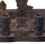 | **Armory Forge** (Armory_TW) | [Forge] Stone ×20, Bronze Nails ×40, Bronze ×10, Surtling Core ×5, Eikthyr Trophy ×1 | Bàn nâng cấp giáp — tối đa cấp 4 |

## 🦺 2. Giáp Theo Hệ (Set)

Mỗi hệ gồm 3 mảnh (Hood/Visage/Helmet + Tunic/Chainmail/Scalemail + Pants/Leggings/Greaves). Giá trị hiển thị: `Giáp nền +/lvl`. Các variant cùng hệ đều cùng visual, chỉ khác số liệu và nguyên liệu. Set bonus (mặc định 3 mảnh) mô tả trong cột cuối.

### Stag (Leather)

**Set bonus:** Speed +3% · Run +10

| Icon | Mảnh (prefab) | Armor / Stats | Chế tạo | Nâng cấp | Set bonus / Hiệu ứng |
| :---: | --- | --- | --- | --- | --- |
| 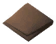 | **Stag leather tunic** (ArmorLeatherChest_TW) | 🛡️ Armor 2+2/lvl Block 10 Weight 5 Durability 400 | ArmorLeatherChest ×1, Deer Hide ×6, Leather Scraps ×3 | Leather Scraps ×2, Deer Hide ×3 | **Set (Stag, 3 pcs):** Speed +3% · Run +10 |
| 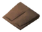 | **Stag leather pants** (ArmorLeatherLegs_TW) | 🛡️ Armor 2+2/lvl Block 10 Weight 5 Durability 400 | ArmorLeatherLegs ×1, Leather Scraps ×6, Deer Hide ×3 | Leather Scraps ×3, Deer Hide ×2 | **Set (Stag, 3 pcs):** Speed +3% · Run +10 |
| 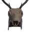 | **Stag hood** (HelmetLeather_TW) | 🛡️ Armor 2+2/lvl Block 10 Weight 1 Durability 400 | HelmetLeather ×1, Deer Trophy ×1, Deer Hide ×4 | Leather Scraps ×2, Deer Hide ×2 | A tough leather hood adorned with antlers. **Set (Stag, 3 pcs):** Speed +3% · Run +10 |

### Razorback

**Set bonus:** Stamina regen +5% · Polearms +5 · Spears +5

| Icon | Mảnh (prefab) | Armor / Stats | Chế tạo | Nâng cấp | Set bonus / Hiệu ứng |
| :---: | --- | --- | --- | --- | --- |
| 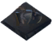 | **Razorback bronze vest** (ArmorRazorbackChest_TW) | 🛡️ Armor 7+2/lvl Block 10 Weight 5 Durability 1000 Movement -4% | Razorback Leather ×12, Bronze ×6, Razorback Tusk ×2 | Razorback Leather ×6, Bronze ×3 | A black leather bronze vest with tusk shoulderpads. **Set (Spellslinger, 3 pcs):** Stamina regen +5% · Polearms +5 · Spears +5 |
| 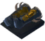 | **Razorback leather leggings** (ArmorRazorbackLegs_TW) | 🛡️ Armor 7+2/lvl Block 10 Weight 10 Durability 1000 Movement -4% | Razorback Leather ×8, Bronze ×6, Razorback Tusk ×2 | Razorback Leather ×4, Bronze ×3 | A pair of black leather trousers and tusk boots **Set (Spellslinger, 3 pcs):** Stamina regen +5% · Polearms +5 · Spears +5 |
| 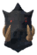 | **Razorback hood** (HelmetRazorback_TW) | 🛡️ Armor 7+2/lvl Block 10 Weight 2 Durability 1000 | Razorback Leather ×8, Razorback Tusk ×6, Boar Trophy ×2 | Razorback Leather ×4, Razorback Tusk ×3 | A boar hunters trophy helmet. **Set (Spellslinger, 3 pcs):** Stamina regen +5% · Polearms +5 · Spears +5 |

### Hunter

**Set bonus:** Bows +2→+10 · Crossbows +2→+10

| Icon | Mảnh (prefab) | Armor / Stats | Chế tạo | Nâng cấp | Set bonus / Hiệu ứng |
| :---: | --- | --- | --- | --- | --- |
| 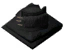 | **Black leather hunting vest** (ArmorHunterChest_TW) | 🛡️ Armor 5+2/lvl Block 10 Weight 5 Durability 1000 Movement +1% | Black Bear Pelt ×8, Bronze ×6, Troll Bone ×2 | Black Bear Pelt ×4, Bronze ×3 | A black leather vest adorned with claw shoulderpads and war paint. **Set (Hunter (Bronze), 3 pcs):** Bows +2 · Crossbows +2 |
| 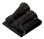 | **Black leather hunting leggings** (ArmorHunterLegs_TW) | 🛡️ Armor 5+2/lvl Block 10 Weight 10 Durability 1000 Movement +1% | Black Bear Pelt ×8, Bronze ×4, Razorback Tusk ×2 | Black Bear Pelt ×4, Bronze ×2 | A pair of black leather fur boots. **Set (Hunter (Bronze), 3 pcs):** Bows +2 · Crossbows +2 |
| 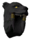 | **Black leather hunting hood** (HelmetHunter_TW) | 🛡️ Armor 5+2/lvl Block 10 Weight 2 Durability 1000 Movement +1% | Black Bear Pelt ×6, Bronze ×8, Boar Trophy ×1 | Black Bear Pelt ×3, Bronze ×4 | An intimidating black leather trophy helmet. **Set (Hunter (Bronze), 3 pcs):** Bows +2 · Crossbows +2 |
| 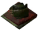 | **Rotten hunting vest** (ArmorHunterChestIron_TW) | 🛡️ Armor 10+2/lvl Block 10 Weight 5 Durability 1000 Movement +1% | Rotten Pelt ×10, Iron ×12, Black leather hunting vest ×1 | Rotten Pelt ×4, Iron ×6 | A rotten leather vest adorned with claw shoulderpads and war paint. **Set (Hunter (Iron), 3 pcs):** Bows +4 · Crossbows +4 |
| 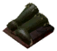 | **Rotten leather hunting leggings** (ArmorHunterLegsIron_TW) | 🛡️ Armor 10+2/lvl Block 10 Weight 10 Durability 1000 Movement +1% | Rotten Pelt ×8, Iron ×8, Black leather hunting leggings ×1 | Rotten Pelt ×3, Iron ×4 | A pair of rotten leather fur boots. **Set (Hunter (Iron), 3 pcs):** Bows +4 · Crossbows +4 |
| 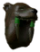 | **Rotten leather hunting hood** (HelmetHunterIron_TW) | 🛡️ Armor 10+2/lvl Block 10 Weight 2 Durability 1000 Movement +1% | Rotten Pelt ×8, Iron ×10, Black leather hunting hood ×1 | Rotten Pelt ×3, Iron ×4 | An intimidating rotten trophy helmet. **Set (Hunter (Iron), 3 pcs):** Bows +4 · Crossbows +4 |
| 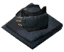 | **Frosted hunting vest** (ArmorHunterChestSilver_TW) | 🛡️ Armor 15+2/lvl Block 10 Weight 5 Durability 1000 Movement +1% | Grizzly Pelt ×10, Silver ×16, Wolf Claw ×6, Rotten hunting vest ×1 | Grizzly Pelt ×4, Silver ×8, Wolf Claw ×3 | A frosted leather vest adorned with claw shoulderpads and war paint. **Set (Hunter (Silver), 3 pcs):** Bows +6 · Crossbows +6 |
| 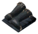 | **Frosted leather hunting leggings** (ArmorHunterLegsSilver_TW) | 🛡️ Armor 15+2/lvl Block 10 Weight 10 Durability 1000 Movement +1% | Wolf Pelt ×8, Silver ×12, Wolf Hair Bundle ×6, Rotten leather hunting leggings ×1 | Wolf Pelt ×4, Silver ×6, Wolf Hair Bundle ×3 | A pair of frosted leather fur boots. **Set (Hunter (Silver), 3 pcs):** Bows +6 · Crossbows +6 |
|  | **Frosted leather hunting hood** (HelmetHunterSilver_TW) | 🛡️ Armor 15+2/lvl Block 10 Weight 2 Durability 1000 Movement +1% | Grizzly Pelt ×6, Silver ×12, Wolf Fang ×6, Rotten leather hunting hood ×1 | Grizzly Pelt ×3, Silver ×6, Wolf Fang ×4 | An intimidating frosted trophy helmet. **Set (Hunter (Silver), 3 pcs):** Bows +6 · Crossbows +6 |
| 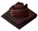 | **Blazed hunting vest** (ArmorHunterChestBM_TW) | 🛡️ Armor 20+2/lvl Block 10 Weight 5 Durability 1000 Movement +1% | Lox Pelt ×12, Black Metal ×25, Lox Bone ×6, Frosted hunting vest ×1 | Lox Pelt ×6, Black Metal ×12, Lox Bone ×3 | A blazed leather vest adorned with claw shoulderpads and war paint. **Set (Hunter (Blackmetal), 3 pcs):** Bows +8 · Crossbows +8 |
|  | **Blazed leather hunting leggings** (ArmorHunterLegsBM_TW) | 🛡️ Armor 20+2/lvl Block 10 Weight 10 Durability 1000 Movement +1% | Lox Bone ×6, Lox Pelt ×6, Prowler Fang ×4, Frosted leather hunting leggings ×1 | Lox Bone ×3, Lox Pelt ×3, Prowler Fang ×2 | A pair of blazed leather fur boots. **Set (Hunter (Blackmetal), 3 pcs):** Bows +8 · Crossbows +8 |
| 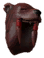 | **Blazed leather hunting hood** (HelmetHunterBM_TW) | 🛡️ Armor 20+2/lvl Block 10 Weight 2 Durability 1000 Movement +1% | Lox Pelt ×8, Black Metal ×25, Prowler Fang ×6, Frosted leather hunting hood ×1 | Lox Pelt ×4, Black Metal ×12, Prowler Fang ×3 | An intimidating blazed trophy helmet. **Set (Hunter (Blackmetal), 3 pcs):** Bows +8 · Crossbows +8 |
| 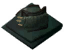 | **Carapace hunting vest** (ArmorHunterChestCarapace_TW) | 🛡️ Armor 25+2/lvl Block 10 Weight 5 Durability 1000 Movement +1% | Carapace ×25, Eitr ×10, Dark Crystal ×8, Blazed hunting vest ×1 | Carapace ×12, Eitr ×5, Dark Crystal ×4 | A carapace vest adorned with claw shoulderpads and war paint. **Set (Hunter (Carapace), 3 pcs):** Bows +10 · Crossbows +10 |
| 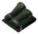 | **Carapace leather hunting leggings** (ArmorHunterLegsCarapace_TW) | 🛡️ Armor 25+2/lvl Block 10 Weight 10 Durability 1000 Movement +1% | Carapace ×12, Soft Tissue ×12, ScaleHide ×10, Blazed leather hunting leggings ×1 | Carapace ×6, Soft Tissue ×6, ScaleHide ×5 | A pair of carapace fur boots. **Set (Hunter (Carapace), 3 pcs):** Bows +10 · Crossbows +10 |
|  | **Carapace leather hunting hood** (HelmetHunterCarapace_TW) | 🛡️ Armor 25+2/lvl Block 10 Weight 2 Durability 1000 Movement +1% | Carapace ×25, Soft Tissue ×12, Eitr ×12, Blazed leather hunting hood ×1 | Carapace ×8, Soft Tissue ×6, Eitr ×6 | An intimidating carapace trophy helmet. **Set (Hunter (Carapace), 3 pcs):** Bows +10 · Crossbows +10 |

### Rogue (Assasin)

**Set bonus:** Knives +2→+10

| Icon | Mảnh (prefab) | Armor / Stats | Chế tạo | Nâng cấp | Set bonus / Hiệu ứng |
| :---: | --- | --- | --- | --- | --- |
| 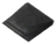 | **Assasin's tunic** (ArmorRogueChest_TW) | 🛡️ Armor 6+2/lvl Block 10 Weight 5 Durability 1000 Movement +1% | Troll Leather Tunic ×1, Bone Fragments ×10, Troll Bone ×2 | Troll Hide ×3, Bone Fragments ×4, Troll Bone ×1 | A black dyed leather tunic. **Set (Rogue (Bronze), 3 pcs):** Knives +2 |
|  | **Assasin's tunic** (ArmorRogueChest_TW1) | 🛡️ Armor 6+2/lvl Block 10 Weight 5 Durability 1000 Movement +1% | Troll Leather Tunic ×1, Bone Fragments ×10, Troll Bone ×2 | Troll Hide ×3, Bone Fragments ×4, Troll Bone ×1 | A black dyed leather tunic. **Set (Rogue (Bronze), 3 pcs):** Knives +2 |
| 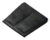 | **Assasin's striders** (ArmorRogueLegs_TW) | 🛡️ Armor 6+2/lvl Block 10 Weight 5 Durability 1000 Movement +1% | Troll Leather Pants ×1, Troll Hide ×8, Deer Hide ×6 | Troll Hide ×4, Bone Fragments ×3, Deer Hide ×3 | Silent as the grave. **Set (Rogue (Bronze), 3 pcs):** Knives +2 |
|  | **Assasin's hood** (HelmetRogue_TW) | 🛡️ Armor 6+2/lvl Block 10 Weight 1 Durability 1000 Movement +1% | Troll Leather Helmet ×1, Troll Hide ×8, Greydwarf Eye ×8 | Troll Hide ×4, Greydwarf Eye ×4, Coal ×3 | A black dyed leather hood that hides your face. **Set (Rogue (Bronze), 3 pcs):** Knives +2 |
| 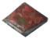 | **Iron-reinforced Assasin's tunic** (ArmorRogueIronChest_TW) | 🛡️ Armor 10+2/lvl Block 10 Weight 5 Durability 1000 Movement +1% | Assasin's tunic ×1, Iron ×12, Rotten Pelt ×6 | Iron ×6, Rotten Pelt ×3, Withered Bone ×2 | A iron reinforced, leather tunic. **Set (Rogue (Iron), 3 pcs):** Knives +4 |
| 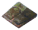 | **Iron-reinforced Assasin's striders** (ArmorRogueIronLegs_TW) | 🛡️ Armor 10+2/lvl Block 10 Weight 5 Durability 1000 Movement +1% | Assasin's striders ×1, Iron ×12, Rotten Pelt ×4 | Iron ×6, Rotten Pelt ×2, Entrails ×4 | Silent as the grave. **Set (Rogue (Iron), 3 pcs):** Knives +4 |
|  | **Iron-reinforced Assasin's hood** (HelmetRogueIron_TW) | 🛡️ Armor 10+2/lvl Block 10 Weight 1 Durability 1000 Movement +1% | Assasin's hood ×1, Iron ×12, Rotten Pelt ×4 | Iron ×6, Rotten Pelt ×2, Ooze ×3 | A leather hood that hides your face. **Set (Rogue (Iron), 3 pcs):** Knives +4 |
| 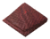 | **Silver-reinforced Assasin's tunic** (ArmorRogueSilverChest_TW) | 🛡️ Armor 16+2/lvl Block 10 Weight 5 Durability 1000 Movement +1% | Iron-reinforced Assasin's tunic ×1, Silver ×14, Red Jute ×6, Wolf Pelt ×4 | Silver ×7, Red Jute ×3, Wolf Pelt ×2 | A silver reinforced, leather tunic. **Set (Rogue (Silver), 3 pcs):** Knives +6 |
| 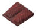 | **Silver-reinforced Assasin's striders** (ArmorRogueSilverLegs_TW) | 🛡️ Armor 16+2/lvl Block 10 Weight 5 Durability 1000 Movement +1% | Iron-reinforced Assasin's striders ×1, Silver ×14, Obsidian ×8, Red Jute ×4 | Silver ×7, Obsidian ×4, Red Jute ×2 | Silent as the grave. **Set (Rogue (Silver), 3 pcs):** Knives +6 |
|  | **Silver-reinforced Assasin's hood** (HelmetRogueSilver_TW) | 🛡️ Armor 16+2/lvl Block 10 Weight 1 Durability 1000 Movement +1% | Iron-reinforced Assasin's hood ×1, Silver ×14, Wolf Fang ×4, Red Jute ×2 | Silver ×7, Wolf Fang ×2, Red Jute ×1 | A leather hood that hides your face. **Set (Rogue (Silver), 3 pcs):** Knives +6 |
| 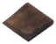 | **Black metal-reinforced Assasin's tunic** (ArmorRogueBMChest_TW) | 🛡️ Armor 22+2/lvl Block 10 Weight 5 Durability 1000 Movement +1% | Silver-reinforced Assasin's tunic ×1, Black Metal ×16, Lox Pelt ×6, Lox Bone ×4 | Black Metal ×8, Lox Pelt ×3, Lox Bone ×2 | A black metal reinforced, leather tunic. **Set (Rogue (Blackmetal), 3 pcs):** Knives +8 |
| 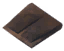 | **Black metal-reinforced Assasin's striders** (ArmorRogueBMLegs_TW) | 🛡️ Armor 22+2/lvl Block 10 Weight 5 Durability 1000 Movement +1% | Silver-reinforced Assasin's striders ×1, Black Metal ×16, Linen Thread ×6, Needle ×6 | Black Metal ×8, Linen Thread ×3, Needle ×3 | Silent as the grave. **Set (Rogue (Blackmetal), 3 pcs):** Knives +8 |
|  | **Black metal-reinforced Assasin's hood** (HelmetRogueBM_TW) | 🛡️ Armor 22+2/lvl Block 10 Weight 1 Durability 1000 Movement +1% | Silver-reinforced Assasin's hood ×1, Black Metal ×16, Linen Thread ×8, Lox Pelt ×4 | Black Metal ×8, Linen Thread ×4, Lox Pelt ×2 | A leather hood that hides your face. **Set (Rogue (Blackmetal), 3 pcs):** Knives +8 |
| 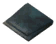 | **Carapace-reinforced Assasin's tunic** (ArmorRogueCarapaceChest_TW) | 🛡️ Armor 28+2/lvl Block 10 Weight 5 Durability 1200 Movement +1% | Black metal-reinforced Assasin's tunic ×1, Soft Tissue ×18, Carapace ×10, Eitr ×8 | Soft Tissue ×9, Carapace ×5, Eitr ×4 | A carapace reinforced, leather tunic. **Set (Rogue (Carapace), 3 pcs):** Knives +10 |
| 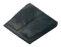 | **Carapace-reinforced Assasin's striders** (ArmorRogueCarapaceLegs_TW) | 🛡️ Armor 28+2/lvl Block 10 Weight 5 Durability 1200 Movement +1% | Black metal-reinforced Assasin's striders ×1, Soft Tissue ×18, Eitr ×6, Dark Crystal ×6 | Soft Tissue ×9, Eitr ×3, Dark Crystal ×3 | Silent as the grave. **Set (Rogue (Carapace), 3 pcs):** Knives +10 |
|  | **Carapace-reinforced Assasin's hood** (HelmetRogueCarapace_TW) | 🛡️ Armor 28+2/lvl Block 10 Weight 1 Durability 1200 Movement +1% | Black metal-reinforced Assasin's hood ×1, Soft Tissue ×18, Eitr ×6, Venomous Fang ×6 | Soft Tissue ×9, Eitr ×3, Venomous Fang ×3 | A leather hood that hides your face. **Set (Rogue (Carapace), 3 pcs):** Knives +10 |

### Vigorous (Raider)

**Set bonus:** Axes +2→+10

| Icon | Mảnh (prefab) | Armor / Stats | Chế tạo | Nâng cấp | Set bonus / Hiệu ứng |
| :---: | --- | --- | --- | --- | --- |
| 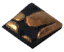 | **Raider vest** (ArmorVigorousChest_TW) | 🛡️ Armor 8+2/lvl Block 10 Weight 10 Durability 1000 Movement -5% | ArmorBronzeChest ×1, Bronze ×8, Troll Bone ×4 | Bronze ×4, Deer Hide ×2, Troll Bone ×2 | A loose vest with some metal protection sewn in. **Set (Vigorous (Bronze), 3 pcs):** Axes +2 |
|  | **Raider trousers** (ArmorVigorousLegs_TW) | 🛡️ Armor 8+2/lvl Block 10 Weight 10 Durability 1000 Movement -5% | ArmorBronzeLegs ×1, Bronze ×6, Deer Hide ×4 | Bronze ×3, Leather Scraps ×4, Deer Hide ×2 | Excellent for raiding and sleeping parties! **Set (Vigorous (Bronze), 3 pcs):** Axes +2 |
| 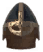 | **Raider helmet** (HelmetVigorous_TW) | 🛡️ Armor 8+2/lvl Block 10 Weight 3 Durability 1000 | HelmetBronze ×1, Bronze ×6, Bone Fragments ×4 | Bronze ×3, Deer Hide ×1, Bone Fragments ×2 | Bronze helmet that protects your skull from fatal blows. **Set (Vigorous (Bronze), 3 pcs):** Axes +2 |
| 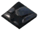 | **Iron-reinforced Raider vest** (ArmorVigorousIronChest_TW) | 🛡️ Armor 14+2/lvl Block 10 Weight 10 Durability 1000 Movement -5% | Raider vest ×1, Iron ×12, Entrails ×6, Withered Bone ×4 | Iron ×6, Entrails ×3, Withered Bone ×2 | A loose vest with some metal protection sewn in. **Set (Vigorous (Iron), 3 pcs):** Axes +4 |
| 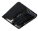 | **Iron-reinforced Raider trousers** (ArmorVigorousIronLegs_TW) | 🛡️ Armor 14+2/lvl Block 10 Weight 10 Durability 1000 Movement -5% | Raider trousers ×1, Iron ×12, Rotten Pelt ×4, Guck ×6 | Iron ×12, Rotten Pelt ×3, Guck ×3 | Excellent for raiding and sleeping parties! **Set (Vigorous (Iron), 3 pcs):** Axes +4 |
| 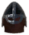 | **Iron-reinforced Raider helmet** (HelmetVigorousIron_TW) | 🛡️ Armor 14+2/lvl Block 10 Weight 3 Durability 1000 | Raider helmet ×1, Iron ×12, Rotten Pelt ×4, Ooze ×4 | Iron ×6, Rotten Pelt ×2, Ooze ×2 | Iron helmet that protects your skull from fatal blows. **Set (Vigorous (Iron), 3 pcs):** Axes +4 |
|  | **Silver-reinforced Raider vest** (ArmorVigorousSilverChest_TW) | 🛡️ Armor 20+2/lvl Block 10 Weight 10 Durability 1000 Movement -5% | Iron-reinforced Raider vest ×1, Silver ×25, Wolf Pelt ×6, Crystal ×6 | Silver ×12, Wolf Pelt ×3, Crystal ×3 | A loose vest with some metal protection sewn in. **Set (Vigorous (Silver), 3 pcs):** Axes +6 |
|  | **Silver-reinforced Raider trousers** (ArmorVigorousSilverLegs_TW) | 🛡️ Armor 20+2/lvl Block 10 Weight 10 Durability 1000 Movement -5% | Iron-reinforced Raider trousers ×1, Silver ×25, Wolf Hair Bundle ×15, Wolf Pelt ×8 | Silver ×12, Wolf Hair Bundle ×8, Wolf Pelt ×4 | Excellent for raiding and sleeping parties! **Set (Vigorous (Silver), 3 pcs):** Axes +6 |
| 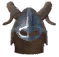 | **Silver-reinforced Raider helmet** (HelmetVigorousSilver_TW) | 🛡️ Armor 20+2/lvl Block 10 Weight 3 Durability 1000 | Iron-reinforced Raider helmet ×1, Silver ×25, Obsidian ×12, Wolf Fang ×6 | Silver ×12, Obsidian ×6, Wolf Fang ×3 | Silver helmet that protects your skull from fatal blows. **Set (Vigorous (Silver), 3 pcs):** Axes +6 |
| 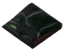 | **Black metal-reinforced Raider vest** (ArmorVigorousBMChest_TW) | 🛡️ Armor 26+2/lvl Block 10 Weight 10 Durability 1000 Movement -5% | Silver-reinforced Raider vest ×1, Black Metal ×25, Lox Pelt ×8, Lox Bone ×6 | Black Metal ×12, Lox Pelt ×4, Lox Bone ×3 | A loose vest with some metal protection sewn in. **Set (Vigorous (Blackmetal), 3 pcs):** Axes +8 |
| 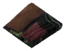 | **Black metal-reinforced Raider trousers** (ArmorVigorousBMLegs_TW) | 🛡️ Armor 26+2/lvl Block 10 Weight 10 Durability 1000 Movement -5% | Silver-reinforced Raider trousers ×1, Black Metal ×25, Tar ×10, Needle ×8 | Black Metal ×12, Tar ×5, Needle ×4 | Excellent for raiding and sleeping parties! **Set (Vigorous (Blackmetal), 3 pcs):** Axes +8 |
| 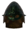 | **Black metal-reinforced Raider helmet** (HelmetVigorousBM_TW) | 🛡️ Armor 26+2/lvl Block 10 Weight 3 Durability 1000 | Silver-reinforced Raider helmet ×1, Black Metal ×25, Linen Thread ×12, Tar ×8 | Black Metal ×25, Linen Thread ×6, Tar ×4 | Black metal helmet that protects your skull from fatal blows. **Set (Vigorous (Blackmetal), 3 pcs):** Axes +8 |
| 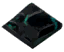 | **Carapace-reinforced Raider vest** (ArmorVigorousCarapaceChest_TW) | 🛡️ Armor 32+2/lvl Block 10 Weight 10 Durability 1200 Movement -5% | Black metal-reinforced Raider vest ×1, Carapace ×25, Eitr ×8, ScaleHide ×10 | Carapace ×12, Eitr ×4, ScaleHide ×5 | A loose vest with some metal protection sewn in. **Set (Vigorous (Carapace), 3 pcs):** Axes +10 |
| 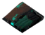 | **Carapace-reinforced Raider trousers** (ArmorVigorousCarapaceLegs_TW) | 🛡️ Armor 32+2/lvl Block 10 Weight 10 Durability 1200 Movement -5% | Black metal-reinforced Raider trousers ×1, Carapace ×25, Eitr ×8, Soft Tissue ×10 | Carapace ×12, Eitr ×4, Soft Tissue ×5 | Excellent for raiding and sleeping parties! **Set (Vigorous (Carapace), 3 pcs):** Axes +10 |
| 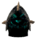 | **Carapace-reinforced Raider helmet** (HelmetVigorousCarapace_TW) | 🛡️ Armor 32+2/lvl Block 32 Weight 3 Durability 1200 | Black metal-reinforced Raider helmet ×1, Carapace ×25, Eitr ×8, Mandible ×6 | Carapace ×12, Eitr ×4, Mandible ×3 | Carapace helmet that protects your skull from fatal blows. **Set (Vigorous (Carapace), 3 pcs):** Axes +10 |

### Warrior

**Set bonus:** Clubs +4→+12

| Icon | Mảnh (prefab) | Armor / Stats | Chế tạo | Nâng cấp | Set bonus / Hiệu ứng |
| :---: | --- | --- | --- | --- | --- |
| 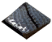 | **Warrior's scalemail** (ArmorWarriorChest_TW) | 🛡️ Armor 14+2/lvl Block 10 Weight 15 Durability 1000 Movement -5% | ArmorIronChest ×1, Iron ×12, Rotten Pelt ×6, Guck ×6 | Iron ×12, Rotten Pelt ×3, Guck ×4 | A sturdy scalemail to protects one's insides. **Set (Warrior (Iron), 3 pcs):** Clubs +4 |
| 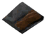 | **Warrior's legguards** (ArmorWarriorLegs_TW) | 🛡️ Armor 14+2/lvl Block 10 Weight 15 Durability 1000 Movement -5% | ArmorIronLegs ×1, Iron ×12, Ooze ×5, Entrails ×6 | Iron ×12, Ooze ×4, Entrails ×4 | Wooly pants with metal sheen protection. **Set (Warrior (Iron), 3 pcs):** Clubs +4 |
|  | **Warrior's skullcage** (HelmetWarrior_TW) | 🛡️ Armor 14+2/lvl Block 10 Weight 3 Durability 1000 | HelmetIron ×1, Iron ×12, Rotten Pelt ×6, Withered Bone ×3 | Iron ×12, Rotten Pelt ×3, Withered Bone ×2 | A sturdy iron helmet, fit for a warrior. **Set (Warrior (Iron), 3 pcs):** Clubs +4 |
| 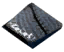 | **Silver-reinforced Warrior's scalemail** (ArmorWarriorSilverChest_TW) | 🛡️ Armor 20+2/lvl Block 10 Weight 15 Durability 1000 Movement -5% | Warrior's scalemail ×1, Silver ×25, Crystal ×10, Freeze Gland ×6 | Silver ×12, Crystal ×5, Freeze Gland ×3 | A sturdy scalemail to protects one's insides. **Set (Warrior (Silver), 3 pcs):** Clubs +6 |
| 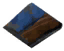 | **Silver-reinforced Warrior's legguards** (ArmorWarriorSilverLegs_TW) | 🛡️ Armor 20+2/lvl Block 10 Weight 15 Durability 1000 Movement -5% | Warrior's legguards ×1, Silver ×20, Wolf Hair Bundle ×15, Wolf Pelt ×8 | Silver ×10, Wolf Hair Bundle ×8, Wolf Pelt ×4 | Wooly pants with metal sheen protection. **Set (Warrior (Silver), 3 pcs):** Clubs +6 |
| 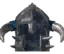 | **Silver-reinforced Warrior's skullcage** (HelmetWarriorSilver_TW) | 🛡️ Armor 20+2/lvl Block 10 Weight 3 Durability 1000 | Warrior's skullcage ×1, Silver ×25, Obsidian ×12, Wolf Fang ×6 | Silver ×12, Obsidian ×6, Wolf Fang ×3 | A sturdy silver helmet, fit for a warrior. **Set (Warrior (Silver), 3 pcs):** Clubs +6 |
| 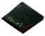 | **Black metal-reinforced Warrior's scalemail** (ArmorWarriorBMChest_TW) | 🛡️ Armor 26+2/lvl Block 10 Weight 15 Durability 1000 Movement -5% | Silver-reinforced Warrior's scalemail ×1, Black Metal ×25, Tar ×12, Needle ×10 | Black Metal ×12, Tar ×6, Needle ×5 | A sturdy scalemail to protects one's insides. **Set (Warrior (Blackmetal), 3 pcs):** Clubs +8 |
| 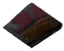 | **Black metal-reinforced Warrior's legguards** (ArmorWarriorBMLegs_TW) | 🛡️ Armor 26+2/lvl Block 10 Weight 15 Durability 1000 Movement -5% | Silver-reinforced Warrior's legguards ×1, Black Metal ×25, Linen Thread ×12, Lox Pelt ×8 | Linen Thread ×6, Black Metal ×12, Lox Pelt ×4 | Wooly pants with metal sheen protection. **Set (Warrior (Blackmetal), 3 pcs):** Clubs +8 |
|  | **Black metal-reinforced Warrior's skullcage** (HelmetWarriorBM_TW) | 🛡️ Armor 26+2/lvl Block 10 Weight 3 Durability 1000 | Silver-reinforced Warrior's skullcage ×1, Black Metal ×25, Tar ×10, Lox Bone ×6 | Black Metal ×12, Tar ×5, Lox Bone ×3 | A sturdy black metal helmet, fit for a warrior. **Set (Warrior (Blackmetal), 3 pcs):** Clubs +8 |
| 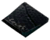 | **Carapace-reinforced Warrior's scalemail** (ArmorWarriorCarapaceChest_TW) | 🛡️ Armor 32+2/lvl Block 10 Weight 15 Durability 1200 Movement -5% | Black metal-reinforced Warrior's scalemail ×1, Carapace ×25, Eitr ×8, Bilebag ×6 | Carapace ×12, Eitr ×4, Bilebag ×3 | A sturdy scalemail to protects one's insides. **Set (Warrior (Carapace), 3 pcs):** Clubs +10 |
| 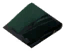 | **Carapace-reinforced Warrior's legguards** (ArmorWarriorCarapaceLegs_TW) | 🛡️ Armor 32+2/lvl Block 10 Weight 15 Durability 1200 Movement -5% | Black metal-reinforced Warrior's legguards ×1, Soft Tissue ×25, Eitr ×8, ScaleHide ×12 | Soft Tissue ×12, Eitr ×4, ScaleHide ×6 | Wooly pants with metal sheen protection. **Set (Warrior (Carapace), 3 pcs):** Clubs +10 |
|  | **Carapace-reinforced Warrior's skullcage** (HelmetWarriorCarapace_TW) | 🛡️ Armor 32+2/lvl Block 10 Weight 3 Durability 1200 | Black metal-reinforced Warrior's skullcage ×1, Carapace ×25, Eitr ×8, Venomous Fang ×6 | Carapace ×12, Eitr ×4, Venomous Fang ×3 | A sturdy carapace helmet, fit for a warrior. **Set (Warrior (Carapace), 3 pcs):** Clubs +10 |
|  | **Flametal-reinforced Warrior's scalemail** (ArmorWarriorFlametalChest_TW) | 🛡️ Armor 38+2/lvl Block 10 Weight 15 Durability 1000 Movement -5% | Carapace-reinforced Warrior's scalemail ×1, Flametal ×30, Charred Bone ×18, Morgen Sinew ×6 | Flametal ×15, Charred Bone ×6, Morgen Sinew ×3 | A sturdy scalemail to protects one's insides. **Set (Warrior (Flametal), 3 pcs):** Clubs +12 |
|  | **Flametal-reinforced Warrior's legguards** (ArmorWarriorFlametalLegs_TW) | 🛡️ Armor 38+2/lvl Block 10 Weight 15 Durability 1000 Movement -5% | Carapace-reinforced Warrior's legguards ×1, Flametal ×30, Ask Hide ×10, Eitr ×8 | Flametal ×15, Ask Hide ×5, Eitr ×4 | Wooly pants with metal sheen protection. **Set (Warrior (Flametal), 3 pcs):** Clubs +12 |
|  | **Flametal-reinforced Warrior's skullcage** (HelmetWarriorFlametal_TW) | 🛡️ Armor 38+2/lvl Block 10 Weight 3 Durability 800 | Carapace-reinforced Warrior's skullcage ×1, Flametal ×30, Bonemaw Serpent Tooth ×24, Eitr ×8 | Flametal ×15, Bonemaw Serpent Tooth ×12, Eitr ×4 | A sturdy flametal helmet, fit for a warrior. **Set (Warrior (Flametal), 3 pcs):** Clubs +12 |

### Fenrir

**Set bonus:** Unarmed +6→+14

| Icon | Mảnh (prefab) | Armor / Stats | Chế tạo | Nâng cấp | Set bonus / Hiệu ứng |
| :---: | --- | --- | --- | --- | --- |
|  | **Fenrir tunic** (ArmorFenrirChest_TW) | 🛡️ Armor 16+2/lvl Block 10 Weight 10 Durability 1000 Movement +2% | ArmorFenringChest ×1, Silver ×20, Red Jute ×8, Wolf Pelt ×6 | Silver ×10, Red Jute ×4, Wolf Pelt ×3 | A furry tunic made of wolf hair, does it smell like wet dog in here? **Set (Fenrir (Silver), 3 pcs):** Unarmed +6 |
|  | **Fenrir leggings** (ArmorFenrirLegs_TW) | 🛡️ Armor 16+2/lvl Block 10 Weight 10 Durability 1000 Movement +2% | ArmorFenringLegs ×1, Silver ×20, Wolf Hair Bundle ×20, Obsidian ×12 | Silver ×10, Wolf Hair Bundle ×10, Obsidian ×6 | Lice riddled fur leggings made of wolf hair, itchy! **Set (Fenrir (Silver), 3 pcs):** Unarmed +6 |
|  | **Fenrir hood** (HelmetFenrir_TW) | 🛡️ Armor 16+2/lvl Block 10 Weight 1 Durability 1000 | HelmetFenring ×1, Silver ×20, Red Jute ×6, Wolf Fang ×6 | Silver ×10, Red Jute ×3, Wolf Fang ×3 | A furry hood made of wolf hair, you feel an insatiable lust for blood.. **Set (Fenrir (Silver), 3 pcs):** Unarmed +6 |
|  | **Black metal-reinforced Fenrir tunic** (ArmorFenrirBMChest_TW) | 🛡️ Armor 22+2/lvl Block 10 Weight 10 Durability 1000 Movement +2% | Fenrir tunic ×1, Black Metal ×20, Linen Thread ×12, Lox Bone ×8 | Black Metal ×10, Linen Thread ×6, Lox Bone ×4 | A furry tunic made of wolf hair, does it smell like wet dog in here? **Set (Fenrir (Blackmetal), 3 pcs):** Unarmed +8 |
|  | **Black metal-reinforced Fenrir leggings** (ArmorFenrirBMLegs_TW) | 🛡️ Armor 22+2/lvl Block 10 Weight 10 Durability 1000 Movement +2% | Fenrir leggings ×1, Black Metal ×20, Tar ×12, Needle ×8 | Black Metal ×10, Tar ×6, Needle ×4 | Lice riddled fur leggings made of wolf hair, itchy! **Set (Fenrir (Blackmetal), 3 pcs):** Unarmed +8 |
|  | **Black metal-reinforced Fenrir hood** (HelmetFenrirBM_TW) | 🛡️ Armor 22+2/lvl Block 10 Weight 1 Durability 1000 Movement +2% | Fenrir hood ×1, Black Metal ×20, Linen Thread ×12, Lox Pelt ×8 | Black Metal ×10, Linen Thread ×6, Lox Pelt ×4 | A furry hood made of wolf hair, you feel an insatiable lust for blood.. **Set (Fenrir (Blackmetal), 3 pcs):** Unarmed +8 |
|  | **Carapace-reinforced Fenrir tunic** (ArmorFenrirCarapaceChest_TW) | 🛡️ Armor 28+2/lvl Block 10 Weight 10 Durability 1200 Movement +2% | Black metal-reinforced Fenrir tunic ×1, Soft Tissue ×25, Eitr ×8, Black Jute ×10 | Soft Tissue ×12, Eitr ×4, Black Jute ×5 | A furry tunic made of wolf hair, does it smell like wet dog in here? **Set (Fenrir (Carapace), 3 pcs):** Unarmed +10 |
|  | **Carapace-reinforced Fenrir leggings** (ArmorFenrirCarapaceLegs_TW) | 🛡️ Armor 28+2/lvl Block 10 Weight 10 Durability 1200 Movement +2% | Black metal-reinforced Fenrir leggings ×1, Soft Tissue ×25, Eitr ×8, ScaleHide ×12 | Soft Tissue ×12, Eitr ×4, ScaleHide ×6 | Lice riddled fur leggings made of wolf hair, itchy! **Set (Fenrir (Carapace), 3 pcs):** Unarmed +10 |
|  | **Carapace-reinforced Fenrir hood** (HelmetFenrirCarapace_TW) | 🛡️ Armor 28+2/lvl Block 10 Weight 1 Durability 1200 Movement +2% | Black metal-reinforced Fenrir hood ×1, Carapace ×25, Eitr ×8, Venomous Fang ×6 | Carapace ×12, Eitr ×4, Venomous Fang ×3 | A furry hood made of wolf hair, you feel an insatiable lust for blood.. **Set (Fenrir (Carapace), 3 pcs):** Unarmed +10 |
|  | **Tyranium-reinforced Fenrir tunic** (ArmorFenrirFlametalChest_TW) | 🛡️ Armor 34+2/lvl Block 10 Weight 10 Durability 2000 Movement +2% |  |  | A furry tunic made of wolf hair, does it smell like wet dog in here? **Set (Fenrir (Tyranium), 3 pcs):** Unarmed +14 |
|  | **Tyranium-reinforced Fenrir leggings** (ArmorFenrirFlametalLegs_TW) | 🛡️ Armor 34+2/lvl Block 10 Weight 10 Durability 2000 Movement +2% |  |  | Lice riddled fur leggings made of wolf hair, itchy! **Set (Fenrir (Tyranium), 3 pcs):** Unarmed +14 |
|  | **Tyranium-reinforced Fenrir hood** (HelmetFenrirFlametal_TW) | 🛡️ Armor 34+2/lvl Block 10 Weight 1 Durability 2000 Movement +2% |  |  | A furry hood made of wolf hair, you feel an insatiable lust for blood.. **Set (Fenrir (Tyranium), 3 pcs):** Unarmed +14 |

### Vidar

**Set bonus:** Swords +6→+12

| Icon | Mảnh (prefab) | Armor / Stats | Chế tạo | Nâng cấp | Set bonus / Hiệu ứng |
| :---: | --- | --- | --- | --- | --- |
|  | **Vidar chainmail** (ArmorVidarChest_TW) | 🛡️ Armor 20+2/lvl Block 10 Weight 15 Durability 1000 Movement -5% | ArmorWolfChest ×1, Silver ×12, Bronze ×10, Wolf Pelt ×4 | Silver ×12, Bronze ×6, Wolf Pelt ×3 | A durable chainmail fit with fur to protect yourself against the harsh weathers. **Set (Vidar (Silver), 3 pcs):** Swords +6 |
|  | **Vidar hide leggings** (ArmorVidarLegs_TW) | 🛡️ Armor 20+2/lvl Block 10 Weight 15 Durability 1000 Movement -5% | ArmorWolfLegs ×1, Silver ×12, Bronze ×10, Wolf Hair Bundle ×10 | Silver ×12, Bronze ×6, Wolf Hair Bundle ×8 | Cozy fur sweat pants, I'm never taking these off! **Set (Vidar (Silver), 3 pcs):** Swords +6 |
|  | **Vidar visage** (HelmetVidar_TW) | 🛡️ Armor 20+2/lvl Block 10 Weight 3 Durability 1000 | HelmetDrake ×1, Silver ×12, Bronze ×10, Wolf Fang ×4 | Silver ×12, Bronze ×6, Wolf Fang ×3 | An inspiring, silver visage adorned with brass. Great fit for a Huskarl. **Set (Vidar (Silver), 3 pcs):** Swords +6 |
|  | **Black metal-reinforced Vidar chainmail** (ArmorVidarBMChest_TW) | 🛡️ Armor 26+2/lvl Block 10 Weight 15 Durability 1000 Movement -5% | Vidar chainmail ×1, Black Metal ×25, Linen Thread ×12, Lox Pelt ×8 | Black Metal ×12, Linen Thread ×6, Lox Pelt ×4 | A durable chainmail fit with fur to protect yourself against the harsh weathers. **Set (Vidar (Blackmetal), 3 pcs):** Swords +8 |
|  | **Black metal-reinforced Vidar hide leggings** (ArmorVidarBMLegs_TW) | 🛡️ Armor 26+2/lvl Block 10 Weight 15 Durability 1000 Movement -5% | Vidar hide leggings ×1, Black Metal ×25, Lox Pelt ×8, Needle ×8 | Black Metal ×12, Lox Pelt ×4, Needle ×4 | Cozy fur sweat pants, I'm never taking these off! **Set (Vidar (Blackmetal), 3 pcs):** Swords +8 |
|  | **Black metal-reinforced Vidar visage** (HelmetVidarBM_TW) | 🛡️ Armor 26+2/lvl Block 10 Weight 3 Durability 1000 | Vidar visage ×1, Black Metal ×25, Tar ×12, Lox Bone ×6 | Black Metal ×12, Tar ×6, Lox Bone ×3 | A brutal, black metal visage adorned with spikes. Great fit for a Huskarl. **Set (Vidar (Blackmetal), 3 pcs):** Swords +8 |
|  | **Carapace-reinforced Vidar chainmail** (ArmorVidarCarapaceChest_TW) | 🛡️ Armor 32+2/lvl Block 10 Weight 15 Durability 1200 Movement -5% | Black metal-reinforced Vidar chainmail ×1, Carapace ×25, Eitr ×8, ScaleHide ×12 | Carapace ×12, Eitr ×4, ScaleHide ×6 | A durable chainmail fit with fur to protect yourself against the harsh weathers. **Set (Vidar (Carapace), 3 pcs):** Swords +10 |
|  | **Carapace-reinforced Vidar hide leggings** (ArmorVidarCarapaceLegs_TW) | 🛡️ Armor 32+2/lvl Block 10 Weight 15 Durability 1200 Movement -5% | Black metal-reinforced Vidar hide leggings ×1, Soft Tissue ×25, Eitr ×8, Black Jute ×10 | Soft Tissue ×12, Eitr ×4, Black Jute ×5 | Cozy fur sweat pants, I'm never taking these off! **Set (Vidar (Carapace), 3 pcs):** Swords +10 |
|  | **Carapace-reinforced Vidar visage** (HelmetVidarCarapace_TW) | 🛡️ Armor 32+2/lvl Block 10 Weight 3 Durability 1200 | Black metal-reinforced Vidar visage ×1, Carapace ×25, Eitr ×8, Dark Crystal ×6 | Carapace ×12, Eitr ×4, Dark Crystal ×4 | An inspiring, carapace visage. Great fit for a Jarl. **Set (Vidar (Carapace), 3 pcs):** Swords +10 |
|  | **Flametal-reinforced Vidar chainmail** (ArmorVidarFlametalChest_TW) | 🛡️ Armor 38+2/lvl Block 10 Weight 15 Durability 1000 Movement -5% | Carapace-reinforced Vidar chainmail ×1, Flametal ×30, Bonemaw Serpent Tooth ×24, Eitr ×8 | Flametal ×15, Bonemaw Serpent Tooth ×12, Eitr ×4 | A durable chainmail fit with fur to protect yourself against the harsh weathers. **Set (Vidar (Flametal), 3 pcs):** Swords +12 |
|  | **Flametal-reinforced Vidar hide leggings** (ArmorVidarFlametalLegs_TW) | 🛡️ Armor 38+2/lvl Block 10 Weight 15 Durability 1000 Movement -5% | Carapace-reinforced Vidar hide leggings ×1, Flametal ×30, Ask Hide ×12, Eitr ×8 | Flametal ×12, Ask Hide ×6, Eitr ×4 | Cozy fur sweat pants, I'm never taking these off! **Set (Vidar (Flametal), 3 pcs):** Swords +12 |
|  | **Flametal-reinforced Vidar visage** (HelmetVidarFlametal_TW) | 🛡️ Armor 38+2/lvl Block 10 Weight 3 Durability 800 | Carapace-reinforced Vidar visage ×1, Flametal ×30, Charred Bone ×18, Eitr ×8 | Flametal ×15, Charred Bone ×8, Eitr ×4 | An inspiring, flametal visage. Great fit for a Konungr. **Set (Vidar (Flametal), 3 pcs):** Swords +12 |

### Bold (Halberdier)

**Set bonus:** Polearms +8→+12

| Icon | Mảnh (prefab) | Armor / Stats | Chế tạo | Nâng cấp | Set bonus / Hiệu ứng |
| :---: | --- | --- | --- | --- | --- |
|  | **Halberdier's cuirass** (ArmorBoldChest_TW) | 🛡️ Armor 26+2/lvl Block 10 Weight 10 Durability 1000 Movement -5% | ArmorPaddedCuirass ×1, Black Metal ×12, Tar ×6, Lox Pelt ×6 | Black Metal ×12, Tar ×6, Lox Pelt ×4 | A cuirass made out of metal plating and leathers to move freely in combat. **Set (Bold (Blackmetal), 3 pcs):** Polearms +8 |
|  | **Halberdier's greaves** (ArmorBoldLegs_TW) | 🛡️ Armor 26+2/lvl Block 10 Weight 10 Durability 1000 Movement -5% | ArmorPaddedGreaves ×1, Black Metal ×12, Linen Thread ×10, Needle ×6 | Black Metal ×12, Linen Thread ×6, Needle ×4 | Protective greaves that offer quite the kick! **Set (Bold (Blackmetal), 3 pcs):** Polearms +8 |
|  | **Halberdier's chainhelmet** (HelmetBold_TW) | 🛡️ Armor 26+2/lvl Block 10 Weight 3 Durability 1000 | HelmetPadded ×1, Black Metal ×12, Lox Pelt ×6, Lox Bone ×4 | Black Metal ×12, Lox Pelt ×4, Lox Bone ×3 | A strong black metal chainhelmet to protect your pretty face from nasty things! **Set (Bold (Blackmetal), 3 pcs):** Polearms +8 |
|  | **Carapace-reinforced Halberdier's cuirass** (ArmorBoldCarapaceChest_TW) | 🛡️ Armor 32+2/lvl Block 10 Weight 10 Durability 1200 Movement -5% | Halberdier's cuirass ×1, Carapace ×25, Eitr ×8, ScaleHide ×15 | Carapace ×12, Eitr ×4, ScaleHide ×8 | A cuirass made out of metal plating and leathers to move freely in combat. **Set (Bold (Carapace), 3 pcs):** Polearms +10 |
|  | **Carapace-reinforced Halberdier's greaves** (ArmorBoldCarapaceLegs_TW) | 🛡️ Armor 32+2/lvl Block 10 Weight 10 Durability 1200 Movement -5% | Halberdier's greaves ×1, Carapace ×25, Eitr ×8, Soft Tissue ×15 | Carapace ×12, Eitr ×4, Soft Tissue ×8 | Protective greaves that offer quite the kick! **Set (Bold (Carapace), 3 pcs):** Polearms +10 |
|  | **Carapace-reinforced Halberdier's chainhelmet** (HelmetBoldCarapace_TW) | 🛡️ Armor 32+2/lvl Block 10 Weight 3 Durability 1200 | Halberdier's chainhelmet ×1, Carapace ×25, Eitr ×8, Dark Crystal ×6 | Carapace ×12, Eitr ×4, Dark Crystal ×3 | A strong carapace chainhelmet to protect your pretty face from nasty things! **Set (Bold (Carapace), 3 pcs):** Polearms +10 |
|  | **Flametal-reinforced Halberdier's cuirass** (ArmorBoldFlametalChest_TW) | 🛡️ Armor 38+2/lvl Block 10 Weight 10 Durability 1000 Movement -5% | Carapace-reinforced Halberdier's cuirass ×1, Flametal ×30, Bonemaw Serpent Tooth ×24, Morgen Heart ×6 | Flametal ×15, Bonemaw Serpent Tooth ×8, Morgen Heart ×2 | A cuirass made out of metal plating and leathers to move freely in combat. **Set (Bold (Flametal), 3 pcs):** Polearms +12 |
|  | **Flametal-reinforced Halberdier's greaves** (ArmorBoldFlametalLegs_TW) | 🛡️ Armor 38+2/lvl Block 10 Weight 10 Durability 1000 Movement -5% | Carapace-reinforced Halberdier's greaves ×1, Flametal ×30, Morgen Sinew ×12, Eitr ×8 | Flametal ×15, Morgen Sinew ×6, Eitr ×8 | Protective greaves that offer quite the kick! **Set (Bold (Flametal), 3 pcs):** Polearms +12 |
|  | **Flametal-reinforced Halberdier's chainhelmet** (HelmetBoldFlametal_TW) | 🛡️ Armor 38+2/lvl Block 10 Weight 3 Durability 800 | Carapace-reinforced Halberdier's chainhelmet ×1, Flametal ×30, Charred Bone ×12, Ask Hide ×8 | Flametal ×15, Charred Bone ×6, Ask Hide ×4 | A strong flametal chainhelmet to protect your pretty face from nasty things! **Set (Bold (Flametal), 3 pcs):** Polearms +12 |

### Legion (Skirmisher)

**Set bonus:** Spears +10→+12

| Icon | Mảnh (prefab) | Armor / Stats | Chế tạo | Nâng cấp | Set bonus / Hiệu ứng |
| :---: | --- | --- | --- | --- | --- |
|  | **Skirmisher's scalemail** (ArmorLegionChest_TW) | 🛡️ Armor 32+2/lvl Block 10 Weight 10 Durability 1200 Movement -5% | ArmorCarapaceChest ×1, Carapace ×12, Eitr ×8, Dark Crystal ×6 | Carapace ×12, Eitr ×4, Dark Crystal ×3 | A scalemail made out of carapace plating and exotic leathers. **Set (Legion (Carapace), 3 pcs):** Spears +10 |
|  | **Skirmisher's pants** (ArmorLegionLegs_TW) | 🛡️ Armor 32+2/lvl Block 10 Weight 10 Durability 1200 Movement -5% | ArmorCarapaceLegs ×1, Soft Tissue ×12, Eitr ×8, ScaleHide ×8 | Soft Tissue ×12, Eitr ×4, ScaleHide ×4 | A pair of coated leather pants to keep ticks at a distance. **Set (Legion (Carapace), 3 pcs):** Spears +10 |
|  | **Skirmisher's faceguard** (HelmetLegion_TW) | 🛡️ Armor 32+2/lvl Block 10 Weight 3 Durability 1200 | HelmetCarapace ×1, Carapace ×12, Eitr ×8, Mandible ×4 | Carapace ×12, Eitr ×4, Mandible ×2 | A scaly carapace helmet adorned with mandibles. **Set (Legion (Carapace), 3 pcs):** Spears +10 |
|  | **Flametal-reinforced Skirmisher's scalemail** (ArmorLegionFlametalChest_TW) | 🛡️ Armor 38+2/lvl Block 10 Weight 10 Durability 1000 Movement -5% | Skirmisher's scalemail ×1, Flametal ×30, Charred Bone ×16, Ask Hide ×8 | Flametal ×15, Charred Bone ×8, Ask Hide ×4 | A scalemail made out of flametal plating and exotic leathers. **Set (Legion (Flametal), 3 pcs):** Spears +12 |
|  | **Flametal-reinforced Skirmisher's pants** (ArmorLegionFlametalLegs_TW) | 🛡️ Armor 38+2/lvl Block 10 Weight 10 Durability 1000 Movement -5% | Skirmisher's pants ×1, Flametal ×30, Ask Hide ×12, Morgen Sinew ×8 | Flametal ×15, Ask Hide ×8, Morgen Sinew ×4 | A pair of coated leather pants to keep ticks at a distance. **Set (Legion (Flametal), 3 pcs):** Spears +12 |
|  | **Flametal-reinforced Skirmisher's faceguard** (HelmetLegionFlametal_TW) | 🛡️ Armor 38+2/lvl Block 10 Weight 3 Durability 800 | Skirmisher's faceguard ×1, Flametal ×30, Charred Bone ×12, Eitr ×8 | Flametal ×15, Charred Bone ×6, Eitr ×4 | A scaly flametal helmet adorned with mandibles. **Set (Legion (Flametal), 3 pcs):** Spears +12 |

## 🧣 3. Đồ Lặt Vặt

Black Troll Cape, Ymir's Belt và các mũ da thú (Lox, Grizzly Bear, Ursa Bear).

| Icon | Mảnh (prefab) | Armor / Stats | Chế tạo | Nâng cấp | Set bonus / Hiệu ứng |
| :---: | --- | --- | --- | --- | --- |
|  | **Ymir's belt** (BeltYmir_TW) | 🛡️ Armor 10+1/lvl Block 10 Weight 2 Durability 100 | BeltStrength ×1, Eitr ×20, Ymir Remains ×4 |  | It's said that one can carry worlds wearing this magical belt. Equipped: Carry weight +300kg |
|  | **Ursa bear hood** (HelmetArcticBear_TW) | 🛡️ Armor 42+2/lvl Block 10 Weight 2 Durability 1200 |  |  | A bear hunters trophy helmet. Equipped: Health regen +25% |
|  | **Grizzly bear hood** (HelmetGrizzlyBear_TW) | 🛡️ Armor 19+2/lvl Block 10 Weight 2 Durability 1000 |  |  | A bear hunters trophy helmet. Equipped: Health regen +12% |
|  | **Black troll cape** (CapeTrollBlack_TW) | 🛡️ Armor 1+1/lvl Block 10 Weight 4 Durability 500 | Troll Hide ×8, Coal ×8, CapeTrollHide ×1 | Troll Hide ×3, Coal ×3, Bone Fragments ×2 | Perfect to cloak yourself in the shadows with.  **Set (Black Troll, 4 pcs):** Sneak +15 |

**Nguồn dữ liệu:** prefab ItemDrop/SE_Stats từ asset bundle nhúng trong `Armory.dll v1.3.1` (type tree Unity), chi phí chế tạo/nâng cấp từ `Therzie.Armory.cfg` (default), tên & mô tả từ `TherzieTranslations/Armory.English.yml`. Có thể khác với server nếu server override config.

Giá trị damage/armor là **default của prefab**; server có thể chỉnh qua config (Therzie mods hỗ trợ "Stats" config cho một số item).
