# 🧙 PHẦN 10 — Wizardry: Wiki Chi Tiết

Mod **Wizardry** (Therzie) thêm hệ **pháp sư (Spellslinger)**: 6 loại **staff** nâng cấp theo biome, giáp pháp sư 5 tier (Novice → Scholar → Wizard → Electromancer → Magus), **circlet** 5 loại với 4 hướng enchanted (Elemental/Hunter/Sneak/Stamina), nhẫn ma thuật, bùa tăng sức mạnh, thuốc, mead eitr và bàn chế tạo phép thuật **Wizard Table**. **Mọi bảng sắp theo thời kỳ** (Black Forest → Swamp → Mountain → Plains → Mistlands).

## 🛠️ 1. Bàn Chế Tạo Phép Thuật

**Wizard Table** (bàn chính) nâng cấp bằng Ancient Spell Book, Spell Cabinet, Ritual Circle; **Arcane Anvil** để enchant staff (Wizard Table improvement); **Potion Cauldron** pha thuốc; **Robe Weaving Loom** may giáp vải.

| Icon | Tên | Chế tạo | Ghi chú |
| --- | --- | --- | --- |
|  | **Wizard Table** (WizardTable_TW) | [Workbench] Surtling Core ×5, Bronze ×10, RoundLog ×8, Troll Hide ×4, Bone Fragments ×6 | Bàn phép thuật chính |
|  | **Arcane Anvil** (ArcaneAnvil_TW) | [WizardTable_TW] Stone ×12, Surtling Core ×4, Elder shard ×2 | Enchant staff — Wizard Table +1 cấp |
|  | **Potion Cauldron** (PotionCauldron_TW) | [WizardTable_TW] Iron ×8, Bronze ×4, Guck ×8, Bonemass shard ×2 | Bàn pha thuốc |
| 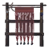 | **Cloth Weaving Loom** (WeavingLoom_TW) | [WizardTable_TW] RoundLog ×12, Hard Antler ×2, Thistle ×6, Bone Fragments ×3 | May giáp vải — Wizard Table +1 cấp |
|  | **Ancient Spell Book** (WizardTable_ext2_TW) | [WizardTable_TW] Withered Bone ×4, Elder Bark ×10, Ooze ×3, Bonemass shard ×2 | Wizard Table +1 cấp |
| 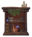 | **Spell Cabinet** (WizardTable_ext3_TW) | [WizardTable_TW] Crystal ×7, Fine Wood ×12, Obsidian ×5, Moder shard ×2 | Wizard Table +1 cấp |
|  | **Ritual Circle** (WizardTable_ext4_TW) | [WizardTable_TW] Tar ×12, Goblin Totem ×3, Skeleton Trophy ×3, Yagluth shard ×4 | Wizard Table +1 cấp |

## 🪄 2. Staff (Gậy Phép)

6 staff theo biome: Evergrowth (Black Forest) → Underworld (Swamp) → Crystalline (Mountain) → Chaos (Plains) → Tempest (Mistlands). Dùng **Arcane scroll** cùng tên để nâng cấp sức mạnh staff. Staffbase/Staffcore là nguyên liệu chế tạo.

| Icon | Tên (prefab) | Stats | Chế tạo | Nâng cấp | Hiệu ứng |
| --- | --- | --- | --- | --- | --- |
|  | **Evergrowth staff** (StaffBlackforest_TW) | ⚔️ 35+6/lvl Blunt 5+1/lvl Spirit 🛡️ Block armor 15+1/lvl Block 2 · Deflection 20+5/lvl Knockback 10 Skill: Elemental Magic Eitr 10 · Range 2m · Speed 0.3× · Proj 18 m/s · Accuracy 1° Alt: Eitr 26 · Range 1.5m · Speed 0.2× · Accuracy 6° Weight 0.3 Durability 250 Movement -10% | Gnarly staff base ×1, Evergrowth core ×1 | Arcane scroll: 'Evergrowth' ×2 | A living weapon enchanted with Freya's magic, great for rooting your enemies to oblivion! |
|  | **Firestarter** (StaffSurtling_TW) | 🛡️ Block armor 15+1/lvl Block 12 Skill: Blood Magic Eitr 40 · Speed 0.3× · Accuracy 1° Alt: Stamina 20 · Range 1.5m · Speed 0.2× Weight 0.3 Durability 200 Movement -5% | Surtling Core ×12, Bonemass shard ×6, Surtling Trophy ×1 | Surtling Core ×4, Arcane scroll: 'Underworld' ×2 | A wicked magic infused head to summon demonic friends with.. |
|  | **Underworld staff** (StaffSwamp_TW) | ⚔️ 25+1/lvl Blunt 60+5/lvl Poison 🛡️ Block armor 15+1/lvl Block 14 · Deflection 20+5/lvl Knockback 10 Skill: Elemental Magic Eitr 15 · Range 2m · Speed 0.3× · Proj 15 m/s · Accuracy 10° Alt: Eitr 38 · Range 1.5m · Speed 0.2× · Proj 20 m/s · Accuracy 10° Weight 0.3 Durability 300 Movement -10% | Rotting staff base ×1, Underworld core ×1 | Arcane scroll: 'Underworld' ×2 | A horrific weapon enchanted with Hel's magic, great for sickening your enemies to their doom! On hit: 4s · Speed -35% |
|  | **Crystaline staff** (StaffMountain_TW) | ⚔️ 8 Pierce 12+2/lvl Frost 🛡️ Block armor 15+1/lvl Block 26 · Deflection 20+5/lvl Knockback 10 Skill: Elemental Magic Eitr 5 · Range 2m · Speed 0.3× · Proj 20 m/s · Accuracy 3° Alt: Eitr 34 · Range 1.5m · Speed 0.2× · Proj 10 m/s · Accuracy 10° Weight 0.3 Durability 300 Movement -5% | Pure staff base ×1, Crystalline core ×1 | Arcane scroll: 'Cleansing' ×2 | A righteous weapon enchanted with Baldr's magic, great for healing and putrifying enemies! On hit: 23s · +100 HP (8s) |
| 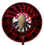 | **Chaos staff** (StaffPlains_TW) | ⚔️ 30+2/lvl Blunt 20+2/lvl Fire 🛡️ Block armor 15+1/lvl Block 38 · Deflection 20+5/lvl Knockback 80 Skill: Elemental Magic Eitr 24 · Range 2m · Speed 0.3× · Proj 20 m/s · Accuracy 1° Alt: Eitr 46 · Range 1.5m · Speed 0.2× · Proj 10 m/s · Accuracy 10° Weight 0.3 Durability 350 Movement -10% | Wicked staff base ×1, Chaos core ×1 | Arcane scroll: 'Hellfire' ×2 | A destructive weapon enchanted with Surtr's magic, great for reigning destruction down upon your enemies! |
|  | **Tarmancer** (StaffGolem_TW) | 🛡️ Block armor 15+1/lvl Block 12 Skill: Blood Magic Eitr 85 · Speed 0.3× · Accuracy 1° Alt: Stamina 20 · Range 1.5m · Speed 0.2× Weight 0.3 Durability 200 Movement -5% | Tar ×30, Yagluth shard ×10, Goblin Totem ×4, TrophyGrowth ×1 | Tar ×15, Yagluth shard ×6, Goblin Totem ×2 | A black magic infused head to summon demonic friends with.. |
|  | **Tempest staff** (StaffMistlands_TW) | ⚔️ 125+6/lvl Lightning 🛡️ Block armor 15+1/lvl Block 48 · Deflection 20+5/lvl Knockback 110 Skill: Elemental Magic Eitr 28 · Range 2m · Speed 0.3× · Proj 20 m/s · Accuracy 1° Alt: Eitr 50 · Range 1.5m · Speed 0.3× · Accuracy 1° Weight 0.3 Durability 350 Movement -10% | Mysterious staff base ×1, Tempest core ×1 | Arcane scroll: 'Storm' ×2, Gjall Trophy ×1 | A electrifying weapon enchanted with Thor's magic, great for shocking your enemies to obliteration! |

### Staff base & core (nguyên liệu)

| Icon | Tên (prefab) | Chế tạo / Nguồn | Ghi chú |
| --- | --- | --- | --- |
|  | **Evergrowth core** (Staffcore_BlackForest_TW) | Ancient Seed ×9, Elder shard ×3 | This magic core can be enchanted into a magical staff. |
| 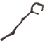 | **Gnarly staff base** (Staffbase_BlackForest_TW) | Magical infused pine wood ×10, Surtling Core ×4 | This staff base can be enchanted into a magical staff or for smacking a foe on the head! |
| 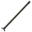 | **Rotting staff base** (Staffbase_Swamp_TW) | Magical infused ancient wood ×14, Iron ×8, Withered Bone ×6 | This staff base can be enchanted into a magical staff or for smacking a foe on the head! |
|  | **Underworld core** (Staffcore_Swamp_TW) | Withered Bone ×8, Bonemass shard ×3, Darkhorn sheep trophy ×1 | This magic core can be enchanted into a magical staff. |
|  | **Crystalline core** (Staffcore_Mountain_TW) | Crystal ×15, Obsidian ×10, Moder shard ×4 | This magic core can be enchanted into a magical staff. |
|  | **Pure staff base** (Staffbase_Mountain_TW) | Magical infused fir wood ×18, Silver ×10, Freeze Gland ×4 | This staff base can be enchanted into a magical staff or for smacking a foe on the head! |
|  | **Chaos core** (Staffcore_Plains_TW) | Goblin Totem ×6, Yagluth shard ×4, Fuling Shaman Trophy ×1 | This magic core can be enchanted into a magical staff. |
| 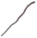 | **Wicked staff base** (Staffbase_Plains_TW) | Magical infused birch wood ×24, Black Metal ×10 | This staff base can be enchanted into a magical staff or for smacking a foe on the head! |
| 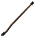 | **Mysterious staff base** (Staffbase_Mistlands_TW) | Magical infused Yggdrasil wood ×30, Carapace ×12 | This staff base can be enchanted into a magical staff or for smacking a foe on the head! |
|  | **Tempest core** (Staffcore_Mistlands_TW) | Soft Tissue ×20, Queen shard ×8, Eitr ×30, Dvergr Trophy ×1 | This magic core can be enchanted into a magical staff. |

## 🦺 3. Giáp Spellslinger

5 tier theo biome: Black Forest (Novice) → Swamp (Scholar) → Mountain (Wizard) → Plains (Electromancer) → Mistlands (Magus). Mỗi tier: Hood + Jersey + Robe + Cape. Giáp cộng **Eitr regen** và set bonus khi đủ bộ.

| Icon | Mảnh (prefab) | Armor / Stats | Chế tạo | Nâng cấp | Set bonus / Hiệu ứng |
| --- | --- | --- | --- | --- | --- |
| 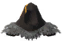 | **Novice hood** (HelmetSpellslinger_BlackForest_TW) | 🛡️ Armor 6+2/lvl Block 10 Weight 1 Durability 1000 | Novice fabric bundle ×4, Feathers ×8, Elder shard ×2 | Novice fabric bundle ×2, Feathers ×4, Elder shard ×1 | A magical hood, fit for the starting magic weaver. **Set (Spellslinger, 3 pcs):** Elemental Magic +3 · Blood Magic +3 Eitr regen +0.06 |
| 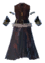 | **Novice robe** (ArmorSpellSlingerChest_BlackForest_TW) | 🛡️ Armor 6+2/lvl Block 10 Weight 10 Durability 1000 | Novice fabric bundle ×6, Bronze ×10, Elder shard ×2 | Novice fabric bundle ×3, Bronze ×5, Elder shard ×2 | Enchanted robes to focus the wearers mind. **Set (Spellslinger, 3 pcs):** Elemental Magic +3 · Blood Magic +3 Eitr regen +0.12 |
| 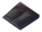 | **Novice jersey** (ArmorSpellslingerLegs_BlackForest_TW) | 🛡️ Armor 6+2/lvl Block 10 Weight 5 Durability 1000 | Novice fabric bundle ×4, Bone Fragments ×4, Elder shard ×2 | Novice fabric bundle ×2, Bone Fragments ×2, Elder shard ×1 | Comfy spell pants, perfect for wearing on a lazy afternoon. **Set (Spellslinger, 3 pcs):** Elemental Magic +3 · Blood Magic +3 Eitr regen +0.12 |
| 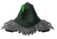 | **Scholar hood** (HelmetSpellslinger_Swamp_TW) | 🛡️ Armor 8+2/lvl Block 10 Weight 1 Durability 1000 | Scholar fabric bundle ×6, Guck ×8, Bonemass shard ×3 | Scholar fabric bundle ×3, Guck ×4, Bonemass shard ×2 | A magical hood, fit for the starting magic weaver. **Set (Spellslinger, 3 pcs):** Elemental Magic +5 · Blood Magic +5 Eitr regen +0.09 |
|  | **Scholar robe** (ArmorSpellSlingerChest_Swamp_TW) | 🛡️ Armor 8+2/lvl Block 10 Weight 10 Durability 1000 | Scholar fabric bundle ×8, Iron ×16, Bonemass shard ×5 | Scholar fabric bundle ×4, Iron ×8, Bonemass shard ×2 | Enchanted robes to focus the wearers mind. **Set (Spellslinger, 3 pcs):** Elemental Magic +5 · Blood Magic +5 Eitr regen +0.18 |
| 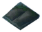 | **Scholar jersey** (ArmorSpellslingerLegs_Swamp_TW) | 🛡️ Armor 8+2/lvl Block 10 Weight 5 Durability 1000 | Scholar fabric bundle ×6, Blood Bag ×4, Bonemass shard ×3 | Scholar fabric bundle ×3, Blood Bag ×2, Bonemass shard ×2 | Comfy spell pants, perfect for wearing on a lazy afternoon. **Set (Spellslinger, 3 pcs):** Elemental Magic +5 · Blood Magic +5 Eitr regen +0.18 |
|  | **Magus hood** (HelmetSpellslinger_Mountain_TW) | 🛡️ Armor 10+2/lvl Block 10 Weight 1 Durability 1000 | Magus fabric bundle ×6, Wolf Fang ×6, Moder shard ×5, Cultist Trophy ×1 | Magus fabric bundle ×3, Wolf Fang ×3, Moder shard ×2 | A magical hood, fit for the starting magic weaver. **Set (Spellslinger, 3 pcs):** Elemental Magic +7 · Blood Magic +7 Eitr regen +0.12 |
|  | **Magus robe** (ArmorSpellSlingerChest_Mountain_TW) | 🛡️ Armor 10+2/lvl Block 10 Weight 10 Durability 1000 | Magus fabric bundle ×8, Silver ×22, Moder shard ×7, Wolf Hair Bundle ×10 | Magus fabric bundle ×4, Silver ×11, Moder shard ×3 | Enchanted robes to focus the wearers mind. **Set (Spellslinger, 3 pcs):** Elemental Magic +7 · Blood Magic +7 Eitr regen +0.24 |
|  | **Magus jersey** (ArmorSpellslingerLegs_Mountain_TW) | 🛡️ Armor 10+2/lvl Block 10 Weight 5 Durability 1000 | Magus fabric bundle ×6, Wolf Pelt ×4, Moder shard ×5, Freeze Gland ×4 | Magus fabric bundle ×3, Wolf Pelt ×2, Moder shard ×2 | Comfy spell pants, perfect for wearing on a lazy afternoon. **Set (Spellslinger, 3 pcs):** Elemental Magic +7 · Blood Magic +7 Eitr regen +0.24 |
| 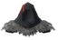 | **Wizard hood** (HelmetSpellslinger_Plains_TW) | 🛡️ Armor 12+2/lvl Block 10 Weight 1 Durability 1000 | Wizard fabric bundle ×8, Tar ×12, Yagluth shard ×7, Lox Trophy ×1 | Wizard fabric bundle ×4, Tar ×6, Yagluth shard ×3 | A magical hood, fit for the starting magic weaver. **Set (Spellslinger, 3 pcs):** Elemental Magic +9 · Blood Magic +9 Eitr regen +0.15 |
|  | **Wizard robe** (ArmorSpellSlingerChest_Plains_TW) | 🛡️ Armor 12+2/lvl Block 10 Weight 10 Durability 1000 | Wizard fabric bundle ×10, Black Metal ×30, Yagluth shard ×8, Lox Pelt ×8 | Wizard fabric bundle ×5, Black Metal ×15, Yagluth shard ×3 | Enchanted robes to focus the wearers mind. **Set (Spellslinger, 3 pcs):** Elemental Magic +9 · Blood Magic +9 Eitr regen +0.3 |
| 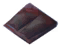 | **Wizard jersey** (ArmorSpellslingerLegs_Plains_TW) | 🛡️ Armor 12+2/lvl Block 10 Weight 5 Durability 1000 | Wizard fabric bundle ×8, Needle ×12, Yagluth shard ×7, Tar ×8 | Wizard fabric bundle ×4, Needle ×6, Yagluth shard ×3 | Comfy spell pants, perfect for wearing on a lazy afternoon. **Set (Spellslinger, 3 pcs):** Elemental Magic +9 · Blood Magic +9 Eitr regen +0.3 |
|  | **Electromancer hood** (HelmetSpellslinger_Mistlands_TW) | 🛡️ Armor 16+2/lvl Block 10 Weight 1 Durability 1000 | Electromancer fabric bundle ×8, Eitr ×12, Queen shard ×8, Gjall Trophy ×1 | Electromancer fabric bundle ×4, Eitr ×6, Queen shard ×4 | A magical hood, fit for the starting magic weaver. **Set (Spellslinger, 3 pcs):** Elemental Magic +12 · Blood Magic +12 Eitr regen +0.2 |
|  | **Electromancer robe** (ArmorSpellSlingerChest_Mistlands_TW) | 🛡️ Armor 16+2/lvl Block 10 Weight 10 Durability 1000 | Electromancer fabric bundle ×10, Black Metal ×30, Queen shard ×8, Lox Pelt ×8 | Electromancer fabric bundle ×5, Black Metal ×15, Queen shard ×4 | Enchanted robes to focus the wearers mind. **Set (Spellslinger, 3 pcs):** Elemental Magic +12 · Blood Magic +12 Eitr regen +0.4 |
| 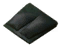 | **Electromancer jersey** (ArmorSpellslingerLegs_Mistlands_TW) | 🛡️ Armor 16+2/lvl Block 10 Weight 5 Durability 1000 | Electromancer fabric bundle ×8, Soft Tissue ×12, Queen shard ×6, Carapace ×8 | Electromancer fabric bundle ×4, Soft Tissue ×6, Queen shard ×3, Carapace ×4 | Comfy spell pants, perfect for wearing on a lazy afternoon. **Set (Spellslinger, 3 pcs):** Elemental Magic +12 · Blood Magic +12 Eitr regen +0.4 |

### Cape

| Icon | Mảnh (prefab) | Armor / Stats | Chế tạo | Nâng cấp | Set bonus / Hiệu ứng |
| --- | --- | --- | --- | --- | --- |
|  | **Novice cape** (CapeSpellslinger_Blackforest_TW) | 🛡️ Armor 1+1/lvl Block 10 Weight 4 Durability 500 | Novice fabric bundle ×4, Bone Fragments ×6, Elder shard ×2 | Novice fabric bundle ×2, Bone Fragments ×3, Elder shard ×1 | A runic cape for the long road. Equipped: Eitr regen +2% |
|  | **Scholar cape** (CapeSpellslinger_Swamp_TW) | 🛡️ Armor 1+1/lvl Block 10 Weight 4 Durability 500 | Scholar fabric bundle ×4, Withered Bone ×2, Bonemass shard ×3 | Scholar fabric bundle ×2, Withered Bone ×1, Bonemass shard ×1 | A runic cape for the long road. Equipped: Eitr regen +3% · +100% Poison dmg |
|  | **Magus cape** (CapeSpellslinger_Mountain_TW) | 🛡️ Armor 1+1/lvl Block 10 Weight 4 Durability 500 | Magus fabric bundle ×4, Wolf Fang ×4, Moder shard ×3, Silver ×1 | Magus fabric bundle ×2, Wolf Fang ×2, Moder shard ×1 | A runic cape for the long road. Equipped: Eitr regen +4% · +100% Frost dmg |
|  | **Wizard cape** (CapeSpellslinger_Plains_TW) | 🛡️ Armor 1+1/lvl Block 10 Weight 4 Durability 500 | Wizard fabric bundle ×6, Needle ×6, Yagluth shard ×4, Black Metal ×4 | Wizard fabric bundle ×3, Needle ×3, Yagluth shard ×1 | A runic cape for the long road. Equipped: Eitr regen +5% · +100% Fire dmg |
|  | **Electromancer cape** (CapeSpellslinger_Mistlands_TW) | 🛡️ Armor 1+1/lvl Block 10 Weight 4 Durability 500 | Electromancer fabric bundle ×6, Needle ×6, Queen shard ×6, Carapace ×8 | Electromancer fabric bundle ×3, Needle ×3, Queen shard ×1 | A runic cape for the long road. Equipped: Eitr regen +5.99999% · Fall damage --100% |

## 👑 4. Circlet (Trang Sức Trán)

5 chất liệu (Bronze/Iron/Silver/Blackmetal/Carapace) × 4 biến thể enchanted (Elemental +Ma thuật, Hunter +Cung/Nỏ, Sneak +Lẻn, Stamina +Stamina). Biến thể enchanted dùng scroll tương ứng để chế.

| Icon | Tên (prefab) | Stats | Chế tạo | Nâng cấp | Hiệu ứng |
| --- | --- | --- | --- | --- | --- |
|  | **Bronze circlet** (HelmetCircletBronze_TW) | 🛡️ Armor 2+1/lvl Block 10 Weight 1 Durability 1000 | Bronze ×6 |  | A simple but elegant circlet forged from bronze. |
| 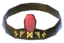 | **Enchanted bronze circlet: Elemental** (HelmetCircletBronze_Elemental_TW) | 🛡️ Armor 6+2/lvl Block 10 Weight 1 Durability 1000 | Bronze circlet ×1, Ruby ×1, Elder shard ×3, Surtling Core ×2 | Bronze ×4, Elder shard ×1 | Magically enchanted bronze circlet that increases it's wearer's elemental skill. Equipped: Elemental Magic +4 |
| 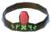 | **Enchanted bronze circlet: Hunter** (HelmetCircletBronze_Hunter_TW) | 🛡️ Armor 6+2/lvl Block 10 Weight 1 Durability 1000 | Bronze circlet ×1, Ruby ×1, Elder shard ×3, Bone Fragments ×6 | Bronze ×4, Elder shard ×1 | Magically enchanted bronze circlet that increases it's wearer's bow and crossbow skill. Equipped: Bows +3 · Crossbows +3 |
| 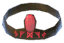 | **Enchanted bronze circlet: Sneak** (HelmetCircletBronze_Sneak_TW) | 🛡️ Armor 6+2/lvl Block 10 Weight 1 Durability 1000 | Bronze circlet ×1, Ruby ×1, Elder shard ×3, Troll Hide ×3 | Bronze ×4, Elder shard ×1 | Magically enchanted bronze circlet that increases it's wearer's sneak skill. Equipped: Sneak +3 |
| 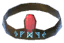 | **Enchanted bronze circlet: Stamina** (HelmetCircletBronze_Stamina_TW) | 🛡️ Armor 6+2/lvl Block 10 Weight 1 Durability 1000 | Bronze circlet ×1, Ruby ×1, Elder shard ×4, Thistle ×4 | Bronze ×4, Elder shard ×1 | Magically enchanted bronze circlet that reduces it's wearer's stamina movement cost. |
|  | **Iron circlet** (HelmetCircletIron_TW) | 🛡️ Armor 2+1/lvl Block 10 Weight 1 Durability 1000 | Iron ×10 |  | A simple but elegant circlet forged from iron. |
| 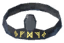 | **Enchanted iron circlet: Elemental** (HelmetCircletIron_Elemental_TW) | 🛡️ Armor 8+2/lvl Block 10 Weight 1 Durability 1000 | Iron circlet ×1, Withered Bone ×4, Bonemass shard ×4, Root ×6 | Iron ×5, Bonemass shard ×2, Root ×1 | Magically enchanted iron circlet that increases it's wearer's elemental skill. Equipped: Elemental Magic +6 |
| 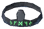 | **Enchanted iron circlet: Hunter** (HelmetCircletIron_Hunter_TW) | 🛡️ Armor 8+2/lvl Block 10 Weight 1 Durability 1000 | Iron circlet ×1, Withered Bone ×4, Bonemass shard ×4, Blood Bag ×6 | Iron ×5, Bonemass shard ×2, Blood Bag ×1 | Magically enchanted iron circlet that increases it's wearer's bow and crossbow skill. Equipped: Bows +5 · Crossbows +5 |
|  | **Enchanted iron circlet: Sneak** (HelmetCircletIron_Sneak_TW) | 🛡️ Armor 8+2/lvl Block 10 Weight 1 Durability 1000 | Iron circlet ×1, Withered Bone ×4, Bonemass shard ×4, Entrails ×8 | Iron ×5, Bonemass shard ×2, Entrails ×1 | Magically enchanted iron circlet that increases it's wearer's sneak skill. Equipped: Sneak +6 |
| 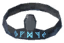 | **Enchanted iron circlet: Stamina** (HelmetCircletIron_Stamina_TW) | 🛡️ Armor 8+2/lvl Block 10 Weight 1 Durability 1000 | Iron circlet ×1, Withered Bone ×4, Bonemass shard ×4, Ooze ×6 | Iron ×5, Bonemass shard ×2, Ooze ×1 | Magically enchanted iron circlet that reduces it's wearer's stamina movement cost. |
|  | **Silver circlet** (HelmetCircletSilver_TW) | 🛡️ Armor 2+1/lvl Block 10 Weight 1 Durability 1000 | Silver ×12 |  | A simple but elegant circlet forged from silver. |
| 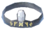 | **Enchanted silver circlet: Elemental** (HelmetCircletSilver_Elemental_TW) | 🛡️ Armor 10+2/lvl Block 10 Weight 1 Durability 1000 | Silver circlet ×1, Wolf Fang ×6, Moder shard ×4, Freeze Gland ×4 | Silver ×6, Moder shard ×2, Freeze Gland ×1 | Magically enchanted silver circlet that increases it's wearer's elemental skill. Equipped: Elemental Magic +8 |
|  | **Enchanted silver circlet: Hunter** (HelmetCircletSilver_Hunter_TW) | 🛡️ Armor 10+2/lvl Block 10 Weight 1 Durability 1000 | Silver circlet ×1, Wolf Fang ×6, Moder shard ×4, Wolf Claw ×6 | Silver ×6, Moder shard ×2, Wolf Fang ×2 | Magically enchanted silver circlet that increases it's wearer's bow and crossbow skill. Equipped: Bows +7 · Crossbows +7 |
|  | **Enchanted silver circlet: Sneak** (HelmetCircletSilver_Sneak_TW) | 🛡️ Armor 10+2/lvl Block 10 Weight 1 Durability 1000 | Silver circlet ×1, Obsidian ×8, Moder shard ×4, Wolf Pelt ×6 | Silver ×6, Moder shard ×2, Obsidian ×2 | Magically enchanted silver circlet that increases it's wearer's sneak skill. Equipped: Sneak +9 |
|  | **Enchanted silver circlet: Stamina** (HelmetCircletSilver_Stamina_TW) | 🛡️ Armor 10+2/lvl Block 10 Weight 1 Durability 1000 | Silver circlet ×1, Freeze Gland ×4, Moder shard ×4, Crystal ×8 | Silver ×6, Moder shard ×2, Crystal ×2 | Magically enchanted silver circlet that reduces it's wearer's stamina movement cost. |
|  | **Blackmetal circlet** (HelmetCircletBM_TW) | 🛡️ Armor 2+1/lvl Block 10 Weight 1 Durability 1000 | Black Metal ×14 |  | A simple but elegant circlet forged from blackmetal. |
|  | **Enchanted blackmetal circlet: Elemental** (HelmetCircletBM_Elemental_TW) | 🛡️ Armor 12+2/lvl Block 10 Weight 1 Durability 1000 | Blackmetal circlet ×1, Goblin Totem ×2, Yagluth shard ×5, Fuling Shaman Trophy ×1 | Black Metal ×7, Yagluth shard ×2, Goblin Totem ×1 | Magically enchanted blackmetal circlet that increases it's wearer's elemental skill. Equipped: Elemental Magic +10 |
|  | **Enchanted blackmetal circlet: Hunter** (HelmetCircletBM_Hunter_TW) | 🛡️ Armor 12+2/lvl Block 10 Weight 1 Durability 1000 | Blackmetal circlet ×1, Tar ×12, Yagluth shard ×5, Lox Trophy ×1 | Black Metal ×7, Yagluth shard ×2, Tar ×3 | Magically enchanted blackmetal circlet that increases it's wearer's bow and crossbow skill. Equipped: Bows +9 · Crossbows +9 |
|  | **Enchanted blackmetal circlet: Sneak** (HelmetCircletBM_Sneak_TW) | 🛡️ Armor 12+2/lvl Block 10 Weight 1 Durability 1000 | Blackmetal circlet ×1, Lox Pelt ×8, Yagluth shard ×5, Deathsquito Trophy ×1 | Black Metal ×7, Yagluth shard ×2, Lox Pelt ×2 | Magically enchanted blackmetal circlet that increases it's wearer's sneak skill. Equipped: Sneak +12 |
|  | **Enchanted blackmetal circlet: Stamina** (HelmetCircletBM_Stamina_TW) | 🛡️ Armor 12+2/lvl Block 10 Weight 1 Durability 1000 | Blackmetal circlet ×1, Needle ×12, Yagluth shard ×5, TrophyGrowth ×1 | Black Metal ×7, Yagluth shard ×2, Needle ×3 | Magically enchanted blackmetal circlet that reduces it's wearer's stamina movement cost. |
| 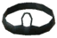 | **Carapace circlet** (HelmetCircletCarapace_TW) | 🛡️ Armor 2+1/lvl Block 10 Weight 1 Durability 1000 | Carapace ×18 |  | A simple but elegant circlet forged from carapace. |
| 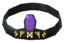 | **Enchanted carapace circlet: Elemental** (HelmetCircletCarapace_Elemental_TW) | 🛡️ Armor 14+2/lvl Block 10 Weight 1 Durability 1000 | Carapace circlet ×1, Eitr ×15, Queen shard ×7, Dvergr Trophy ×1 | Carapace ×7, Queen shard ×2, Bilebag ×1 | Magically enchanted carapace circlet that increases it's wearer's elemental skill. Equipped: Elemental Magic +14 |
|  | **Enchanted carapace circlet: Hunter** (HelmetCircletCarapace_Hunter_TW) | 🛡️ Armor 14+2/lvl Block 10 Weight 1 Durability 1000 | Carapace circlet ×1, Eitr ×15, Queen shard ×7, Gjall Trophy ×1 | Carapace ×7, Queen shard ×2, Soft Tissue ×2 | Magically enchanted carapace circlet that increases it's wearer's bow and crossbow skill. Equipped: Bows +13 · Crossbows +13 |
| 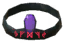 | **Enchanted carapace circlet: Sneak** (HelmetCircletCarapace_Sneak_TW) | 🛡️ Armor 14+2/lvl Block 10 Weight 1 Durability 1000 | Carapace circlet ×1, Eitr ×15, Queen shard ×7, Tick Trophy ×1 | Carapace ×7, Queen shard ×2, JuteBlue ×1 | Magically enchanted carapace circlet that increases it's wearer's sneak skill. Equipped: Sneak +16 |
| 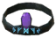 | **Enchanted carapace circlet: Stamina** (HelmetCircletCarapace_Stamina_TW) | 🛡️ Armor 14+2/lvl Block 10 Weight 1 Durability 1000 | Carapace circlet ×1, Eitr ×15, Queen shard ×7, Seeker Trophy ×1 | Carapace ×7, Queen shard ×2, Eitr ×4 | Magically enchanted carapace circlet that reduces it's wearer's stamina movement cost. |

## 💍 5. Nhẫn Ma Thuật

| Icon | Tên (prefab) | Stats | Chế tạo | Nâng cấp | Hiệu ứng |
| --- | --- | --- | --- | --- | --- |
|  | **Magical bronze ring** (RingBlackForest_TW) |  | Elder shard ×4, Bronze ×4, Ruby ×2 |  | An enchanted ring that gives it's wearer +5 skill in sneaking. Equipped: Sneak +5 |
|  | **Magical iron ring** (RingSwamp_TW) |  | Bonemass shard ×4, Iron ×4, Withered Bone ×2 |  | An enchanted ring that gives it's wearer +3 skill in elemental magic. Equipped: Elemental Magic +3 |
|  | **Magical silver ring** (RingMountain_TW) |  | Moder shard ×4, Silver ×4, Wolf Claw ×2 |  | An enchanted ring that gives it's wearer 4% increased eitr regeneration. Equipped: Eitr regen +4% |
|  | **Magical blackmetal ring** (RingPlains_TW) |  | Yagluth shard ×4, Black Metal ×4, Goblin Totem ×2, TrophyGrowth ×1 |  | An enchanted ring that gives it's wearer 3% increased damage with elemental magic. |
|  | **Magical carapace ring** (RingMistlands_TW) |  | Carapace ×4, Bilebag ×1, Soft Tissue ×4, Tick Trophy ×1 |  | An enchanted ring that gives it's wearer 2% health regeneration bonus and +5 skill in blood magic. Equipped: Health regen +2% · Blood Magic +7 |

## ⚗️ 6. Thuốc · Mead · Đồ Ăn

Potion craft tại **Potion Cauldron**; mead eitr tại Cauldron.

| Icon | Tên (prefab) | Stats | Chế tạo | Nâng cấp | Hiệu ứng |
| --- | --- | --- | --- | --- | --- |
|  | **Medium rejuvenation potion** (PotionRejuvenationMedium_TW) | Weight 1 | Yagluth shard ×2, MeadHealthMedium ×2, MeadStaminaMedium ×2, Medium eitr mead ×2 |  | That kicks like a Lox! On use: 480s · +70 HP (4s) · +63 Stamina (4s) · +90 Eitr (4s) |
|  | **Miner potion** (PotionMiner_TW) | Weight 1 | Bonemass shard ×2, Deathcap ×4, Bone Fragments ×6, Blueberries ×6 |  | A treasure hunter's favorite soft drink. On use: 600s · Pickaxes +10 |
|  | **Minor rejuvenation potion** (PotionRejuvenationMinor_TW) | Weight 1 | Bonemass shard ×2, MeadHealthMinor ×2, MeadStaminaMinor ×2, Small eitr mead ×2 |  | That kicks like a Abomination! On use: 480s · +32 HP (4s) · +28 Stamina (4s) · +55 Eitr (4s) |
|  | **Skillful potion** (PotionSkills_TW) | Weight 1 | Moder shard ×3, Wizard butter ×3, Devil's tongue ×3, Cloudberry ×4 |  | You're a jack of all trades! On use: 900s · 999 +10 |
|  | **Sneak potion** (PotionSneak_TW) | Weight 1 | Bonemass shard ×2, Witch eye ×3, Deathcap ×3, Carrot ×3 |  | As silent as a cat stalking it's prey. On use: 900s · Sneak +20 |
|  | **Aquatic potion** (PotionAquatic_TW) | Weight 1 | Moder shard ×2, Wizard butter ×3, FishRaw ×6, Chitin ×2 |  | The sea's grace bottled in a potion. On use: 1800s · Swim +25 · Fishing +15 |
|  | **Lumberjack potion** (PotionLumberjack_TW) | Weight 1 | Elder shard ×2, Witch eye ×4, Ancient Seed ×1, Thistle ×2 |  | Yggdrasil's forbidden knowledge. On use: 600s · Wood Cutting +10 |
|  | **Oxen potion** (PotionOx_TW) | Weight 1 | Elder shard ×2, Witch eye ×3, Blood Bag ×6, Carrot ×4 |  | The strength of an ox bottled in a potion. On use: 1800s · Carry weight +200kg |
|  | **Speed potion** (PotionSpeed_TW) | Weight 1 | Yagluth shard ×2, Devil's tongue ×4, Cloudberry ×4, Guck ×8 |  | Fast as a shark! On use: 60s · Speed +20% |
|  | **Stoneskin potion** (PotionStoneskin_TW) | Weight 1 | Yagluth shard ×4, Devil's tongue ×6, Stone ×14, Obsidian ×8 |  | Hardens your skin for battle. On use: 30s · Speed -80% · +100% Blunt dmg · +100% Slash dmg · +100% Pierce dmg |
|  | **Mead base: Medium eitr mead** (MeadBaseEitrMountain_TW) | Weight 1 | MeadTasty ×3, Wizard butter ×5, Honey ×10 |  | On use: 120s · +85 Eitr (8s) |
|  | **Mead base: Small eitr mead** (MeadBaseEitrBlackForest_TW) | Weight 1 | MeadTasty ×3, Witch eye ×5, Honey ×10 |  | On use: 120s · +45 Eitr (6s) |
|  | **Small eitr mead** (MeadEitrBlackForest_TW) | Weight 1 |  |  | On use: 120s · +45 Eitr (6s) |
|  | **Medium eitr mead** (MeadEitrMountain_TW) | Weight 1 |  |  | On use: 120s · +85 Eitr (8s) |

| Icon | Tên (prefab) | Stats | Chế tạo | Nâng cấp | Hiệu ứng |
| --- | --- | --- | --- | --- | --- |
|  | **Honey glazed eitr berry** (BerryCandyBlackForest_TW) | Weight 0.3 | Witch eye ×2, Blueberries ×4, Honey ×6 |  | Eating that is gonna cost you your tooth enamel.. Food: +17 HP (1500s) +19 Stamina +19 Eitr |
| 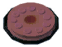 | **Uncooked berry cake** (UncookedBerryCakePlains_TW) | Weight 0.3 | Cloudberry ×8, Devil's tongue ×4, Honey ×8, Barley Flour ×4 |  | Filled with berries and Devil's tongue mushrooms, bake it in the oven. |
|  | **Witcheye soup** (ShroomSoupBlackForest_TW) | Weight 0.3 | Witch eye ×3, Mushroom ×4, Raw Meat ×2 |  | A simple yet delicious eitr soup, made with Witcheye mushrooms. Food: +25 HP (1500s) +21 Stamina +10 Eitr |
|  | **Deathcap soup** (ShroomSoupSwamp_TW) | Weight 0.3 | Deathcap ×2, Carrot ×2, Entrails ×3 |  | A simple yet delicious eitr soup, made with Deathcap mushrooms. Food: +32 HP (1500s) +27 Stamina +14 Eitr |
|  | **Jellymass dessert** (JellyCakeSwamp_TW) | Weight 0.3 | Deathcap ×3, Ooze ×2, Honey ×3 |  | Sweetened eitr jelly cake with whipped ooze cream. Food: +22 HP (1500s) +27 Stamina +26 Eitr |
|  | **Brain chill** (IceHornMountain_TW) | Weight 0.3 | Wizard butter ×3, Freeze Gland ×1, Honey ×4 |  | Delicious eitr icecream in a horn, don't eat too fast! Food: +29 HP (1500s) +33 Stamina +33 Eitr |
|  | **Wizard butter soup** (ShroomSoupMountain_TW) | Weight 0.3 | Wizard butter ×2, Onion ×2, WolfMeat ×2 |  | A simple yet delicious eitr soup, made with Wizard butter mushrooms. Food: +40 HP (1500s) +35 Stamina +20 Eitr |
| 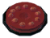 | **Berry cake** (BerryCakePlains_TW) | Weight 0.3 |  |  | Sweet eitr berry cake with a thick layer of cream in the middle! Food: +36 HP (1800s) +40 Stamina +39 Eitr |
|  | **Devils tongue soup** (ShroomSoupPlains_TW) | Weight 0.3 | Devil's tongue ×3, Barley ×2, LoxMeat ×2 |  | A simple yet delicious eitr soup, made with Devil's tongue mushrooms. Food: +52 HP (1800s) +37 Stamina +26 Eitr |

## 📜 7. Arcane Scroll

Scroll nâng cấp staff theo biome (Evergrowth/Underworld/Cleansing/Hellfire/Storm) và scroll buff (Destruction/Gust/Frog/Feather light).

| Icon | Tên (prefab) | Chế tạo / Nguồn | Ghi chú |
| --- | --- | --- | --- |
| 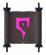 | **Arcane scroll: 'Destruction'** (ArcaneScroll_DamageBuff_TW) | Arcane scroll: 'Underworld' ×1, Arcane scroll: 'Hellfire' ×1 | A powerful upgrade spell bound in a magic scroll, this can be used to upgrade your staff. On use: 900s |
|  | **Arcane scroll: 'Frog'** (ArcaneScroll_JumpBuff_TW) | Arcane scroll: 'Underworld' ×1, Ooze ×6 | A powerful upgrade spell bound in a magic scroll, this can be used to upgrade your staff. On use: 900s |
|  | **Arcane scroll: 'Feather light'** (ArcaneScroll_SlowfallBuff_TW) | Arcane scroll: 'Cleansing' ×1, Wolf Claw ×2, Surtling Core ×2 | A powerful upgrade spell bound in a magic scroll, this can be used to upgrade your staff. On use: 600s · Fall damage --100% |
| 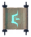 | **Arcane scroll: 'Gust'** (ArcaneScroll_SpeedBuff_TW) | Arcane scroll: 'Evergrowth' ×1, Arcane scroll: 'Cleansing' ×1 | A powerful upgrade spell bound in a magic scroll, this can be used to upgrade your staff. On use: 1500s · Speed +4% |
| 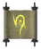 | **Arcane scroll: 'Evergrowth'** (ArcaneScroll_BlackForest_TW) | Elder shard ×2, Surtling Core ×3, Ancient Seed ×1 | A powerful upgrade spell bound in a magic scroll, this can be used to upgrade your staff. |
|  | **Arcane scroll: 'Underworld'** (ArcaneScroll_Swamp_TW) |  | A powerful upgrade spell bound in a magic scroll, this can be used to upgrade your staff. |
|  | **Arcane scroll: 'Cleansing'** (ArcaneScroll_Mountain_TW) |  | A powerful upgrade spell bound in a magic scroll, this can be used to upgrade your staff. |
|  | **Arcane scroll: 'Hellfire'** (ArcaneScroll_Plains_TW) |  | A powerful upgrade spell bound in a magic scroll, this can be used to upgrade your staff. |
|  | **Arcane scroll: 'Storm'** (ArcaneScroll_Mistlands_TW) |  | A powerful upgrade spell bound in a magic scroll, this can be used to upgrade your staff. |

## 🧵 8. Nguyên Liệu

| Icon | Tên (prefab) | Chế tạo / Nguồn | Ghi chú |
| --- | --- | --- | --- |
|  | **Bonemass shard** (ShardBonemass_TW) |  | The shard oozes with vicious undead energy.. |
|  | **Brown yarn** (WoolYarn_Brown_TW) | Wool ×4 |  |
|  | **Darkhorn sheep trophy** (TrophySheep_TW) |  | You still have that empty spot on your living room wall that needs decorating.. |
|  | **Deathcap** (MushroomDeathcap_TW) |  | On use: 300s · Eitr regen +2% · Speed -3% · +200% Poison dmg Food: +5 HP (300s) +18 Eitr |
|  | **Deathcap** (MushroomDeathcap_TW) |  | On use: 300s · Eitr regen +2% · Speed -3% · +200% Poison dmg Food: +5 HP (300s) +18 Eitr |
|  | **Devil's tongue** (MushroomDevilstongue_TW) |  | On use: 300s · Eitr regen +4% · Speed -3% · +200% Fire dmg Food: +5 HP (300s) +24 Eitr |
|  | **Devil's tongue** (MushroomDevilstongue_TW) |  | On use: 300s · Eitr regen +4% · Speed -3% · +200% Fire dmg Food: +5 HP (300s) +24 Eitr |
|  | **Moder shard** (ShardModer_TW) |  | Tranquil and pure, just like the first snow set upon the mountains.. |
| 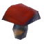 | **Mushroom_TW** (Mushroom_TW) |  | Food: +15 HP (900s) +15 Stamina |
| 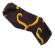 | **Novice fabric bundle** (FabricBundle_Blackforest_TW) |  | A collection of quality fabrics for crafting the finest clothes. |
|  | **Queen shard** (ShardQueen_TW) |  | You feel electrifying magic pulsing from the shard! |
| 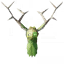 | **TrophyGreydwarfShaman** (TrophyGreydwarfShaman) |  |  |
|  | **TrophyRazorback_TW** (TrophyRazorback_TW) |  |  |
|  | **Witch eye** (MushroomWitcheye_TW) |  | On use: 300s · Eitr regen +0.999999% · Speed -3% Food: +5 HP (300s) +15 Eitr |
|  | **Witch eye** (MushroomWitcheye_TW) |  | On use: 300s · Eitr regen +0.999999% · Speed -3% Food: +5 HP (300s) +15 Eitr |
|  | **Wizard butter** (MushroomWizardbutter_TW) |  | On use: 300s · Eitr regen +2% · Speed -3% · +200% Frost dmg Food: +5 HP (300s) +21 Eitr |
|  | **Wizard butter** (MushroomWizardbutter_TW) |  | On use: 300s · Eitr regen +2% · Speed -3% · +200% Frost dmg Food: +5 HP (300s) +21 Eitr |
| 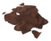 | **Wool** (WoolScraps_TW) |  | Warm and fluffy, ideal for cloth weaving. |
|  | **Yagluth shard** (ShardYagluth_TW) |  | You feel pure chaos magic pulsing from the shard! |
|  | **Yellow yarn** (WoolYarn_Yellow_TW) | Wool ×4, Dandelion ×4 |  |
| 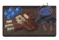 | **Black forest buffet** (EitrPlateBlackForest_TW) | Witch eye ×3, DeerMeat ×2, Blueberries ×2, Thistle ×1 | Cooked food buffet with various regional flavors and Witcheye delight. On use: 1800s · Eitr regen +4% Food: +14 HP (1500s) +6 Stamina +45 Eitr |
|  | **Elder shard** (ShardElder_TW) | Bronze ×5, Ancient Seed ×2, TrophyGreydwarfShaman ×1 | You feel the built up rage of the forest within.. |
| 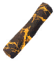 | **Magical infused pine wood** (EnchantedWoodBlackForest_TW) |  | A rare piece of magical wood, this could be used to craft a nice base for a staff. |
|  | **Green yarn** (WoolYarn_Green_TW) | Wool ×4, Ooze ×2 |  |
|  | **Magical infused ancient wood** (EnchantedWoodSwamp_TW) |  | A rare piece of magical wood, this could be used to craft a nice base for a staff. |
|  | **Red yarn** (WoolYarn_Red_TW) | Wool ×4, Blood Bag ×2 |  |
| 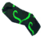 | **Scholar fabric bundle** (FabricBundle_Swamp_TW) |  | A collection of quality fabrics for crafting the finest clothes. |
| 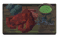 | **Swamp buffet** (EitrPlateSwamp_TW) | Deathcap ×3, Entrails ×3, Turnip ×2, Blood Bag ×2 | Cooked food buffet with various regional flavors and Deathcap delight. On use: 1800s · Eitr regen +5.99999% Food: +18 HP (1800s) +8 Stamina +55 Eitr |
|  | **Blue yarn** (WoolYarn_Blue_TW) | Wool ×4, Freeze Gland ×2 |  |
| 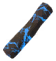 | **Magical infused fir wood** (EnchantedWoodMountain_TW) |  | A rare piece of magical wood, this could be used to craft a nice base for a staff. |
|  | **Magus fabric bundle** (FabricBundle_Mountain_TW) |  | A collection of quality fabrics for crafting the finest clothes. |
| 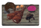 | **Mountain buffet** (EitrPlateMountain_TW) | Wizard butter ×3, WolfMeat ×3, Onion ×2, SerpentMeat ×1 | Cooked food buffet with various regional flavors and Wizard butter delight. On use: 1800s · Eitr regen +8% Food: +22 HP (1800s) +10 Stamina +65 Eitr |
|  | **White yarn** (WoolYarn_White_TW) | Wool ×4, Crystal ×1 |  |
|  | **Black yarn** (WoolYarn_Black_TW) | Wool ×4, Tar ×2 |  |
| 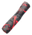 | **Magical infused birch wood** (EnchantedWoodPlains_TW) |  | A rare piece of magical wood, this could be used to craft a nice base for a staff. |
| 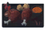 | **Plains buffet** (EitrPlatePlains_TW) | Devil's tongue ×3, LoxMeat ×3, Cloudberry ×2, Barley Flour ×1 | Spicy food buffet with various regional flavors and Devil's tongue delight On use: 1800s · Eitr regen +10% Food: +24 HP (1800s) +12 Stamina +75 Eitr |
| 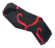 | **Wizard fabric bundle** (FabricBundle_Plains_TW) |  | A collection of quality fabrics for crafting the finest clothes. |
|  | **Electromancer fabric bundle** (FabricBundle_Mistlands_TW) |  | A collection of quality fabrics for crafting the finest clothes. |
| 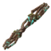 | **Magical infused Yggdrasil wood** (EnchantedWoodMistlands_TW) |  | A rare piece of magical wood, this could be used to craft a nice base for a staff. |
|  | **Teal yarn** (WoolYarn_Teal_TW) | Wool ×4, Eitr ×2 |  |

**Nguồn dữ liệu:** prefab ItemDrop/SE_Stats từ asset bundle nhúng trong `Wizardry.dll` (type tree Unity), chi phí chế tạo/nâng cấp từ `Therzie.Wizardry.cfg` (default), tên & mô tả từ `TherzieTranslations/Wizardry.English.yml`. Có thể khác với server nếu server override config.

Giá trị damage/armor là **default của prefab**; server có thể chỉnh qua config (Therzie mods hỗ trợ "Stats" config cho một số item).
