# 🔪 Bàn Chế Biến (Prep Table) (36 items)

#### Meat/Fish Dish (1)

| 🍳 Icon | Tên Món | Công Thức | Stats Food | Ghi Chú |
| :---: | --- | --- | --- | --- |
| 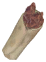 | **Wolf Wraps** | **🔪 Bàn Chế Biến (Prep Table)** Lefse ×1, FlambeWolfStrips ×1, CuredPork ×1, SauteMushrooms ×1 | ❤️70 ⚡70 💚+5/s ⏱️35m 00s | ✨ — |

#### Fermented (1)

| 🍳 Icon | Tên Món | Công Thức | Stats Food | Ghi Chú |
| :---: | --- | --- | --- | --- |
| 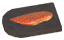 | **Gravlaks** | **🔪 Bàn Chế Biến (Prep Table)** Fish10 ×2, Honey ×1, SpiceForests ×2, FreezeGland ×1 | ❤️20 ⚡98 💚+5/s ⏱️35m 00s | ✨ — |

#### Dessert/Sweet (1)

| 🍳 Icon | Tên Món | Công Thức | Stats Food | Ghi Chú |
| :---: | --- | --- | --- | --- |
| 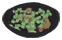 | **Fruit Bowl** | **🔪 Bàn Chế Biến (Prep Table)** Raspberry ×3, Blueberries ×3, Cloudberry ×3, Vineberry ×3 | ❤️33 ⚡105 🟣30 💚+4/s ⏱️20m 00s | ✨ — |

#### Khác (Other) (8)

| 🍳 Icon | Tên Món | Công Thức | Stats Food | Ghi Chú |
| :---: | --- | --- | --- | --- |
| 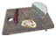 | **Cold Cuts Board** | **🔪 Bàn Chế Biến (Prep Table)** ColdCuredNeck ×2, Smorrebrod ×2, Morrpolse ×1, LoxCheese ×1 | ❤️100 ⚡100 🟣100 💚+6/s ⏱️30m 00s | ✨ — |
|  | **Dvergr Dagmál** | **🔪 Bàn Chế Biến (Prep Table)** Sausages ×1, CookedEgg ×1, BogButter ×1, DvergrMead ×1 | ❤️90 ⚡100 🟣80 💚+6/s ⏱️55m 00s | ✨ StatusEffect: VC_DvergrDagmalEffect; Tốc chạy: -0.029999999329447746; DMG m_pierce: +10%; Guide 2.2.7: -3% mvt speed. +10% jump height. +10% pierce dmg for 25m; Thời gian effect: 25m 00s |
|  | **Highlander Dagmál** | **🔪 Bàn Chế Biến (Prep Table)** SalmonChowder ×1, Lefse ×1, Rakfisk ×1, MeadStaminaMedium ×1 | ❤️90 ⚡100 🟣80 💚+6/s ⏱️55m 00s | ✨ StatusEffect: VC_HighlanderDagmalEffect; Tốc chạy: -0.029999999329447746; Guide 2.2.7: -3% mvt speed. +15 Jumping for 25m; Thời gian effect: 25m 00s |
|  | **Hot Pork** | **🔪 Bàn Chế Biến (Prep Table)** Bread ×1, Sausages ×1, RoyalJelly ×1, Surkal ×2 | ❤️80 ⚡45 🟣60 💚+6/s ⏱️35m 00s | ✨ — |
|  | **Peasant Dagmál** | **🔪 Bàn Chế Biến (Prep Table)** Bread ×1, Butter ×1, SweetPorridge ×1, Blaand ×1 | ❤️35 ⚡110 💚+5/s ⏱️55m 00s | ✨ StatusEffect: VC_PeasantDagmalEffect; Tốc chạy: -0.029999999329447746; Guide 2.2.7: -3% mvt speed. +10 to Farming and Wood cutting for 25m; Thời gian effect: 25m 00s |
| 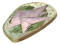 | **Smørrebrød** | **🔪 Bàn Chế Biến (Prep Table)** Rugbraud ×1, Rakfisk ×3, SauteMushrooms ×3, Surkal ×3 | ❤️35 ⚡84 🟣35 💚+5/s ⏱️30m 00s | ✨ — |
|  | **Snowballs** | **🔪 Bàn Chế Biến (Prep Table)** SpiceSnow ×6, Honey ×3, Blueberries ×2 | ❤️20 ⚡80 💚+3/s ⏱️25m 00s | ✨ — |
|  | **Varangian Dagmál** | **🔪 Bàn Chế Biến (Prep Table)** VarangianStew ×1, Hakarl ×1, MeadHealthMajor ×1 | ❤️120 ⚡80 💚+6/s ⏱️55m 00s | ✨ StatusEffect: VC_VarangianDagmalEffect; Tốc chạy: -0.029999999329447746; Guide 2.2.7: -3% mvt speed. Resistance to physical damage for 25m; Thời gian effect: 25m 00s |

| 🍳 Icon | Tên Vật Phẩm | Công Thức | Thông Số | Ghi Chú |
| :---: | --- | --- | --- | --- |
|  | **Chopped Shrooms** | **🔪 Bàn Chế Biến (Prep Table)** BlueMushroom ×1, MushroomYellow ×1, MushroomJotunPuffs ×1, MushroomMagecap ×1 | — | ✨ — |
|  | **Chopped Veggies** | **🔪 Bàn Chế Biến (Prep Table)** Carrot ×1, Turnip ×1, Onion ×1 | — | ✨ — |
|  | **Journey Bread Dough** | **🔪 Bàn Chế Biến (Prep Table)** BarleyFlour ×5, AncientBarkFlour ×5, BoneMeal ×10, LoxMilk ×1 | — | ✨ — |
|  | **Paltbröd Dough** | **🔪 Bàn Chế Biến (Prep Table)** BarleyFlour ×10, GiantBloodSack ×2, Sap ×2 | — | ✨ — |
|  | **Rúgbrauð Dough** | **🔪 Bàn Chế Biến (Prep Table)** BarleyFlour ×5, AncientBarkFlour ×5, Butter ×1 | — | ✨ — |
|  | **Unbaked Buttered Tentacle** | **🔪 Bàn Chế Biến (Prep Table)** KrakenTentacle ×1, BogButter ×3 | — | ✨ — |
|  | **Unbaked Honey Glazed Cod** | **🔪 Bàn Chế Biến (Prep Table)** Fish8 ×1, Honey ×1, Onion ×2, Thistle ×1 | — | ✨ — |
| 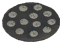 | **Unbaked Honey-Nut Cookies** | **🔪 Bàn Chế Biến (Prep Table)** BarleyFlour ×12, Honey ×8, Acorn ×4, Vineberry ×2 | — | ✨ — |
| 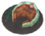 | **Unbaked Oozed Serpent** | **🔪 Bàn Chế Biến (Prep Table)** SerpentMeat ×1, Onion ×2, Sap ×2, Ooze ×2 | — | ✨ — |
| 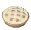 | **Unbaked Raspberry Pie** | **🔪 Bàn Chế Biến (Prep Table)** Raspberry ×8, Honey ×1, Skyr ×1, BarleyFlour ×3 | — | ✨ — |
|  | **Unbaked Stuffed Drake Heart** | **🔪 Bàn Chế Biến (Prep Table)** DrakeHeart ×1, ChoppedShrooms ×1, MeadTasty ×1, SpiceElderblaze ×1 | — | ✨ — |
| 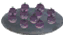 | **Unbaked Stuffed Turnips** | **🔪 Bàn Chế Biến (Prep Table)** Turnip ×8, Ectoplasm ×1, Sap ×1, IdunnConfiture ×1 | — | ✨ — |
|  | **Uncooked Beer Glazed Volture** | **🔪 Bàn Chế Biến (Prep Table)** VoltureMeat ×1, BogButter ×2, ShroomBeer ×2 | — | ✨ — |
|  | **Uncooked Húskarl Lox Ribs** | **🔪 Bàn Chế Biến (Prep Table)** LoxMeat ×2, Honey ×2, Cloudberry ×4 | — | ✨ — |
| 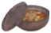 | **Uncooked Jugged Hare** | **🔪 Bàn Chế Biến (Prep Table)** HareMeat ×2, ChoppedVeggies ×1, Thistle ×1, MeadTasty ×1 | — | ✨ — |
| 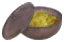 | **Uncooked Jugged Neck** | **🔪 Bàn Chế Biến (Prep Table)** TrophyNeck ×1, NeckTail ×2, ChoppedVeggies ×1, Thistle ×1 | — | ✨ — |
| 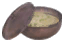 | **Uncooked Jugged Salmon** | **🔪 Bàn Chế Biến (Prep Table)** Fish10 ×3, Ooze ×2, Onion ×2, GefjunMead ×1 | — | ✨ — |
| 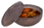 | **Uncooked Overnight Broth** | **🔪 Bàn Chế Biến (Prep Table)** ChoppedMeat ×1, BogButter ×2, Turnip ×3, CloudberryAle ×1 | — | ✨ — |
|  | **Uncooked Roasted Fruit** | **🔪 Bàn Chế Biến (Prep Table)** FruitBowl ×1, RoyalJelly ×2, BogButter ×1, SpicePlains ×1 | — | ✨ — |
| 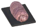 | **Uncooked Wrapped Tetra** | **🔪 Bàn Chế Biến (Prep Table)** Fish4 cave ×2, Bacon ×1, Thistle ×1 | — | ✨ — |
| 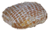 | **Uncured Boar Ham** | **🔪 Bàn Chế Biến (Prep Table)** RawMeat ×4, SpiceMountains ×1 | — | ✨ — |
|  | **Uncured Lox Ham** | **🔪 Bàn Chế Biến (Prep Table)** LoxMeat ×2, SpiceMountains ×1 | — | ✨ — |
|  | **Uncured Pork** | **🔪 Bàn Chế Biến (Prep Table)** RawMeat ×2, SpiceForests ×1 | — | ✨ — |
|  | **Unfermented Bonemaw Meat** | **🔪 Bàn Chế Biến (Prep Table)** BoneMawSerpentMeat ×1, SpiceOceans ×3, PowderedDragonEgg ×2, FreezeGland ×1 | — | ✨ — |
|  | **Unfermented Serpent Meat** | **🔪 Bàn Chế Biến (Prep Table)** SerpentMeat ×1, SpiceOceans ×3, FreezeGland ×1 | — | ✨ — |
