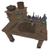

# 🔨 Bàn Làm Việc (Workbench) (12 items)

| 🍳 Icon | Tên Vật Phẩm | Công Thức | Thông Số | Ghi Chú |
| :---: | --- | --- | --- | --- |
|  | **Ashwood Food Fermenter** | **🔨 Bàn Làm Việc (Workbench)** Blackwood:10 ×1, CharcoalResin:2 ×1, FlametalNew:2 ×1 | — | ✨ — |
|  | **Bone Meal** | **🔨 Bàn Làm Việc (Workbench)** BoneFragments ×10 | — | ✨ — |
|  | **Chefs Table** | **🔨 Bàn Làm Việc (Workbench)** FineWood:10 ×1, RoundLog:6 ×1, Iron:8 ×1, CookingSupplies:4 ×1 | — | ✨ Guide 2.2.7: 10 Fine Wood, 6 Core Wood, 8 Iron, 4 Cooking Supplies |
|  | **Drying Rack** | **🔨 Bàn Làm Việc (Workbench)** Wood:10 ×1, LinenThread:15 ×1 | — | ✨ Guide 2.2.7: 10 Wood, 15 Linen Thread |
|  | **Food Fermenter** | **🔨 Bàn Làm Việc (Workbench)** ElderBark:10 ×1, Resin:8 ×1, BarrelRings:1 ×1 | — | ✨ Guide 2.2.7: 10 Ancient Bark, 8 Resin, 1 Barrel Hoops |
|  | **Freezing Barrel** | **🔨 Bàn Làm Việc (Workbench)** Blackwood:20 ×1, BarrelRings:1 ×1, FrostBloodbag:4 ×1, CookingSupplies:4 ×1 | — | ✨ Guide 2.2.7: 20 Ashwood, 1 Barrel Hoops, 4 Frozen Bloodbag, 4 Cooking Supplies |
|  | **Hanging Ladles** | **🔨 Bàn Làm Việc (Workbench)** RoundLog:4 ×1, FineWood:4 ×1, IronNails:2 ×1 | — | ✨ Guide 2.2.7: 4 Core Wood, 4 Finewood, 2 Iron Nails |
|  | **Ingredient Shelves** | **🔨 Bàn Làm Việc (Workbench)** FineWood:16 ×1, IronNails:12 ×1, Silver:6 ×1, CookingSupplies:4 ×1 | — | ✨ Guide 2.2.7: 16 Finewood,12 Iron Nails, 6 Silver, 4 Cooking Supplies |
|  | **Milking Bucket** | **🔨 Bàn Làm Việc (Workbench)** Wood ×10, Resin ×6, BarrelRings ×1 | — | ✨ — |
|  | **Selective Collection** | **🔨 Bàn Làm Việc (Workbench)** RoundLog:20 ×1, FineWood:50 ×1, BarrelRings:9 ×1, CookingSupplies:8 ×1 | — | ✨ Guide 2.2.7: 20 Ancient Bark, 50 Finewood, 9 Barrel Hoops, 8 Cooking Supplies |
|  | **Spice Shelf** | **🔨 Bàn Làm Việc (Workbench)** Blackwood:6 ×1, CharcoalResin:2 ×1, IronNails:4 ×1, CookingSupplies:4 ×1 | — | ✨ Guide 2.2.7: 6 Ashwood, 2 Charcoal Resin, 4 Iron Nails, 4 Cooking Supplies |
|  | **Wooden Smokehouse** | **🔨 Bàn Làm Việc (Workbench)** Wood:50 ×1, Stone:5 ×1 | — | ✨ Guide 2.2.7: 50 Wood, 5 Stone |
