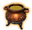
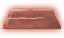

# ⚒️ Lò Rèn (Forge) (6 items)

| 🍳 Icon | Tên Vật Phẩm | Công Thức | Thông Số | Ghi Chú |
| :---: | --- | --- | --- | --- |
|  | **Drying Hook** | **⚒️ Lò Rèn (Forge)** Iron:1 ×1 | — | ✨ Guide 2.2.7: 1 Iron |
|  | **Eldhrímnir** | **⚒️ Lò Rèn (Forge)** NidavellirBronze:12 ×1 | — | ✨ Guide 2.2.7: 12 Niðavellir Bronze |
|  | **Fuling Cooking Cauldron** | **⚒️ Lò Rèn (Forge) Lv.5** Iron ×14, Stone ×20, FulingTablet ×1 | — | ✨ — |
|  | **Keg Hammer** | **⚒️ Lò Rèn (Forge)** FineWood ×4, Resin ×2, Tin ×2, BronzeNails ×8 | — | ✨ — |
|  | **Niðavellir Bronze** | **⚒️ Lò Rèn (Forge)** Copper ×2, Tin ×1, Coal ×3, SurtlingCore ×1 | — | ✨ — |
|  | **Völvas Cauldron** | **⚒️ Lò Rèn (Forge)** Iron:20 ×1 | — | ✨ Guide 2.2.7: 20 Iron |
