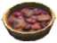
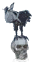

# 🧪 Bàn Phép Thuật (Mage Table) (4 items)

| 🍳 Icon | Tên Vật Phẩm | Công Thức | Thông Số | Ghi Chú |
| :---: | --- | --- | --- | --- |
|  | **Dvergr Apparatus** | **🧪 Bàn Phép Thuật (Mage Table)** BlobVial:1 ×1, MechanicalSpring:1 ×1, NidavellirBronze:5 ×1, YggdrasilWood:10 ×1 | — | ✨ — |
|  | **Freydís** | **🧪 Bàn Phép Thuật (Mage Table)** RavenTablet:1 ×1, TrophySkeleton:3 ×1, BoneFragments:10 ×1, Grausten:8 ×1 | — | ✨ Guide 2.2.7: 1 Hrafnagaldr Nótts, 3 Skeleton Trophy, 10 Bone Fragments, 8 Grausten |
|  | **Grimpys Box** | **🧪 Bàn Phép Thuật (Mage Table)** TrappedVaettir:1 ×1, FineWood:20 ×1, FlametalNew:2 ×1, QueensJam:4 ×1 | — | ✨ Guide 2.2.7: 1 Trapped Vættr, 20 Finewood, 2 Flametal, 4 Queen’s Jam |
|  | **Hrafnagaldr Nótts** | **🧪 Bàn Phép Thuật (Mage Table) Lv.4** BlackMarble ×2, Ectoplasm ×10, CelestialFeather ×5, TrophyFallenValkyrie ×1 | — | ✨ — |
