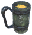
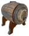

# 🏗️ Bàn Thợ Thủ Công (Artisan Table) (3 items)

| 🍳 Icon | Tên Vật Phẩm | Công Thức | Thông Số | Ghi Chú |
| :---: | --- | --- | --- | --- |
|  | **Butter Churn** | **🏗️ Bàn Thợ Thủ Công (Artisan Table)** RoundLog:20 ×1, IronNails:10 ×1, BarrelRings:1 ×1 | — | ✨ Guide 2.2.7: 20 Core Wood, 10 Iron Nails, 1 Barrel Hoops |
|  | **Goblet of Kings** | **🏗️ Bàn Thợ Thủ Công (Artisan Table)** GoKParts ×1, GemstoneRed ×4, GemstoneGreen ×2, TrophySkeleton ×1 | — | ✨ — |
|  | **Great Fermenter** | **🏗️ Bàn Thợ Thủ Công (Artisan Table)** FineWood:30 ×1, NidavellirBronze:20 ×1, IronNails:20 ×1, Resin:10 ×1 | — | ✨ — |
