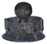

# ⬛ Lò Rèn Đen (Black Forge) (2 items)

| 🍳 Icon | Tên Vật Phẩm | Công Thức | Thông Số | Ghi Chú |
| :---: | --- | --- | --- | --- |
|  | **Dvergr Cauldron** | **⬛ Lò Rèn Đen (Black Forge)** Iron:20 ×1, NidavellirBronze:15 ×1, YggdrasilWood:20 ×1, BlackCore:5 ×1 | — | ✨ — |
|  | **Goblet Parts** | **⬛ Lò Rèn Đen (Black Forge) Lv.4** FlametalNew ×6, NidavellirBronze ×2 | — | ✨ — |
