# 📦 Vật Phẩm Khác (183 items)

| 🍳 Icon | Tên | Công Thức | Thông Số | Ghi Chú |
| :---: | --- | --- | --- | --- |
|  | **Abyssal Philter** | **📖 Guide 2.2.7** None | — | ✨ StatusEffect: VC_AbyssalPhilterEffect; Guide 2.2.7: +10 to Swimming skill, Swimming improves 15% faster; Thời gian effect: 10m 00s 🧔 Haldor (120 coins) |
|  | **Ægir’s Offering** | **📖 Guide 2.2.7** 3 Jörmungandr Stew, 2 Lyngbakr Chowder, 4 Tasty Mead, 2 Andhrímnir´s Seasoning | — | ✨ — |
|  | **Alföðrs Revelry** | **📖 Guide 2.2.7** 3 Sveigðir’s Hall Main Course, 3 Regal Porridge, 2 Heiðrún Mead, 4 Elderblaze Dust | — | ✨ — |
|  | **Ancient Bark Flour** | **📖 Guide 2.2.7** Grinded at the Windmill with 1 Ancient Bark | — | ✨ — |
|  | **Artificer’s Decoction** | **📖 Guide 2.2.7** 1 Decoction Base: Artificer | — | ✨ StatusEffect: VC_ArtificerDecoctionEffect; Guide 2.2.7: +1m/comfort lvl.; Thời gian effect: 5m 00s |
|  | **Artisans Philter** | **📖 Guide 2.2.7** None | — | ✨ Guide 2.2.7: +10 to Crafting skill. Crafting skill improves 15% faster 🧔 Haldor (120 coins) |
|  | **Bacon** | **📖 Guide 2.2.7** 1 Cured Pork | — | ✨ — |
| 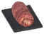 | **Bacon Wrapped Tetra** | **📖 Guide 2.2.7** 1 Uncooked Wrapped Tetra | — | ✨ — |
|  | **Baldr Draught of Radiance** | Không có công thức chế tạo trong config/guide | — | ✨ — |
|  | **Battleragers Cordial** | **📖 Guide 2.2.7** 1 Cordial Base: Battlerager | — | ✨ StatusEffect: VC_BattleragerCordialEffect; Sát thương: +10%; Guide 2.2.7: +10% fist dmg, +15% armor, +10 dodge skill; Thời gian effect: 10m 00s |
|  | **Beastmasters Blaand** | **📖 Guide 2.2.7** 1 Blaand Base: Beastmaster | — | ✨ StatusEffect: VC_BeastmasterBlaandEffect; Guide 2.2.7: +10 to Riding skill, Riding improves 15% faster; Thời gian effect: 10m 00s |
|  | **Beer Glazed Volture** | **📖 Guide 2.2.7** 1 Uncooked Glazed Volture | — | ✨ — |
|  | **Blaand** | **📖 Guide 2.2.7** 1 Blaand Base | — | ✨ StatusEffect: VC_BlaandEffect; Stamina ngay lập tức: 80.0; Guide 2.2.7: Restore 80 SP in 1s; Thời gian effect: 0m 01s |
|  | **Boar Ham** | **📖 Guide 2.2.7** 1 Uncured Boar Ham | — | ✨ — |
|  | **Bog Butter** | **📖 Guide 2.2.7** 1 Unfermented Bog Butter | — | ✨ — |
|  | **Bonebreakers Cordial** | **📖 Guide 2.2.7** 1 Cordial Base: Bonebreaker | — | ✨ StatusEffect: VC_BonebreakerCordialEffect; Choáng: -0.15000000596046448; DMG m_blunt: +10%; Guide 2.2.7: +10% blunt dmg, -15% stagger modifier, -25% physical dmg taken; Thời gian effect: 10m 00s |
|  | **Bonemaw Hákarl** | **📖 Guide 2.2.7** 1 Fermented Bonemaw Meat | — | ✨ — |
|  | **Booze** | **📖 Guide 2.2.7** 1 Booze Base | — | ✨ StatusEffect: VC_BoozeEffect; Stamina ngay lập tức: 50.0; Guide 2.2.7: Restores 100 SP instantly; Thời gian effect: 0m 01s |
|  | **Brawlers Mead** | **📖 Guide 2.2.7** 1 Mead Base: Brawler | — | ✨ StatusEffect: VC_BrawlerMeadEffect; Guide 2.2.7: +10 to Fists skill, Fists improves 15% faster; Thời gian effect: 10m 00s |
|  | **Buttered Kraken Tentacle** | **📖 Guide 2.2.7** 1 Unbaked Buttered Kraken Tentacle | — | ✨ Guide 2.2.7: Uncooked Food (Oven) |
|  | **Cauldron Keeper’s Decoction** | **📖 Guide 2.2.7** 1 Decoction Base: Cauldron Keeper | — | ✨ StatusEffect: VC_ChefDecoctionEffect; Guide 2.2.7: +1m/comfort lvl.; Thời gian effect: 5m 00s |
|  | **Cloudberry Ale** | **📖 Guide 2.2.7** 1 Ale Base: Cloudberry | — | ✨ StatusEffect: VC_CloudberryAleEffect; Eitr ngay lập tức: 80.0; Guide 2.2.7: Restore 80 Eitr in 1s; Thời gian effect: 0m 01s |
|  | **Conversions - Ashwood Food Fermenter** | Không có công thức chế tạo trong config/guide | — | ✨ — |
|  | **Conversions - Cooking Station** | Không có công thức chế tạo trong config/guide | — | ✨ — |
|  | **Conversions - Drying Hook** | Không có công thức chế tạo trong config/guide | — | ✨ — |
|  | **Conversions - Drying Rack** | Không có công thức chế tạo trong config/guide | — | ✨ — |
|  | **Conversions - Dvergr Cauldron** | Không có công thức chế tạo trong config/guide | — | ✨ — |
|  | **Conversions - Fermenter** | Không có công thức chế tạo trong config/guide | — | ✨ — |
|  | **Conversions - Food Fermenter** | Không có công thức chế tạo trong config/guide | — | ✨ — |
|  | **Conversions - Great Fermenter** | Không có công thức chế tạo trong config/guide | — | ✨ — |
|  | **Conversions - Iron Cooking Station** | Không có công thức chế tạo trong config/guide | — | ✨ — |
|  | **Conversions - Oven** | Không có công thức chế tạo trong config/guide | — | ✨ — |
|  | **Conversions - Stone Smokehouse** | Không có công thức chế tạo trong config/guide | — | ✨ — |
|  | **Conversions - Wooden Smokehouse** | Không có công thức chế tạo trong config/guide | — | ✨ — |
| 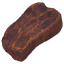 | **Cooked Fowl Meat** | **📖 Guide 2.2.7** 1 Fowl Meat | — | ✨ — |
|  | **Cooked Troll Meat** | **📖 Guide 2.2.7** 1 Troll Meat | — | ✨ — |
|  | **Cooking Supplies** | Không có công thức chế tạo trong config/guide | — | ✨ — 🧙‍♀️ BogWitch (150 coins) |
|  | **Corrupted Vættr** | Không có công thức chế tạo trong config/guide | — | ✨ — |
|  | **Creature Bombs - Custom** | Không có công thức chế tạo trong config/guide | — | ✨ — |
|  | **Cured Pork** | **📖 Guide 2.2.7** 1 Uncured Pork | — | ✨ — |
| 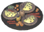 | **Dragonslayer’s Dagmál** | **📖 Guide 2.2.7** 3 Sigurd’s Omelette, 4 Pickled Veggies, 10 Hákarl, 4 Woodland Herb Blend | — | ✨ — |
|  | **Drake Heart** | **📖 Guide 2.2.7** Dropped by Drake | — | ✨ — 🐾 Hatchling |
|  | **Drengr’s Mead** | **📖 Guide 2.2.7** 1 Mead Base: Drengr | — | ✨ StatusEffect: VC_DrengrMead; Guide 2.2.7: +10 to Swords skill, Swords improves 15% faster; Thời gian effect: 10m 00s |
|  | **Dvergr Arbalist Mead** | **📖 Guide 2.2.7** 1 Mead Base: Arbalist | — | ✨ StatusEffect: VC_ArbalistPhilterEffect; Guide 2.2.7: +10 to Crossbows skill, Crossbows improves 15% faster; Thời gian effect: 10m 00s 🐾 Dverger 🐾 DvergerMage 🐾 DvergerAshlands |
|  | **Dvergr Mead** | **📖 Guide 2.2.7** 1 Mead Base: Dvergr | — | ✨ StatusEffect: VC_DvergrMeadEffect; Hồi Stamina: +25%; Hồi Eitr: +25%; Hồi HP: +25%; Guide 2.2.7: +25% HP, SP and Eitr regen.; Thời gian effect: 10m 00s 🐾 Dverger 🐾 DvergerMage 🐾 DvergerAshlands |
|  | **Dvergr Tonic** | **📖 Guide 2.2.7** 1 Dvergr Tonic Base / Dropped by Dvergr | — | ✨ StatusEffect: VC_DvergrTonicEffect; HP ngay lập tức: 40.0; Stamina ngay lập tức: 40.0; Eitr ngay lập tức: 40.0; Guide 2.2.7: Restore 40 HP, SP and Eitr. +25 Adrenaline; Thời gian effect: 0m 10s 🐾 Dverger 🐾 DvergerMageFire 🐾 DvergerMageIce 🐾 DvergerMageSupport 🐾 DvergerAshlands |
|  | **Einherjar Mead Keg** | **📖 Guide 2.2.7** 6 Heiðrún Mead, 4 Tasty Mead, 2 Andhrímnir´s Seasoning | — | ✨ — |
|  | **Elixir of Berserkergang - Hamask** | Không có công thức chế tạo trong config/guide | — | ✨ — |
|  | **Éljúðnir Ceremonial Meal** | **📖 Guide 2.2.7** 3 Bone Broth, 2 Caramelized Náströnd Roots, 2 Boar Ham, 2 Woodland Herb Blend | — | ✨ — |
|  | **Farmers Philter** | **📖 Guide 2.2.7** None | — | ✨ Guide 2.2.7: +10 to Farming skill. Farming skill improves 15% faster 🧔 Haldor (120 coins) |
|  | **Fermented Bonemaw Meat** | **📖 Guide 2.2.7** 1 Unfermented Bonemaw Meat | — | ✨ — |
|  | **Fermented Serpent Meat** | **📖 Guide 2.2.7** 1 Unfermented Serpent Meat | — | ✨ — |
|  | **Fimbulvetr Everburning Stew** | **📖 Guide 2.2.7** 3 Hróðvitnir Stewpot, 3 Galgviðr Skause, 4 Andhrímnir´s Seasoning, 4 Elderblaze Dust | — | ✨ — |
|  | **Fishermans Philter** | **📖 Guide 2.2.7** None | — | ✨ Guide 2.2.7: +10 to Fishing skill. Fishing skill improves 15% faster 🧔 Haldor (120 coins) |
|  | **Fjalar’s Flyting Keg** | **📖 Guide 2.2.7** 6 Suttungr Mead, 2 Nogginfog, 2 Dvergr Bouquet Garni | — | ✨ — |
| 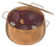 | **Fólkvangr Náttmál** | **📖 Guide 2.2.7** 3 Sessrúmnir’s Ragout, 4 Pork Ribs, 2 Woodland Herb Blend | — | ✨ — |
| 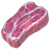 | **Fowl Meat** | **📖 Guide 2.2.7** Dropped by Gull, Crow and Ash Crow | — | ✨ — |
|  | **Freyja Draught** | Không có công thức chế tạo trong config/guide | — | ✨ StatusEffect: VC_FreyjaDraughtEffect; Hồi Eitr: +10%; Giảm 25% Eitr khi dùng staff; Thời gian effect: 15m 00s |
|  | **Freyr Draught of Prosperity** | **📖 Guide 2.2.7** 6 Bloodbag, 4 Barley Flour, 1 Heiðrún's Milk, 2 Medium Health Mead | — | ✨ Guide 2.2.7: 25% chance to receive extra yield from crops and extra yield from riches. |
|  | **Freyr Draught of Prosperity - Item Lists** | Không có công thức chế tạo trong config/guide | — | ✨ — |
|  | **Frozen Bloodbag** | Không có công thức chế tạo trong config/guide | — | ✨ — |
|  | **Fuling Beer** | **📖 Guide 2.2.7** 1 Beer Base: Fuling | — | ✨ StatusEffect: VC_FulingBeerEffect; Sức chứa: 100.0; Hồi Stamina: +100%; Guide 2.2.7: +100 carry weight, +100% SP regen. -1 HP/s; Thời gian effect: 10m 00s |
|  | **Fuling Blaand** | **📖 Guide 2.2.7** 1 Blaand Base: Fuling | — | ✨ StatusEffect: VC_FulingBlaandEffect; Hồi HP: -15%; Sát thương: +10%; Guide 2.2.7: +10% dmg with spears, -15% sneak SP use. -15% HP regen; Thời gian effect: 10m 00s |
|  | **Fuling Gutfire Brew** | Không có công thức chế tạo trong config/guide | — | ✨ StatusEffect: VC_FulingGutfireBrewEffect; Giảm 45% Eitr khi dùng staff; Thời gian effect: 5m 00s |
|  | **Fuling Secrets** | **📖 Guide 2.2.7** Dropped by Zil | — | ✨ — 🐾 GoblinShaman_Hildir |
|  | **Gefjuns Mead** | **📖 Guide 2.2.7** 1 Mead Base: Gefjun Mead | — | ✨ StatusEffect: VC_GefjunMeadEffect; HP theo thời gian: 150.0; Stamina theo thời gian: 150.0; Eitr theo thời gian: 150.0; Guide 2.2.7: Restore 150 HP, SP and Eitr in 1s; Thời gian effect: 1m 00s |
|  | **Ginnungagap’s Cauldron** | **📖 Guide 2.2.7** 3 Smoked Troll Meat, 2 Ymir’s Broth, 2 Spiced Perry, 5 Powdered Dragon Eggshells | — | ✨ — |
|  | **God Draughts** | Không có công thức chế tạo trong config/guide | — | ✨ — |
|  | **Greydwarf Blue Mushroom Drops** | Không có công thức chế tạo trong config/guide | — | ✨ — |
|  | **Grimpy Box Conversion** | Không có công thức chế tạo trong config/guide | — | ✨ — |
|  | **Groa Elixir** | Không có công thức chế tạo trong config/guide | — | ✨ StatusEffect: VC_GroaElixirEffect; Eitr theo thời gian: 1500.0; Hạ gục địch hồi +15 HP; Thời gian effect: 5m 00s |
|  | **Hákarl** | **📖 Guide 2.2.7** 1 Fermented Serpent Meat | — | ✨ Guide 2.2.7: Uncooked Food (Drying Rack) |
|  | **Heiðrún Mead** | **📖 Guide 2.2.7** 1 Heiðrún Mead Base | — | ✨ — |
|  | **Heiðrúns Milk** | **📖 Guide 2.2.7** Have defeated Moder | — | ✨ — 🧙‍♀️ BogWitch (200 coins) |
|  | **Hermaðr’s Mead** | **📖 Guide 2.2.7** 1 Mead Base: Hermaðr | — | ✨ StatusEffect: VC_HermadrMead; Guide 2.2.7: +10 to Spears skill, Spears improves 15% faster; Thời gian effect: 10m 00s |
|  | **Hersir’s Mead** | **📖 Guide 2.2.7** 1 Mead Base: Hersir | — | ✨ StatusEffect: VC_HersirMead; Guide 2.2.7: +10 to Polearms skill, Polearms improves 15% faster; Thời gian effect: 10m 00s |
|  | **Hindarfjall Gathering Platter** | **📖 Guide 2.2.7** 12 Lefse, 8 Frosty Salmon Jerky, 4 Eyescream, 4 Andhrímnir´s Seasoning | — | ✨ — |
|  | **Honey Glazed Coral Cod** | **📖 Guide 2.2.7** 1 Unbaked Honey Glazed Coral Cod | — | ✨ — |
|  | **Honey-Nut Cookies** | **📖 Guide 2.2.7** 1 Unbaked Honey-Cake | — | ✨ — |
|  | **Hunter’s Mead** | **📖 Guide 2.2.7** 1 Mead Base: Hunter | — | ✨ StatusEffect: VC_HunterMead; Guide 2.2.7: +10 to Bows skill, Bows improves 15% faster; Thời gian effect: 10m 00s |
| 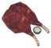 | **Húskarl Lox Ribs** | **📖 Guide 2.2.7** 1 Uncooked Húskarl Lox Ribs | — | ✨ Guide 2.2.7: Uncooked Food (Cooking Station) |
|  | **Húskarl’s Mead** | **📖 Guide 2.2.7** 1 Mead Base: Húskarl | — | ✨ StatusEffect: VC_HuskarlMead; Guide 2.2.7: +10 to Clubs skill, Clubs improves 15% faster; Thời gian effect: 10m 00s |
|  | **Hvergelmir Drops** | **📖 Guide 2.2.7** Have defeated The Queen | — | ✨ StatusEffect: VC_HvergelmirDropsEffect; HP theo thời gian: 4500.0; Stamina theo thời gian: 4500.0; Eitr theo thời gian: 4500.0; Guide 2.2.7: Restore 5 HP, SP and Eitr per second; Thời gian effect: 15m 00s 🧙‍♀️ BogWitch (1200 coins) |
|  | **Ironfangs Cordial** | **📖 Guide 2.2.7** 1 Cordial Base: Ironfang | — | ✨ StatusEffect: VC_IronfangCordialEffect; Choáng: -0.15000000596046448; DMG m_pierce: +10%; Guide 2.2.7: +10% pierce dmg, -15% stagger modifier, -25% physical dmg taken; Thời gian effect: 10m 00s |
|  | **Journey Bread** | **📖 Guide 2.2.7** 1 Journey Bread Dough | — | ✨ — |
|  | **Jugged Hare** | **📖 Guide 2.2.7** 1 Uncooked Jugged Hare | — | ✨ — |
|  | **Jugged Neck** | **📖 Guide 2.2.7** 1 Uncooked Jugged Neck | — | ✨ StatusEffect: VC_JuggedNeckEffect; Guide 2.2.7: +10 to Fishing skill for 10m; Thời gian effect: 10m 00s |
|  | **Jugged Salmon** | **📖 Guide 2.2.7** 1 Uncooked Jugged Salmon | — | ✨ — |
|  | **Kraken Tentacle** | **📖 Guide 2.2.7** Have defeated Moder | — | ✨ — 🧙‍♀️ BogWitch (250 coins) |
|  | **Kvasirs Blood** | **📖 Guide 2.2.7** Have defeated Yagluth | — | ✨ — 🧙‍♀️ BogWitch (200 coins) |
|  | **Landvidi Roots** | **📖 Guide 2.2.7** Dropped by Zil and Fuling Shaman | — | ✨ — 🐾 GoblinShaman 🐾 GoblinShaman_Hildir |
|  | **Lightning Resistance Mead** | **📖 Guide 2.2.7** 1 Mead Base: Lightning Resistance | — | ✨ StatusEffect: VC_LightningResistMeadEffect; Thời gian effect: 10m 00s |
|  | **Limbsplitters Cordial** | **📖 Guide 2.2.7** 1 Cordial Base: Limbsplitter | — | ✨ StatusEffect: VC_LimbsplitterCordialEffect; Choáng: -0.15000000596046448; DMG m_slash: +10%; Guide 2.2.7: +10% slash dmg, -15% stagger modifier, -25% physical dmg taken; Thời gian effect: 10m 00s |
|  | **Lox Cheese** | **📖 Guide 2.2.7** 1 Unfermented Lox Cheese | — | ✨ — |
| 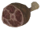 | **Lox Ham** | **📖 Guide 2.2.7** 1 Uncured Lox Ham | — | ✨ — |
|  | **Lox Milk** | **📖 Guide 2.2.7** Dropped by Lox / Collected from tamed Lox | — | ✨ StatusEffect: VC_LoxMilkEffect; Stamina theo thời gian: 15.0; Guide 2.2.7: Restore 15 SP in 1s; Thời gian effect: 0m 10s 🐾 Lox |
|  | **Lox Milking** | Không có công thức chế tạo trong config/guide | — | ✨ — |
|  | **Lumberjacks Philter** | **📖 Guide 2.2.7** None | — | ✨ Guide 2.2.7: +10 to Wood Cutting skill. Wood Cutting skill improves 15% faster 🧔 Haldor (120 coins) |
|  | **Lutefisk** | **📖 Guide 2.2.7** 1 Unfermented Lutefisk | — | ✨ — |
|  | **Mímisbrunnr Drops** | **📖 Guide 2.2.7** Dropped by Dvergr Support Mage and Fallen Valkyrie | — | ✨ Guide 2.2.7: Raise all skills 25% faster 🧙‍♀️ BogWitch (1200 coins) 🐾 DvergerMageSupport 🐾 FallenValkyrie |
|  | **Miners Philter** | **📖 Guide 2.2.7** None | — | ✨ Guide 2.2.7: +10 to Pickaxes skill. Pickaxes skill improves 15% faster 🧔 Haldor (120 coins) |
| 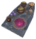 | **Móðsognir’s Hall Banquet** | **📖 Guide 2.2.7** 2 Dvergr Mage Broth, 6 Crispy Puffers, 2 Ratatosk’s Desire, 2 Dvergr Bouquet Garni | — | ✨ — |
|  | **Morrpølse** | **📖 Guide 2.2.7** 1 Uncured Morrpølse | — | ✨ — |
|  | **Njörðr Draught** | Không có công thức chế tạo trong config/guide | — | ✨ StatusEffect: VC_NjordrDraughtEffect; Tốc bơi: 0.5; +20% tốc độ thuyền; Thời gian effect: 15m 00s |
|  | **Nóatún’s Table of Plenty** | **📖 Guide 2.2.7** 3 Njörðr's Favorite, 2 Tuna with Herbs, 2 Cooked Serpent Meat, 2 Seafarer’s Herbs | — | ✨ — |
|  | **Nogginfog** | **📖 Guide 2.2.7** 1 Booze Base: Nogginfog | — | ✨ StatusEffect: VC_NogginfogEffect; Eitr ngay lập tức: 50.0; Guide 2.2.7: Restores 100 Eitr instantly; Thời gian effect: 0m 01s |
|  | **Northern Leech** | Không có công thức chế tạo trong config/guide | — | ✨ Guide 2.2.7: Type |
|  | **Northern Leech Trophy** | Không có công thức chế tạo trong config/guide | — | ✨ — |
|  | **Nótts Cap** | **📖 Guide 2.2.7** Found inside the Hollowed Tree / chance to drop from greydwarf at night | — | ✨ Guide 2.2.7: SL |
|  | **Oozed Serpent** | **📖 Guide 2.2.7** 1 Unbaked Oozed Serpent | — | ✨ — |
|  | **Overnight Broth** | **📖 Guide 2.2.7** 1 Uncooked Overnight Broth | — | ✨ Guide 2.2.7: +15 to Crafting skill for 10m |
|  | **Paltbröd** | **📖 Guide 2.2.7** 1 Paltbröd Dough | — | ✨ — |
|  | **Pickled Berries** | **📖 Guide 2.2.7** 1 Unfermented Pickled Berries | — | ✨ — |
|  | **Pickled Entrails** | **📖 Guide 2.2.7** 1 Unfermented Pickled Entrails | — | ✨ — |
|  | **Pickled Herring** | **📖 Guide 2.2.7** 1 Unfermented Pickled Herring | — | ✨ — |
|  | **Pickled Shrooms** | **📖 Guide 2.2.7** 1 Unfermented Pickled Shrooms | — | ✨ — |
|  | **Pickled Veggies** | **📖 Guide 2.2.7** 1 Unfermented Pickled Veggies | — | ✨ — |
|  | **Plowmaster’s Decoction** | **📖 Guide 2.2.7** 1 Decoction Base: Plowmaster | — | ✨ StatusEffect: VC_FarmerDecoctionEffect; Guide 2.2.7: +1m/comfort lvl.; Thời gian effect: 5m 00s |
|  | **Pork Ribs** | **📖 Guide 2.2.7** 1 Uncooked Pork Ribs | — | ✨ — |
|  | **Rakfisk** | **📖 Guide 2.2.7** 1 Unfermented Rakfisk | — | ✨ — |
|  | **Raspberry Pie** | **📖 Guide 2.2.7** 1 Unbaked Berry Pie | — | ✨ StatusEffect: VC_RaspberryPieEffect; Stamina theo thời gian: 1200.0; Guide 2.2.7: Restore 2 SP per second for 10m; Thời gian effect: 10m 00s |
|  | **RecipeToggles** | Không có công thức chế tạo trong config/guide | — | ✨ — |
|  | **Roasted Drake Heart** | **📖 Guide 2.2.7** 1 Drake Heart | — | ✨ — |
| 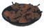 | **Roasted Fruit** | **📖 Guide 2.2.7** 1 Unbaked Roasted Fruit | — | ✨ — |
|  | **Rogues Cordial** | **📖 Guide 2.2.7** 1 Cordial Base: Rogue | — | ✨ StatusEffect: VC_RogueCordialEffect; Hồi Stamina: +15%; DMG m_pierce: +10%; DMG m_poison: +15%; Guide 2.2.7: +10% pierce dmg, +15% poison dmg, +15% SP regeneration; Thời gian effect: 10m 00s |
| 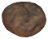 | **Rúgbrauð** | **📖 Guide 2.2.7** 1 Rúgbrauð Dough | — | ✨ Guide 2.2.7: -20% SP used with home items for 10m |
|  | **Sapped Greydwarf Eyes** | **📖 Guide 2.2.7** 1 Unfermented Sapped Greydwarf Eyes | — | ✨ — |
|  | **Sceadugengan Philter** | **📖 Guide 2.2.7** None | — | ✨ Guide 2.2.7: +10 to Sneaking skill, Sneaking improves 15% faster 🧔 Haldor (120 coins) |
|  | **Seiðkona’s Mead** | **📖 Guide 2.2.7** 1 Mead Base: Seiðkona | — | ✨ StatusEffect: VC_SeidkonaMead; Guide 2.2.7: +10 to Blood Magic skill, Blood Magic improves 15% faster; Thời gian effect: 10m 00s |
|  | **Shroom Beer** | **📖 Guide 2.2.7** 1 Unfermented Shroom Beer | — | ✨ — |
|  | **Shroom Mead** | **📖 Guide 2.2.7** 1 Unfermented Shroom Mead | — | ✨ — |
|  | **Skaði Hunting Draught** | Không có công thức chế tạo trong config/guide | — | ✨ — |
|  | **Skaði’s Hunting Draught** | Không có công thức chế tạo trong config/guide | — | ✨ StatusEffect: VC_SkadiDraughtEffect; Thời gian effect: 15m 00s |
|  | **Skilfingar Clan Royal Meal** | **📖 Guide 2.2.7** 3 Varangian Stew, 2 Regal Porridge, 2 Meadnog, 4 Elderblaze Dust | — | ✨ — |
|  | **Skjaldmær’s Mead** | **📖 Guide 2.2.7** 1 Mead Base: Skjaldmær | — | ✨ StatusEffect: VC_SkjaldmaerMead; Guide 2.2.7: +10 to Blocking skill, Blocking improves 15% faster; Thời gian effect: 10m 00s |
|  | **Skjaldmærs Cordial** | **📖 Guide 2.2.7** 1 Cordial Base: Skjaldmær | — | ✨ StatusEffect: VC_SkjaldmaerCordialEffect; Guide 2.2.7: +5 SP returned on block, +25% parry bonus; Thời gian effect: 10m 00s |
|  | **Skógarmaðr’s Mead** | **📖 Guide 2.2.7** 1 Mead Base: Skógarmaðr | — | ✨ StatusEffect: VC_SkogarmadrMead; Guide 2.2.7: +10 to Knives skill, Knives improves 15% faster; Thời gian effect: 10m 00s |
|  | **Skyr** | **📖 Guide 2.2.7** 1 Unfermented Skyr | — | ✨ — |
|  | **Smoked Asksvin Tail** | **📖 Guide 2.2.7** 1 Asksvin Tail | — | ✨ — |
|  | **Smoked Bear Meat** | **📖 Guide 2.2.7** 1 Bear Meat | — | ✨ — |
|  | **Smoked Boar Ham** | **📖 Guide 2.2.7** 1 Boar Ham | — | ✨ — |
|  | **Smoked Boar Meat** | **📖 Guide 2.2.7** 1 Boar Meat | — | ✨ — |
|  | **Smoked Bonemaw Meat** | **📖 Guide 2.2.7** 1 Bonemaw Meat | — | ✨ — |
|  | **Smoked Chicken Meat** | **📖 Guide 2.2.7** 1 Chicken Meat | — | ✨ — |
|  | **Smoked Deer Meat** | **📖 Guide 2.2.7** 1 Deer Meat | — | ✨ — |
| 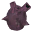 | **Smoked Drake Heart** | **📖 Guide 2.2.7** 1 Drake Heart | — | ✨ — |
|  | **Smoked Fish** | **📖 Guide 2.2.7** 1 Raw Fish | — | ✨ — |
| 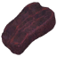 | **Smoked Fowl Meat** | **📖 Guide 2.2.7** 1 Fowl Meat | — | ✨ — |
|  | **Smoked Hare Meat** | **📖 Guide 2.2.7** 1 Hare Meat | — | ✨ — |
|  | **Smoked Kraken Tentacle** | **📖 Guide 2.2.7** 1 Kraken Tentacle | — | ✨ — |
| 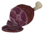 | **Smoked Lox ham** | **📖 Guide 2.2.7** 1 Lox Ham | — | ✨ — |
|  | **Smoked Lox Meat** | **📖 Guide 2.2.7** 1 Lox Meat | — | ✨ — |
|  | **Smoked Morrpølse** | **📖 Guide 2.2.7** 1 Morrpølse | — | ✨ — |
|  | **Smoked Neck Tail** | **📖 Guide 2.2.7** 1 Neck Tail | — | ✨ — |
|  | **Smoked Sausages** | **📖 Guide 2.2.7** 1 Sausages | — | ✨ — |
|  | **Smoked Seeker Meat** | **📖 Guide 2.2.7** 1 Seeker Meat | — | ✨ — |
| 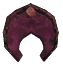 | **Smoked Serpent Meat** | **📖 Guide 2.2.7** 1 Serpent Meat | — | ✨ — |
|  | **Smoked Troll Meat** | **📖 Guide 2.2.7** 1 Troll Meat | — | ✨ — |
|  | **Smoked Volture Meat** | **📖 Guide 2.2.7** 1 Volture Meat | — | ✨ — |
|  | **Smoked Wolf Meat** | **📖 Guide 2.2.7** 1 Wolf Meat | — | ✨ — |
|  | **Smoked Wolf Salami** | **📖 Guide 2.2.7** 1 Wolf Salami | — | ✨ — |
|  | **Smokehouse** | Không có công thức chế tạo trong config/guide | — | ✨ — |
|  | **Spiced Perry** | **📖 Guide 2.2.7** 1 Unfermented Spiced Perry | — | ✨ — |
|  | **Sporebark** | **📖 Guide 2.2.7** Found inside the Hollowed Tree | — | ✨ — |
|  | **Stockfish** | **📖 Guide 2.2.7** 1 Raw Fish | — | ✨ — |
|  | **Stuffed Drake Heart** | **📖 Guide 2.2.7** 1 Unbaked Stuffed Drake Heart | — | ✨ Guide 2.2.7: -15% SP used when attacking for 10m |
|  | **Stuffed Turnips** | **📖 Guide 2.2.7** 1 Unbaked Stuffed Turnips | — | ✨ — |
|  | **Suttungr Mead** | **📖 Guide 2.2.7** 1 Suttungr Mead Base | — | ✨ — |
|  | **Svalinns Essence** | **📖 Guide 2.2.7** 1 Svalinn’s Essence Base | — | ✨ Guide 2.2.7: Creates a strong shield around the drinker |
|  | **Tórr Draught** | Không có công thức chế tạo trong config/guide | — | ✨ StatusEffect: VC_TorrDraughtEffect; +25% damage power attack; 50% cơ hội gọi lightning AoE; Thời gian effect: 15m 00s |
|  | **Trapped Vættr** | **📖 Guide 2.2.7** Dropped by Lord Reto | — | ✨ — 🐾 Charred_Melee_Dyrnwyn |
|  | **Troll Meat** | **📖 Guide 2.2.7** Dropped by Troll | — | ✨ — 🐾 Troll |
|  | **Tunnelrumbler** | **📖 Guide 2.2.7** 1 Booze Base: Tunnelrumbler | — | ✨ StatusEffect: VC_TunnelrumblerEffect; HP ngay lập tức: 50.0; Guide 2.2.7: Restores 100 HP instantly; Thời gian effect: 0m 01s |
|  | **Unmelting Snow** | **📖 Guide 2.2.7** Dropped by Stone Golem or sold by Bog Witch for 250 gold after defeating Moder | — | ✨ — 🐾 StoneGolem |
| 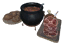 | **Valhǫll’s Great Feast** | **📖 Guide 2.2.7** 3 Sæhrímnir, 3 Lox Ham, 2 Rúgbrauð, 2 Andhrímnir´s Seasoning | — | ✨ — |
|  | **Víðarr Mighty Draught** | **📖 Guide 2.2.7** 6 Tar, 4 Surtling Core, 1 Heiðrún's Milk, 2 Medium Stamina Mead | — | ✨ Guide 2.2.7: +25% dmg against bosses |
|  | **Vikingr’s Mead** | **📖 Guide 2.2.7** 1 Mead Base: Vikingr | — | ✨ StatusEffect: VC_VikingrMead; Guide 2.2.7: +10 to Axes skill, Axes improves 15% faster; Thời gian effect: 10m 00s |
|  | **Vineberry Ale** | **📖 Guide 2.2.7** 1 Vinebarry Ale Base | — | ✨ StatusEffect: VC_VineberryAleEffect; HP ngay lập tức: 80.0; Stamina ngay lập tức: 80.0; Eitr ngay lập tức: 80.0; Guide 2.2.7: Restore 80 HP, SP and Eitr in 1s; Thời gian effect: 0m 01s |
|  | **Vitki’s Mead** | **📖 Guide 2.2.7** 1 Mead Base: Vitki | — | ✨ StatusEffect: VC_VitkiMead; Guide 2.2.7: +10 to Elmt. Magic skill, Elmt. Magic improves 15% faster; Thời gian effect: 10m 00s |
|  | **Vitkis Cordial** | **📖 Guide 2.2.7** 1 Cordial Base: Vitki | — | ✨ Guide 2.2.7: +15% elmt. magic dmg, -25% elmt. dmg taken |
|  | **Wanderers Cordial** | **📖 Guide 2.2.7** 1 Cordial Base: Wanderer | — | ✨ Guide 2.2.7: -15% SP used to jump, run, swim and dodge, +250 carry weight |
|  | **Wolf Salami** | **📖 Guide 2.2.7** 1 Uncured Wolf Salami | — | ✨ — |
|  | **Ýdalir Warming Stew** | **📖 Guide 2.2.7** 2 Mánagarmr Chops, 4 Chopped Veggies, 4 Thistle, 2 Mountain Peak Pepper Powder | — | ✨ — |
