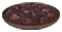
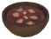
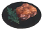
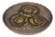
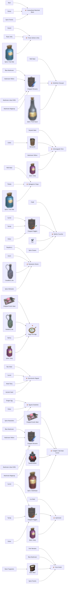

# ⚜️ Eldhrímnir — Bàn Huyền Thoại (32 items)

#### Legendary (2)

| 🍳 Icon | Tên Món | Công Thức | Stats Food | Ghi Chú |
| :---: | --- | --- | --- | --- |
|  | **Sæhrímnir** | **⚜️ Eldhrímnir — Bàn Huyền Thoại Lv.3** LoxMeat ×4, ChoppedVeggies ×2, SpiceAndy ×4 | ❤️110 ⚡30 💚+6/s ⏱️1h 20m | ✨ — |
|  | **Sveigðir’s Hall Main Course** | **⚜️ Eldhrímnir — Bàn Huyền Thoại Lv.4** ChoppedExoticMeat ×4, ChoppedShrooms ×4, Tunnelrumbler ×1, SpiceElderblaze ×4 | ❤️150 ⚡90 🟣80 💚+7/s ⏱️1h 20m | ✨ — |

#### Stew/Skause/Soup (4)

| 🍳 Icon | Tên Món | Công Thức | Stats Food | Ghi Chú |
| :---: | --- | --- | --- | --- |
|  | **Hróðvitnir Stewpot** | **⚜️ Eldhrímnir — Bàn Huyền Thoại Lv.5** WolfMeat ×4, ChoppedShrooms ×2, SpiceFrostSauce ×4 | ❤️180 ⚡120 🟣30 💚+7/s ⏱️1h 20m | ✨ — |
|  | **Jörmungandr Stew** | **⚜️ Eldhrímnir — Bàn Huyền Thoại Lv.3** SerpentMeat ×1, Barnacles ×6, MushroomYellow ×2, SpiceAndy ×4 | ❤️135 ⚡50 💚+6/s ⏱️1h 20m | ✨ — |
|  | **Sessrúmnirs Ragout** | **⚜️ Eldhrímnir — Bàn Huyền Thoại** RawMeat ×2, Carrot ×2, MeadTasty ×1, AncientSeed ×2 | ❤️70 ⚡20 💚+4/s ⏱️1h 20m | ✨ — |
|  | **Ymirs Broth** | **⚜️ Eldhrímnir — Bàn Huyền Thoại Lv.2** YmirRemains ×2, BlueMushroom ×6, BoneMeal ×6, SpiceForests ×1 | ❤️35 ⚡20 🟣65 💚+4/s ⏱️1h 20m | ✨ — |

#### Porridge/Grøt (2)

| 🍳 Icon | Tên Món | Công Thức | Stats Food | Ghi Chú |
| :---: | --- | --- | --- | --- |
|  | **Regal Porridge** | **⚜️ Eldhrímnir — Bàn Huyền Thoại Lv.4** ChoppedExoticMeat ×2, VineberryAle ×1, Barley ×8, SpiceAndy ×4 | ❤️60 ⚡120 🟣50 💚+7/s ⏱️1h 20m | ✨ — |
|  | **Sigurds Omelette** | **⚜️ Eldhrímnir — Bàn Huyền Thoại Lv.2** DragonEgg ×1, Onion ×3, SpiceMountains ×3 | ❤️20 ⚡90 💚+5/s ⏱️1h 20m | ✨ — |

#### Meat/Fish Dish (2)

| 🍳 Icon | Tên Món | Công Thức | Stats Food | Ghi Chú |
| :---: | --- | --- | --- | --- |
|  | **Frosty Salmon Jerky** | **⚜️ Eldhrímnir — Bàn Huyền Thoại Lv.5** Fish10 ×4, RoyalJelly ×6, SpiceFrostRub ×6 | ❤️100 ⚡100 💚+7/s ⏱️1h 20m | ✨ — |
|  | **Mánagarmr Chops** | **⚜️ Eldhrímnir — Bàn Huyền Thoại Lv.2** WolfMeat ×2, Thistle ×2, SpiceFrostRub ×2 | ❤️85 ⚡25 💚+5/s ⏱️1h 20m | ✨ — |

#### Khác (Other) (3)

| 🍳 Icon | Tên Món | Công Thức | Stats Food | Ghi Chú |
| :---: | --- | --- | --- | --- |
|  | **Caramelized Náströnd Roots** | **⚜️ Eldhrímnir — Bàn Huyền Thoại Lv.2** Root ×6, Honey ×4, SpiceForests ×1 | ❤️20 ⚡70 💚+4/s ⏱️1h 20m | ✨ — |
|  | **Njörðrs Favorite** | **⚜️ Eldhrímnir — Bàn Huyền Thoại Lv.2** Fish8 ×2, ChoppedVeggies ×2, Skyr ×1, SpiceOceans ×4 | ❤️40 ⚡110 💚+6/s ⏱️1h 20m | ✨ — |
|  | **Ratatoskrs Desire** | **⚜️ Eldhrímnir — Bàn Huyền Thoại Lv.3** Raspberry ×12, Acorn ×4, CloudberryAle ×1, SpiceMistlands ×4 | ❤️30 ⚡90 🟣100 💚+6/s ⏱️1h 20m | ✨ — |

| 🍳 Icon | Tên Vật Phẩm | Công Thức | Thông Số | Ghi Chú |
| :---: | --- | --- | --- | --- |
|  | **Ægir’s Blessing** | **⚜️ Eldhrímnir — Bàn Huyền Thoại Lv.2** TrophyHatchling ×1, SpiceOceans ×8, Barnacles ×20, MeadStaminaLingering ×2 | — | ✨ Guide 2.2.7: Forces tailwind when sailing |
|  | **Andhrímnir´s Gift** | **⚜️ Eldhrímnir — Bàn Huyền Thoại** MushroomYellow ×3, MushroomBzerker ×3, SpiceForests ×2, MeadTasty ×1 | — | ✨ Guide 2.2.7: +10 to Cooking skill, Cooking improves 15% faster |
|  | **Bloodmoon Cult Ceremonial Horn** | **⚜️ Eldhrímnir — Bàn Huyền Thoại Lv.2** TrophyUlv ×1, FreezeGland ×2, MeadStaminaMedium ×1 | — | ✨ StatusEffect: VC_BloodmoonHornEffect; Guide 2.2.7: -25% SP used to sprint, jump and dodge; Thời gian effect: 5m 00s |
|  | **Bragafull** | **⚜️ Eldhrímnir — Bàn Huyền Thoại Lv.5** HeidrunMead ×1, SuttungrMead ×1, SpiceAndy ×12, GoK ×1 | — | ✨ StatusEffect: VC_BragafullEffect; Sát thương: +25%; Guide 2.2.7: +25% dmg, +50% jump force, -100% fall damage; Thời gian effect: 5m 00s |
|  | **Einherjar Mixture** | **⚜️ Eldhrímnir — Bàn Huyền Thoại Lv.4** DragonTear ×2, CelestialFeather ×3, TrophyFallenValkyrie ×1 | — | ✨ StatusEffect: VC_EinherjarMixtureEffect; DMG m_damage: +50%; Guide 2.2.7: +50% dmg. +50% Adrenaline; Thời gian effect: 5m 00s |
|  | **Eir’s Gløgg** | **⚜️ Eldhrímnir — Bàn Huyền Thoại Lv.3** TrophyGoblinBruteBrosShaman ×1, MeadPoisonResist ×1 | — | ✨ Guide 2.2.7: -10% HP regen, Immunity to Poison |
|  | **Frigg’s Invigorating Tea** | **⚜️ Eldhrímnir — Bàn Huyền Thoại Lv.2** TrophyGreydwarfBrute ×1, Thistle ×10, AncientSeed ×8, Ectoplasm ×5 | — | ✨ Guide 2.2.7: Grants the Well-rested buff |
|  | **Glöð’s Brew** | **⚜️ Eldhrímnir — Bàn Huyền Thoại Lv.3** TrophySkeletonHildir ×1, BarleyWine ×1 | — | ✨ StatusEffect: VC_GlodsBrewEffect; Hồi HP: -10%; Thời gian effect: 1m 00s |
|  | **Gróa’s Elixir** | **⚜️ Eldhrímnir — Bàn Huyền Thoại Lv.4** Nogginfog ×2, Thunderstone ×1, GemstoneRed ×1 | — | ✨ StatusEffect: VC_GroaElixirEffect; Eitr theo thời gian: 1500.0; Hạ gục địch hồi +15 HP; Guide 2.2.7: +5 Eitr/s, -4 HP/s. Restore 15 HP per kill; Thời gian effect: 5m 00s |
|  | **Hermóðr’s Waterskin** | **⚜️ Eldhrímnir — Bàn Huyền Thoại Lv.2** TrophyWolf ×1, SpicePlains ×3, MeadHasty ×1 | — | ✨ StatusEffect: VC_HermodrWaterskinEffect; Tốc chạy: 1.0; Guide 2.2.7: +100% mvt. speed.; Thời gian effect: 2m 00s |
|  | **Hrungnirs Grog** | **⚜️ Eldhrímnir — Bàn Huyền Thoại Lv.5** TrophySGolem ×1, Booze ×2, GefjunMead ×2 | — | ✨ Guide 2.2.7: -50% mvt. speed, Immunity to Physical damage |
|  | **Mead Base: Heiðrún** | **⚜️ Eldhrímnir — Bàn Huyền Thoại Lv.3** HeidrunMilk ×2, MeadBaseStaminaMedium ×2 | — | ✨ — |
|  | **Mead Base: Suttungr** | **⚜️ Eldhrímnir — Bàn Huyền Thoại Lv.3** KvasirBlood ×2, MeadBaseEitrMinor ×2 | — | ✨ — |
|  | **Ráns Embrace** | **⚜️ Eldhrímnir — Bàn Huyền Thoại Lv.2** GreydwarfEye ×3, Barnacles ×5, SpiceOceans ×5, MeadSwimmer ×1 | — | ✨ StatusEffect: VC_RanEmbraceEffect; Guide 2.2.7: Increases the spawn rate of Serpents; Thời gian effect: 5m 00s |
|  | **Svaðilfari’s Drinking Water** | **⚜️ Eldhrímnir — Bàn Huyền Thoại Lv.3** Booze ×3, Tunnelrumbler ×3, Nogginfog ×3 | — | ✨ Guide 2.2.7: +500 carry weight |
|  | **Þórrablót Sacred Horn** | **⚜️ Eldhrímnir — Bàn Huyền Thoại Lv.3** TrophyGoblinBruteBrosBrute ×1, LightningResistMead ×1 | — | ✨ Guide 2.2.7: -10% HP regen, Immunity to Lightning |
|  | **Týrs Boozy Mead** | **⚜️ Eldhrímnir — Bàn Huyền Thoại Lv.3** TrophySurtling ×1, Booze ×1, MeadStaminaLingering ×2 | — | ✨ Guide 2.2.7: -20% SP used when attacking, -20% SP used while blocking |
|  | **Vættir Tears** | **⚜️ Eldhrímnir — Bàn Huyền Thoại Lv.2** TrophyCultist Hildir ×1, MeadFrostResist ×1 | — | ✨ StatusEffect: VC_VaettirTearsEffect; Hồi HP: -10%; Guide 2.2.7: -10% HP regen, Immunity to Frost; Thời gian effect: 1m 00s |
|  | **Vör’s Frothy Eggnog** | **⚜️ Eldhrímnir — Bàn Huyền Thoại Lv.4** VoltureEgg ×3, Honey ×2, LoxMilk ×1, MimirDrops ×1 | — | ✨ Guide 2.2.7: Raise all skills 50% faster |

## 🧬 Sơ Đồ Chế Biến (Mermaid)

### 🍽️ VC_Eldhrimnir (13 món)

