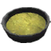
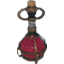
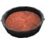
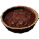
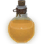
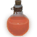
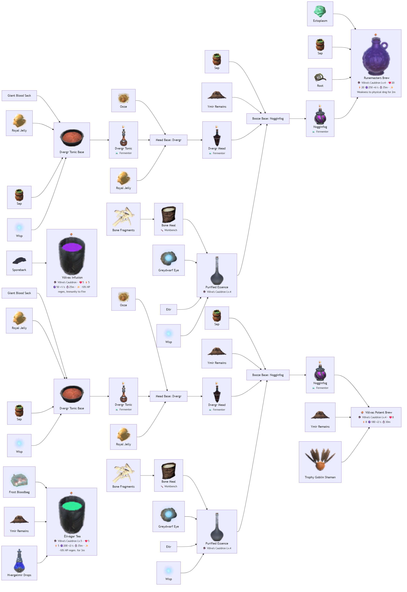

# 🔮 Nồi Đồng Völva (Völva's Cauldron) (45 items)

#### Cordial/Philter (3)

| 🍳 Icon | Tên Món | Công Thức | Stats Food | Ghi Chú |
| :---: | --- | --- | --- | --- |
|  | **Runemasters Brew** | **🔮 Nồi Đồng Völva (Völva's Cauldron) Lv.4** Ectoplasm ×1, Sap ×4, Root ×2, Nogginfog ×1 | ❤️20 ⚡20 🟣250 💚+6/s ⏱️35m 00s | ✨ Guide 2.2.7: Weakness to physical dmg for 2m |
|  | **Völvas Infusion** | **🔮 Nồi Đồng Völva (Völva's Cauldron)** Sporebark ×1 | ❤️5 ⚡5 🟣50 💚+1/s ⏱️25m 00s | ✨ Guide 2.2.7: -10% HP regen, Immunity to Fire |
|  | **Völvas Potent Brew** | **🔮 Nồi Đồng Völva (Völva's Cauldron) Lv.4** Nogginfog ×1, YmirRemains ×6, TrophyGoblinShaman ×2 | ❤️8 ⚡8 🟣180 💚+2/s ⏱️30m 00s | ✨ — |

#### Khác (Other) (1)

| 🍳 Icon | Tên Món | Công Thức | Stats Food | Ghi Chú |
| :---: | --- | --- | --- | --- |
|  | **Élivágar Tea** | **🔮 Nồi Đồng Völva (Völva's Cauldron) Lv.5** FrostBloodbag ×4, YmirRemains ×2, HvergelmirDrops ×1 | ❤️5 ⚡5 🟣200 💚+2/s ⏱️35m 00s | ✨ Guide 2.2.7: -10% HP regen. for 3m |

| 🍳 Icon | Tên Vật Phẩm | Công Thức | Thông Số | Ghi Chú |
| :---: | --- | --- | --- | --- |
|  | **Anti-Bite Concoction** | **🔮 Nồi Đồng Völva (Völva's Cauldron) Lv.2** Fish5 ×1, Onion ×2, SpiceOceans ×1 | — | ✨ StatusEffect: VC_BatRepellent; Guide 2.2.7: Prevent Bat attacks; Thời gian effect: 10m 00s |
|  | **Baldr’s Draught of Radiance** | **🔮 Nồi Đồng Völva (Völva's Cauldron) Lv.3** YmirRemains ×6, BoneMeal ×4, HeidrunMilk ×1, MeadHealthLingering ×2 | — | ✨ StatusEffect: VC_BaldrDraughtEffect; +15 spirit damage lên undead và demon; Guide 2.2.7: +15 spirit dmg against undead and demons.; Thời gian effect: 15m 00s |
|  | **Berserker Mixture** | **🔮 Nồi Đồng Völva (Völva's Cauldron) Lv.2** Guck ×4, Tar ×4, Cloudberry ×8, TrophyGoblinBrute ×1 | — | ✨ StatusEffect: VC_BerserkerMixtureEffect; DMG m_damage: +35%; Guide 2.2.7: +35% dmg. +35% Adrenaline; Thời gian effect: 5m 00s |
|  | **Booze Base** | **🔮 Nồi Đồng Völva (Völva's Cauldron) Lv.4** RoyalJelly ×10, YmirRemains ×10, DvergrMead ×5, PurifiedEssence ×5 | — | ✨ — |
|  | **Booze Base: Nogginfog** | **🔮 Nồi Đồng Völva (Völva's Cauldron) Lv.4** Sap ×10, YmirRemains ×10, DvergrMead ×5, PurifiedEssence ×5 | — | ✨ — |
|  | **Booze Base: Tunnelrumbler** | **🔮 Nồi Đồng Völva (Völva's Cauldron) Lv.4** GiantBloodSack ×10, YmirRemains ×10, DvergrMead ×5, PurifiedEssence ×5 | — | ✨ — |
|  | **Cordial Base: Battlerager** | **🔮 Nồi Đồng Völva (Völva's Cauldron) Lv.4** TrophySkeleton ×1, MeadStaminaMinor ×2, Carapace ×5, PurifiedEssence ×2 | — | ✨ — |
|  | **Cordial Base: Bonebreaker** | **🔮 Nồi Đồng Völva (Völva's Cauldron) Lv.4** TrophySkeleton ×1, MeadHealthMinor ×2, WitheredBone ×5, PurifiedEssence ×2 | — | ✨ — |
|  | **Cordial Base: Ironfang** | **🔮 Nồi Đồng Völva (Völva's Cauldron) Lv.4** TrophySkeleton ×1, MeadHealthMinor ×2, Needle ×5, PurifiedEssence ×2 | — | ✨ — |
|  | **Cordial Base: Limbsplitter** | **🔮 Nồi Đồng Völva (Völva's Cauldron) Lv.4** TrophySkeleton ×1, MeadHealthMinor ×2, WolfClaw ×5, PurifiedEssence ×2 | — | ✨ — |
|  | **Cordial Base: Rogue** | **🔮 Nồi Đồng Völva (Völva's Cauldron) Lv.4** TrophySkeleton ×1, MeadStaminaMinor ×2, Bilebag ×5, PurifiedEssence ×2 | — | ✨ — |
|  | **Cordial Base: Skjaldmær** | **🔮 Nồi Đồng Völva (Völva's Cauldron) Lv.4** TrophySkeleton ×1, MeadStaminaMinor ×2, SerpentScale ×5, PurifiedEssence ×2 | — | ✨ — |
|  | **Cordial Base: Vitki** | **🔮 Nồi Đồng Völva (Völva's Cauldron) Lv.4** TrophySkeleton ×1, MeadEitrMinor ×2, Sap ×5, PurifiedEssence ×2 | — | ✨ — |
|  | **Cordial Base: Wanderer** | **🔮 Nồi Đồng Völva (Völva's Cauldron) Lv.4** TrophySkeleton ×1, MeadStaminaMinor ×2, BarleyFlour ×5, PurifiedEssence ×2 | — | ✨ — |
|  | **Custom Bomb** | **🔮 Nồi Đồng Völva (Völva's Cauldron) Lv.5** BlobVial ×1, Ectoplasm ×20, PurifiedEssence ×15 | ⚔️ DMG: 5 | ✨ Guide 2.2.7: Configurable |
|  | **Decoction Base: Artificer** | **🔮 Nồi Đồng Völva (Völva's Cauldron) Lv.4** ArtisanPhilter ×5, MimirDrops ×1, SpiceBouquetGarni ×10, PurifiedEssence ×4 | — | ✨ — |
|  | **Decoction Base: Cauldron keeper** | **🔮 Nồi Đồng Völva (Völva's Cauldron) Lv.4** AndysGift ×5, MimirDrops ×1, SpiceBouquetGarni ×10, PurifiedEssence ×4 | — | ✨ — |
|  | **Decoction Base: Plowmaster** | **🔮 Nồi Đồng Völva (Völva's Cauldron) Lv.4** FarmerPhilter ×5, MimirDrops ×1, SpiceBouquetGarni ×10, PurifiedEssence ×4 | — | ✨ — |
|  | **Dvergr Tonic Base** | **🔮 Nồi Đồng Völva (Völva's Cauldron) Lv.4** GiantBloodSack ×10, RoyalJelly ×10, Sap ×10, Wisp ×1 | — | ✨ — |
|  | **Experimental Bomb: Bloodmoon** | **🔮 Nồi Đồng Völva (Völva's Cauldron) Lv.5** BlobVial ×1, Ectoplasm ×20, PurifiedEssence ×15, TrophyFenring ×2 | ⚔️ DMG: 5 | ✨ Guide 2.2.7: Spawn on impact: 3 Ulv, 2 Cultist, 2 Fenring |
|  | **Experimental Bomb: Niflheimr** | **🔮 Nồi Đồng Völva (Völva's Cauldron) Lv.5** BlobVial ×1, Ectoplasm ×20, PurifiedEssence ×15, TrophyWraith ×2 | ⚔️ DMG: 5 | ✨ Guide 2.2.7: Spawn on impact: 3 Draugr, 2 Ghost, 2 Wraith |
|  | **Experimental Bomb: The Horde** | **🔮 Nồi Đồng Völva (Völva's Cauldron) Lv.5** BlobVial ×1, Ectoplasm ×20, PurifiedEssence ×15, TrophyGoblinBrute ×2 | ⚔️ DMG: 5 | ✨ Guide 2.2.7: Spawn on impact: 4 Fuling, 2 Fuling Berserker |
|  | **Freyjas Seiðr Draught** | **🔮 Nồi Đồng Völva (Völva's Cauldron) Lv.3** RoyalJelly ×6, Eitr ×4, HeidrunMilk ×1, MeadEitrMinor ×2 | — | ✨ StatusEffect: VC_FreyjaDraughtEffect; Hồi Eitr: +10%; Guide 2.2.7: Staff attacks cost 25% less Eitr, +10% Eitr regen.; Thời gian effect: 15m 00s |
|  | **Freyrs Bountiful Draught** | **🔮 Nồi Đồng Völva (Völva's Cauldron) Lv.3** Bloodbag ×6, BarleyFlour ×4, HeidrunMilk ×1, MeadStaminaMedium ×2 | — | ✨ StatusEffect: VC_FreyrDraughtEffect; Thời gian effect: 15m 00s |
|  | **Ghost Extract** | **🔮 Nồi Đồng Völva (Völva's Cauldron)** TrophyGhost ×1, MeadHealthMinor ×1 | — | ✨ StatusEffect: VC_GhostExtractEffect; Guide 2.2.7: -100% fall damage; Thời gian effect: 10m 00s |
|  | **Goði’s Brew** | **🔮 Nồi Đồng Völva (Völva's Cauldron)** GreydwarfEye ×4, Ectoplasm ×1, BoneMeal ×2, Honey ×3 | — | ✨ StatusEffect: VC_GodiBrewEffect; HP theo thời gian: 600.0; DMG m_spirit: +15%; Guide 2.2.7: +15% spirit dmg. Restore 1 HP per second; Thời gian effect: 10m 00s |
|  | **Herbal Remedy** | **🔮 Nồi Đồng Völva (Völva's Cauldron)** Pukeberries ×6, Thistle ×4, Dandelion ×8 | — | ✨ StatusEffect: VC_HerbalRemedyEffect; HP theo thời gian: 40.0; Guide 2.2.7: Restore 40 HP in 1s; Thời gian effect: 0m 01s |
|  | **Iðunn’s Golden Draught** | **🔮 Nồi Đồng Völva (Völva's Cauldron) Lv.3** Cloudberry ×8, KvasirBlood ×2, HeidrunMilk ×1, VineberryAle ×2 | — | ✨ StatusEffect: VC_IdunnDraughtEffect; +20 max HP, +20 max Stamina, +20 max Eitr; hồi ngay các giá trị tương ứng; Guide 2.2.7: +20 HP, SP and Eitr; Thời gian effect: 15m 00s |
|  | **Jöfurr Mixture** | **🔮 Nồi Đồng Völva (Völva's Cauldron)** Coal ×4, Resin ×4, Raspberry ×6, TrophyGreydwarfBrute ×1 | — | ✨ StatusEffect: VC_JofurrMixtureEffect; DMG m_damage: +15%; Guide 2.2.7: +15% dmg. +15% Adrenaline; Thời gian effect: 5m 00s |
|  | **Lupine Extract** | **🔮 Nồi Đồng Völva (Völva's Cauldron) Lv.2** Guck ×3, WolfFang ×4, TrophyUlv ×1, MeadStaminaMinor ×1 | — | ✨ StatusEffect: VC_LupineExtractEffect; Tốc chạy: 0.20000000298023224; Guide 2.2.7: +20% mvt. speed, -15% SP sprint SP use; Thời gian effect: 10m 00s |
|  | **Miners Infusion** | **🔮 Nồi Đồng Völva (Völva's Cauldron)** Dandelion ×6, GreydwarfEye ×2, Root ×1, BoneMeal ×2 | — | ✨ StatusEffect: VC_MinerInfusionEffect; Sát thương: -100%; DMG m_pickaxe: +20%; Guide 2.2.7: +20% mining speed; Thời gian effect: 10m 00s |
|  | **Njörðrs Seafarer Draught** | **🔮 Nồi Đồng Völva (Völva's Cauldron) Lv.3** Barnacles ×6, SpiceOceans ×4, HeidrunMilk ×1, MeadSwimmer ×2 | — | ✨ StatusEffect: VC_NjordrDraughtEffect; Tốc bơi: 0.5; Guide 2.2.7: +20% sailing speed. +50% swim speed; Thời gian effect: 15m 00s |
|  | **Purified Essence** | **🔮 Nồi Đồng Völva (Völva's Cauldron) Lv.4** BoneMeal ×10, GreydwarfEye ×5, Eitr ×3, Wisp ×1 | — | ✨ — |
|  | **Skaðis Hunting Draught** | **🔮 Nồi Đồng Völva (Völva's Cauldron) Lv.3** Guck ×6, WolfFang ×4, HeidrunMilk ×1, MeadTasty ×2 | — | ✨ StatusEffect: VC_SkadiDraughtEffect; Guide 2.2.7: Raise trophy drop chance by 25%. +1 meat drops; Thời gian effect: 15m 00s |
|  | **Spice Tea** | **🔮 Nồi Đồng Völva (Völva's Cauldron) Lv.4** SpicePlains ×6, SpiceMountains ×6, SpiceAshlands ×6 | — | ✨ StatusEffect: VC_SpiceTea; Guide 2.2.7: Become Very Resistant to all elements; Thời gian effect: 5m 00s |
|  | **Svalinns Essence Base** | **🔮 Nồi Đồng Völva (Völva's Cauldron) Lv.4** FrostBloodbag ×20, SerpentScale ×10, CeramicPlate ×10, PurifiedEssence ×5 | — | ✨ — |
|  | **Þórr’s Draught of Wrath** | **🔮 Nồi Đồng Völva (Völva's Cauldron) Lv.3** GreydwarfEye ×6, Thunderstone ×4, HeidrunMilk ×1, MeadStaminaLingering ×2 | — | ✨ StatusEffect: VC_TorrDraughtEffect; +25% damage power attack; 50% cơ hội gọi lightning AoE; Guide 2.2.7: +25% secondary attack dmg. Secondary attacks have a chance to invoke Þórr’s wrath.; Thời gian effect: 15m 00s |
|  | **Úlfhéðnar Mixture** | **🔮 Nồi Đồng Völva (Völva's Cauldron) Lv.2** FreezeGland ×4, Ooze ×4, WolfHairBundle ×6, TrophyFenring ×1 | — | ✨ StatusEffect: VC_UlfhednarMixtureEffect; DMG m_damage: +25%; Guide 2.2.7: +25% dmg. +25% Adrenaline; Thời gian effect: 5m 00s |
|  | **Víðarr’s Vengeful Draught** | **🔮 Nồi Đồng Völva (Völva's Cauldron) Lv.3** Tar ×6, SurtlingCore ×4, HeidrunMilk ×1, MeadStaminaMedium ×2 | — | ✨ StatusEffect: VC_VidarrDraughtEffect; +25% damage lên boss; Thời gian effect: 15m 00s |
|  | **Woodcutter’s Infusion** | **🔮 Nồi Đồng Völva (Völva's Cauldron)** ElderBark ×2, BirchSeeds ×3, Root ×1 | — | ✨ StatusEffect: VC_WoodcutterInfusionEffect; Sát thương: -100%; DMG m_chop: +20%; Guide 2.2.7: +20% chopping damage; Thời gian effect: 10m 00s |
|  | **Wraithward** | **🔮 Nồi Đồng Völva (Völva's Cauldron)** FragrantBundle ×2, Thistle ×5, GreydwarfEye ×5 | — | ✨ StatusEffect: VC_WraithRepellent; Guide 2.2.7: Prevent Wraith attacks; Thời gian effect: 10m 00s |

## 🧬 Sơ Đồ Chế Biến (Mermaid)

### 🍽️ VC_VolvaCauldron (4 món)

