# 👨‍🍳 Bàn Đầu Bếp (Chef's Table) (20 items)

| 🍳 Icon | Tên Vật Phẩm | Công Thức | Thông Số | Ghi Chú |
| :---: | --- | --- | --- | --- |
| 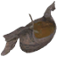 | **Ægir’s Offering Stew** | **👨‍🍳 Bàn Đầu Bếp (Chef's Table)** JormundStew ×3, LyngbakrChowder ×2, MeadTasty ×4, SpiceAndy ×2 | — | ✨ — |
| 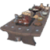 | **Alföðr’s Revelry Prepared Meals** | **👨‍🍳 Bàn Đầu Bếp (Chef's Table)** SveigdirMeal ×3, RegalPorridge ×3, HeidrunMead ×2, SpiceElderblaze ×4 | — | ✨ — |
|  | **Andhrímnirs Secret Seasoning** | **👨‍🍳 Bàn Đầu Bếp (Chef's Table)** SpiceForests ×2, SpiceMountains ×2, SpicePlains ×2, Flax ×6 | — | ✨ — |
| 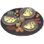 | **Dragonslayer’s Dagmál Platter** | **👨‍🍳 Bàn Đầu Bếp (Chef's Table)** SigurdOmelette ×3, PickledVeggies ×4, Hakarl ×10, SpiceForests ×4 | — | ✨ — |
|  | **Dvergr Bouquet Garni** | **👨‍🍳 Bàn Đầu Bếp (Chef's Table)** SpiceMistlands ×2, PowderedDragonEgg ×1, SpiceOceans ×2, Thistle ×2 | — | ✨ — |
| 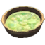 | **Einherjars Mead Barrel** | **👨‍🍳 Bàn Đầu Bếp (Chef's Table)** HeidrunMead ×6, MeadTasty ×4, SpiceAndy ×2 | — | ✨ — |
| 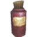 | **Elderblaze Dust** | **👨‍🍳 Bàn Đầu Bếp (Chef's Table)** SpiceAshlands ×2, PowderedDragonEgg ×2, ProustitePowder ×5 | — | ✨ — |
| 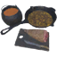 | **Éljúðnir Banquet Prepared Meals** | **👨‍🍳 Bàn Đầu Bếp (Chef's Table)** BoneBroth ×3, CaramelizedRoots ×2, BoarHam ×2, SpiceForests ×2 | — | ✨ — |
| 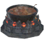 | **Fimbulvetr Stew** | **👨‍🍳 Bàn Đầu Bếp (Chef's Table)** HrodvitnirStewpot ×3, GalgvidrSkause ×3, SpiceAndy ×4, SpiceElderblaze ×4 | — | ✨ — |
| 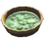 | **Fjalarr’s Mead Barrel** | **👨‍🍳 Bàn Đầu Bếp (Chef's Table)** SuttungrMead ×6, Nogginfog ×2, SpiceBouquetGarni ×2 | — | ✨ — |
| 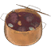 | **Fólkvangr Náttmál Stew** | **👨‍🍳 Bàn Đầu Bếp (Chef's Table)** SessrumnirRagout ×3, PorkRibs ×4, SpiceForests ×2 | — | ✨ — |
| 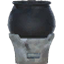 | **Ginnungagap’s Cauldron Broth** | **👨‍🍳 Bàn Đầu Bếp (Chef's Table)** SmokedTroll ×3, YmirBroth ×2, SpicedPerry ×2, PowderedDragonEgg ×5 | — | ✨ — |
|  | **Highlands Frosty Rub** | **👨‍🍳 Bàn Đầu Bếp (Chef's Table)** SpiceMountains ×2, SpiceSnow ×2, FreezeGland ×2 | — | ✨ — |
| 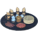 | **Hindarfjall Platter** | **👨‍🍳 Bàn Đầu Bếp (Chef's Table)** Lefse ×12, SalmonJerky ×8, Eyescream ×4, SpiceAndy ×4 | — | ✨ — |
| 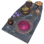 | **Móðsognir’s Banquet Victuals** | **👨‍🍳 Bàn Đầu Bếp (Chef's Table)** DvergrMageBroth ×2, CrispyPuffers ×6, RatatoskrDesire ×2, SpiceBouquetGarni ×2 | — | ✨ — |
| 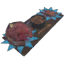 | **Nóatún’s Feast Fare** | **👨‍🍳 Bàn Đầu Bếp (Chef's Table)** NjordFavorite ×3, TunaWHerbs ×2, SerpentMeatCooked ×2, SpiceOceans ×2 | — | ✨ — |
|  | **Skilfingar Royal Meal Victuals** | **👨‍🍳 Bàn Đầu Bếp (Chef's Table)** VarangianStew ×3, RegalPorridge ×2, Meadnog ×2, SpiceElderblaze ×4 | — | ✨ — |
| 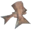 | **Thickening Sauce of the Frozen Depths** | **👨‍🍳 Bàn Đầu Bếp (Chef's Table)** BarleyFlour ×6, BoneMeal ×6, FrostBloodbag ×4, Butter ×4 | — | ✨ — |
| 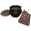 | **Valhǫll’s Great Feast Victuals** | **👨‍🍳 Bàn Đầu Bếp (Chef's Table)** Saehrimnir ×3, LoxHam ×3, Rugbraud ×2, SpiceAndy ×2 | — | ✨ — |
| 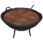 | **Ýdalir Stew** | **👨‍🍳 Bàn Đầu Bếp (Chef's Table)** ManagarmrChop ×2, ChoppedVeggies ×4, Thistle ×4, SpiceMountains ×2 | — | ✨ — |
