# 🧰 Trạm Phụ & Công Cụ Khác (37 items)

## 🧈 Máy Đánh Bơ (Butter Churn) (2 items)

| 🍳 Icon | Tên Món | Công Thức | Stats Food | Ghi Chú |
| :---: | --- | --- | --- | --- |
| 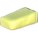 | **Butter** | **🧈 Máy Đánh Bơ (Butter Churn)** LoxMilk ×5 | ❤️4 ⚡33 💚+2/s ⏱️25m 00s | ✨ — |

| 🍳 Icon | Tên Vật Phẩm | Công Thức | Thông Số | Ghi Chú |
| :---: | --- | --- | --- | --- |
|  | **Unfermented Bog Butter** | **🧈 Máy Đánh Bơ (Butter Churn)** LoxMilk ×5, Sap ×2 | — | ✨ — |

## 🧬 Sơ Đồ Chế Biến (Mermaid)

### 🍽️ VC_ButterChurn (1 món)

## 🔨 Bàn Làm Việc (Workbench) (12 items)

| 🍳 Icon | Tên Vật Phẩm | Công Thức | Thông Số | Ghi Chú |
| :---: | --- | --- | --- | --- |
| 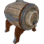 | **Ashwood Food Fermenter** | **🔨 Bàn Làm Việc (Workbench)** Blackwood:10 ×1, CharcoalResin:2 ×1, FlametalNew:2 ×1 | — | ✨ — |
| 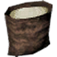 | **Bone Meal** | **🔨 Bàn Làm Việc (Workbench)** BoneFragments ×10 | — | ✨ — |
| 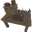 | **Chefs Table** | **🔨 Bàn Làm Việc (Workbench)** FineWood:10 ×1, RoundLog:6 ×1, Iron:8 ×1, CookingSupplies:4 ×1 | — | ✨ Guide 2.2.7: 10 Fine Wood, 6 Core Wood, 8 Iron, 4 Cooking Supplies |
| 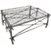 | **Drying Rack** | **🔨 Bàn Làm Việc (Workbench)** Wood:10 ×1, LinenThread:15 ×1 | — | ✨ Guide 2.2.7: 10 Wood, 15 Linen Thread |
|  | **Food Fermenter** | **🔨 Bàn Làm Việc (Workbench)** ElderBark:10 ×1, Resin:8 ×1, BarrelRings:1 ×1 | — | ✨ Guide 2.2.7: 10 Ancient Bark, 8 Resin, 1 Barrel Hoops |
| 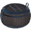 | **Freezing Barrel** | **🔨 Bàn Làm Việc (Workbench)** Blackwood:20 ×1, BarrelRings:1 ×1, FrostBloodbag:4 ×1, CookingSupplies:4 ×1 | — | ✨ Guide 2.2.7: 20 Ashwood, 1 Barrel Hoops, 4 Frozen Bloodbag, 4 Cooking Supplies |
|  | **Hanging Ladles** | **🔨 Bàn Làm Việc (Workbench)** RoundLog:4 ×1, FineWood:4 ×1, IronNails:2 ×1 | — | ✨ Guide 2.2.7: 4 Core Wood, 4 Finewood, 2 Iron Nails |
| 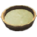 | **Ingredient Shelves** | **🔨 Bàn Làm Việc (Workbench)** FineWood:16 ×1, IronNails:12 ×1, Silver:6 ×1, CookingSupplies:4 ×1 | — | ✨ Guide 2.2.7: 16 Finewood,12 Iron Nails, 6 Silver, 4 Cooking Supplies |
| 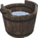 | **Milking Bucket** | **🔨 Bàn Làm Việc (Workbench)** Wood ×10, Resin ×6, BarrelRings ×1 | — | ✨ — |
| 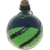 | **Selective Collection** | **🔨 Bàn Làm Việc (Workbench)** RoundLog:20 ×1, FineWood:50 ×1, BarrelRings:9 ×1, CookingSupplies:8 ×1 | — | ✨ Guide 2.2.7: 20 Ancient Bark, 50 Finewood, 9 Barrel Hoops, 8 Cooking Supplies |
|  | **Spice Shelf** | **🔨 Bàn Làm Việc (Workbench)** Blackwood:6 ×1, CharcoalResin:2 ×1, IronNails:4 ×1, CookingSupplies:4 ×1 | — | ✨ Guide 2.2.7: 6 Ashwood, 2 Charcoal Resin, 4 Iron Nails, 4 Cooking Supplies |
|  | **Wooden Smokehouse** | **🔨 Bàn Làm Việc (Workbench)** Wood:50 ×1, Stone:5 ×1 | — | ✨ Guide 2.2.7: 50 Wood, 5 Stone |

## ⚒️ Lò Rèn (Forge) (6 items)

| 🍳 Icon | Tên Vật Phẩm | Công Thức | Thông Số | Ghi Chú |
| :---: | --- | --- | --- | --- |
| 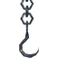 | **Drying Hook** | **⚒️ Lò Rèn (Forge)** Iron:1 ×1 | — | ✨ Guide 2.2.7: 1 Iron |
| 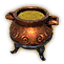 | **Eldhrímnir** | **⚒️ Lò Rèn (Forge)** NidavellirBronze:12 ×1 | — | ✨ Guide 2.2.7: 12 Niðavellir Bronze |
|  | **Fuling Cooking Cauldron** | **⚒️ Lò Rèn (Forge) Lv.5** Iron ×14, Stone ×20, FulingTablet ×1 | — | ✨ — |
|  | **Keg Hammer** | **⚒️ Lò Rèn (Forge)** FineWood ×4, Resin ×2, Tin ×2, BronzeNails ×8 | — | ✨ — |
| 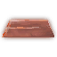 | **Niðavellir Bronze** | **⚒️ Lò Rèn (Forge)** Copper ×2, Tin ×1, Coal ×3, SurtlingCore ×1 | — | ✨ — |
| 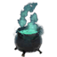 | **Völvas Cauldron** | **⚒️ Lò Rèn (Forge)** Iron:20 ×1 | — | ✨ Guide 2.2.7: 20 Iron |

## 🥩 Bàn Cắt (Butcher Table) (4 items)

| 🍳 Icon | Tên Vật Phẩm | Công Thức | Thông Số | Ghi Chú |
| :---: | --- | --- | --- | --- |
|  | **Barnacles** | **🥩 Bàn Cắt (Butcher Table)** Chitin ×6 | — | ✨ — |
|  | **Chopped Meat** | **🥩 Bàn Cắt (Butcher Table)** RawMeat ×1, DeerMeat ×1, WolfMeat ×1, LoxMeat ×1 | — | ✨ — |
|  | **Exotic Meat** | **🥩 Bàn Cắt (Butcher Table)** TrollMeat ×1, BugMeat ×1, HareMeat ×1, AsksvinMeat ×1 | — | ✨ — |
|  | **Kraken Tentacle Chunks** | **🥩 Bàn Cắt (Butcher Table)** KrakenTentacle ×1 | — | ✨ — |

## 🧪 Bàn Phép Thuật (Mage Table) (4 items)

| 🍳 Icon | Tên Vật Phẩm | Công Thức | Thông Số | Ghi Chú |
| :---: | --- | --- | --- | --- |
| 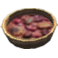 | **Dvergr Apparatus** | **🧪 Bàn Phép Thuật (Mage Table)** BlobVial:1 ×1, MechanicalSpring:1 ×1, NidavellirBronze:5 ×1, YggdrasilWood:10 ×1 | — | ✨ — |
| 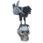 | **Freydís** | **🧪 Bàn Phép Thuật (Mage Table)** RavenTablet:1 ×1, TrophySkeleton:3 ×1, BoneFragments:10 ×1, Grausten:8 ×1 | — | ✨ Guide 2.2.7: 1 Hrafnagaldr Nótts, 3 Skeleton Trophy, 10 Bone Fragments, 8 Grausten |
| 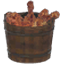 | **Grimpys Box** | **🧪 Bàn Phép Thuật (Mage Table)** TrappedVaettir:1 ×1, FineWood:20 ×1, FlametalNew:2 ×1, QueensJam:4 ×1 | — | ✨ Guide 2.2.7: 1 Trapped Vættr, 20 Finewood, 2 Flametal, 4 Queen’s Jam |
|  | **Hrafnagaldr Nótts** | **🧪 Bàn Phép Thuật (Mage Table) Lv.4** BlackMarble ×2, Ectoplasm ×10, CelestialFeather ×5, TrophyFallenValkyrie ×1 | — | ✨ — |

## 🏗️ Bàn Thợ Thủ Công (Artisan Table) (3 items)

| 🍳 Icon | Tên Vật Phẩm | Công Thức | Thông Số | Ghi Chú |
| :---: | --- | --- | --- | --- |
| 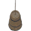 | **Butter Churn** | **🏗️ Bàn Thợ Thủ Công (Artisan Table)** RoundLog:20 ×1, IronNails:10 ×1, BarrelRings:1 ×1 | — | ✨ Guide 2.2.7: 20 Core Wood, 10 Iron Nails, 1 Barrel Hoops |
| 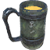 | **Goblet of Kings** | **🏗️ Bàn Thợ Thủ Công (Artisan Table)** GoKParts ×1, GemstoneRed ×4, GemstoneGreen ×2, TrophySkeleton ×1 | — | ✨ — |
|  | **Great Fermenter** | **🏗️ Bàn Thợ Thủ Công (Artisan Table)** FineWood:30 ×1, NidavellirBronze:20 ×1, IronNails:20 ×1, Resin:10 ×1 | — | ✨ — |

## 🪨 Máy Cắt Đá (Stone Cutter) (3 items)

| 🍳 Icon | Tên Vật Phẩm | Công Thức | Thông Số | Ghi Chú |
| :---: | --- | --- | --- | --- |
|  | **Fuling Cauldron** | **🪨 Máy Cắt Đá (Stone Cutter)** Stone:40 ×1, BoneFragments:40 ×1, GoblinTotem:1 ×1, FulingCauldron Mat:1 ×1 | — | ✨ Guide 2.2.7: 40 Stone, 40 Bone Fragments, 1 Fuling Totem, 1 Fuling Cauldron |
|  | **Hörgr** | **🪨 Máy Cắt Đá (Stone Cutter)** Stone:100 ×1, CandleWick:10 ×1, Tar:4 ×1, Coal:6 ×1 | — | ✨ Guide 2.2.7: 100 Stone, 10 Candle Wick, 4 Tar, 6 Coal |
|  | **Stone Smokehouse** | **🪨 Máy Cắt Đá (Stone Cutter)** Stone:80 ×1, FineWood:20 ×1, Iron:16 ×1, IronNails:12 ×1 | — | ✨ Guide 2.2.7: 80 Stone, 20 Finewood, 16 Iron, 12 Iron Nails |

## ⬛ Lò Rèn Đen (Black Forge) (2 items)

| 🍳 Icon | Tên Vật Phẩm | Công Thức | Thông Số | Ghi Chú |
| :---: | --- | --- | --- | --- |
| 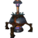 | **Dvergr Cauldron** | **⬛ Lò Rèn Đen (Black Forge)** Iron:20 ×1, NidavellirBronze:15 ×1, YggdrasilWood:20 ×1, BlackCore:5 ×1 | — | ✨ — |
| 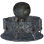 | **Goblet Parts** | **⬛ Lò Rèn Đen (Black Forge) Lv.4** FlametalNew ×6, NidavellirBronze ×2 | — | ✨ — |

## 🎒 Hành Trang (Inventory) (1 items)

| 🍳 Icon | Tên Vật Phẩm | Công Thức | Thông Số | Ghi Chú |
| :---: | --- | --- | --- | --- |
| 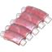 | **Uncooked Pork Ribs** | **🎒 Hành Trang (Inventory)** RawMeat ×2, Honey ×1, Raspberry ×4 | — | ✨ — |
