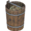
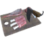
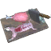

# 🥩 Bàn Cắt (Butcher Table) (4 items)

| 🍳 Icon | Tên Vật Phẩm | Công Thức | Thông Số | Ghi Chú |
| :---: | --- | --- | --- | --- |
|  | **Barnacles** | **🥩 Bàn Cắt (Butcher Table)** Chitin ×6 | — | ✨ — |
|  | **Chopped Meat** | **🥩 Bàn Cắt (Butcher Table)** RawMeat ×1, DeerMeat ×1, WolfMeat ×1, LoxMeat ×1 | — | ✨ — |
|  | **Exotic Meat** | **🥩 Bàn Cắt (Butcher Table)** TrollMeat ×1, BugMeat ×1, HareMeat ×1, AsksvinMeat ×1 | — | ✨ — |
|  | **Kraken Tentacle Chunks** | **🥩 Bàn Cắt (Butcher Table)** KrakenTentacle ×1 | — | ✨ — |
