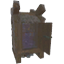

# 🪨 Máy Cắt Đá (Stone Cutter) (3 items)

| 🍳 Icon | Tên Vật Phẩm | Công Thức | Thông Số | Ghi Chú |
| :---: | --- | --- | --- | --- |
|  | **Fuling Cauldron** | **🪨 Máy Cắt Đá (Stone Cutter)** Stone:40 ×1, BoneFragments:40 ×1, GoblinTotem:1 ×1, FulingCauldron Mat:1 ×1 | — | ✨ Guide 2.2.7: 40 Stone, 40 Bone Fragments, 1 Fuling Totem, 1 Fuling Cauldron |
|  | **Hörgr** | **🪨 Máy Cắt Đá (Stone Cutter)** Stone:100 ×1, CandleWick:10 ×1, Tar:4 ×1, Coal:6 ×1 | — | ✨ Guide 2.2.7: 100 Stone, 10 Candle Wick, 4 Tar, 6 Coal |
|  | **Stone Smokehouse** | **🪨 Máy Cắt Đá (Stone Cutter)** Stone:80 ×1, FineWood:20 ×1, Iron:16 ×1, IronNails:12 ×1 | — | ✨ Guide 2.2.7: 80 Stone, 20 Finewood, 16 Iron, 12 Iron Nails |
