# 🧬 Sơ Đồ Chế Biến Cuisine (Mermaid)

Sơ đồ cây công thức: **nguyên liệu → món**. Món dùng làm nguyên liệu cho món khác sẽ tự khai triển thành cây con. Kích thước lớn — nếu không render trên thiết bị, hãy xem trên máy tính/GitBook.

### 🍲 Cauldron (130 món)

```mermaid
flowchart LR
  Adventurers_Porridge_0["🍲 Adventurers Porridge"]
  VC_VegetableSoup_1["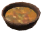 Vegetable Soup"]
  Carrot_2["Carrot"]
  Turnip_3["Turnip"]
  MushroomYellow_4["Mushroom Yellow"]
  MushroomJotunPuffs_5["Mushroom Jotun Puffs"]
  Barley_6["Barley"]
  Thistle_7["Thistle"]
  Ammas_Hearty_Stew_8["🍲 Ammas Hearty Stew"]
  CookedDeerMeat_9["Cooked Deer Meat"]
  VC_CuredPork_10[" Cured Pork"]
  VC_GlazedTurnips_11["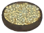 Glazed Turnips"]
  VC_BlueMushroom_12["Blue Mushroom"]
  Asksvin_Svi__13["🍲 Asksvin Svið"]
  TrophyAsksvin_14["Trophy Asksvin"]
  Fiddleheadfern_15["Fiddleheadfern"]
  Sap_16["Sap"]
  Barley_Gruel_17["🍲 Barley Gruel"]
  Barley_18["Barley"]
  VC_Biksemad_19["🍲 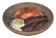 Biksemad"]
  CookedLoxMeat_20["Cooked Lox Meat"]
  MushroomSmokePuff_21["Mushroom Smoke Puff"]
  CookedEgg_22["Cooked Egg"]
  Blazing_Yggdrasil_Stew_23["🍲 Blazing Yggdrasil Stew"]
  VC_ChoppedVeggies_24[" Chopped Veggies"]
  Carrot_25["Carrot"]
  Turnip_26["Turnip"]
  Onion_27["Onion"]
  Sap_28["Sap"]
  SulfurStone_29["Sulfur Stone"]
  ProustitePowder_30["Proustite Powder"]
  Blodpl_ttar_31["🍲 Blodplättar"]
  GiantBloodSack_32["Giant Blood Sack"]
  BarleyFlour_33["Barley Flour"]
  Honey_34["Honey"]
  Blueberries_35["Blueberries"]
  Blodp_lse_36["🍲 Blodpølse"]
  TrophyLeech_37["Trophy Leech"]
  VC_TrollMeat_38[" Troll Meat"]
  Bloodbag_39["Bloodbag"]
  Thistle_40["Thistle"]
  VC_BloodmoonStew_41["🍲 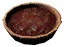 Bloodmoon Stew"]
  Fish4_cave_42["Fish4 cave"]
  Bloodbag_43["Bloodbag"]
  VC_ChoppedVeggies_44[" Chopped Veggies"]
  Carrot_45["Carrot"]
  Turnip_46["Turnip"]
  Onion_47["Onion"]
  Thistle_48["Thistle"]
  VC_BloodyBroth_49["🍲 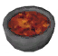 Bloody Broth"]
  Bloodbag_50["Bloodbag"]
  Entrails_51["Entrails"]
  Turnip_52["Turnip"]
  Thistle_53["Thistle"]
  VC_BoarStew_54["🍲 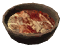 Boar Stew"]
  RawMeat_55["Raw Meat"]
  VC_BlueMushroom_56["Blue Mushroom"]
  Thistle_57["Thistle"]
  Boar_Svi__58["🍲 Boar Svið"]
  TrophyBoar_59["Trophy Boar"]
  Dandelion_60["Dandelion"]
  VC_BoneBroth_61["🍲 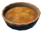 Bone Broth"]
  BoneFragments_62["Bone Fragments"]
  Carrot_63["Carrot"]
  Thistle_64["Thistle"]
  VC_BonemawChowder_65["🍲 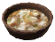 Bonemaw Chowder"]
  CookedBoneMawSerpentMeat_66["Cooked Bone Maw Serpent Meat"]
  VC_Barnacles_67["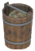 Barnacles"]
  Chitin_68["Chitin"]
  VC_ChoppedVeggies_69[" Chopped Veggies"]
  Carrot_70["Carrot"]
  Turnip_71["Turnip"]
  Onion_72["Onion"]
  VC_LoxMilk_73[" Lox Milk"]
  VC_BonemawStew_74["🍲 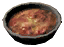 Bonemaw Stew"]
  CookedBoneMawSerpentMeat_75["Cooked Bone Maw Serpent Meat"]
  MushroomSmokePuff_76["Mushroom Smoke Puff"]
  Honey_77["Honey"]
  VC_Butter_78[" Butter"]
  VC_LoxMilk_79[" Lox Milk"]
  Carrion_Crows_Broth_80["🍲 Carrion Crows Broth"]
  VC_BirdMeat_81[" Bird Meat"]
  Entrails_82["Entrails"]
  VC_BoneMeal_83[" Bone Meal"]
  BoneFragments_84["Bone Fragments"]
  Turnip_85["Turnip"]
  VC_ChickenStew_86["🍲 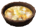 Chicken Stew"]
  ChickenMeat_87["Chicken Meat"]
  VC_ChoppedVeggies_88[" Chopped Veggies"]
  Carrot_89["Carrot"]
  Turnip_90["Turnip"]
  Onion_91["Onion"]
  VC_ColdCuredNeck_92["🍲 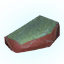 Cold-Cured Neck"]
  NeckTail_93["Neck Tail"]
  Honey_94["Honey"]
  VC_SpiceSnow_95[" Spice: Snow"]
  PowderedDragonEgg_96["Powdered Dragon Egg"]
  VC_CookedBarnacles_97["🍲 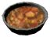 Cooked Barnacles"]
  VC_Barnacles_98[" Barnacles"]
  Chitin_99["Chitin"]
  VC_CreamBastarde_100["🍲  Cream Bastarde"]
  VC_LoxMilk_101[" Lox Milk"]
  ChickenEgg_102["Chicken Egg"]
  Honey_103["Honey"]
  Raspberry_104["Raspberry"]
  VC_CrispyPuffers_105["🍲  Crispy Puffers"]
  Fish12_106["Fish12"]
  ChickenEgg_107["Chicken Egg"]
  BarleyFlour_108["Barley Flour"]
  VC_BogButter_109[" Bog Butter"]
  Crispy_Thighs_Bucket_110["🍲 Crispy Thighs Bucket"]
  VC_BirdMeat_111[" Bird Meat"]
  AsksvinEgg_112["Asksvin Egg"]
  BarleyFlour_113["Barley Flour"]
  Vineberry_114["Vineberry"]
  Crunchy_Seeker_Skewer_115["🍲 Crunchy Seeker Skewer"]
  BugMeat_116["Bug Meat"]
  VC_ChoppedVeggies_117[" Chopped Veggies"]
  Carrot_118["Carrot"]
  Turnip_119["Turnip"]
  Onion_120["Onion"]
  Dandelion_Leaf_Surk_l_121["🍲 Dandelion Leaf Surkål"]
  Dandelion_122["Dandelion"]
  MushroomMagecap_123["Mushroom Magecap"]
  VC_DandelionSoup_124["🍲  Dandelion Soup"]
  Dandelion_125["Dandelion"]
  VC_DeepNorthRagout_126["🍲 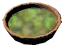 Deep North Ragout"]
  Fish10_127["Fish10"]
  VC_ChoppedShrooms_128[" Chopped Shrooms"]
  VC_BlueMushroom_129["Blue Mushroom"]
  MushroomYellow_130["Mushroom Yellow"]
  MushroomJotunPuffs_131["Mushroom Jotun Puffs"]
  MushroomMagecap_132["Mushroom Magecap"]
  VC_CloudberryAle_133[" Cloudberry Ale"]
  Deer_Svi__134["🍲 Deer Svið"]
  TrophyDeer_135["Trophy Deer"]
  Carrot_136["Carrot"]
  Thistle_137["Thistle"]
  VC_DragonAlenog_138["🍲  Dragon Alenog"]
  DragonEgg_139["Dragon Egg"]
  Honey_140["Honey"]
  VC_LoxMilk_141[" Lox Milk"]
  VC_VineberryAle_142[" Vineberry Ale"]
  Dvergr_Boozed_Meat_143["🍲 Dvergr Boozed Meat"]
  VC_ChoppedExoticMeat_144["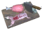 Chopped Exotic Meat"]
  MushroomJotunPuffs_145["Mushroom Jotun Puffs"]
  Sap_146["Sap"]
  VC_Booze_147[" Booze"]
  VC_DvergrMageBroth_148["🍲 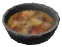 Dvergr Mage Broth"]
  CookedBugMeat_149["Cooked Bug Meat"]
  VC_ChoppedVeggies_150[" Chopped Veggies"]
  Carrot_151["Carrot"]
  Turnip_152["Turnip"]
  Onion_153["Onion"]
  Sap_154["Sap"]
  VC_DvergrTonic_155[" Dvergr Tonic"]
  VC_EctoplasmSoup_156["🍲 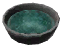 Ectoplasm Soup"]
  Ectoplasm_157["Ectoplasm"]
  Honey_158["Honey"]
  Thistle_159["Thistle"]
  VC_FensalirSkause_160["🍲 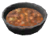 Fensalir Skause"]
  DeerMeat_161["Deer Meat"]
  Carrot_162["Carrot"]
  Turnip_163["Turnip"]
  Honey_164["Honey"]
  VC_FishChowder_165["🍲  Fish Chowder"]
  FishRaw_166["Fish Raw"]
  VC_ChoppedVeggies_167[" Chopped Veggies"]
  Carrot_168["Carrot"]
  Turnip_169["Turnip"]
  Onion_170["Onion"]
  VC_LoxMilk_171[" Lox Milk"]
  VC_FishSoup_172["🍲  Fish Soup"]
  FishRaw_173["Fish Raw"]
  MushroomYellow_174["Mushroom Yellow"]
  Dandelion_175["Dandelion"]
  VC_FishStew_176["🍲 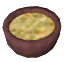 Fish Stew"]
  FishCooked_177["Fish Cooked"]
  Turnip_178["Turnip"]
  Thistle_179["Thistle"]
  Flamb_ed_Wolf_Strips_180["🍲 Flambéed Wolf Strips"]
  WolfMeat_181["Wolf Meat"]
  MeadTasty_182["Mead Tasty"]
  Blueberries_183["Blueberries"]
  VC_ForestSkewer_184["🍲 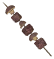 Forest Skewer"]
  DeerMeat_185["Deer Meat"]
  Mushroom_186["Mushroom"]
  MushroomYellow_187["Mushroom Yellow"]
  Fowlers_Ragout_188["🍲 Fowlers Ragout"]
  VC_BirdMeat_189[" Bird Meat"]
  Carrot_190["Carrot"]
  Thistle_191["Thistle"]
  Fried_Chicken_Dumplings_192["🍲 Fried Chicken Dumplings"]
  ChickenMeat_193["Chicken Meat"]
  ChickenEgg_194["Chicken Egg"]
  BarleyFlour_195["Barley Flour"]
  Galgvi_r_Skause_196["🍲 Galgviðr Skause"]
  WolfMeat_197["Wolf Meat"]
  VC_DrakeHeart_198[" Drake Heart"]
  VC_FrostBloodbag_199[" Frost Bloodbag"]
  Onion_200["Onion"]
  Gar_ar_ki_Stew_201["🍲 Garðaríki Stew"]
  Fish10_202["Fish10"]
  BarleyFlour_203["Barley Flour"]
  VC_Butter_204[" Butter"]
  VC_LoxMilk_205[" Lox Milk"]
  SpiceOceans_206["Spice Oceans"]
  VC_GlowingStew_207["🍲  Glowing Stew"]
  VC_BlueMushroom_208["Blue Mushroom"]
  GreydwarfEye_209["Greydwarf Eye"]
  MeadFrostResist_210["Mead Frost Resist"]
  VC_GrouperPottage_211["🍲 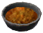 Grouper Pottage"]
  Fish7_212["Fish7"]
  VC_ChoppedVeggies_213[" Chopped Veggies"]
  Carrot_214["Carrot"]
  Turnip_215["Turnip"]
  Onion_216["Onion"]
  Thistle_217["Thistle"]
  VC_HafgufaStew_218["🍲 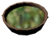 Hafgufa Stew"]
  VC_Barnacles_219[" Barnacles"]
  Chitin_220["Chitin"]
  VC_BogButter_221[" Bog Butter"]
  VC_Surkal_222[" Surkal"]
  Flax_223["Flax"]
  Haldors_Troll_Stew_224["🍲 Haldors Troll Stew"]
  VC_CookedTrollMeat_225[" Cooked Troll Meat"]
  VC_ChoppedVeggies_226[" Chopped Veggies"]
  Carrot_227["Carrot"]
  Turnip_228["Turnip"]
  Onion_229["Onion"]
  VC_Booze_230[" Booze"]
  VC_Butter_231[" Butter"]
  VC_LoxMilk_232[" Lox Milk"]
  VC_HareJerky_233["🍲  Hare Jerky"]
  HareMeat_234["Hare Meat"]
  Honey_235["Honey"]
  Thistle_236["Thistle"]
  VC_HareStew_237["🍲 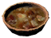 Hare Stew"]
  HareMeat_238["Hare Meat"]
  VC_ChoppedVeggies_239[" Chopped Veggies"]
  Carrot_240["Carrot"]
  Turnip_241["Turnip"]
  Onion_242["Onion"]
  TrophyHare_243["Trophy Hare"]
  VC_HatchlingSoup_244["🍲  Hatchling Soup"]
  TrophyHatchling_245["Trophy Hatchling"]
  VC_DrakeHeart_246[" Drake Heart"]
  Onion_247["Onion"]
  VC_HeavyFishStew_248["🍲 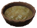 Heavy Fish Stew"]
  Fish7_249["Fish7"]
  Fish8_250["Fish8"]
  Fish3_251["Fish3"]
  VC_ChoppedVeggies_252[" Chopped Veggies"]
  Carrot_253["Carrot"]
  Turnip_254["Turnip"]
  Onion_255["Onion"]
  Honey_Glazed_Carrots_256["🍲 Honey Glazed Carrots"]
  Carrot_257["Carrot"]
  Honey_258["Honey"]
  Honey_Glazed_Turnips_259["🍲 Honey Glazed Turnips"]
  Turnip_260["Turnip"]
  Honey_261["Honey"]
  Hunters_Stew_262["🍲 Hunters Stew"]
  DeerMeat_263["Deer Meat"]
  WolfMeat_264["Wolf Meat"]
  VC_ChoppedVeggies_265[" Chopped Veggies"]
  Carrot_266["Carrot"]
  Turnip_267["Turnip"]
  Onion_268["Onion"]
  MeadStaminaMinor_269["Mead Stamina Minor"]
  Hvidp_lse_270["🍲 Hvidpølse"]
  VC_TrophyFrostLeech_271[" Frost Leech Trophy"]
  WolfMeat_272["Wolf Meat"]
  Barley_273["Barley"]
  VC_SpiceSnow_274[" Spice: Snow"]
  Iced_Marinated_Berries_275["🍲 Iced Marinated Berries"]
  Raspberry_276["Raspberry"]
  Blueberries_277["Blueberries"]
  FreezeGland_278["Freeze Gland"]
  MeadTasty_279["Mead Tasty"]
  Icelandic_Fish_Fritters_280["🍲 Icelandic Fish Fritters"]
  Fish10_281["Fish10"]
  Onion_282["Onion"]
  BarleyFlour_283["Barley Flour"]
  ChickenEgg_284["Chicken Egg"]
  I_unns_Confiture_285["🍲 Iðunns Confiture"]
  Raspberry_286["Raspberry"]
  Blueberries_287["Blueberries"]
  Cloudberry_288["Cloudberry"]
  Jarls_Seared_Meat_289["🍲 Jarls Seared Meat"]
  LoxMeat_290["Lox Meat"]
  Cloudberry_291["Cloudberry"]
  Thistle_292["Thistle"]
  MeadTasty_293["Mead Tasty"]
  VC_JomsvikingStew_294["🍲 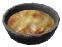 Jomsviking Stew"]
  Fish8_295["Fish8"]
  VC_ChoppedVeggies_296[" Chopped Veggies"]
  Carrot_297["Carrot"]
  Turnip_298["Turnip"]
  Onion_299["Onion"]
  Thistle_300["Thistle"]
  J_rnbj_rn_Stew_301["🍲 Járnbjörn Stew"]
  BjornMeat_302["Bjorn Meat"]
  VC_PickledVeggies_303[" Pickled Veggies"]
  VC_BoneMeal_304[" Bone Meal"]
  BoneFragments_305["Bone Fragments"]
  VC_AncientBarkFlour_306[" Ancient Bark Flour"]
  J_rnvi_r_Skause_307["🍲 Járnviðr Skause"]
  VC_TrollMeat_308[" Troll Meat"]
  VC_ChoppedVeggies_309[" Chopped Veggies"]
  Carrot_310["Carrot"]
  Turnip_311["Turnip"]
  Onion_312["Onion"]
  Thistle_313["Thistle"]
  TrophyGoblin_314["Trophy Goblin"]
  VC_KingsOmelette_315["🍲  Kings Omelette"]
  VoltureEgg_316["Volture Egg"]
  VC_BogButter_317[" Bog Butter"]
  VC_ChoppedShrooms_318[" Chopped Shrooms"]
  VC_BlueMushroom_319["Blue Mushroom"]
  MushroomYellow_320["Mushroom Yellow"]
  MushroomJotunPuffs_321["Mushroom Jotun Puffs"]
  MushroomMagecap_322["Mushroom Magecap"]
  VC_Krumkakes_323["🍲 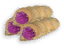 Krumkakes"]
  BarleyFlour_324["Barley Flour"]
  VC_Butter_325[" Butter"]
  VC_LoxMilk_326[" Lox Milk"]
  AsksvinEgg_327["Asksvin Egg"]
  VC_IdunnConfiture_328[" Idunn Confiture"]
  VC_LandvidiRootSoup_329["🍲 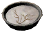 Landvidi Root Soup"]
  VC_LandvidiRoots_330[" Landvidi Roots"]
  SulfurStone_331["Sulfur Stone"]
  VC_Lefse_332["🍲  Lefse"]
  VC_AncientBarkFlour_333[" Ancient Bark Flour"]
  VC_Skyr_334[" Skyr"]
  Honey_335["Honey"]
  VC_Butter_336[" Butter"]
  VC_LoxMilk_337[" Lox Milk"]
  VC_LoxJerky_338["🍲  Lox Jerky"]
  LoxMeat_339["Lox Meat"]
  Honey_340["Honey"]
  Lox_Svi__341["🍲 Lox Svið"]
  TrophyLox_342["Trophy Lox"]
  VC_ChoppedVeggies_343[" Chopped Veggies"]
  Carrot_344["Carrot"]
  Turnip_345["Turnip"]
  Onion_346["Onion"]
  Thistle_347["Thistle"]
  VC_Butter_348[" Butter"]
  VC_LoxMilk_349[" Lox Milk"]
  VC_LyngbakrChowder_350["🍲 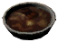 Lyngbakr Chowder"]
  VC_ChoppedTentacles_351[" Chopped Tentacles"]
  VC_ChoppedShrooms_352[" Chopped Shrooms"]
  VC_BlueMushroom_353["Blue Mushroom"]
  MushroomYellow_354["Mushroom Yellow"]
  MushroomJotunPuffs_355["Mushroom Jotun Puffs"]
  MushroomMagecap_356["Mushroom Magecap"]
  Sap_357["Sap"]
  VC_LoxMilk_358[" Lox Milk"]
  VC_MagmafishSkewer_359["🍲 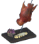 Magmafish Skewer"]
  Fish11_360["Fish11"]
  Fiddleheadfern_361["Fiddleheadfern"]
  MushroomYellow_362["Mushroom Yellow"]
  VC_MagmafishStew_363["🍲 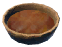 Magmafish Stew"]
  Fish11_364["Fish11"]
  Onion_365["Onion"]
  MushroomSmokePuff_366["Mushroom Smoke Puff"]
  Mead_Braised_Barnacles_367["🍲 Mead-Braised Barnacles"]
  VC_Barnacles_368[" Barnacles"]
  Chitin_369["Chitin"]
  OnionSoup_370["Onion Soup"]
  VC_Butter_371[" Butter"]
  VC_LoxMilk_372[" Lox Milk"]
  MeadTasty_373["Mead Tasty"]
  VC_Meadnog_374["🍲  Meadnog"]
  VoltureEgg_375["Volture Egg"]
  Honey_376["Honey"]
  VC_LoxMilk_377[" Lox Milk"]
  MeadTasty_378["Mead Tasty"]
  VC_MeatbugRagout_379["🍲 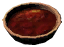 Meatbug Ragout"]
  GiantBloodSack_380["Giant Blood Sack"]
  VC_ChoppedVeggies_381[" Chopped Veggies"]
  Carrot_382["Carrot"]
  Turnip_383["Turnip"]
  Onion_384["Onion"]
  VC_ChoppedShrooms_385[" Chopped Shrooms"]
  VC_BlueMushroom_386["Blue Mushroom"]
  MushroomYellow_387["Mushroom Yellow"]
  MushroomJotunPuffs_388["Mushroom Jotun Puffs"]
  MushroomMagecap_389["Mushroom Magecap"]
  VC_MistyFondue_390["🍲 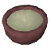 Misty Fondue"]
  VC_LoxCheese_391[" Lox Cheese"]
  MushroomJotunPuffs_392["Mushroom Jotun Puffs"]
  VC_CloudberryAle_393[" Cloudberry Ale"]
  VC_MorgenJerky_394["🍲  Morgen Jerky"]
  MorgenSinew_395["Morgen Sinew"]
  Honey_396["Honey"]
  Mountaineer_Hotpot_397["🍲 Mountaineer Hotpot"]
  WolfMeat_398["Wolf Meat"]
  VC_ChoppedVeggies_399[" Chopped Veggies"]
  Carrot_400["Carrot"]
  Turnip_401["Turnip"]
  Onion_402["Onion"]
  WolfHairBundle_403["Wolf Hair Bundle"]
  VC_BoneMeal_404[" Bone Meal"]
  BoneFragments_405["Bone Fragments"]
  VC_Multekrem_406["🍲 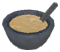 Multekrem"]
  VC_LoxMilk_407[" Lox Milk"]
  Honey_408["Honey"]
  Cloudberry_409["Cloudberry"]
  Munarv_gr_Skause_410["🍲 Munarvágr Skause"]
  Fish8_411["Fish8"]
  Fish3_412["Fish3"]
  Mushroom_413["Mushroom"]
  Thistle_414["Thistle"]
  Mushroom_Chowder_415["🍲 Mushroom Chowder"]
  VC_PickledShrooms_416[" Pickled Shrooms"]
  VC_LoxMilk_417[" Lox Milk"]
  Dandelion_418["Dandelion"]
  Mushroom_Skewewr_419["🍲 Mushroom Skewewr"]
  VC_BlueMushroom_420["Blue Mushroom"]
  Mushroom_421["Mushroom"]
  VC_MushroomSoup_422["🍲 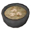 Mushroom Soup"]
  VC_SauteMushrooms_423[" Sauté Mushrooms"]
  Dandelion_424["Dandelion"]
  VC_MushroomStew_425["🍲 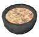 Mushroom Stew"]
  VC_ChoppedShrooms_426[" Chopped Shrooms"]
  VC_BlueMushroom_427["Blue Mushroom"]
  MushroomYellow_428["Mushroom Yellow"]
  MushroomJotunPuffs_429["Mushroom Jotun Puffs"]
  MushroomMagecap_430["Mushroom Magecap"]
  Thistle_431["Thistle"]
  Myrkvi_r_Skause_432["🍲 Myrkviðr Skause"]
  DeerMeat_433["Deer Meat"]
  Carrot_434["Carrot"]
  Mushroom_435["Mushroom"]
  Myrk_lfars_Fish_Stew_436["🍲 Myrkálfars Fish Stew"]
  Fish9_437["Fish9"]
  VC_Surkal_438[" Surkal"]
  AncientSeed_439["Ancient Seed"]
  VC_CloudberryAle_440[" Cloudberry Ale"]
  M_mamei_r_Skause_441["🍲 Mímameiðr Skause"]
  ChickenMeat_442["Chicken Meat"]
  VC_ChoppedShrooms_443[" Chopped Shrooms"]
  VC_BlueMushroom_444["Blue Mushroom"]
  MushroomYellow_445["Mushroom Yellow"]
  MushroomJotunPuffs_446["Mushroom Jotun Puffs"]
  MushroomMagecap_447["Mushroom Magecap"]
  Flax_448["Flax"]
  Thistle_449["Thistle"]
  VC_NeckSoup_450["🍲 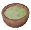 Neck Soup"]
  NeckTail_451["Neck Tail"]
  Mushroom_452["Mushroom"]
  VC_NeckStew_453["🍲 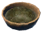 Neck Stew"]
  TrophyNeck_454["Trophy Neck"]
  NeckTail_455["Neck Tail"]
  Turnip_456["Turnip"]
  VC_NeckBarleyStew_457["🍲  Neck-Barley Stew"]
  VC_SmokedNeck_458[" Smoked Neck"]
  Barley_459["Barley"]
  Onion_460["Onion"]
  VC_Butter_461[" Butter"]
  VC_LoxMilk_462[" Lox Milk"]
  VC_PerchSteak_463["🍲 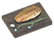 Perch Steak"]
  Fish1_464["Fish1"]
  Thistle_465["Thistle"]
  VC_PerryBroth_466["🍲 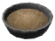 Perry Broth"]
  VC_SpicedPerry_467[" Spiced Perry"]
  VC_BoneMeal_468[" Bone Meal"]
  BoneFragments_469["Bone Fragments"]
  Carrot_470["Carrot"]
  VC_PerryPorridge_471["🍲 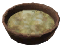 Perry Porridge"]
  VC_SpicedPerry_472[" Spiced Perry"]
  Barley_473["Barley"]
  VC_PickleSoup_474["🍲  Pickle Soup"]
  VC_PickledVeggies_475[" Pickled Veggies"]
  Fiddleheadfern_476["Fiddleheadfern"]
  Thistle_477["Thistle"]
  VC_PikeFillets_478["🍲 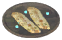 Pike Fillets"]
  Fish2_479["Fish2"]
  Thistle_480["Thistle"]
  VC_Pottage_481["🍲  Pottage"]
  VC_ChoppedVeggies_482[" Chopped Veggies"]
  Carrot_483["Carrot"]
  Turnip_484["Turnip"]
  Onion_485["Onion"]
  Redbeard_Clan_Fiery_Stew_486["🍲 Redbeard Clan Fiery Stew"]
  VC_ChoppedExoticMeat_487[" Chopped Exotic Meat"]
  VC_ChoppedVeggies_488[" Chopped Veggies"]
  Carrot_489["Carrot"]
  Turnip_490["Turnip"]
  Onion_491["Onion"]
  Eitr_492["Eitr"]
  ProustitePowder_493["Proustite Powder"]
  Redbeard_Clan_Kettle_Worms_494["🍲 Redbeard Clan Kettle Worms"]
  VC_ChoppedExoticMeat_495[" Chopped Exotic Meat"]
  Entrails_496["Entrails"]
  Thistle_497["Thistle"]
  Dandelion_498["Dandelion"]
  VC_RootSoup_499["🍲 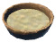 Root Soup"]
  Root_500["Root"]
  Dandelion_501["Dandelion"]
  R_mmegr_t_502["🍲 Rømmegrøt"]
  VC_AncientBarkFlour_503[" Ancient Bark Flour"]
  Honey_504["Honey"]
  VC_Skyr_505[" Skyr"]
  AskBladder_506["Ask Bladder"]
  VC_SalmonChowder_507["🍲 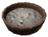 Salmon Chowder"]
  Fish10_508["Fish10"]
  VC_ChoppedVeggies_509[" Chopped Veggies"]
  Carrot_510["Carrot"]
  Turnip_511["Turnip"]
  Onion_512["Onion"]
  Sap_513["Sap"]
  VC_Blaand_514[" Blaand"]
  Saut_ed_Mushrooms_515["🍲 Sautéed Mushrooms"]
  Mushroom_516["Mushroom"]
  MushroomYellow_517["Mushroom Yellow"]
  VC_ScrambledEggs_518["🍲 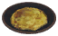 Scrambled Eggs"]
  DragonEgg_519["Dragon Egg"]
  SpiceForests_520["Spice Forests"]
  VC_SerpentChowder_521["🍲  Serpent Chowder"]
  SerpentMeat_522["Serpent Meat"]
  GreydwarfEye_523["Greydwarf Eye"]
  Onion_524["Onion"]
  VC_LoxMilk_525[" Lox Milk"]
  Serpent_Svi__526["🍲 Serpent Svið"]
  TrophySerpent_527["Trophy Serpent"]
  VC_ChoppedVeggies_528[" Chopped Veggies"]
  Carrot_529["Carrot"]
  Turnip_530["Turnip"]
  Onion_531["Onion"]
  VC_ShroomDumplings_532["🍲  Shroom Dumplings"]
  MushroomMagecap_533["Mushroom Magecap"]
  MushroomSmokePuff_534["Mushroom Smoke Puff"]
  VoltureEgg_535["Volture Egg"]
  BarleyFlour_536["Barley Flour"]
  VC_SmokedBearStew_537["🍲 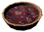 Smoked Bear Stew"]
  VC_SmokedBear_538[" Smoked Bear Meat"]
  Thistle_539["Thistle"]
  Turnip_540["Turnip"]
  BeechSeeds_541["Beech Seeds"]
  VC_SpicedFishJerky_542["🍲  Spiced Fish Jerky"]
  FishRaw_543["Fish Raw"]
  Honey_544["Honey"]
  Sap_545["Sap"]
  Thistle_546["Thistle"]
  Squirrel_Stew_547["🍲 Squirrel Stew"]
  CuredSquirrelHamstring_548["Cured Squirrel Hamstring"]
  VC_BlueMushroom_549["Blue Mushroom"]
  PowderedDragonEgg_550["Powdered Dragon Egg"]
  VC_StirFriedVeggies_551["🍲 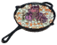 Stir-Fried Veggies"]
  VC_ChoppedVeggies_552[" Chopped Veggies"]
  Carrot_553["Carrot"]
  Turnip_554["Turnip"]
  Onion_555["Onion"]
  Fiddleheadfern_556["Fiddleheadfern"]
  VC_Nogginfog_557[" Nogginfog"]
  VC_SweetPorridge_558["🍲  Sweet Porridge"]
  Blueberries_559["Blueberries"]
  Honey_560["Honey"]
  VC_Skyr_561[" Skyr"]
  Barley_562["Barley"]
  S_konungr_Stew_563["🍲 Sækonungr Stew"]
  VC_ChoppedTentacles_564[" Chopped Tentacles"]
  SerpentMeat_565["Serpent Meat"]
  VC_PickledVeggies_566[" Pickled Veggies"]
  VC_BogButter_567[" Bog Butter"]
  Travellers_Porridge_568["🍲 Travellers Porridge"]
  TurnipStew_569["Turnip Stew"]
  MushroomYellow_570["Mushroom Yellow"]
  Barley_571["Barley"]
  VC_Butter_572[" Butter"]
  VC_LoxMilk_573[" Lox Milk"]
  VC_TrollAspic_574["🍲 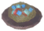 Troll Aspic"]
  VC_TrollMeat_575[" Troll Meat"]
  MushroomMagecap_576["Mushroom Magecap"]
  RoyalJelly_577["Royal Jelly"]
  VC_TrollJerky_578["🍲 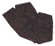 Troll Jerky"]
  VC_TrollMeat_579[" Troll Meat"]
  Honey_580["Honey"]
  VC_TrollStew_581["🍲  Troll Stew"]
  VC_TrollMeat_582[" Troll Meat"]
  Carrot_583["Carrot"]
  MushroomYellow_584["Mushroom Yellow"]
  Dandelion_585["Dandelion"]
  Troll_Svi__586["🍲 Troll Svið"]
  TrophyFrostTroll_587["Trophy Frost Troll"]
  Carrot_588["Carrot"]
  Thistle_589["Thistle"]
  Tuna_With_Herbs_590["🍲 Tuna With Herbs"]
  Fish3_591["Fish3"]
  Thistle_592["Thistle"]
  Dandelion_593["Dandelion"]
  VC_UlvTailStew_594["🍲  Ulv Tail Stew"]
  TrophyUlv_595["Trophy Ulv"]
  VC_ChoppedVeggies_596[" Chopped Veggies"]
  Carrot_597["Carrot"]
  Turnip_598["Turnip"]
  Onion_599["Onion"]
  Raspberry_600["Raspberry"]
  VC_VarangianStew_601["🍲  Varangian Stew"]
  BoneMawSerpentMeat_602["Bone Maw Serpent Meat"]
  Carrot_603["Carrot"]
  Thistle_604["Thistle"]
  VC_VegetableSoup_605["🍲  Vegetable Soup"]
  Carrot_606["Carrot"]
  Turnip_607["Turnip"]
  MushroomYellow_608["Mushroom Yellow"]
  VC_VegetableStew_609["🍲 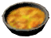 Vegetable Stew"]
  VC_ChoppedVeggies_610[" Chopped Veggies"]
  Carrot_611["Carrot"]
  Turnip_612["Turnip"]
  Onion_613["Onion"]
  MushroomYellow_614["Mushroom Yellow"]
  VC_BlueMushroom_615["Blue Mushroom"]
  Root_616["Root"]
  Vikingr_Stew_617["🍲 Vikingr Stew"]
  Fish5_618["Fish5"]
  MushroomYellow_619["Mushroom Yellow"]
  Dandelion_620["Dandelion"]
  V_gr__r_Skause_621["🍲 Vígríðr Skause"]
  VoltureMeat_622["Volture Meat"]
  Fiddleheadfern_623["Fiddleheadfern"]
  MushroomSmokePuff_624["Mushroom Smoke Puff"]
  Dandelion_625["Dandelion"]
  Warriors_Pottage_626["🍲 Warriors Pottage"]
  VC_ChoppedMeat_627["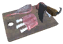 Chopped Meat"]
  RawMeat_628["Raw Meat"]
  DeerMeat_629["Deer Meat"]
  WolfMeat_630["Wolf Meat"]
  LoxMeat_631["Lox Meat"]
  VC_CuredPork_632[" Cured Pork"]
  VC_ChoppedVeggies_633[" Chopped Veggies"]
  Carrot_634["Carrot"]
  Turnip_635["Turnip"]
  Onion_636["Onion"]
  MeadTasty_637["Mead Tasty"]
  Winghunters_Porridge_638["🍲 Winghunters Porridge"]
  VC_CookedBirdMeat_639[" Cooked Bird Meat"]
  VC_ChoppedVeggies_640[" Chopped Veggies"]
  Carrot_641["Carrot"]
  Turnip_642["Turnip"]
  Onion_643["Onion"]
  Barley_644["Barley"]
  VC_Blaand_645[" Blaand"]
  Wolf_Svi__646["🍲 Wolf Svið"]
  TrophyWolf_647["Trophy Wolf"]
  VC_ChoppedVeggies_648[" Chopped Veggies"]
  Carrot_649["Carrot"]
  Turnip_650["Turnip"]
  Onion_651["Onion"]
  Thistle_652["Thistle"]
  _lfabl_t_Stew_653["🍲 Álfablót Stew"]
  VC_ChoppedMeat_654[" Chopped Meat"]
  RawMeat_655["Raw Meat"]
  DeerMeat_656["Deer Meat"]
  WolfMeat_657["Wolf Meat"]
  LoxMeat_658["Lox Meat"]
  VC_VegetableSoup_659[" Vegetable Soup"]
  Carrot_660["Carrot"]
  Turnip_661["Turnip"]
  MushroomYellow_662["Mushroom Yellow"]
  VC_Butter_663[" Butter"]
  VC_LoxMilk_664[" Lox Milk"]
  VC_Blaand_665[" Blaand"]
  _blefl_sk_666["🍲 Æbleflæsk"]
  Pukeberries_667["Pukeberries"]
  VC_CuredPork_668[" Cured Pork"]
  Onion_669["Onion"]
  Honey_670["Honey"]
  _blekage_671["🍲 Æblekage"]
  Pukeberries_672["Pukeberries"]
  VC_LoxMilk_673[" Lox Milk"]
  VC_Paltbrod_674[" Paltbrod"]
  FreezeGland_675["Freeze Gland"]
  _bleskiver_676["🍲 Æbleskiver"]
  BarleyFlour_677["Barley Flour"]
  VC_Butter_678[" Butter"]
  VC_LoxMilk_679[" Lox Milk"]
  Honey_680["Honey"]
  Pukeberries_681["Pukeberries"]
  _llebr_d_682["🍲 Øllebrød"]
  VC_ShroomBeer_683[" Shroom Beer"]
  VC_Rugbraud_684[" Rugbraud"]
  Honey_685["Honey"]
  VC_LoxMilk_686[" Lox Milk"]
  _dalir_Skause_687["🍲 Ýdalir Skause"]
  WolfMeat_688["Wolf Meat"]
  VC_ChoppedVeggies_689[" Chopped Veggies"]
  Carrot_690["Carrot"]
  Turnip_691["Turnip"]
  Onion_692["Onion"]
  Thistle_693["Thistle"]
  VC_VegetableSoup_1 --> Adventurers_Porridge_0
  Carrot_2 --> VC_VegetableSoup_1
  Turnip_3 --> VC_VegetableSoup_1
  MushroomYellow_4 --> VC_VegetableSoup_1
  MushroomJotunPuffs_5 --> Adventurers_Porridge_0
  Barley_6 --> Adventurers_Porridge_0
  Thistle_7 --> Adventurers_Porridge_0
  CookedDeerMeat_9 --> Ammas_Hearty_Stew_8
  VC_CuredPork_10 --> Ammas_Hearty_Stew_8
  VC_GlazedTurnips_11 --> Ammas_Hearty_Stew_8
  VC_BlueMushroom_12 --> Ammas_Hearty_Stew_8
  TrophyAsksvin_14 --> Asksvin_Svi__13
  Fiddleheadfern_15 --> Asksvin_Svi__13
  Sap_16 --> Asksvin_Svi__13
  Barley_18 --> Barley_Gruel_17
  CookedLoxMeat_20 --> VC_Biksemad_19
  MushroomSmokePuff_21 --> VC_Biksemad_19
  CookedEgg_22 --> VC_Biksemad_19
  VC_ChoppedVeggies_24 --> Blazing_Yggdrasil_Stew_23
  Carrot_25 --> VC_ChoppedVeggies_24
  Turnip_26 --> VC_ChoppedVeggies_24
  Onion_27 --> VC_ChoppedVeggies_24
  Sap_28 --> Blazing_Yggdrasil_Stew_23
  SulfurStone_29 --> Blazing_Yggdrasil_Stew_23
  ProustitePowder_30 --> Blazing_Yggdrasil_Stew_23
  GiantBloodSack_32 --> Blodpl_ttar_31
  BarleyFlour_33 --> Blodpl_ttar_31
  Honey_34 --> Blodpl_ttar_31
  Blueberries_35 --> Blodpl_ttar_31
  TrophyLeech_37 --> Blodp_lse_36
  VC_TrollMeat_38 --> Blodp_lse_36
  Bloodbag_39 --> Blodp_lse_36
  Thistle_40 --> Blodp_lse_36
  Fish4_cave_42 --> VC_BloodmoonStew_41
  Bloodbag_43 --> VC_BloodmoonStew_41
  VC_ChoppedVeggies_44 --> VC_BloodmoonStew_41
  Carrot_45 --> VC_ChoppedVeggies_44
  Turnip_46 --> VC_ChoppedVeggies_44
  Onion_47 --> VC_ChoppedVeggies_44
  Thistle_48 --> VC_BloodmoonStew_41
  Bloodbag_50 --> VC_BloodyBroth_49
  Entrails_51 --> VC_BloodyBroth_49
  Turnip_52 --> VC_BloodyBroth_49
  Thistle_53 --> VC_BloodyBroth_49
  RawMeat_55 --> VC_BoarStew_54
  VC_BlueMushroom_56 --> VC_BoarStew_54
  Thistle_57 --> VC_BoarStew_54
  TrophyBoar_59 --> Boar_Svi__58
  Dandelion_60 --> Boar_Svi__58
  BoneFragments_62 --> VC_BoneBroth_61
  Carrot_63 --> VC_BoneBroth_61
  Thistle_64 --> VC_BoneBroth_61
  CookedBoneMawSerpentMeat_66 --> VC_BonemawChowder_65
  VC_Barnacles_67 --> VC_BonemawChowder_65
  Chitin_68 --> VC_Barnacles_67
  VC_ChoppedVeggies_69 --> VC_BonemawChowder_65
  Carrot_70 --> VC_ChoppedVeggies_69
  Turnip_71 --> VC_ChoppedVeggies_69
  Onion_72 --> VC_ChoppedVeggies_69
  VC_LoxMilk_73 --> VC_BonemawChowder_65
  CookedBoneMawSerpentMeat_75 --> VC_BonemawStew_74
  MushroomSmokePuff_76 --> VC_BonemawStew_74
  Honey_77 --> VC_BonemawStew_74
  VC_Butter_78 --> VC_BonemawStew_74
  VC_LoxMilk_79 --> VC_Butter_78
  VC_BirdMeat_81 --> Carrion_Crows_Broth_80
  Entrails_82 --> Carrion_Crows_Broth_80
  VC_BoneMeal_83 --> Carrion_Crows_Broth_80
  BoneFragments_84 --> VC_BoneMeal_83
  Turnip_85 --> Carrion_Crows_Broth_80
  ChickenMeat_87 --> VC_ChickenStew_86
  VC_ChoppedVeggies_88 --> VC_ChickenStew_86
  Carrot_89 --> VC_ChoppedVeggies_88
  Turnip_90 --> VC_ChoppedVeggies_88
  Onion_91 --> VC_ChoppedVeggies_88
  NeckTail_93 --> VC_ColdCuredNeck_92
  Honey_94 --> VC_ColdCuredNeck_92
  VC_SpiceSnow_95 --> VC_ColdCuredNeck_92
  PowderedDragonEgg_96 --> VC_ColdCuredNeck_92
  VC_Barnacles_98 --> VC_CookedBarnacles_97
  Chitin_99 --> VC_Barnacles_98
  VC_LoxMilk_101 --> VC_CreamBastarde_100
  ChickenEgg_102 --> VC_CreamBastarde_100
  Honey_103 --> VC_CreamBastarde_100
  Raspberry_104 --> VC_CreamBastarde_100
  Fish12_106 --> VC_CrispyPuffers_105
  ChickenEgg_107 --> VC_CrispyPuffers_105
  BarleyFlour_108 --> VC_CrispyPuffers_105
  VC_BogButter_109 --> VC_CrispyPuffers_105
  VC_BirdMeat_111 --> Crispy_Thighs_Bucket_110
  AsksvinEgg_112 --> Crispy_Thighs_Bucket_110
  BarleyFlour_113 --> Crispy_Thighs_Bucket_110
  Vineberry_114 --> Crispy_Thighs_Bucket_110
  BugMeat_116 --> Crunchy_Seeker_Skewer_115
  VC_ChoppedVeggies_117 --> Crunchy_Seeker_Skewer_115
  Carrot_118 --> VC_ChoppedVeggies_117
  Turnip_119 --> VC_ChoppedVeggies_117
  Onion_120 --> VC_ChoppedVeggies_117
  Dandelion_122 --> Dandelion_Leaf_Surk_l_121
  MushroomMagecap_123 --> Dandelion_Leaf_Surk_l_121
  Dandelion_125 --> VC_DandelionSoup_124
  Fish10_127 --> VC_DeepNorthRagout_126
  VC_ChoppedShrooms_128 --> VC_DeepNorthRagout_126
  VC_BlueMushroom_129 --> VC_ChoppedShrooms_128
  MushroomYellow_130 --> VC_ChoppedShrooms_128
  MushroomJotunPuffs_131 --> VC_ChoppedShrooms_128
  MushroomMagecap_132 --> VC_ChoppedShrooms_128
  VC_CloudberryAle_133 --> VC_DeepNorthRagout_126
  TrophyDeer_135 --> Deer_Svi__134
  Carrot_136 --> Deer_Svi__134
  Thistle_137 --> Deer_Svi__134
  DragonEgg_139 --> VC_DragonAlenog_138
  Honey_140 --> VC_DragonAlenog_138
  VC_LoxMilk_141 --> VC_DragonAlenog_138
  VC_VineberryAle_142 --> VC_DragonAlenog_138
  VC_ChoppedExoticMeat_144 --> Dvergr_Boozed_Meat_143
  MushroomJotunPuffs_145 --> Dvergr_Boozed_Meat_143
  Sap_146 --> Dvergr_Boozed_Meat_143
  VC_Booze_147 --> Dvergr_Boozed_Meat_143
  CookedBugMeat_149 --> VC_DvergrMageBroth_148
  VC_ChoppedVeggies_150 --> VC_DvergrMageBroth_148
  Carrot_151 --> VC_ChoppedVeggies_150
  Turnip_152 --> VC_ChoppedVeggies_150
  Onion_153 --> VC_ChoppedVeggies_150
  Sap_154 --> VC_DvergrMageBroth_148
  VC_DvergrTonic_155 --> VC_DvergrMageBroth_148
  Ectoplasm_157 --> VC_EctoplasmSoup_156
  Honey_158 --> VC_EctoplasmSoup_156
  Thistle_159 --> VC_EctoplasmSoup_156
  DeerMeat_161 --> VC_FensalirSkause_160
  Carrot_162 --> VC_FensalirSkause_160
  Turnip_163 --> VC_FensalirSkause_160
  Honey_164 --> VC_FensalirSkause_160
  FishRaw_166 --> VC_FishChowder_165
  VC_ChoppedVeggies_167 --> VC_FishChowder_165
  Carrot_168 --> VC_ChoppedVeggies_167
  Turnip_169 --> VC_ChoppedVeggies_167
  Onion_170 --> VC_ChoppedVeggies_167
  VC_LoxMilk_171 --> VC_FishChowder_165
  FishRaw_173 --> VC_FishSoup_172
  MushroomYellow_174 --> VC_FishSoup_172
  Dandelion_175 --> VC_FishSoup_172
  FishCooked_177 --> VC_FishStew_176
  Turnip_178 --> VC_FishStew_176
  Thistle_179 --> VC_FishStew_176
  WolfMeat_181 --> Flamb_ed_Wolf_Strips_180
  MeadTasty_182 --> Flamb_ed_Wolf_Strips_180
  Blueberries_183 --> Flamb_ed_Wolf_Strips_180
  DeerMeat_185 --> VC_ForestSkewer_184
  Mushroom_186 --> VC_ForestSkewer_184
  MushroomYellow_187 --> VC_ForestSkewer_184
  VC_BirdMeat_189 --> Fowlers_Ragout_188
  Carrot_190 --> Fowlers_Ragout_188
  Thistle_191 --> Fowlers_Ragout_188
  ChickenMeat_193 --> Fried_Chicken_Dumplings_192
  ChickenEgg_194 --> Fried_Chicken_Dumplings_192
  BarleyFlour_195 --> Fried_Chicken_Dumplings_192
  WolfMeat_197 --> Galgvi_r_Skause_196
  VC_DrakeHeart_198 --> Galgvi_r_Skause_196
  VC_FrostBloodbag_199 --> Galgvi_r_Skause_196
  Onion_200 --> Galgvi_r_Skause_196
  Fish10_202 --> Gar_ar_ki_Stew_201
  BarleyFlour_203 --> Gar_ar_ki_Stew_201
  VC_Butter_204 --> Gar_ar_ki_Stew_201
  VC_LoxMilk_205 --> VC_Butter_204
  SpiceOceans_206 --> Gar_ar_ki_Stew_201
  VC_BlueMushroom_208 --> VC_GlowingStew_207
  GreydwarfEye_209 --> VC_GlowingStew_207
  MeadFrostResist_210 --> VC_GlowingStew_207
  Fish7_212 --> VC_GrouperPottage_211
  VC_ChoppedVeggies_213 --> VC_GrouperPottage_211
  Carrot_214 --> VC_ChoppedVeggies_213
  Turnip_215 --> VC_ChoppedVeggies_213
  Onion_216 --> VC_ChoppedVeggies_213
  Thistle_217 --> VC_GrouperPottage_211
  VC_Barnacles_219 --> VC_HafgufaStew_218
  Chitin_220 --> VC_Barnacles_219
  VC_BogButter_221 --> VC_HafgufaStew_218
  VC_Surkal_222 --> VC_HafgufaStew_218
  Flax_223 --> VC_HafgufaStew_218
  VC_CookedTrollMeat_225 --> Haldors_Troll_Stew_224
  VC_ChoppedVeggies_226 --> Haldors_Troll_Stew_224
  Carrot_227 --> VC_ChoppedVeggies_226
  Turnip_228 --> VC_ChoppedVeggies_226
  Onion_229 --> VC_ChoppedVeggies_226
  VC_Booze_230 --> Haldors_Troll_Stew_224
  VC_Butter_231 --> Haldors_Troll_Stew_224
  VC_LoxMilk_232 --> VC_Butter_231
  HareMeat_234 --> VC_HareJerky_233
  Honey_235 --> VC_HareJerky_233
  Thistle_236 --> VC_HareJerky_233
  HareMeat_238 --> VC_HareStew_237
  VC_ChoppedVeggies_239 --> VC_HareStew_237
  Carrot_240 --> VC_ChoppedVeggies_239
  Turnip_241 --> VC_ChoppedVeggies_239
  Onion_242 --> VC_ChoppedVeggies_239
  TrophyHare_243 --> VC_HareStew_237
  TrophyHatchling_245 --> VC_HatchlingSoup_244
  VC_DrakeHeart_246 --> VC_HatchlingSoup_244
  Onion_247 --> VC_HatchlingSoup_244
  Fish7_249 --> VC_HeavyFishStew_248
  Fish8_250 --> VC_HeavyFishStew_248
  Fish3_251 --> VC_HeavyFishStew_248
  VC_ChoppedVeggies_252 --> VC_HeavyFishStew_248
  Carrot_253 --> VC_ChoppedVeggies_252
  Turnip_254 --> VC_ChoppedVeggies_252
  Onion_255 --> VC_ChoppedVeggies_252
  Carrot_257 --> Honey_Glazed_Carrots_256
  Honey_258 --> Honey_Glazed_Carrots_256
  Turnip_260 --> Honey_Glazed_Turnips_259
  Honey_261 --> Honey_Glazed_Turnips_259
  DeerMeat_263 --> Hunters_Stew_262
  WolfMeat_264 --> Hunters_Stew_262
  VC_ChoppedVeggies_265 --> Hunters_Stew_262
  Carrot_266 --> VC_ChoppedVeggies_265
  Turnip_267 --> VC_ChoppedVeggies_265
  Onion_268 --> VC_ChoppedVeggies_265
  MeadStaminaMinor_269 --> Hunters_Stew_262
  VC_TrophyFrostLeech_271 --> Hvidp_lse_270
  WolfMeat_272 --> Hvidp_lse_270
  Barley_273 --> Hvidp_lse_270
  VC_SpiceSnow_274 --> Hvidp_lse_270
  Raspberry_276 --> Iced_Marinated_Berries_275
  Blueberries_277 --> Iced_Marinated_Berries_275
  FreezeGland_278 --> Iced_Marinated_Berries_275
  MeadTasty_279 --> Iced_Marinated_Berries_275
  Fish10_281 --> Icelandic_Fish_Fritters_280
  Onion_282 --> Icelandic_Fish_Fritters_280
  BarleyFlour_283 --> Icelandic_Fish_Fritters_280
  ChickenEgg_284 --> Icelandic_Fish_Fritters_280
  Raspberry_286 --> I_unns_Confiture_285
  Blueberries_287 --> I_unns_Confiture_285
  Cloudberry_288 --> I_unns_Confiture_285
  LoxMeat_290 --> Jarls_Seared_Meat_289
  Cloudberry_291 --> Jarls_Seared_Meat_289
  Thistle_292 --> Jarls_Seared_Meat_289
  MeadTasty_293 --> Jarls_Seared_Meat_289
  Fish8_295 --> VC_JomsvikingStew_294
  VC_ChoppedVeggies_296 --> VC_JomsvikingStew_294
  Carrot_297 --> VC_ChoppedVeggies_296
  Turnip_298 --> VC_ChoppedVeggies_296
  Onion_299 --> VC_ChoppedVeggies_296
  Thistle_300 --> VC_JomsvikingStew_294
  BjornMeat_302 --> J_rnbj_rn_Stew_301
  VC_PickledVeggies_303 --> J_rnbj_rn_Stew_301
  VC_BoneMeal_304 --> J_rnbj_rn_Stew_301
  BoneFragments_305 --> VC_BoneMeal_304
  VC_AncientBarkFlour_306 --> J_rnbj_rn_Stew_301
  VC_TrollMeat_308 --> J_rnvi_r_Skause_307
  VC_ChoppedVeggies_309 --> J_rnvi_r_Skause_307
  Carrot_310 --> VC_ChoppedVeggies_309
  Turnip_311 --> VC_ChoppedVeggies_309
  Onion_312 --> VC_ChoppedVeggies_309
  Thistle_313 --> J_rnvi_r_Skause_307
  TrophyGoblin_314 --> J_rnvi_r_Skause_307
  VoltureEgg_316 --> VC_KingsOmelette_315
  VC_BogButter_317 --> VC_KingsOmelette_315
  VC_ChoppedShrooms_318 --> VC_KingsOmelette_315
  VC_BlueMushroom_319 --> VC_ChoppedShrooms_318
  MushroomYellow_320 --> VC_ChoppedShrooms_318
  MushroomJotunPuffs_321 --> VC_ChoppedShrooms_318
  MushroomMagecap_322 --> VC_ChoppedShrooms_318
  BarleyFlour_324 --> VC_Krumkakes_323
  VC_Butter_325 --> VC_Krumkakes_323
  VC_LoxMilk_326 --> VC_Butter_325
  AsksvinEgg_327 --> VC_Krumkakes_323
  VC_IdunnConfiture_328 --> VC_Krumkakes_323
  VC_LandvidiRoots_330 --> VC_LandvidiRootSoup_329
  SulfurStone_331 --> VC_LandvidiRootSoup_329
  VC_AncientBarkFlour_333 --> VC_Lefse_332
  VC_Skyr_334 --> VC_Lefse_332
  Honey_335 --> VC_Lefse_332
  VC_Butter_336 --> VC_Lefse_332
  VC_LoxMilk_337 --> VC_Butter_336
  LoxMeat_339 --> VC_LoxJerky_338
  Honey_340 --> VC_LoxJerky_338
  TrophyLox_342 --> Lox_Svi__341
  VC_ChoppedVeggies_343 --> Lox_Svi__341
  Carrot_344 --> VC_ChoppedVeggies_343
  Turnip_345 --> VC_ChoppedVeggies_343
  Onion_346 --> VC_ChoppedVeggies_343
  Thistle_347 --> Lox_Svi__341
  VC_Butter_348 --> Lox_Svi__341
  VC_LoxMilk_349 --> VC_Butter_348
  VC_ChoppedTentacles_351 --> VC_LyngbakrChowder_350
  VC_ChoppedShrooms_352 --> VC_LyngbakrChowder_350
  VC_BlueMushroom_353 --> VC_ChoppedShrooms_352
  MushroomYellow_354 --> VC_ChoppedShrooms_352
  MushroomJotunPuffs_355 --> VC_ChoppedShrooms_352
  MushroomMagecap_356 --> VC_ChoppedShrooms_352
  Sap_357 --> VC_LyngbakrChowder_350
  VC_LoxMilk_358 --> VC_LyngbakrChowder_350
  Fish11_360 --> VC_MagmafishSkewer_359
  Fiddleheadfern_361 --> VC_MagmafishSkewer_359
  MushroomYellow_362 --> VC_MagmafishSkewer_359
  Fish11_364 --> VC_MagmafishStew_363
  Onion_365 --> VC_MagmafishStew_363
  MushroomSmokePuff_366 --> VC_MagmafishStew_363
  VC_Barnacles_368 --> Mead_Braised_Barnacles_367
  Chitin_369 --> VC_Barnacles_368
  OnionSoup_370 --> Mead_Braised_Barnacles_367
  VC_Butter_371 --> Mead_Braised_Barnacles_367
  VC_LoxMilk_372 --> VC_Butter_371
  MeadTasty_373 --> Mead_Braised_Barnacles_367
  VoltureEgg_375 --> VC_Meadnog_374
  Honey_376 --> VC_Meadnog_374
  VC_LoxMilk_377 --> VC_Meadnog_374
  MeadTasty_378 --> VC_Meadnog_374
  GiantBloodSack_380 --> VC_MeatbugRagout_379
  VC_ChoppedVeggies_381 --> VC_MeatbugRagout_379
  Carrot_382 --> VC_ChoppedVeggies_381
  Turnip_383 --> VC_ChoppedVeggies_381
  Onion_384 --> VC_ChoppedVeggies_381
  VC_ChoppedShrooms_385 --> VC_MeatbugRagout_379
  VC_BlueMushroom_386 --> VC_ChoppedShrooms_385
  MushroomYellow_387 --> VC_ChoppedShrooms_385
  MushroomJotunPuffs_388 --> VC_ChoppedShrooms_385
  MushroomMagecap_389 --> VC_ChoppedShrooms_385
  VC_LoxCheese_391 --> VC_MistyFondue_390
  MushroomJotunPuffs_392 --> VC_MistyFondue_390
  VC_CloudberryAle_393 --> VC_MistyFondue_390
  MorgenSinew_395 --> VC_MorgenJerky_394
  Honey_396 --> VC_MorgenJerky_394
  WolfMeat_398 --> Mountaineer_Hotpot_397
  VC_ChoppedVeggies_399 --> Mountaineer_Hotpot_397
  Carrot_400 --> VC_ChoppedVeggies_399
  Turnip_401 --> VC_ChoppedVeggies_399
  Onion_402 --> VC_ChoppedVeggies_399
  WolfHairBundle_403 --> Mountaineer_Hotpot_397
  VC_BoneMeal_404 --> Mountaineer_Hotpot_397
  BoneFragments_405 --> VC_BoneMeal_404
  VC_LoxMilk_407 --> VC_Multekrem_406
  Honey_408 --> VC_Multekrem_406
  Cloudberry_409 --> VC_Multekrem_406
  Fish8_411 --> Munarv_gr_Skause_410
  Fish3_412 --> Munarv_gr_Skause_410
  Mushroom_413 --> Munarv_gr_Skause_410
  Thistle_414 --> Munarv_gr_Skause_410
  VC_PickledShrooms_416 --> Mushroom_Chowder_415
  VC_LoxMilk_417 --> Mushroom_Chowder_415
  Dandelion_418 --> Mushroom_Chowder_415
  VC_BlueMushroom_420 --> Mushroom_Skewewr_419
  Mushroom_421 --> Mushroom_Skewewr_419
  VC_SauteMushrooms_423 --> VC_MushroomSoup_422
  Dandelion_424 --> VC_MushroomSoup_422
  VC_ChoppedShrooms_426 --> VC_MushroomStew_425
  VC_BlueMushroom_427 --> VC_ChoppedShrooms_426
  MushroomYellow_428 --> VC_ChoppedShrooms_426
  MushroomJotunPuffs_429 --> VC_ChoppedShrooms_426
  MushroomMagecap_430 --> VC_ChoppedShrooms_426
  Thistle_431 --> VC_MushroomStew_425
  DeerMeat_433 --> Myrkvi_r_Skause_432
  Carrot_434 --> Myrkvi_r_Skause_432
  Mushroom_435 --> Myrkvi_r_Skause_432
  Fish9_437 --> Myrk_lfars_Fish_Stew_436
  VC_Surkal_438 --> Myrk_lfars_Fish_Stew_436
  AncientSeed_439 --> Myrk_lfars_Fish_Stew_436
  VC_CloudberryAle_440 --> Myrk_lfars_Fish_Stew_436
  ChickenMeat_442 --> M_mamei_r_Skause_441
  VC_ChoppedShrooms_443 --> M_mamei_r_Skause_441
  VC_BlueMushroom_444 --> VC_ChoppedShrooms_443
  MushroomYellow_445 --> VC_ChoppedShrooms_443
  MushroomJotunPuffs_446 --> VC_ChoppedShrooms_443
  MushroomMagecap_447 --> VC_ChoppedShrooms_443
  Flax_448 --> M_mamei_r_Skause_441
  Thistle_449 --> M_mamei_r_Skause_441
  NeckTail_451 --> VC_NeckSoup_450
  Mushroom_452 --> VC_NeckSoup_450
  TrophyNeck_454 --> VC_NeckStew_453
  NeckTail_455 --> VC_NeckStew_453
  Turnip_456 --> VC_NeckStew_453
  VC_SmokedNeck_458 --> VC_NeckBarleyStew_457
  Barley_459 --> VC_NeckBarleyStew_457
  Onion_460 --> VC_NeckBarleyStew_457
  VC_Butter_461 --> VC_NeckBarleyStew_457
  VC_LoxMilk_462 --> VC_Butter_461
  Fish1_464 --> VC_PerchSteak_463
  Thistle_465 --> VC_PerchSteak_463
  VC_SpicedPerry_467 --> VC_PerryBroth_466
  VC_BoneMeal_468 --> VC_PerryBroth_466
  BoneFragments_469 --> VC_BoneMeal_468
  Carrot_470 --> VC_PerryBroth_466
  VC_SpicedPerry_472 --> VC_PerryPorridge_471
  Barley_473 --> VC_PerryPorridge_471
  VC_PickledVeggies_475 --> VC_PickleSoup_474
  Fiddleheadfern_476 --> VC_PickleSoup_474
  Thistle_477 --> VC_PickleSoup_474
  Fish2_479 --> VC_PikeFillets_478
  Thistle_480 --> VC_PikeFillets_478
  VC_ChoppedVeggies_482 --> VC_Pottage_481
  Carrot_483 --> VC_ChoppedVeggies_482
  Turnip_484 --> VC_ChoppedVeggies_482
  Onion_485 --> VC_ChoppedVeggies_482
  VC_ChoppedExoticMeat_487 --> Redbeard_Clan_Fiery_Stew_486
  VC_ChoppedVeggies_488 --> Redbeard_Clan_Fiery_Stew_486
  Carrot_489 --> VC_ChoppedVeggies_488
  Turnip_490 --> VC_ChoppedVeggies_488
  Onion_491 --> VC_ChoppedVeggies_488
  Eitr_492 --> Redbeard_Clan_Fiery_Stew_486
  ProustitePowder_493 --> Redbeard_Clan_Fiery_Stew_486
  VC_ChoppedExoticMeat_495 --> Redbeard_Clan_Kettle_Worms_494
  Entrails_496 --> Redbeard_Clan_Kettle_Worms_494
  Thistle_497 --> Redbeard_Clan_Kettle_Worms_494
  Dandelion_498 --> Redbeard_Clan_Kettle_Worms_494
  Root_500 --> VC_RootSoup_499
  Dandelion_501 --> VC_RootSoup_499
  VC_AncientBarkFlour_503 --> R_mmegr_t_502
  Honey_504 --> R_mmegr_t_502
  VC_Skyr_505 --> R_mmegr_t_502
  AskBladder_506 --> R_mmegr_t_502
  Fish10_508 --> VC_SalmonChowder_507
  VC_ChoppedVeggies_509 --> VC_SalmonChowder_507
  Carrot_510 --> VC_ChoppedVeggies_509
  Turnip_511 --> VC_ChoppedVeggies_509
  Onion_512 --> VC_ChoppedVeggies_509
  Sap_513 --> VC_SalmonChowder_507
  VC_Blaand_514 --> VC_SalmonChowder_507
  Mushroom_516 --> Saut_ed_Mushrooms_515
  MushroomYellow_517 --> Saut_ed_Mushrooms_515
  DragonEgg_519 --> VC_ScrambledEggs_518
  SpiceForests_520 --> VC_ScrambledEggs_518
  SerpentMeat_522 --> VC_SerpentChowder_521
  GreydwarfEye_523 --> VC_SerpentChowder_521
  Onion_524 --> VC_SerpentChowder_521
  VC_LoxMilk_525 --> VC_SerpentChowder_521
  TrophySerpent_527 --> Serpent_Svi__526
  VC_ChoppedVeggies_528 --> Serpent_Svi__526
  Carrot_529 --> VC_ChoppedVeggies_528
  Turnip_530 --> VC_ChoppedVeggies_528
  Onion_531 --> VC_ChoppedVeggies_528
  MushroomMagecap_533 --> VC_ShroomDumplings_532
  MushroomSmokePuff_534 --> VC_ShroomDumplings_532
  VoltureEgg_535 --> VC_ShroomDumplings_532
  BarleyFlour_536 --> VC_ShroomDumplings_532
  VC_SmokedBear_538 --> VC_SmokedBearStew_537
  Thistle_539 --> VC_SmokedBearStew_537
  Turnip_540 --> VC_SmokedBearStew_537
  BeechSeeds_541 --> VC_SmokedBearStew_537
  FishRaw_543 --> VC_SpicedFishJerky_542
  Honey_544 --> VC_SpicedFishJerky_542
  Sap_545 --> VC_SpicedFishJerky_542
  Thistle_546 --> VC_SpicedFishJerky_542
  CuredSquirrelHamstring_548 --> Squirrel_Stew_547
  VC_BlueMushroom_549 --> Squirrel_Stew_547
  PowderedDragonEgg_550 --> Squirrel_Stew_547
  VC_ChoppedVeggies_552 --> VC_StirFriedVeggies_551
  Carrot_553 --> VC_ChoppedVeggies_552
  Turnip_554 --> VC_ChoppedVeggies_552
  Onion_555 --> VC_ChoppedVeggies_552
  Fiddleheadfern_556 --> VC_StirFriedVeggies_551
  VC_Nogginfog_557 --> VC_StirFriedVeggies_551
  Blueberries_559 --> VC_SweetPorridge_558
  Honey_560 --> VC_SweetPorridge_558
  VC_Skyr_561 --> VC_SweetPorridge_558
  Barley_562 --> VC_SweetPorridge_558
  VC_ChoppedTentacles_564 --> S_konungr_Stew_563
  SerpentMeat_565 --> S_konungr_Stew_563
  VC_PickledVeggies_566 --> S_konungr_Stew_563
  VC_BogButter_567 --> S_konungr_Stew_563
  TurnipStew_569 --> Travellers_Porridge_568
  MushroomYellow_570 --> Travellers_Porridge_568
  Barley_571 --> Travellers_Porridge_568
  VC_Butter_572 --> Travellers_Porridge_568
  VC_LoxMilk_573 --> VC_Butter_572
  VC_TrollMeat_575 --> VC_TrollAspic_574
  MushroomMagecap_576 --> VC_TrollAspic_574
  RoyalJelly_577 --> VC_TrollAspic_574
  VC_TrollMeat_579 --> VC_TrollJerky_578
  Honey_580 --> VC_TrollJerky_578
  VC_TrollMeat_582 --> VC_TrollStew_581
  Carrot_583 --> VC_TrollStew_581
  MushroomYellow_584 --> VC_TrollStew_581
  Dandelion_585 --> VC_TrollStew_581
  TrophyFrostTroll_587 --> Troll_Svi__586
  Carrot_588 --> Troll_Svi__586
  Thistle_589 --> Troll_Svi__586
  Fish3_591 --> Tuna_With_Herbs_590
  Thistle_592 --> Tuna_With_Herbs_590
  Dandelion_593 --> Tuna_With_Herbs_590
  TrophyUlv_595 --> VC_UlvTailStew_594
  VC_ChoppedVeggies_596 --> VC_UlvTailStew_594
  Carrot_597 --> VC_ChoppedVeggies_596
  Turnip_598 --> VC_ChoppedVeggies_596
  Onion_599 --> VC_ChoppedVeggies_596
  Raspberry_600 --> VC_UlvTailStew_594
  BoneMawSerpentMeat_602 --> VC_VarangianStew_601
  Carrot_603 --> VC_VarangianStew_601
  Thistle_604 --> VC_VarangianStew_601
  Carrot_606 --> VC_VegetableSoup_605
  Turnip_607 --> VC_VegetableSoup_605
  MushroomYellow_608 --> VC_VegetableSoup_605
  VC_ChoppedVeggies_610 --> VC_VegetableStew_609
  Carrot_611 --> VC_ChoppedVeggies_610
  Turnip_612 --> VC_ChoppedVeggies_610
  Onion_613 --> VC_ChoppedVeggies_610
  MushroomYellow_614 --> VC_VegetableStew_609
  VC_BlueMushroom_615 --> VC_VegetableStew_609
  Root_616 --> VC_VegetableStew_609
  Fish5_618 --> Vikingr_Stew_617
  MushroomYellow_619 --> Vikingr_Stew_617
  Dandelion_620 --> Vikingr_Stew_617
  VoltureMeat_622 --> V_gr__r_Skause_621
  Fiddleheadfern_623 --> V_gr__r_Skause_621
  MushroomSmokePuff_624 --> V_gr__r_Skause_621
  Dandelion_625 --> V_gr__r_Skause_621
  VC_ChoppedMeat_627 --> Warriors_Pottage_626
  RawMeat_628 --> VC_ChoppedMeat_627
  DeerMeat_629 --> VC_ChoppedMeat_627
  WolfMeat_630 --> VC_ChoppedMeat_627
  LoxMeat_631 --> VC_ChoppedMeat_627
  VC_CuredPork_632 --> Warriors_Pottage_626
  VC_ChoppedVeggies_633 --> Warriors_Pottage_626
  Carrot_634 --> VC_ChoppedVeggies_633
  Turnip_635 --> VC_ChoppedVeggies_633
  Onion_636 --> VC_ChoppedVeggies_633
  MeadTasty_637 --> Warriors_Pottage_626
  VC_CookedBirdMeat_639 --> Winghunters_Porridge_638
  VC_ChoppedVeggies_640 --> Winghunters_Porridge_638
  Carrot_641 --> VC_ChoppedVeggies_640
  Turnip_642 --> VC_ChoppedVeggies_640
  Onion_643 --> VC_ChoppedVeggies_640
  Barley_644 --> Winghunters_Porridge_638
  VC_Blaand_645 --> Winghunters_Porridge_638
  TrophyWolf_647 --> Wolf_Svi__646
  VC_ChoppedVeggies_648 --> Wolf_Svi__646
  Carrot_649 --> VC_ChoppedVeggies_648
  Turnip_650 --> VC_ChoppedVeggies_648
  Onion_651 --> VC_ChoppedVeggies_648
  Thistle_652 --> Wolf_Svi__646
  VC_ChoppedMeat_654 --> _lfabl_t_Stew_653
  RawMeat_655 --> VC_ChoppedMeat_654
  DeerMeat_656 --> VC_ChoppedMeat_654
  WolfMeat_657 --> VC_ChoppedMeat_654
  LoxMeat_658 --> VC_ChoppedMeat_654
  VC_VegetableSoup_659 --> _lfabl_t_Stew_653
  Carrot_660 --> VC_VegetableSoup_659
  Turnip_661 --> VC_VegetableSoup_659
  MushroomYellow_662 --> VC_VegetableSoup_659
  VC_Butter_663 --> _lfabl_t_Stew_653
  VC_LoxMilk_664 --> VC_Butter_663
  VC_Blaand_665 --> _lfabl_t_Stew_653
  Pukeberries_667 --> _blefl_sk_666
  VC_CuredPork_668 --> _blefl_sk_666
  Onion_669 --> _blefl_sk_666
  Honey_670 --> _blefl_sk_666
  Pukeberries_672 --> _blekage_671
  VC_LoxMilk_673 --> _blekage_671
  VC_Paltbrod_674 --> _blekage_671
  FreezeGland_675 --> _blekage_671
  BarleyFlour_677 --> _bleskiver_676
  VC_Butter_678 --> _bleskiver_676
  VC_LoxMilk_679 --> VC_Butter_678
  Honey_680 --> _bleskiver_676
  Pukeberries_681 --> _bleskiver_676
  VC_ShroomBeer_683 --> _llebr_d_682
  VC_Rugbraud_684 --> _llebr_d_682
  Honey_685 --> _llebr_d_682
  VC_LoxMilk_686 --> _llebr_d_682
  WolfMeat_688 --> _dalir_Skause_687
  VC_ChoppedVeggies_689 --> _dalir_Skause_687
  Carrot_690 --> VC_ChoppedVeggies_689
  Turnip_691 --> VC_ChoppedVeggies_689
  Onion_692 --> VC_ChoppedVeggies_689
  Thistle_693 --> _dalir_Skause_687
```

### 🔪 PrepTable (11 món)


### 🍽️ VC_ButterChurn (1 món)


### 🍽️ VC_Eldhrimnir (13 món)


### 🍽️ VC_FulingCauldron (4 món)


### 🍽️ VC_VolvaCauldron (4 món)


