# 🧭 Nguồn Nguyên Liệu Đặc Biệt (Valheim Cuisine)

> Trang này tổng hợp **nơi lấy** các nguyên liệu đặc biệt của mod Valheim
> Cuisine mà không nấu trực tiếp được: gia vị biome, nguyên liệu rơi từ boss,
> và hàng hoá của các NPC buôn bán.

## 🧙‍♀️ Bà Phù Thuỷ Đầm Lầy (The Bog Witch)

NPC buôn bán trong biome **Swamp** — bán toàn bộ gia vị theo vùng sinh học
(nguyên liệu bắt buộc cho bàn Eldhrímnir và Chef's Table). Giá bằng Coins.

| Icon | Nguyên liệu | Tên game | Giá | Mở bán khi | Dùng cho |
|---|---|---|---|---|---|
| 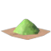 | **Hỗn hợp thảo mộc rừng** | Woodland Herb Blend | 120 c | Hạ <b>The Elder</b> | Gravlaks, Uncured Pork, Andhrímnirs Seasoning... |
| 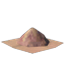 | **Thảo mộc thuỷ thủ** | Seafarer's Herbs | 130 c | Giết <b>Serpent</b> | Unfermented Serpent/Bonemaw Meat, Ráns Embrace... |
| 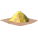 | **Bột tiêu đỉnh núi** | Mountain Peak Pepper Powder | 140 c | Hạ <b>Moder</b> | Highlands Frosty Rub, Uncured Ham, Sigurds Omelette... |
| 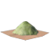 | **Mùa vụ thảo mộc đồng cỏ** | Grasslands Herbalist Harvest | 160 c | Hạ <b>Yagluth</b> | Spice Tea, Hermóðrs Waterskin, Uncooked Roasted Fruit |
| 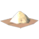 | **Thảo mộc đồi ẩn** | Herbs of the Hidden Hills | 180 c | Hạ <b>The Queen</b> | Dvergr Bouquet Garni, Ratatoskrs Desire |
| 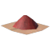 | **Bột gia vị rực lửa** | Fiery Spice Powder | 200 c | Hạ <b>Fader</b> | Elderblaze Dust, Spice Tea, Ægirs Blessing |
| 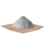 | **Tuyết không tan** | Unmelting Snow | 250 c | Hạ <b>Moder</b> | Highlands Frosty Rub, Snowballs (drop Stone Golem) |
|  | **Vỏ trứng rồng xay** | Powdered Dragon Eggshells | 120 c | Luôn bán | Nhiều món mead/eitr |
|  | **Gói hương liệu** | Fragrant Bundle | 140 c | Hạ <b>Moder</b> | Anti-Bite Concoction |
|  | **Đùi sóc muối** | Cured Squirrel Hamstring | 80 c | Luôn bán | Tonic of Ratatosk |
| 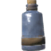 | **Lọ nút bần** | Corked Vial | 150 c | Hạ <b>The Elder</b> | Custom Bomb / Blob bomb |

*Địa điểm: tối đa 10 điểm spawn trong Swamp, cách tâm bản đồ 3000–8000m;
khi phát hiện sẽ hiện icon 🍲 trên bản đồ.*

## 🐺 Nguyên Liệu Rơi Từ Quái / Boss / Hiện Vật

| Icon | Nguyên liệu | Nguồn |
|---|---|---|
| 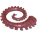 | **Kraken Tentacle** | Nhận sau khi hạ **Moder** (Kraken xuất hiện ở biển) |
| 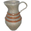 | **Heiðrúns Milk** | Nhận sau khi hạ **Moder** |
| 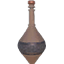 | **Kvasirs Blood** | Nhận sau khi hạ **Yagluth** |
| 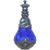 | **Hvergelmir Drops** | Nhận sau khi hạ **The Queen** |
| 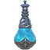 | **Mímisbrunnr Drops** | Rơi từ **Dvergr Support Mage** và **Fallen Valkyrie** |
| 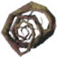 | **Landvidi Roots** | Rơi từ **Zil** và **Fuling Shaman** |
|  | **Fuling Secrets** | Rơi từ **Zil** |
| 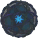 | **Trapped Vættr** | Rơi từ **Lord Reto** |
| 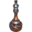 | **Dvergr Tonic** | Nấu hoặc rơi từ **Dvergr** |
|  | **Sporebark** | Tìm trong **Hollowed Tree** (cây rỗng Ashlands) |
| 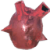 | **Drake Heart** | Rơi từ **Drake** (Mountain) |
|  | **Troll Meat** | Rơi từ **Troll** (Black Forest) |
|  | **Fowl Meat** | Rơi từ **Gull, Crow, Ash Crow** |
| 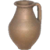 | **Lox Milk** | **Vắt Lox thuần hoá** (Milking Bucket tại Workbench) |
| 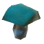 | **Blue Mushroom** | Rơi từ **Greydwarf** (Black Forest) |

## 📖 Ghi Chú Nguồn Gốc Khác (Guide 2.2.7)

| Món / Vật phẩm | Ghi chú nguồn gốc |
|---|---|
| **Nótts Cap** | Found inside the Hollowed Tree / chance to drop from greydwarf at night |
| **Unmelting Snow** | Dropped by Stone Golem or sold by Bog Witch for 250 gold after defeating Moder |

