# 🧥 10 Bộ Giáp Ma Thuật

Set bonus yêu cầu đủ **4 món**: Helmet + Chest + Legs + Cape. Mỗi bộ có cơ chế riêng chỉ hoạt động khi mặc đủ set (xem cột Ghi Chú). Ghép mảnh nhiều bộ vẫn được vì stats phân bổ khác nhau theo biome.

#### 🧙 Totemcaller (5 món)

| 🍳 Icon | Tên | Công Thức | Thông Số | Ghi Chú |
| :---: | --- | --- | --- | --- |
|  | **Totemcaller Mask** | **🧵 Magic Weaver** Round Log ×6; Spirit of Totem ×6; Dim Eitr ×4; Leather Scraps ×4 Nâng cấp: Spirit of Totem ×3; Dim Eitr ×2 | 🛡️ Giáp: 7 +2/cấp 🔋 Hồi Eitr: +8% | ✨ Set bonus: **Totemcaller** As ancestral spirits converge within, a strike against you unleashes a shockwave that pushes enemies away. 🛡️ Full set: khiên linh hồn tự nạp lại; bị đánh tạo sóng xung kích đẩy lùi địch |
|  | **Totemcaller Garb** | **🧵 Magic Weaver** Round Log ×6; Spirit of Totem ×6; Dim Eitr ×4; Leather Scraps ×4 Nâng cấp: Spirit of Totem ×3; Dim Eitr ×2 | 🛡️ Giáp: 7 +2/cấp 🔋 Hồi Eitr: +16% | ✨ Set bonus: **Totemcaller** As ancestral spirits converge within, a strike against you unleashes a shockwave that pushes enemies away. 🛡️ Full set: khiên linh hồn tự nạp lại; bị đánh tạo sóng xung kích đẩy lùi địch |
| 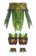 | **Totemcaller Skirt** | **🧵 Magic Weaver** Round Log ×6; Spirit of Totem ×6; Dim Eitr ×4; Leather Scraps ×4 Nâng cấp: Spirit of Totem ×3; Dim Eitr ×2 | 🛡️ Giáp: 7 +2/cấp 🔋 Hồi Eitr: +16% | ✨ Set bonus: **Totemcaller** As ancestral spirits converge within, a strike against you unleashes a shockwave that pushes enemies away. 🛡️ Full set: khiên linh hồn tự nạp lại; bị đánh tạo sóng xung kích đẩy lùi địch |
|  | **Totemcaller Bloom** | **🧵 Magic Weaver** Dandelion ×20; Spirit of Totem ×7; Dim Eitr ×4; Thistle ×6 Nâng cấp: Spirit of Totem ×3; Dim Eitr ×2 | 🛡️ Giáp: 1 +1/cấp 🔋 Hồi Eitr: +2% | ✨ Set bonus: **Totemcaller** As ancestral spirits converge within, a strike against you unleashes a shockwave that pushes enemies away. 🛡️ Full set: khiên linh hồn tự nạp lại; bị đánh tạo sóng xung kích đẩy lùi địch |
|  | **Totemcaller Crest** | **🧵 Magic Weaver** Ancient Seed ×10; Spirit of Totem ×6; Dim Eitr ×4; Greydwarf Eye ×10 | 🛡️ Giáp: 10 +1/cấp 🟣 Eitr: +30 | ✨ Khi đeo: **Pineapple Sigil** A carved fruit whispers old tricks to the wind. The jungle knows your name. Tốc độ: -97% 🛡️ Full set: khiên linh hồn tự nạp lại; bị đánh tạo sóng xung kích đẩy lùi địch |

#### 🧙 Mushroomcaller (5 món)

| 🍳 Icon | Tên | Công Thức | Thông Số | Ghi Chú |
| :---: | --- | --- | --- | --- |
|  | **Mushroomcaller Cap** | **🧵 Magic Weaver** Mushroom ×5; Spirit of Mushroom ×6; Dim Eitr ×4; Deer Hide ×6 Nâng cấp: Spirit of Mushroom ×3; Dim Eitr ×2 | 🛡️ Giáp: 8 +2/cấp 🔋 Hồi Eitr: +7% | ✨ Set bonus: **Mushroomcaller** Magical mushrooms occasionally appear around you, quietly guarding your path. 🍄 Full set: nấm ma thuật tự mọc quanh bạn, cản đường kẻ địch |
| 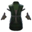 | **Mushroomcaller Vestments** | **🧵 Magic Weaver** Mushroom ×5; Spirit of Mushroom ×6; Dim Eitr ×4; Deer Hide ×6 Nâng cấp: Spirit of Mushroom ×3; Dim Eitr ×2 | 🛡️ Giáp: 8 +2/cấp 🔋 Hồi Eitr: +14% | ✨ Set bonus: **Mushroomcaller** Magical mushrooms occasionally appear around you, quietly guarding your path. 🍄 Full set: nấm ma thuật tự mọc quanh bạn, cản đường kẻ địch |
| 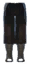 | **Mushroomcaller Trousers** | **🧵 Magic Weaver** Mushroom ×5; Spirit of Mushroom ×6; Dim Eitr ×4; Deer Hide ×6 Nâng cấp: Spirit of Mushroom ×3; Dim Eitr ×2 | 🛡️ Giáp: 8 +2/cấp 🔋 Hồi Eitr: +14% | ✨ Set bonus: **Mushroomcaller** Magical mushrooms occasionally appear around you, quietly guarding your path. 🍄 Full set: nấm ma thuật tự mọc quanh bạn, cản đường kẻ địch |
|  | **Mushroomcaller Mantle** | **🧵 Magic Weaver** Yellow Mushroom ×6; Spirit of Mushroom ×7; Dim Eitr ×4 Nâng cấp: Spirit of Mushroom ×3; Dim Eitr ×2 | 🛡️ Giáp: 1 +1/cấp 🔋 Hồi Eitr: +2% | ✨ Set bonus: **Mushroomcaller** Magical mushrooms occasionally appear around you, quietly guarding your path. 🍄 Full set: nấm ma thuật tự mọc quanh bạn, cản đường kẻ địch |
|  | **Mushroomcaller Tome** | **🧵 Magic Weaver** Arcane Page ×4; Spirit of Mushroom ×6; Dim Eitr ×4; Yellow Mushroom ×4 | 🛡️ Giáp: 10 +1/cấp 🟣 Eitr: +30 | ✨ Khi đeo: **Mushroom Memory** Knowledge spreads within you like mycelium beneath the forest soil. Hồi Eitr: +10% 🍄 Full set: nấm ma thuật tự mọc quanh bạn, cản đường kẻ địch |

#### 🧙 Deathcaller (5 món)

| 🍳 Icon | Tên | Công Thức | Thông Số | Ghi Chú |
| :---: | --- | --- | --- | --- |
|  | **Deathcaller Hood** | **🧵 Magic Weaver** Iron ×6; Spirit of Death ×6; Dim Eitr ×4; Troll Hide ×6 Nâng cấp: Spirit of Death ×3; Dim Eitr ×2 | 🛡️ Giáp: 10 +2/cấp 🔋 Hồi Eitr: +10% | ✨ Set bonus: **Deathcaller** Enemies dying in your presence release a poisonous cloud of decay. ☠️ Full set: kẻ địch chết quanh bạn phát nổ độc (AOE 24 m) |
| 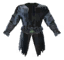 | **Deathcaller Vestments** | **🧵 Magic Weaver** Iron ×6; Spirit of Death ×6; Dim Eitr ×4; Troll Hide ×6 Nâng cấp: Spirit of Death ×3; Dim Eitr ×2 | 🛡️ Giáp: 10 +2/cấp 🔋 Hồi Eitr: +20% | ✨ Set bonus: **Deathcaller** Enemies dying in your presence release a poisonous cloud of decay. ☠️ Full set: kẻ địch chết quanh bạn phát nổ độc (AOE 24 m) |
| 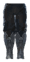 | **Deathcaller Leggings** | **🧵 Magic Weaver** Iron ×6; Spirit of Death ×6; Dim Eitr ×4; Troll Hide ×6 Nâng cấp: Spirit of Death ×3; Dim Eitr ×2 | 🛡️ Giáp: 10 +2/cấp 🔋 Hồi Eitr: +20% | ✨ Set bonus: **Deathcaller** Enemies dying in your presence release a poisonous cloud of decay. ☠️ Full set: kẻ địch chết quanh bạn phát nổ độc (AOE 24 m) |
|  | **Deathcaller Cape** | **🧵 Magic Weaver** Iron ×6; Spirit of Death ×6; Dim Eitr ×4; Feathers ×10 Nâng cấp: Spirit of Death ×3; Dim Eitr ×2 | 🛡️ Giáp: 3 +1/cấp 🔋 Hồi Eitr: +4% | ✨ Set bonus: **Deathcaller** Enemies dying in your presence release a poisonous cloud of decay. ☠️ Full set: kẻ địch chết quanh bạn phát nổ độc (AOE 24 m) |
| 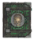 | **Deathcaller Tome** | **🧵 Magic Weaver** Arcane Page ×10; Spirit of Death ×10; Dim Eitr ×6; Guck ×6 | 🛡️ Giáp: 10 +1/cấp 🟣 Eitr: +30 | ✨ Khi đeo: **Gravetext** The words were never meant for the living. Hồi Eitr: +15% ☠️ Full set: kẻ địch chết quanh bạn phát nổ độc (AOE 24 m) |

#### 🧙 Frostcaller (5 món)

| 🍳 Icon | Tên | Công Thức | Thông Số | Ghi Chú |
| :---: | --- | --- | --- | --- |
|  | **Frostcaller Hood** | **🧵 Magic Weaver Lv.2** Silver ×10; Spirit of Frost ×6; Dim Eitr ×4; Wolf Pelt ×4 Nâng cấp: Spirit of Frost ×3; Dim Eitr ×2 | 🛡️ Giáp: 12 +2/cấp 🔋 Hồi Eitr: +13% | ✨ Set bonus: **Frostcaller** Nearby enemies are gripped by biting cold, slowing their movement. ❄️ Full set: hào quang làm chậm kẻ địch gần |
| 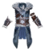 | **Frostcaller Vestments** | **🧵 Magic Weaver Lv.2** Silver ×10; Spirit of Frost ×6; Dim Eitr ×4; Wolf Pelt ×4 Nâng cấp: Spirit of Frost ×3; Dim Eitr ×2 | 🛡️ Giáp: 12 +2/cấp 🔋 Hồi Eitr: +26% | ✨ Set bonus: **Frostcaller** Nearby enemies are gripped by biting cold, slowing their movement. ❄️ Full set: hào quang làm chậm kẻ địch gần |
| 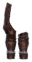 | **Frostcaller Legwraps** | **🧵 Magic Weaver Lv.2** Silver ×10; Spirit of Frost ×6; Dim Eitr ×4; Wolf Pelt ×4 Nâng cấp: Spirit of Frost ×3; Dim Eitr ×2 | 🛡️ Giáp: 12 +2/cấp 🔋 Hồi Eitr: +26% | ✨ Set bonus: **Frostcaller** Nearby enemies are gripped by biting cold, slowing their movement. ❄️ Full set: hào quang làm chậm kẻ địch gần |
|  | **Frostcaller Cape** | **🧵 Magic Weaver Lv.2** Wolf Hair Bundle ×20; Spirit of Frost ×6; Dim Eitr ×4; Wolf Pelt ×6 Nâng cấp: Spirit of Frost ×3; Dim Eitr ×2 | 🛡️ Giáp: 2 +1/cấp 🔋 Hồi Eitr: +6% | ✨ Set bonus: **Frostcaller** Nearby enemies are gripped by biting cold, slowing their movement. ❄️ Full set: hào quang làm chậm kẻ địch gần |
| 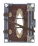 | **Frostcaller Tome** | **🧵 Magic Weaver Lv.2** Arcane Page ×10; Spirit of Frost ×10; Dim Eitr ×6; Freeze Gland ×6 | 🛡️ Giáp: 10 +1/cấp 🟣 Eitr: +30 | ✨ Khi đeo: **Frozen Resolve** Chilling clarity drawn from ancient tomes - it grants the restraint and focus of the winter's edge. Hồi Eitr: +15% ❄️ Full set: hào quang làm chậm kẻ địch gần |

#### 🧙 Firecaller (5 món)

| 🍳 Icon | Tên | Công Thức | Thông Số | Ghi Chú |
| :---: | --- | --- | --- | --- |
| 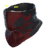 | **Firecaller Wrap** | **🧵 Magic Weaver Lv.3** Black Metal ×10; Spirit of Fire ×8; Dim Eitr ×6; Linen Thread ×20 Nâng cấp: Spirit of Fire ×4; Dim Eitr ×3 | 🛡️ Giáp: 14 +2/cấp 🔋 Hồi Eitr: +16% | ✨ Set bonus: **Firecaller** As heat builds to its peak, a strike against you triggers a searing burst that scorches all around. 🔥 Full set: khiên lửa tự nạp lại sau khi vỡ; bị đánh kích hoạt bùng nổ sát thương |
| 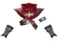 | **Firecaller Vestments** | **🧵 Magic Weaver Lv.3** Black Metal ×10; Spirit of Fire ×8; Dim Eitr ×6; Linen Thread ×20 Nâng cấp: Spirit of Fire ×4; Dim Eitr ×3 | 🛡️ Giáp: 14 +2/cấp 🔋 Hồi Eitr: +32% | ✨ Set bonus: **Firecaller** As heat builds to its peak, a strike against you triggers a searing burst that scorches all around. 🔥 Full set: khiên lửa tự nạp lại sau khi vỡ; bị đánh kích hoạt bùng nổ sát thương |
| 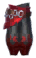 | **Firecaller Legwraps** | **🧵 Magic Weaver Lv.3** Black Metal ×10; Spirit of Fire ×8; Dim Eitr ×6; Linen Thread ×20 Nâng cấp: Spirit of Fire ×4; Dim Eitr ×3 | 🛡️ Giáp: 14 +2/cấp 🔋 Hồi Eitr: +32% | ✨ Set bonus: **Firecaller** As heat builds to its peak, a strike against you triggers a searing burst that scorches all around. 🔥 Full set: khiên lửa tự nạp lại sau khi vỡ; bị đánh kích hoạt bùng nổ sát thương |
|  | **Firecaller Cape** | **🧵 Magic Weaver Lv.3** Tar ×30; Spirit of Fire ×8; Dim Eitr ×8; Linen Thread ×20 Nâng cấp: Spirit of Fire ×4; Dim Eitr ×4 | 🛡️ Giáp: 2 +1/cấp 🔋 Hồi Eitr: +8% | ✨ Set bonus: **Firecaller** As heat builds to its peak, a strike against you triggers a searing burst that scorches all around. 🔥 Full set: khiên lửa tự nạp lại sau khi vỡ; bị đánh kích hoạt bùng nổ sát thương |
| 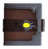 | **Firecaller Tome** | **🧵 Magic Weaver Lv.3** Arcane Page ×10; Spirit of Fire ×10; Dim Eitr ×6; Tar ×20 | 🛡️ Giáp: 10 +1/cấp 🟣 Eitr: +30 | ✨ Khi đeo: **Emberbound Memory** The pages carry warmth long after they close. Their knowledge lingers like smoke in the mind. Hồi Eitr: +20% 🔥 Full set: khiên lửa tự nạp lại sau khi vỡ; bị đánh kích hoạt bùng nổ sát thương |

#### 🧙 Stonecaller (5 món)

| 🍳 Icon | Tên | Công Thức | Thông Số | Ghi Chú |
| :---: | --- | --- | --- | --- |
|  | **Stonecaller Hood** | **🧵 Magic Weaver Lv.3** Stone ×60; Spirit of Stone ×8; Dim Eitr ×6; Linen Thread ×20 Nâng cấp: Spirit of Stone ×4; Dim Eitr ×3 | 🛡️ Giáp: 16 +2/cấp 🔋 Hồi Eitr: +14% | ✨ Set bonus: **Stonecaller** A stone barrier surrounds you, reforming over time after being broken. 🪨 Full set: khiên đá tự nạp lại sau khi vỡ |
| 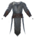 | **Stonecaller Vestments** | **🧵 Magic Weaver Lv.3** Stone ×60; Spirit of Stone ×8; Dim Eitr ×6; Linen Thread ×20 Nâng cấp: Spirit of Stone ×4; Dim Eitr ×3 | 🛡️ Giáp: 16 +2/cấp 🔋 Hồi Eitr: +28% | ✨ Set bonus: **Stonecaller** A stone barrier surrounds you, reforming over time after being broken. 🪨 Full set: khiên đá tự nạp lại sau khi vỡ |
| 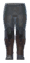 | **Stonecaller Trousers** | **🧵 Magic Weaver Lv.3** Stone ×60; Spirit of Stone ×8; Dim Eitr ×6; Linen Thread ×20 Nâng cấp: Spirit of Stone ×4; Dim Eitr ×3 | 🛡️ Giáp: 16 +2/cấp 🔋 Hồi Eitr: +28% | ✨ Set bonus: **Stonecaller** A stone barrier surrounds you, reforming over time after being broken. 🪨 Full set: khiên đá tự nạp lại sau khi vỡ |
| 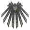 | **Stonecaller Mantle** | **🧵 Magic Weaver Lv.3** Stone ×150; Spirit of Stone ×8; Dim Eitr ×6; Obsidian ×30 Nâng cấp: Spirit of Stone ×4; Dim Eitr ×3 | 🛡️ Giáp: 6 +1/cấp 🔋 Hồi Eitr: +8% 🏃 Di chuyển: -4% | ✨ Set bonus: **Stonecaller** A stone barrier surrounds you, reforming over time after being broken. 🪨 Full set: khiên đá tự nạp lại sau khi vỡ |
| 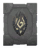 | **Stonecaller Tome** | **🧵 Magic Weaver** Arcane Page ×10; Spirit of Stone ×10; Dim Eitr ×6; Stone ×60 | 🛡️ Giáp: 10 +1/cấp 🟣 Eitr: +30 | ✨ Khi đeo: **Granite Memory** Each line settles firmly, leaving the mind steady and unshaken. Hồi Eitr: +15%; Giáp: +3 🪨 Full set: khiên đá tự nạp lại sau khi vỡ |

#### 🧙 Windcaller (5 món)

| 🍳 Icon | Tên | Công Thức | Thông Số | Ghi Chú |
| :---: | --- | --- | --- | --- |
|  | **Windcaller Hat** | **🧵 Magic Weaver Lv.4** Yggdrasil Wood ×20; Spirit of Wind ×8; Eitr ×10; Blue Jute ×2 Nâng cấp: Spirit of Wind ×4; Eitr ×5 | 🛡️ Giáp: 20 +2/cấp 🔋 Hồi Eitr: +20% | ✨ Set bonus: **Windcaller** Currents of wind grant you a second push in the air and soften your fall. 🌬️ Full set: nhảy đúp giữa không trung (Vertical Boost, 14 m/s lên, 2.5 m/s tới, 15 stamina) + rơi chậm |
|  | **Windcaller Vestments** | **🧵 Magic Weaver Lv.4** Blue Jute ×6; Spirit of Wind ×8; Eitr ×10; Scale Hide ×3 Nâng cấp: Spirit of Wind ×4; Eitr ×5 | 🛡️ Giáp: 17 +2/cấp 🔋 Hồi Eitr: +40% | ✨ Set bonus: **Windcaller** Currents of wind grant you a second push in the air and soften your fall. 🌬️ Full set: nhảy đúp giữa không trung (Vertical Boost, 14 m/s lên, 2.5 m/s tới, 15 stamina) + rơi chậm |
| 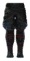 | **Windcaller Legwraps** | **🧵 Magic Weaver Lv.4** Blue Jute ×6; Spirit of Wind ×8; Eitr ×10; Scale Hide ×3 Nâng cấp: Spirit of Wind ×4; Eitr ×5 | 🛡️ Giáp: 17 +2/cấp 🔋 Hồi Eitr: +40% | ✨ Set bonus: **Windcaller** Currents of wind grant you a second push in the air and soften your fall. 🌬️ Full set: nhảy đúp giữa không trung (Vertical Boost, 14 m/s lên, 2.5 m/s tới, 15 stamina) + rơi chậm |
|  | **Windcaller Scarf** | **🧵 Magic Weaver Lv.4** Red Jute ×10; Spirit of Wind ×10; Eitr ×10; Linen Thread ×20 Nâng cấp: Spirit of Wind ×4; Eitr ×5 | 🛡️ Giáp: 2 +1/cấp 🔋 Hồi Eitr: +10% | ✨ Set bonus: **Windcaller** Currents of wind grant you a second push in the air and soften your fall. 🌬️ Full set: nhảy đúp giữa không trung (Vertical Boost, 14 m/s lên, 2.5 m/s tới, 15 stamina) + rơi chậm |
|  | **Windcaller Gourd** | **🧵 Magic Weaver Lv.4** Dvergr Tankard ×1; Spirit of Wind ×10; Eitr ×16; Wisp ×10 | 🛡️ Giáp: 10 +1/cấp 🟣 Eitr: +30 | ✨ Khi đeo: **Weightless Vessel** Filled with nothing but wind and wisdom, leaving no burden to slow your step. 🌬️ Full set: nhảy đúp giữa không trung (Vertical Boost, 14 m/s lên, 2.5 m/s tới, 15 stamina) + rơi chậm |

#### 🧙 Lightcaller (5 món)

| 🍳 Icon | Tên | Công Thức | Thông Số | Ghi Chú |
| :---: | --- | --- | --- | --- |
|  | **Lightcaller Hood** | **🧵 Magic Weaver Lv.4** Bronze ×12; Spirit of Light ×8; Eitr ×6; Linen Thread ×20 Nâng cấp: Spirit of Light ×4; Eitr ×3 | 🛡️ Giáp: 18 +2/cấp 🔋 Hồi Eitr: +22% | ✨ Set bonus: **Lightcaller** A sacred light surrounds you, easing the wounds of your allies and illuminating the space around. 💡 Full set: hào quang chữa lành đồng minh gần + chiếu sáng xung quanh |
| 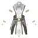 | **Lightcaller Vestments** | **🧵 Magic Weaver Lv.4** Bronze ×12; Spirit of Light ×8; Eitr ×6; Linen Thread ×20 Nâng cấp: Spirit of Light ×4; Eitr ×3 | 🛡️ Giáp: 18 +2/cấp 🔋 Hồi Eitr: +44% | ✨ Set bonus: **Lightcaller** A sacred light surrounds you, easing the wounds of your allies and illuminating the space around. 💡 Full set: hào quang chữa lành đồng minh gần + chiếu sáng xung quanh |
|  | **Lightcaller Legwraps** | **🧵 Magic Weaver Lv.4** Bronze ×12; Spirit of Light ×8; Eitr ×6; Linen Thread ×20 Nâng cấp: Spirit of Light ×4; Eitr ×3 | 🛡️ Giáp: 18 +2/cấp 🔋 Hồi Eitr: +44% | ✨ Set bonus: **Lightcaller** A sacred light surrounds you, easing the wounds of your allies and illuminating the space around. 💡 Full set: hào quang chữa lành đồng minh gần + chiếu sáng xung quanh |
|  | **Lightcaller Cape** | **🧵 Magic Weaver Lv.4** Black Core ×2; Spirit of Light ×8; Eitr ×6; Linen Thread ×20 Nâng cấp: Spirit of Light ×4; Eitr ×3 | 🛡️ Giáp: 3 +1/cấp 🔋 Hồi Eitr: +10% | ✨ Set bonus: **Lightcaller** A sacred light surrounds you, easing the wounds of your allies and illuminating the space around. 💡 Full set: hào quang chữa lành đồng minh gần + chiếu sáng xung quanh |
|  | **Lightcaller Tome** | **🧵 Magic Weaver Lv.4** Arcane Page ×10; Spirit of Light ×10; Eitr ×6; Wisp ×8 | 🛡️ Giáp: 10 +1/cấp 🟣 Eitr: +30 | ✨ Khi đeo: **Scripture of Clarity** Each page turns in silence, but leaves the mind brighter than before. Hồi Eitr: +15% 💡 Full set: hào quang chữa lành đồng minh gần + chiếu sáng xung quanh |

#### 🧙 Stormcaller (5 món)

| 🍳 Icon | Tên | Công Thức | Thông Số | Ghi Chú |
| :---: | --- | --- | --- | --- |
| 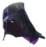 | **Stormcaller Hood** | **🧵 Magic Weaver Lv.4** Flametal ×10; Spirit of Storm ×10; Eitr ×16; Ask Hide ×10 Nâng cấp: Spirit of Storm ×5; Eitr ×5 | 🛡️ Giáp: 22 +2/cấp 🔋 Hồi Eitr: +32% | ✨ Set bonus: **Stormcaller** You move like lightning, breaking through space in a sudden surge. ⚡ Full set: lao nhanh giữa không trung (Dash 30 m/s, 11 m, 20 Eitr) |
| 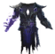 | **Stormcaller Vestments** | **🧵 Magic Weaver Lv.4** Flametal ×10; Spirit of Storm ×10; Eitr ×16; Ask Hide ×10 Nâng cấp: Spirit of Storm ×5; Eitr ×5 | 🛡️ Giáp: 22 +2/cấp 🔋 Hồi Eitr: +54% | ✨ Set bonus: **Stormcaller** You move like lightning, breaking through space in a sudden surge. ⚡ Full set: lao nhanh giữa không trung (Dash 30 m/s, 11 m, 20 Eitr) |
| 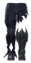 | **Stormcaller Trousers** | **🧵 Magic Weaver Lv.4** Flametal ×10; Spirit of Storm ×10; Eitr ×16; Ask Hide ×10 Nâng cấp: Spirit of Storm ×5; Eitr ×5 | 🛡️ Giáp: 22 +2/cấp 🔋 Hồi Eitr: +54% | ✨ Set bonus: **Stormcaller** You move like lightning, breaking through space in a sudden surge. ⚡ Full set: lao nhanh giữa không trung (Dash 30 m/s, 11 m, 20 Eitr) |
| 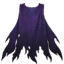 | **Stormcaller Cape** | **🧵 Magic Weaver Lv.4** Morgen Sinew ×4; Spirit of Storm ×10; Eitr ×16; Ask Hide ×10 Nâng cấp: Spirit of Storm ×5; Eitr ×5 | 🛡️ Giáp: 3 +1/cấp 🔋 Hồi Eitr: +12% | ✨ Set bonus: **Stormcaller** You move like lightning, breaking through space in a sudden surge. ⚡ Full set: lao nhanh giữa không trung (Dash 30 m/s, 11 m, 20 Eitr) |
| 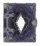 | **Stormcaller Tome** | **🧵 Magic Weaver Lv.4** Arcane Page ×10; Spirit of Storm ×10; Eitr ×6; Blue Gemstone ×1 | 🛡️ Giáp: 10 +1/cấp 🟣 Eitr: +30 | ✨ Khi đeo: **Tome of Currents** Grants focus to the storm within - taming chaos into power. Hồi Eitr: +20%; Tốc độ: -97% ⚡ Full set: lao nhanh giữa không trung (Dash 30 m/s, 11 m, 20 Eitr) |

#### 🧙 Bloodcaller (4 món)

| 🍳 Icon | Tên | Công Thức | Thông Số | Ghi Chú |
| :---: | --- | --- | --- | --- |
| 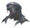 | **Bloodcaller Adornment** | **🧵 Magic Weaver Lv.4** Giant Blood Sack ×4; Spirit of Blood ×10; Eitr ×16; Ask Hide ×10 Nâng cấp: Spirit of Blood ×5; Eitr ×5 | 🛡️ Giáp: 21 +2/cấp 🔋 Hồi Eitr: +15% | ✨ Set bonus: **Bloodcaller** You drain the lifeblood of nearby dying enemies, each fading heartbeat restoring your health. Hồi HP: +30% 🩸 Full set: kẻ địch chết hồi máu cho đồng minh gần (AOE 20 m) |
|  | **Bloodcaller Vestments** | **🧵 Magic Weaver Lv.4** Giant Blood Sack ×4; Spirit of Blood ×10; Eitr ×16; Ask Hide ×10 Nâng cấp: Spirit of Blood ×5; Eitr ×5 | 🛡️ Giáp: 21 +2/cấp 🔋 Hồi Eitr: +30% | ✨ Set bonus: **Bloodcaller** You drain the lifeblood of nearby dying enemies, each fading heartbeat restoring your health. Hồi HP: +30% 🩸 Full set: kẻ địch chết hồi máu cho đồng minh gần (AOE 20 m) |
| 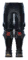 | **Bloodcaller Legwraps** | **🧵 Magic Weaver Lv.4** Giant Blood Sack ×4; Spirit of Blood ×10; Eitr ×16; Ask Hide ×10 Nâng cấp: Spirit of Blood ×5; Eitr ×5 | 🛡️ Giáp: 21 +2/cấp 🔋 Hồi Eitr: +30% | ✨ Set bonus: **Bloodcaller** You drain the lifeblood of nearby dying enemies, each fading heartbeat restoring your health. Hồi HP: +30% 🩸 Full set: kẻ địch chết hồi máu cho đồng minh gần (AOE 20 m) |
| 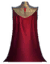 | **Bloodcaller Crimson Veil** | **🧵 Magic Weaver Lv.4** Red Jute ×12; Spirit of Blood ×12; Eitr ×16; Flametal ×12 Nâng cấp: Spirit of Blood ×5; Eitr ×5 | 🛡️ Giáp: 3 +1/cấp 🔋 Hồi Eitr: +5% | ✨ Set bonus: **Bloodcaller** You drain the lifeblood of nearby dying enemies, each fading heartbeat restoring your health. Hồi HP: +30% 🩸 Full set: kẻ địch chết hồi máu cho đồng minh gần (AOE 20 m) |
