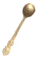

# 🧿 Spirit & Nguyên Liệu Ma Thuật

#### Spirit (10)

| 🍳 Icon | Tên | Công Thức | Thông Số | Nguồn/Rơi |
| :---: | --- | --- | --- | --- |
|  | **Spirit of Blood** | — | 📦 Stack: 50 ⚖️ 0.1 | 🐾 Volture (5%, 1-2) 🐾 BlobLava (8%, 1-2) 🐾 Charred_Twitcher (8%, 1-2) 🐾 Charred_Melee (10%, 1-2) 🐾 Charred_Archer (10%, 1-2) 🐾 Charred_Mage (15%, 1-2) 🐾 Asksvin (12%, 1-2) 🐾 BonemawSerpent (20%, 1-2) 🐾 Morgen (20%, 1-2) 🐾 FallenValkyrie (30%, 1-2) 🐾 Fader (100%, 4-8) |
|  | **Spirit of Death** | — | 📦 Stack: 50 ⚖️ 0.1 | 🐾 Draugr (3%, 1-2) 🐾 Draugr_Ranged (3%, 1-2) 🐾 Draugr_Elite (10%, 2-3) 🐾 Blob (5%, 1-1) 🐾 BlobElite (15%, 1-2) 🐾 Leech (3%, 1-1) 🐾 Wraith (14%, 1-3) 🐾 Abomination (30%, 2-5) 🐾 Bonemass (100%, 3-8) |
|  | **Spirit of Fire** | — | 📦 Stack: 50 ⚖️ 0.1 | 🐾 Lox (15%, 1-2) 🐾 Deathsquito (3%, 1-2) 🐾 Goblin (7%, 1-2) 🐾 GoblinArcher (7%, 1-2) 🐾 GoblinBrute (20%, 2-3) 🐾 GoblinShaman (15%, 2-3) 🐾 BlobTar (12%, 1-3) 🐾 GoblinKing (100%, 3-8) |
|  | **Spirit of Frost** | — | 📦 Stack: 50 ⚖️ 0.1 | 🐾 Bat (2%, 1-1) 🐾 Wolf (6%, 1-2) 🐾 Hatchling (10%, 1-2) 🐾 Fenring (18%, 1-3) 🐾 Fenring_Cultist (20%, 1-3) 🐾 Ulv (20%, 1-3) 🐾 StoneGolem (40%, 2-5) 🐾 Dragon (100%, 3-8) |
|  | **Spirit of Light** | — | 📦 Stack: 50 ⚖️ 0.1 | 🐾 Hare (6%, 1-1) 🐾 Tick (4%, 1-2) 🐾 Seeker (12%, 1-2) 🐾 SeekerBrute (30%, 1-3) 🐾 Dverger (12%, 1-2) 🐾 DvergerMage (12%, 1-2) 🐾 Gjall (40%, 2-5) 🐾 SeekerQueen (100%, 4-8) |
|  | **Spirit of Mushroom** | — | 📦 Stack: 50 ⚖️ 0.1 | 🐾 Neck (3%, 1-1) 🐾 Boar (3%, 1-1) 🐾 Deer (3%, 1-2) 🐾 Greyling (3%, 1-1) 🐾 Eikthyr (100%, 3-6) 🐾 Greydwarf (5%, 1-2) 🐾 Greydwarf_Elite (15%, 1-3) 🐾 Greydwarf_Shaman (15%, 1-3) 🐾 Troll (30%, 1-3) 🐾 gd_king (100%, 3-6) |
|  | **Spirit of Stone** | — | 📦 Stack: 50 ⚖️ 0.1 | 🐾 Lox (15%, 1-2) 🐾 Deathsquito (3%, 1-2) 🐾 Goblin (7%, 1-2) 🐾 GoblinArcher (7%, 1-2) 🐾 GoblinBrute (20%, 2-3) 🐾 GoblinShaman (15%, 2-3) 🐾 BlobTar (12%, 1-3) 🐾 GoblinKing (100%, 3-8) |
|  | **Spirit of Storm** | — | 📦 Stack: 50 ⚖️ 0.1 | 🐾 Volture (5%, 1-2) 🐾 BlobLava (8%, 1-2) 🐾 Charred_Twitcher (8%, 1-2) 🐾 Charred_Melee (10%, 1-2) 🐾 Charred_Archer (10%, 1-2) 🐾 Charred_Mage (15%, 1-2) 🐾 Asksvin (12%, 1-2) 🐾 BonemawSerpent (20%, 1-2) 🐾 Morgen (20%, 1-2) 🐾 FallenValkyrie (30%, 1-2) 🐾 Fader (100%, 4-8) |
|  | **Spirit of Totem** | — | 📦 Stack: 50 ⚖️ 0.1 | 🐾 Neck (3%, 1-1) 🐾 Boar (3%, 1-1) 🐾 Deer (3%, 1-2) 🐾 Greyling (3%, 1-1) 🐾 Eikthyr (100%, 3-6) 🐾 Greydwarf (5%, 1-2) 🐾 Greydwarf_Elite (15%, 1-3) 🐾 Greydwarf_Shaman (15%, 1-3) 🐾 Troll (30%, 1-3) 🐾 gd_king (100%, 3-6) |
|  | **Spirit of Wind** | — | 📦 Stack: 50 ⚖️ 0.1 | 🐾 Hare (6%, 1-1) 🐾 Tick (4%, 1-2) 🐾 Seeker (12%, 1-2) 🐾 SeekerBrute (30%, 1-3) 🐾 Dverger (12%, 1-2) 🐾 DvergerMage (12%, 1-2) 🐾 Gjall (40%, 2-5) 🐾 SeekerQueen (100%, 4-8) |

#### Nguyên Liệu (5)

| 🍳 Icon | Tên | Công Thức | Thông Số | Nguồn/Rơi |
| :---: | --- | --- | --- | --- |
|  | **Roseheart Crystal** | — | 📦 Stack: 30 ⚖️ 5 | 🐾 Eikthyr (100%, 1-1) |
|  | **Dim Eitr** | **🧵 Magic Weaver** Eitr-Fractured Remnant ×1; Surtling Core ×1; Greydwarf Eye ×3 | 📦 Stack: 30 ⚖️ 3 | — |
|  | **Eitr-Fractured Remnant** | — | 📦 Stack: 50 ⚖️ 0.2 | 🐾 Greyling (5%, 1-2) 🐾 Boar (5%, 1-2) 🐾 Deer (5%, 1-1) 🐾 Neck (7%, 1-2) 🐾 Skeleton (5%, 1-2) 🐾 Skeleton_Poison (40%, 1-4) 🐾 Ghost (10%, 1-3) 🐾 Greydwarf (5%, 1-2) 🐾 Greydwarf_Elite (15%, 1-3) 🐾 Greydwarf_Shaman (15%, 1-3) 🐾 Troll (25%, 1-3) 🐾 Leech (5%, 1-1) 🐾 Blob (8%, 1-1) 🐾 BlobElite (10%, 1-2) 🐾 Draugr (7%, 1-1) 🐾 Draugr_Ranged (7%, 1-1) 🐾 Draugr_Elite (15%, 1-2) 🐾 Surtling (2%, 1-1) 🐾 Wraith (20%, 1-2) 🐾 Abomination (40%, 2-4) 🐾 Bat (3%, 1-1) 🐾 Wolf (9%, 1-2) 🐾 Hatchling (11%, 1-1) 🐾 Fenring (15%, 1-2) 🐾 Fenring_Cultist (20%, 1-2) 🐾 Ulv (20%, 1-2) 🐾 StoneGolem (40%, 3-5) 🐾 Lox (12%, 1-2) 🐾 Deathsquito (6%, 1-2) 🐾 Goblin (7%, 1-2) 🐾 GoblinArcher (8%, 1-2) 🐾 GoblinBrute (25%, 2-3) 🐾 GoblinShaman (25%, 2-3) 🐾 BlobTar (15%, 1-3) 🐾 Skeleton_Hildir (100%, 2-4) 🐾 Fenring_Cultist_Hildir (100%, 3-5) 🐾 GoblinBruteBros (100%, 3-7) 🐾 GoblinBrute_Hildir (100%, 3-7) 🐾 GoblinShaman_Hildir (100%, 3-7) 🐾 Eikthyr (60%, 2-5) 🐾 gd_king (70%, 3-6) 🐾 Bonemass (80%, 4-7) 🐾 Dragon (90%, 5-8) 🐾 GoblinKing (100%, 6-10) |
|  | **Arcane Page** | — | 📦 Stack: 30 ⚖️ 5 | 🐾 Greyling (0.1%, 1-2) 🐾 Boar (1%, 1-2) 🐾 Deer (1%, 1-2) 🐾 Neck (1%, 1-2) 🐾 Skeleton (0.5%, 1-2) 🐾 Skeleton_Poison (2%, 1-2) 🐾 Ghost (2%, 1-2) 🐾 Greydwarf (0.5%, 1-2) 🐾 Greydwarf_Elite (0.5%, 1-2) 🐾 Greydwarf_Shaman (0.5%, 1-2) 🐾 Troll (8%, 1-2) 🐾 Leech (1%, 1-2) 🐾 Blob (1%, 1-2) 🐾 BlobElite (3%, 1-2) 🐾 Draugr (0.1%, 1-2) 🐾 Draugr_Ranged (0.1%, 1-2) 🐾 Draugr_Elite (1%, 1-2) 🐾 Surtling (0.1%, 1-2) 🐾 Wraith (3%, 1-2) 🐾 Abomination (10%, 1-2) 🐾 Bat (0.1%, 1-2) 🐾 Wolf (1.5%, 1-2) 🐾 Hatchling (2%, 1-2) 🐾 Fenring (3%, 1-2) 🐾 Fenring_Cultist (4%, 1-2) 🐾 Ulv (4%, 1-2) 🐾 StoneGolem (10%, 1-2) 🐾 Lox (3%, 1-2) 🐾 Deathsquito (1%, 1-2) 🐾 Goblin (1%, 1-2) 🐾 GoblinArcher (1%, 1-2) 🐾 GoblinBrute (5%, 1-2) 🐾 GoblinShaman (10%, 1-2) 🐾 BlobTar (3%, 1-2) 🐾 Tick (1%, 1-2) 🐾 Seeker (3%, 1-2) 🐾 Seeker_Brood (0.5%, 1-2) 🐾 SeekerBrute (10%, 1-2) 🐾 Gjall (20%, 1-2) 🐾 Volture (1%, 1-2) 🐾 BlobLava (1%, 1-2) 🐾 Charred_Twitcher (2%, 1-2) 🐾 Charred_Melee (2%, 1-2) 🐾 Charred_Archer (2%, 1-2) 🐾 Charred_Mage (10%, 1-2) 🐾 Asksvin (2%, 1-2) 🐾 BonemawSerpent (15%, 1-2) 🐾 Morgen (10%, 1-2) 🐾 FallenValkyrie (15%, 1-2) 🐾 Skeleton_Hildir (20%, 1-3) 🐾 Fenring_Cultist_Hildir (20%, 1-3) 🐾 GoblinBruteBros (20%, 1-3) 🐾 GoblinBrute_Hildir (20%, 1-3) 🐾 GoblinShaman_Hildir (20%, 1-3) 🐾 Eikthyr (15%, 1-3) 🐾 gd_king (20%, 1-3) 🐾 Bonemass (20%, 1-3) 🐾 Dragon (30%, 1-4) 🐾 GoblinKing (30%, 1-4) 🐾 SeekerQueen (40%, 1-5) 🐾 Fader (40%, 1-5) 🧔 Haldor — 200 coins (cần: defeated_eikthyr) |
|  | **Mouse's Spoon** | — | 📦 Stack: 30 ⚖️ 5 | 🐾 Troll (50%, 1-1) |
