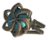
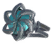

# 💍 Trinkets (Nhẫn)

| 🍳 Icon | Tên | Công Thức | Thông Số | Ghi Chú |
| :---: | --- | --- | --- | --- |
|  | **Bloodcaller Ring** | **🧵 Magic Weaver Lv.4** Red Gemstone ×1; Black Core ×1; Spirit of Blood ×10; Eitr ×12 | ⚖️ 2 | ✨ Khi đeo: **Bloodguard** In the moment of surge, blood answers its master's call, weaving a scarlet barrier around the vessel of life. Hồi HP: +2% |
|  | **Flametal Inspiration Ring** | **🧵 Magic Weaver Lv.7** Golden Inspiration Ring ×1; Flametal ×6; Blue Gemstone ×1; Green Gemstone ×1 | ⚖️ 2 | ⚡ +20% tốc độ sinh Inspiration 🔺 +1 Inspiration tối đa |
|  | **Bronze Inspiration Ring** | **🧵 Magic Weaver Lv.2** Ruby ×1; Bronze ×6; Dim Eitr ×4; Greydwarf Eye ×10 | ⚖️ 2 | — |
|  | **Golden Inspiration Ring** | **🧵 Magic Weaver Lv.6** Black Metal Inspiration Ring ×1; Coins ×600; Eitr ×10; Wisp ×4 | ⚖️ 2 | ⚡ +20% tốc độ sinh Inspiration |
|  | **Silver Inspiration Ring** | **🧵 Magic Weaver Lv.4** Iron Inspiration Ring ×1; Silver ×6; Dim Eitr ×8; Freeze Gland ×8 | ⚖️ 2 | — |
|  | **Black Metal Inspiration Ring** | **🧵 Magic Weaver Lv.5** Silver Inspiration Ring ×1; Black Metal ×6; Dim Eitr ×10; Dragon Tear ×2 | ⚖️ 2 | — |
|  | **Iron Inspiration Ring** | **🧵 Magic Weaver Lv.3** Bronze Inspiration Ring ×1; Iron ×6; Dim Eitr ×6; Guck ×10 | ⚖️ 2 | — |
