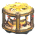
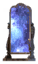
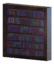
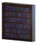
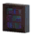
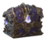

# 🔨 Trạm Chế Tạo & Trang Trí

#### Trạm Chế Tạo (7)

| 🍳 Icon | Tên | Công Thức | Hạng Mục |
| :---: | --- | --- | --- |
|  | **Magic Weaver** | **⚒️ Lò Rèn (Forge)** Bronze ×4; Roseheart Crystal ×1; Eitr-Fractured Remnant ×1; Dandelion ×10 | Distant Origins |
|  | **Dark Monolith** | Ectoplasm ×3; Stone ×30; Iron ×6; Spirit of Death ×3 | Distant Origins |
|  | **Astral Mirror** | Crystal ×15; Fine Wood ×10; Silver ×6; Spirit of Frost ×3 | Distant Origins |
|  | **Spellbook Stand** | Arcane Page ×6; Fine Wood ×15; Linen Thread ×6; Refined Eitr Elixir ×4 | Distant Origins |
|  | **Eitr Well** | Dragon Tear ×2; Black Marble ×20; Black Metal ×12; Eitr ×12 | Distant Origins |
|  | **Blood Fountain** | Giant Blood Sack ×6; Grausten ×30; Flametal ×6; Spirit of Blood ×6 | Distant Origins |
|  | **Essence Cauldron** | Bronze ×5; Mouse's Spoon ×1; Ruby ×2; Dim Eitr ×2 | Distant Origins |

#### Trang Trí (51)

| 🍳 Icon | Tên | Công Thức | Hạng Mục |
| :---: | --- | --- | --- |
|  | **Arcane Bookcase Corner Piece (A1)** | Round Log ×4 | Distant Origins Decor |
|  | **Arcane Bookcase Corner Piece (A2)** | Round Log ×4 | Distant Origins Decor |
|  | **Arcane Bookcase Corner Piece (V1)** | Round Log ×4 | Distant Origins Decor |
|  | **Arcane Bookcase Corner Piece (V2)** | Round Log ×4 | Distant Origins Decor |
|  | **Arcane Bookcase Corner Piece (V3)** | Round Log ×4 | Distant Origins Decor |
|  | **Arcane Bookcase Corner Piece (V4)** | Round Log ×4 | Distant Origins Decor |
|  | **Arcane Bookcase Ladder (V1)** | Round Log ×4 | Distant Origins Decor |
|  | **Large Arcane Bookcase (D1)** | Round Log ×30; Bronze Nails ×20; Dim Eitr ×1 | Distant Origins Decor |
|  | **Large Arcane Bookcase (D2)** | Round Log ×30; Bronze Nails ×20; Dim Eitr ×1 | Distant Origins Decor |
|  | **Large Arcane Bookcase (V1)** | Round Log ×30; Bronze Nails ×20 | Distant Origins Decor |
|  | **Large Arcane Bookcase (V2)** | Round Log ×30; Bronze Nails ×20 | Distant Origins Decor |
|  | **Medium Arcane Bookcase (A1)** | Round Log ×20; Bronze Nails ×10 | Distant Origins Decor |
|  | **Medium Arcane Bookcase (A2)** | Round Log ×20; Bronze Nails ×10 | Distant Origins Decor |
|  | **Medium Arcane Bookcase (D1)** | Round Log ×20; Bronze Nails ×10; Dim Eitr ×1 | Distant Origins Decor |
|  | **Medium Arcane Bookcase (D2)** | Round Log ×20; Bronze Nails ×10; Dim Eitr ×1 | Distant Origins Decor |
|  | **Medium Arcane Bookcase (V1)** | Round Log ×20; Bronze Nails ×10 | Distant Origins Decor |
|  | **Medium Arcane Bookcase (V2)** | Round Log ×20; Bronze Nails ×10 | Distant Origins Decor |
|  | **Small Arcane Bookcase (D1)** | Round Log ×10; Bronze Nails ×5; Dim Eitr ×1 | Distant Origins Decor |
|  | **Small Arcane Bookcase (D2)** | Round Log ×10; Bronze Nails ×5; Dim Eitr ×1 | Distant Origins Decor |
|  | **Small Arcane Bookcase (V1)** | Round Log ×10; Bronze Nails ×5 | Distant Origins Decor |
|  | **Small Arcane Bookcase (V2)** | Round Log ×10; Bronze Nails ×5 | Distant Origins Decor |
|  | **The Magic Carpet** | Red Jute ×2; Blue Jute ×2; Eitr-Fractured Remnant ×1; Surtling Core ×1; Greydwarf Eye ×3; Blueberries ×5; Honey ×3; Carrot ×4; Blueberries ×4; Thistle ×3; Yellow Mushroom ×4; Ooze ×4; Honey ×5; Turnip ×4; Ooze ×5; Guck ×1; Entrails ×7; Freeze Gland ×3; Honey ×5; Onion ×3; Freeze Gland ×2; Crystal ×3; Greydwarf Eye ×3; Cloudberries ×10; Honey ×5; Barley Flour ×3; Cloudberries ×12; Tar ×3; Flax ×8; Spirit of Mushroom ×3; Honey ×10; Yellow Mushroom ×10; Greydwarf Eye ×3; Spirit of Death ×3; Honey ×10; Guck ×5; Thistle ×5; Spirit of Frost ×3; Honey ×10; Crystal ×5; Wolf Fang ×1; Spirit of Fire ×3; Honey ×10; Tar ×5; Needle ×2; Round Log ×6; Spirit of Totem ×6; Dim Eitr ×4; Leather Scraps ×4; Round Log ×6; Spirit of Totem ×6; Dim Eitr ×4; Leather Scraps ×4; Round Log ×6; Spirit of Totem ×6; Dim Eitr ×4; Leather Scraps ×4; Dandelion ×20; Spirit of Totem ×7; Dim Eitr ×4; Thistle ×6; Ancient Seed ×10; Spirit of Totem ×6; Dim Eitr ×4; Greydwarf Eye ×10; Mushroom ×5; Spirit of Mushroom ×6; Dim Eitr ×4; Deer Hide ×6; Mushroom ×5; Spirit of Mushroom ×6; Dim Eitr ×4; Deer Hide ×6; Mushroom ×5; Spirit of Mushroom ×6; Dim Eitr ×4; Deer Hide ×6; Yellow Mushroom ×6; Spirit of Mushroom ×7; Dim Eitr ×4; Arcane Page ×4; Spirit of Mushroom ×6; Dim Eitr ×4; Yellow Mushroom ×4; Iron ×6; Spirit of Death ×6; Dim Eitr ×4; Troll Hide ×6; Iron ×6; Spirit of Death ×6; Dim Eitr ×4; Troll Hide ×6; Iron ×6; Spirit of Death ×6; Dim Eitr ×4; Troll Hide ×6; Iron ×6; Spirit of Death ×6; Dim Eitr ×4; Feathers ×10; Arcane Page ×10; Spirit of Death ×10; Dim Eitr ×6; Guck ×6; Silver ×10; Spirit of Frost ×6; Dim Eitr ×4; Wolf Pelt ×4; Silver ×10; Spirit of Frost ×6; Dim Eitr ×4; Wolf Pelt ×4; Silver ×10; Spirit of Frost ×6; Dim Eitr ×4; Wolf Pelt ×4; Wolf Hair Bundle ×20; Spirit of Frost ×6; Dim Eitr ×4; Wolf Pelt ×6; Arcane Page ×10; Spirit of Frost ×10; Dim Eitr ×6; Freeze Gland ×6; Black Metal ×10; Spirit of Fire ×8; Dim Eitr ×6; Linen Thread ×20; Black Metal ×10; Spirit of Fire ×8; Dim Eitr ×6; Linen Thread ×20; Black Metal ×10; Spirit of Fire ×8; Dim Eitr ×6; Linen Thread ×20; Tar ×30; Spirit of Fire ×8; Dim Eitr ×8; Linen Thread ×20; Arcane Page ×10; Spirit of Fire ×10; Dim Eitr ×6; Tar ×20; Stone ×60; Spirit of Stone ×8; Dim Eitr ×6; Linen Thread ×20; Stone ×60; Spirit of Stone ×8; Dim Eitr ×6; Linen Thread ×20; Stone ×60; Spirit of Stone ×8; Dim Eitr ×6; Linen Thread ×20; Stone ×150; Spirit of Stone ×8; Dim Eitr ×6; Obsidian ×30; Arcane Page ×10; Spirit of Stone ×10; Dim Eitr ×6; Stone ×60; Blue Jute ×6; Spirit of Wind ×8; Eitr ×10; Scale Hide ×3; Blue Jute ×6; Spirit of Wind ×8; Eitr ×10; Scale Hide ×3; Yggdrasil Wood ×20; Spirit of Wind ×8; Eitr ×10; Blue Jute ×2; Red Jute ×10; Spirit of Wind ×10; Eitr ×10; Linen Thread ×20; Dvergr Tankard ×1; Spirit of Wind ×10; Eitr ×16; Wisp ×10; Bronze ×12; Spirit of Light ×8; Eitr ×6; Linen Thread ×20; Bronze ×12; Spirit of Light ×8; Eitr ×6; Linen Thread ×20; Bronze ×12; Spirit of Light ×8; Eitr ×6; Linen Thread ×20; Black Core ×2; Spirit of Light ×8; Eitr ×6; Linen Thread ×20; Arcane Page ×10; Spirit of Light ×10; Eitr ×6; Wisp ×8; Flametal ×10; Spirit of Storm ×10; Eitr ×16; Ask Hide ×10; Flametal ×10; Spirit of Storm ×10; Eitr ×16; Ask Hide ×10; Flametal ×10; Spirit of Storm ×10; Eitr ×16; Ask Hide ×10; Morgen Sinew ×4; Spirit of Storm ×10; Eitr ×16; Ask Hide ×10; Arcane Page ×10; Spirit of Storm ×10; Eitr ×6; Blue Gemstone ×1; Giant Blood Sack ×4; Spirit of Blood ×10; Eitr ×16; Ask Hide ×10; Giant Blood Sack ×4; Spirit of Blood ×10; Eitr ×16; Ask Hide ×10; Giant Blood Sack ×4; Spirit of Blood ×10; Eitr ×16; Ask Hide ×10; Red Jute ×12; Spirit of Blood ×12; Eitr ×16; Flametal ×12; Red Gemstone ×1; Black Core ×1; Spirit of Blood ×10; Eitr ×12; Frost Troll Trophy ×1; Spirit of Totem ×8; Dim Eitr ×4; Round Log ×8; Ancient Seed ×8; Spirit of Totem ×8; Dim Eitr ×4; Round Log ×6; Yellow Mushroom ×18; Spirit of Mushroom ×8; Dim Eitr ×4; Round Log ×8; Draugr Elite Trophy ×1; Spirit of Death ×10; Dim Eitr ×6; Iron ×16; Freeze Gland ×20; Spirit of Frost ×10; Dim Eitr ×6; Crystal ×50; Hatchling Trophy ×3; Spirit of Frost ×10; Dim Eitr ×6; Silver ×18; Surtling Core ×20; Spirit of Fire ×10; Dim Eitr ×8; Black Metal ×24; Fuling Shaman Trophy ×1; Spirit of Fire ×10; Dim Eitr ×8; Black Metal ×18; Fuling Brute Trophy ×1; Spirit of Stone ×10; Dim Eitr ×8; Stone ×150; Gjall Trophy ×1; Spirit of Wind ×12; Eitr ×16; Yggdrasil Wood ×20; Jotun Puffs ×30; Spirit of Light ×12; Eitr ×16; Bronze ×24; Seeker Trophy ×1; Spirit of Light ×12; Eitr ×16; Bronze ×24; Blue Gemstone ×1; Spirit of Storm ×14; Eitr ×16; Flametal ×10; Blue Gemstone ×1; Spirit of Storm ×14; Eitr ×16; Flametal ×10; Red Gemstone ×1; Spirit of Blood ×14; Morgen Heart ×3; Flametal ×10; Red Gemstone ×1; Spirit of Blood ×14; Giant Blood Sack ×6; Flametal ×10 | Distant Origins Decor |
|  | **Void Chest** | Black Core ×1; Crystal ×3; Bronze ×4; Yggdrasil Wood ×10 | Distant Origins Decor |
|  | **Blood Spirit Holder** | Spirit of Blood ×1; Flametal ×1 | Distant Origins Decor |
|  | **Death Spirit Holder** | Spirit of Death ×1; Iron ×1 | Distant Origins Decor |
|  | **Fire Spirit Holder** | Spirit of Fire ×1; Black Metal ×1 | Distant Origins Decor |
|  | **Frost Spirit Holder** | Spirit of Frost ×1; Silver ×1 | Distant Origins Decor |
|  | **Light Spirit Holder** | Spirit of Light ×1; Iron ×1 | Distant Origins Decor |
|  | **Mushroom Spirit Holder** | Spirit of Mushroom ×1; Bronze ×1 | Distant Origins Decor |
|  | **Stone Spirit Holder** | Spirit of Stone ×1; Black Metal ×1 | Distant Origins Decor |
|  | **Storm Spirit Holder** | Spirit of Storm ×1; Flametal ×1 | Distant Origins Decor |
|  | **Totem Spirit Holder** | Spirit of Totem ×1; Bronze ×1 | Distant Origins Decor |
|  | **Wind Spirit Holder** | Spirit of Wind ×1; Iron ×1 | Distant Origins Decor |
|  | **TileArcaneFloorV1DO (V1)** | Crystal ×1; Wood ×2 | Distant Origins Decor |
|  | **TileArcaneFloorV2DO (V2)** | Crystal ×1; Wood ×2 | Distant Origins Decor |
|  | **TileArcaneFloorV3DO (V3)** | Crystal ×1; Wood ×2 | Distant Origins Decor |
|  | **TileArcaneFloorV4DO (V4)** | Crystal ×1; Wood ×2 | Distant Origins Decor |
|  | **TileArcaneFloorV5DO (V5)** | Crystal ×1; Wood ×2 | Distant Origins Decor |
|  | **TileArcaneWallA1DO (A1)** | Crystal ×1; Wood ×2 | Distant Origins Decor |
|  | **TileArcaneWallA2DO (A2)** | Crystal ×1; Wood ×2 | Distant Origins Decor |
|  | **TileArcaneWallA3DO (A3)** | Crystal ×1; Wood ×2 | Distant Origins Decor |
|  | **TileArcaneWallA4DO (A4)** | Crystal ×1; Wood ×2 | Distant Origins Decor |
|  | **TileArcaneWallA5DO (A5)** | Crystal ×1; Wood ×2 | Distant Origins Decor |
|  | **TileArcaneWallV1DO (V1)** | Crystal ×1; Wood ×2 | Distant Origins Decor |
|  | **TileArcaneWallV2DO (V2)** | Crystal ×1; Wood ×2 | Distant Origins Decor |
|  | **TileArcaneWallV3DO (V3)** | Crystal ×1; Wood ×2 | Distant Origins Decor |
|  | **TileArcaneWallV4DO (V4)** | Crystal ×1; Wood ×2 | Distant Origins Decor |
|  | **TileArcaneWallV5DO (V5)** | Crystal ×1; Wood ×2 | Distant Origins Decor |
|  | **Fierce Tiki** | Spirit of Totem ×1; Round Log ×12 | Distant Origins Decor |
|  | **Mocking Tiki** | Spirit of Totem ×1; Round Log ×12 | Distant Origins Decor |
|  | **Wise Tiki** | Spirit of Totem ×1; Round Log ×12 | Distant Origins Decor |
