# 📜 Schematic Recipes (Bản Vẽ)

Tất cả **113 bản vẽ** được chế tạo tại **Bàn Biên Tập (Scribe Table) Level 1**.

#### Shield Schematics (6)

| Icon | Bản Vẽ | Nguyên Liệu |
| :---: | --- | --- |
| 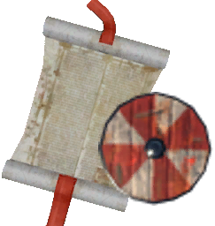 | **Drakkar Shields** | Iron Nails ×88 Round Log ×12 Resin ×20 Deer Hide ×15 |
| 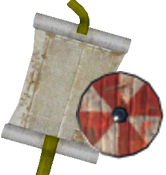 | **KarveShields** | Leather Scraps ×14 Bronze Nails ×50 Copper ×8 Round Log ×20 |
| 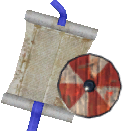 | **KnarrShields** | Leather Scraps ×20 Bronze Nails ×65 Copper ×12 Round Log ×24 |
| 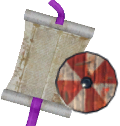 | **HolkShields** | Chain ×10 Round Log ×40 Black Metal ×30 Wolf Pelt ×16 |
| 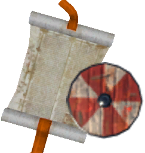 | **AshlandsDrakkar Shields** | Flametal ×14 Blackwood ×20 Charcoal Resin ×20 Ask Hide ×10 |
| — | **SnekkeShields** | Leather Scraps ×24 Iron Nails ×55 Copper ×14 Round Log ×28 |

#### Lamp/Light Schematics (6)

| Icon | Bản Vẽ | Nguyên Liệu |
| :---: | --- | --- |
| 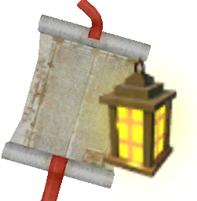 | **Drakkar Lights** | Fine Wood ×10 Iron Nails ×37 Copper ×5 |
| 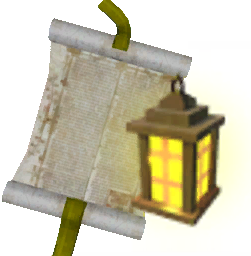 | **KarveLights** | Coal Paste ×8 Bronze Nails ×25 Tin ×4 Fine Wood ×8 |
| 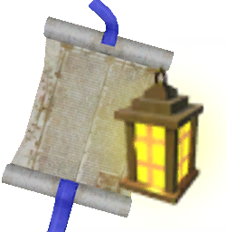 | **KnarrLights** | Coal Paste ×12 Bronze Nails ×35 Tin ×6 Fine Wood ×12 |
| 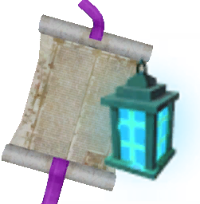 | **HolkLights** | Yggdrasil Wood ×10 Iron Nails ×37 Wisp ×4 |
| 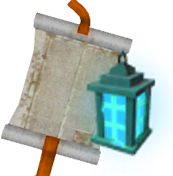 | **AshlandsDrakkar Lights** | Blackwood ×10 Iron Nails ×37 Flametal ×5 Wisp ×4 |
| — | **SnekkeLights** | Coal Paste ×12 Iron Nails ×55 Tin ×8 Fine Wood ×16 |

#### Anchor Schematics (6)

| Icon | Bản Vẽ | Nguyên Liệu |
| :---: | --- | --- |
| 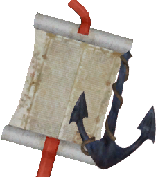 | **Drakkar Anchor** | Iron ×13 Coal Paste ×20 Fine Wood ×10 Chain ×3 |
| 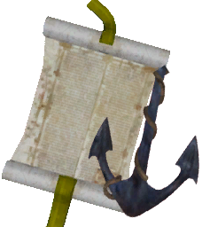 | **KarveAnchor** | Bronze ×6 Coal Paste ×4 Leather Scraps ×12 Wood ×10 |
| 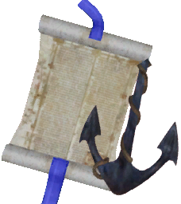 | **KnarrAnchor** | Bronze ×8 Coal Paste ×6 Leather Scraps ×16 Wood ×14 |
| 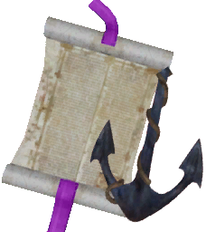 | **HolkAnchor** | Iron ×20 Tar ×6 Yggdrasil Wood ×10 Chain ×5 |
| 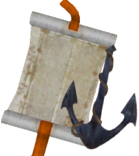 | **AshlandsDrakkar Anchor** | Flametal ×13 Coal Paste ×20 Blackwood ×10 Chain ×4 |
| — | **SnekkeAnchor** | Iron ×8 Coal Paste ×6 Leather Scraps ×16 Round Log ×10 |

#### Supply/Bag Schematics (7)

| Icon | Bản Vẽ | Nguyên Liệu |
| :---: | --- | --- |
| 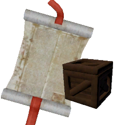 | **Drakkar Barrels** | Iron Nails ×57 Resin ×30 Fine Wood ×10 Wood ×20 |
| 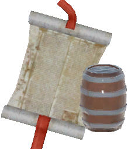 | **Drakkar Crates** | Tar ×6 Black Metal ×8 Fine Wood ×25 Iron Nails ×33 |
| 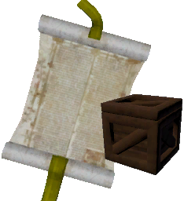 | **KarveBag** | Leather Scraps ×10 Tin ×3 Bronze Nails ×15 Fine Wood ×10 |
| 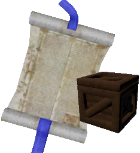 | **KnarrBag** | Leather Scraps ×12 Tin ×4 Bronze Nails ×20 Fine Wood ×14 |
| 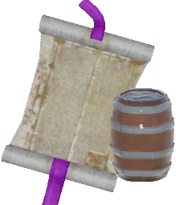 | **HolkBag** | Tar ×10 Black Metal ×12 Yggdrasil Wood ×15 Iron Nails ×77 |
| — | **AshlandsDrakkar Crates** | Charcoal Resin ×6 Flametal ×8 Blackwood ×25 Iron Nails ×33 |
| — | **SnekkeBag** | Leather Scraps ×14 Tin ×6 Iron Nails ×30 Fine Wood ×16 |

#### Tent Schematics (5)

| Icon | Bản Vẽ | Nguyên Liệu |
| :---: | --- | --- |
| 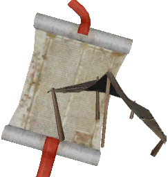 | **Drakkar Tent** | Red Jute ×5 Iron Nails ×23 Fine Wood ×10 Wolf Pelt ×3 |
| 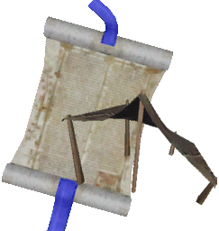 | **KnarrTent** | Troll Hide ×10 Bronze Nails ×35 Fine Wood ×10 Wood ×6 |
| 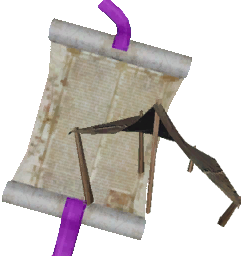 | **HolkTent** | Yggdrasil Wood ×14 Iron Nails ×40 Tar ×10 Black Metal ×3 |
| 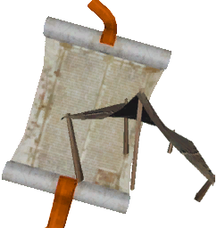 | **AshlandsDrakkar Tent** | Linen Thread ×25 Flametal ×10 Blackwood ×20 Ask Hide ×10 |
| — | **SnekkeTent** | Troll Hide ×12 Iron Nails ×55 Fine Wood ×14 Wood ×10 |

#### Armor Schematics (5)

| Icon | Bản Vẽ | Nguyên Liệu |
| :---: | --- | --- |
| 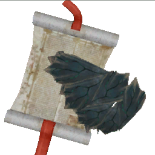 | **Drakkar Armor** | Carapace ×20 Black Metal ×16 Guck ×20 Chain ×8 |
| 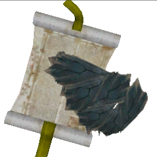 | **KarveArmor** | Carapace ×12 Black Metal ×12 Guck ×12 Chain ×4 |
| 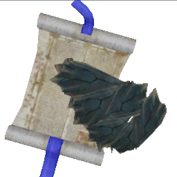 | **KnarrArmor** | Carapace ×16 Black Metal ×14 Guck ×16 Chain ×4 |
| — | **HolkArmor** | Carapace ×40 Black Metal ×24 Guck ×30 Chain ×10 |
| — | **SnekkeArmor** | Carapace ×18 Black Metal ×16 Guck ×16 Chain ×4 |

#### Oar Schematics (6)

| Icon | Bản Vẽ | Nguyên Liệu |
| :---: | --- | --- |
| 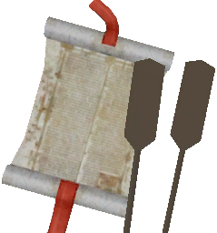 | **Drakkar Oar** | Wood ×10 Fine Wood ×5 Round Log ×10 |
| 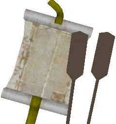 | **KarveOars** | Wood ×5 Fine Wood ×2 Round Log ×4 Coal Paste ×4 |
| 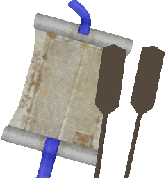 | **KnarrOars** | Wood ×7 Fine Wood ×4 Round Log ×6 Coal Paste ×6 |
| 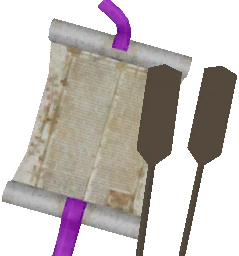 | **HolkOars** | Wood ×10 Fine Wood ×10 Round Log ×10 Yggdrasil Wood ×10 |
| 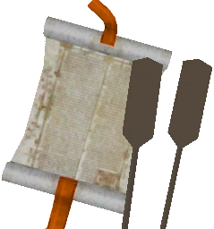 | **AshlandsDrakkar Oar** | Wood ×10 Blackwood ×5 Round Log ×10 |
| — | **SnekkeOars** | Wood ×8 Fine Wood ×5 Round Log ×7 Coal Paste ×7 |

#### Sail Color Schematics (60)

| Icon | Bản Vẽ | Nguyên Liệu |
| :---: | --- | --- |
| 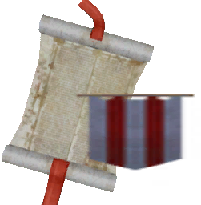 | **Drakkar SailBlack** | Coal Paste ×5 Fine Wood ×5 Sail Ink ×4 Leather Scraps ×8 |
|  | **Drakkar SailBlue** | Coal Paste ×5 Fine Wood ×5 Sail Ink ×4 Leather Scraps ×8 |
|  | **Drakkar SailGreen** | Coal Paste ×5 Fine Wood ×5 Sail Ink ×4 Leather Scraps ×8 |
|  | **Drakkar SailDefault** | Coal Paste ×5 Fine Wood ×5 Sail Ink ×4 Leather Scraps ×8 |
|  | **Drakkar SailTransparent** | Coal Paste ×5 Fine Wood ×5 Sail Ink ×4 Leather Scraps ×8 |
|  | **Drakkar SailWhite** | Coal Paste ×5 Fine Wood ×5 Sail Ink ×4 Leather Scraps ×8 |
|  | **Drakkar SailHound** | Coal Paste ×5 Fine Wood ×5 Sail Ink ×4 Leather Scraps ×8 |
|  | **Drakkar SailDruid** | Coal Paste ×5 Fine Wood ×5 Sail Ink ×4 Leather Scraps ×8 |
|  | **Drakkar SailWolf** | Coal Paste ×5 Fine Wood ×5 Sail Ink ×4 Leather Scraps ×8 |
|  | **Drakkar SailRaven** | Coal Paste ×5 Fine Wood ×5 Sail Ink ×4 Leather Scraps ×8 |
| 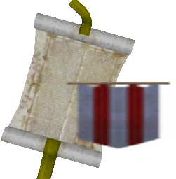 | **KarveSailBlack** | Coal Paste ×2 Wood ×5 Sail Ink ×3 Leather Scraps ×5 |
|  | **KarveSailBlue** | Coal Paste ×2 Wood ×5 Sail Ink ×3 Leather Scraps ×5 |
|  | **KarveSailDefault** | Coal Paste ×2 Wood ×5 Sail Ink ×3 Leather Scraps ×5 |
|  | **KarveSailGreen** | Coal Paste ×2 Wood ×5 Sail Ink ×3 Leather Scraps ×5 |
|  | **KarveSailTransparent** | Coal Paste ×2 Wood ×5 Sail Ink ×3 Leather Scraps ×5 |
|  | **KarveSailWhite** | Coal Paste ×2 Wood ×5 Sail Ink ×3 Leather Scraps ×5 |
|  | **KarveSailHound** | Coal Paste ×2 Wood ×5 Sail Ink ×3 Leather Scraps ×5 |
|  | **KarveSailDruid** | Coal Paste ×2 Wood ×5 Sail Ink ×3 Leather Scraps ×5 |
|  | **KarveSailWolf** | Coal Paste ×2 Wood ×5 Sail Ink ×3 Leather Scraps ×5 |
|  | **KarveSailRaven** | Coal Paste ×2 Wood ×5 Sail Ink ×3 Leather Scraps ×5 |
| 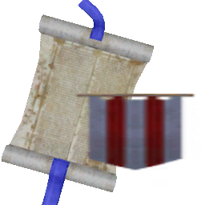 | **KnarrSailBlack** | Coal Paste ×3 Wood ×4 Sail Ink ×2 Leather Scraps ×4 |
|  | **KnarrSailBlue** | Coal Paste ×3 Wood ×4 Sail Ink ×2 Leather Scraps ×4 |
|  | **KnarrSailDefault** | Coal Paste ×3 Wood ×4 Sail Ink ×2 Leather Scraps ×4 |
|  | **KnarrSailDruid** | Coal Paste ×3 Wood ×4 Sail Ink ×2 Leather Scraps ×4 |
|  | **KnarrSailGreen** | Coal Paste ×3 Wood ×4 Sail Ink ×2 Leather Scraps ×4 |
|  | **KnarrSailHound** | Coal Paste ×3 Wood ×4 Sail Ink ×2 Leather Scraps ×4 |
|  | **KnarrSailRaven** | Coal Paste ×3 Wood ×4 Sail Ink ×2 Leather Scraps ×4 |
|  | **KnarrSailTransparent** | Coal Paste ×3 Wood ×4 Sail Ink ×2 Leather Scraps ×4 |
|  | **KnarrSailWhite** | Coal Paste ×3 Wood ×4 Sail Ink ×2 Leather Scraps ×4 |
|  | **KnarrSailWolf** | Coal Paste ×3 Wood ×4 Sail Ink ×2 Leather Scraps ×4 |
| 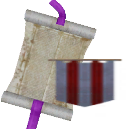 | **HolkSailBlack** | Coal Paste ×7 Yggdrasil Wood ×4 Sail Ink ×6 Leather Scraps ×10 |
|  | **HolkSailBlue** | Coal Paste ×7 Yggdrasil Wood ×4 Sail Ink ×6 Leather Scraps ×10 |
|  | **HolkSailGreen** | Coal Paste ×7 Yggdrasil Wood ×4 Sail Ink ×6 Leather Scraps ×10 |
|  | **HolkSailDefault** | Coal Paste ×7 Yggdrasil Wood ×4 Sail Ink ×6 Leather Scraps ×10 |
|  | **HolkSailTransparent** | Coal Paste ×7 Yggdrasil Wood ×4 Sail Ink ×6 Leather Scraps ×10 |
|  | **HolkSailWhite** | Coal Paste ×7 Yggdrasil Wood ×4 Sail Ink ×6 Leather Scraps ×10 |
|  | **HolkSailHound** | Coal Paste ×7 Yggdrasil Wood ×4 Sail Ink ×6 Leather Scraps ×10 |
|  | **HolkSailDruid** | Coal Paste ×7 Yggdrasil Wood ×4 Sail Ink ×6 Leather Scraps ×10 |
|  | **HolkSailWolf** | Coal Paste ×7 Yggdrasil Wood ×4 Sail Ink ×6 Leather Scraps ×10 |
|  | **HolkSailRaven** | Coal Paste ×7 Yggdrasil Wood ×4 Sail Ink ×6 Leather Scraps ×10 |
| 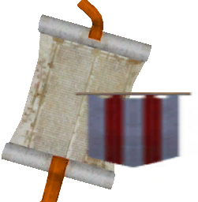 | **AshlandsDrakkar SailBlack** | Coal Paste ×4 Blackwood ×6 Sail Ink ×6 Leather Scraps ×14 |
|  | **AshlandsDrakkar SailBlue** | Coal Paste ×4 Blackwood ×6 Sail Ink ×6 Leather Scraps ×14 |
|  | **AshlandsDrakkar SailGreen** | Coal Paste ×4 Blackwood ×6 Sail Ink ×6 Leather Scraps ×14 |
|  | **AshlandsDrakkar SailDefault** | Coal Paste ×4 Blackwood ×6 Sail Ink ×6 Leather Scraps ×14 |
|  | **AshlandsDrakkar SailTransparent** | Coal Paste ×4 Blackwood ×6 Sail Ink ×6 Leather Scraps ×14 |
|  | **AshlandsDrakkar SailWhite** | Coal Paste ×4 Blackwood ×6 Sail Ink ×6 Leather Scraps ×14 |
|  | **AshlandsDrakkar SailHound** | Coal Paste ×4 Blackwood ×6 Sail Ink ×6 Leather Scraps ×14 |
|  | **AshlandsDrakkar SailDruid** | Coal Paste ×4 Blackwood ×6 Sail Ink ×6 Leather Scraps ×14 |
|  | **AshlandsDrakkar SailWolf** | Coal Paste ×4 Blackwood ×6 Sail Ink ×6 Leather Scraps ×14 |
|  | **AshlandsDrakkar SailRaven** | Coal Paste ×4 Blackwood ×6 Sail Ink ×6 Leather Scraps ×14 |
| — | **SnekkeSailBlack** | Coal Paste ×3 Wood ×4 Sail Ink ×2 Leather Scraps ×4 |
| — | **SnekkeSailBlue** | Coal Paste ×3 Wood ×4 Sail Ink ×2 Leather Scraps ×4 |
| — | **SnekkeSailGreen** | Coal Paste ×3 Wood ×4 Sail Ink ×2 Leather Scraps ×4 |
| — | **SnekkeSailDefault** | Coal Paste ×3 Wood ×4 Sail Ink ×2 Leather Scraps ×4 |
| — | **SnekkeSailTransparent** | Coal Paste ×3 Wood ×4 Sail Ink ×2 Leather Scraps ×4 |
| — | **SnekkeSailWhite** | Coal Paste ×3 Wood ×4 Sail Ink ×2 Leather Scraps ×4 |
| — | **SnekkeSailHound** | Coal Paste ×3 Wood ×4 Sail Ink ×2 Leather Scraps ×4 |
| — | **SnekkeSailDruid** | Coal Paste ×3 Wood ×4 Sail Ink ×2 Leather Scraps ×4 |
| — | **SnekkeSailWolf** | Coal Paste ×3 Wood ×4 Sail Ink ×2 Leather Scraps ×4 |
| — | **SnekkeSailRaven** | Coal Paste ×3 Wood ×4 Sail Ink ×2 Leather Scraps ×4 |

#### Head Schematics (4)

| Icon | Bản Vẽ | Nguyên Liệu |
| :---: | --- | --- |
| 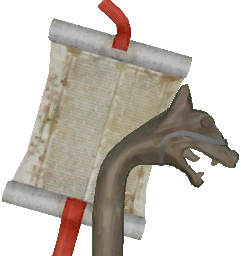 | **Drakkar HeadCernyx** | Fine Wood ×4 Tin ×2 |
|  | **Drakkar HeadDragon** | Fine Wood ×4 Tin ×2 |
|  | **Drakkar HeadOsberg** | Fine Wood ×4 Tin ×2 |
|  | **Drakkar HeadSkull** | Fine Wood ×4 Tin ×2 |

#### Rope Schematics (2)

| Icon | Bản Vẽ | Nguyên Liệu |
| :---: | --- | --- |
| 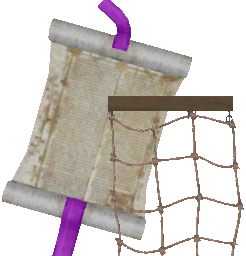 | **HolkRopes** | Wood ×10 Yggdrasil Wood ×5 Leather Scraps ×10 Iron Nails ×16 |
| 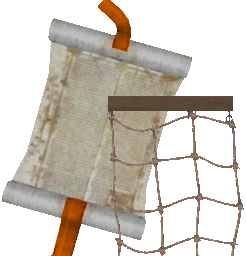 | **AshlandsDrakkar Ropes** | Wood ×20 Blackwood ×5 Leather Scraps ×20 Flametal ×5 |

#### NamePlate Schematics (6)

| Icon | Bản Vẽ | Nguyên Liệu |
| :---: | --- | --- |
| 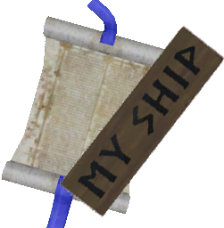 | **KnarrNamePlate** | Wood ×2 Coal ×2 |
| 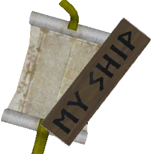 | **KarveNamePlate** | Wood ×2 Coal ×2 |
| 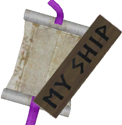 | **HolkNamePlate** | Wood ×2 Coal ×2 |
| 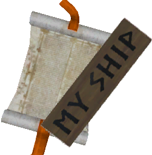 | **AshlandsDrakkar NamePlate** | Wood ×2 Coal ×2 |
| 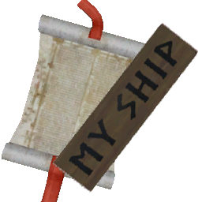 | **Drakkar NamePlate** | Wood ×2 Coal ×2 |
| — | **SnekkeNamePlate** | Wood ×2 Coal ×2 |
