# 🔨 Build Pieces (Công Trình Xây Dựng)

28 công trình mới, bao gồm gỗ trét tar, nội thất, bẫy cá, và trang trí.

#### 🪵 Tar Wood Series (10 pieces)

Gỗ trét than, chống nước/mưa. Tất cả tại **Workbench**.

| Icon | Tên | Prefab | Nguyên Liệu |
| :---: | --- | --- | --- |
| — | **Wall Log4** | `tar_wood_wall_log4` | Coal Paste ×2 Round Log ×4 |
| — | **Wall Log2** | `tar_wood_wall_log2` | Coal Paste ×1 Round Log ×2 |
| — | **Pole Log4** | `tar_wood_pole_log4` | Coal Paste ×2 Round Log ×4 |
| — | **Pole Log2** | `tar_wood_pole_log2` | Coal Paste ×1 Round Log ×2 |
| — | **Floor** | `tar_wood_floor` | Coal Paste ×1 Round Log ×2 |
| 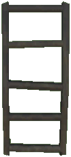 | **Ladder** | `tar_ladder` | Coal Paste ×2 Round Log ×3 |
| — | **Log 26** | `tar_wood_log_26` | Coal Paste ×1 Round Log ×2 |
| — | **Log 45** | `tar_wood_log_45` | Coal Paste ×1 Round Log ×2 |
| — | **Pole Log1** | `tar_wood_pole_log1` | Coal Paste ×1 Round Log ×1 |
| — | **Ramp** | `tar_wood_ramp` | Coal Paste ×1 Round Log ×2 |

#### 🏗️ Functional & Decorative Pieces

| Icon | Tên | Prefab | Trạm | Nguyên Liệu | Ghi Chú |
| :---: | --- | --- | --- | --- | --- |
| 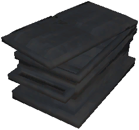 | **Chest Tarred** | `piece_chest_tarred` | 🔨 Workbench | Tar ×5 Iron Nails ×64 Fine Wood ×20 Leather Scraps ×10 | 📦 40 slots |
| 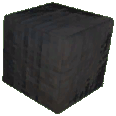 | **Chest Cargo** | `piece_chest_cargo` | 🔨 Workbench | Coal Paste ×2 Iron Nails ×24 Round Log ×2 | 📦 4 slots |
| 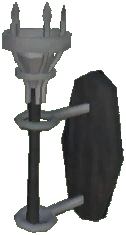 | **Iron Wall Torch** | `piece_iron_wall_torch` | 🔨 Workbench | Coal Paste ×1 Iron ×1 Round Log ×2 Tar ×2 | 🔥 Fuel: Tar |
| 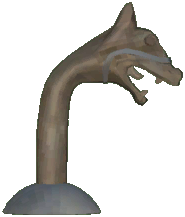 | **Decor Dragon** | `decor_dragon` | 🔨 Workbench | Coal ×1 Iron ×1 Round Log ×2 |  |
| 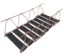 | **Bridge Rope** | `bridge_rope` | 🔨 Workbench | Fine Wood ×3 Leather Scraps ×3 |  |
|  | **Bridge Rope Support** | `bridge_rope_support` | 🔨 Workbench | Fine Wood ×3 Bronze Nails ×6 Round Log ×2 Leather Scraps ×3 |  |
| 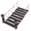 | **Bridge Rope Support Side** | `bridge_rope_support_side` | 🔨 Workbench | Fine Wood ×3 Bronze Nails ×3 Round Log ×1 Leather Scraps ×3 |  |
| 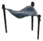 | **Cloth Roof** | `cloth_roof` | 🔨 Workbench | Fine Wood ×1 Leather Scraps ×3 Bronze Nails ×6 |  |
| 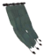 | **Cloth Roof Corner** | `cloth_roof_corner` | 🔨 Workbench | Fine Wood ×1 Leather Scraps ×3 Bronze Nails ×6 |  |
|  | **Cloth Roof Corner2** | `cloth_roof_corner2` | 🔨 Workbench | Fine Wood ×1 Leather Scraps ×3 Bronze Nails ×6 |  |
|  | **Cloth Roof Triangle Sloope** | `cloth_roof_triangle_sloope` | 🔨 Workbench | Fine Wood ×1 Leather Scraps ×3 Bronze Nails ×6 |  |
| 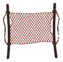 | **Fishnet Wall** | `fishnet_wall` | 🔨 Workbench | Fine Wood ×1 Leather Scraps ×3 Bronze Nails ×6 |  |
|  | **Banner Sail1** | `piece_banner_sail1` | 🔨 Workbench | Fine Wood ×2 Leather Scraps ×3 Bronze Nails ×2 |  |
| 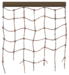 | **Banner Sail2** | `piece_banner_sail2` | 🔨 Workbench | Fine Wood ×2 Leather Scraps ×3 Bronze Nails ×2 |  |
|  | **Ropewall** | `piece_ropewall` | 🔨 Workbench | Fine Wood ×2 Leather Scraps ×3 Bronze Nails ×2 |  |
|  | **Ropewall Big** | `piece_ropewall_big` | 🔨 Workbench | Fine Wood ×2 Leather Scraps ×3 Bronze Nails ×2 |  |
|  | **Wisplampceiling** | `piece_wisplampceiling` | 🔨 Workbench | Wisp ×3 Leather Scraps ×3 Bronze Nails ×8 Iron ×1 | 💡 Wisp lamp |
|  | **Fishnettrap** | `FishnetTrap` | 🔨 Workbench | — |  |
