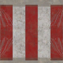
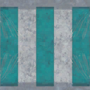
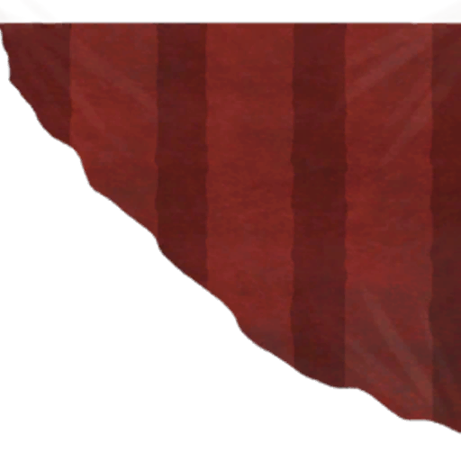
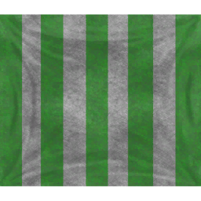
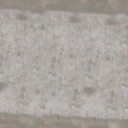
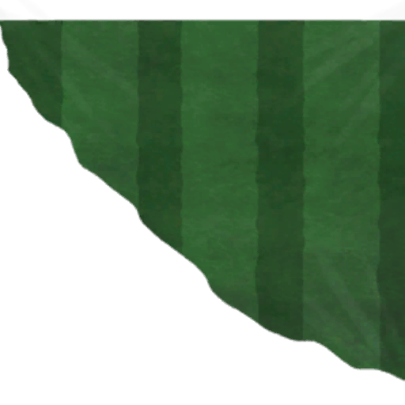
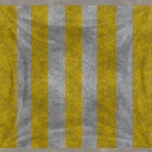
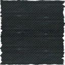
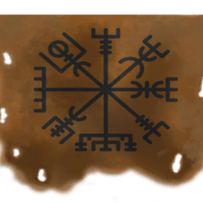

# 🎨 Màu Sail & Tùy Chỉnh Hình Thức

#### ⛵ 10 Màu Sail

| # | Preview | Tên | Texture | Mô Tả |
| --- | --- | --- | --- | --- |
| 0 |  | **Default** | `default_drakkar` | Red sail (default) |
| 1 |  | **Blue** | `blue_drakkar` | Blue sail |
| 2 |  | **Black/Triangle Red** | `torn_drakkar` | Triangle red pattern |
| 3 |  | **Green** | `green_drakkar` | Green sail |
| 4 |  | **Transparent** | `transparent_drakkar` | Transparent sail |
| 5 |  | **White** | `white_drakkar` | White sail |
| 6 |  | **Wolf/Triangle Green** | `sailCross` | Triangle green pattern |
| 7 |  | **Raven/Yellow** | `yellow_drakkar` | Yellow sail |
| 8 |  | **Hound/Gray** | `sailDark` | Gray sail |
| 9 |  | **Druid/Vegvisir** | `sailVegvisir` | Vegvisir pattern |

#### 🛡️ Shield Patterns

| Tàu | Số Kiểu Shield |
| --- | --- |
| **Raft** | 0 |
| **Karve** | 4 |
| **Knarr** | 4 |
| **Snekke** | 4 |
| **Drakkar (Longship)** | 5 |
| **Holk** | 6 |
| **Ashlands Drakkar** | 4 |

#### 🐉 Drakkar Head Decorations

| ID | Tên | Schematic |
| --- | --- | --- |
| 0 | Skull (Default) | SchematicDrakkarHeadSkull |
| 1 | Cernyx | SchematicDrakkarHeadCernyx |
| 2 | Dragon | SchematicDrakkarHeadDragon |
| 3 | Osberg | SchematicDrakkarHeadOsberg |
