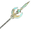
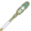
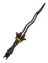
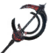
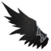

# ⚔️ PHẦN 14 — Eternal Legends: Pantheon Gods & Divine Equipment

## ⚔️ Eternal Legends — Pantheon Gods & Divine Equipment

*Mod: Eternal Legends v1.0.4 — 3 bộ giáp thần thánh, 14 vũ khí, 4 nguyên liệu, Trail Forging + 4 extension.*

### 💎 Nguyên Liệu & Nguồn Drops

#### 💠 Crystal Dualis (Dualis Crystal)

Nguyên liệu lõi để xây **Trail Forging**. Rơi từ **Yagluth** (100%, 1-1).

#### 🪲 Scarabs (Mistlands)

Cả Solar Scarab và Abyssal Scarab đều rơi từ mob **Mistlands**. Drop rate khác nhau theo loại mob:

| Nguyên Liệu | Mob | Tỷ Lệ | Số Lượng |
| --- | --- | --- | --- |

#### 🪶 Feather of Oblivion (Ashlands)

Rơi từ mob **Ashlands** và boss **Fader**. Drop rate cao nhất từ Fader (100%, 5-8).

| Mob | Tỷ Lệ | Số Lượng |
| --- | --- | --- |

### ☀️ Horus Set — Falcon God / Sun

*Embrace the radiance of the Falcon God and ascend upon the wings of dawn.*

📦 Crafting Level: **1** tại Celestial Forge

✨ **Set Bonus (4 pieces):** 🛡️ +6 Armor | 🛡️ Block Stamina: -20%

#### 🧥 Armor (5 pieces)

| Icon | Tên | Armor | Nguyên Liệu | Mô Tả |
| :---: | --- | --- | --- | --- |
|  | **Horus Helmet** | 🛡️ 32 +2/lv | — | — |
|  | **Horus Chestguard** | 🛡️ 32 +2/lv | — | — |
|  | **Horus Greaves** | 🛡️ 32 +2/lv | — | — |
|  | **Horus Wings** | 🛡️ 4 +1/lv | — | — |
|  | **Horus Belt** | 🛡️ 10 +1/lv | — | — |

🔮 **$item_horus_cape_DO** bonus: 📦 +50 Carry Weight | 🦘 Jump Stamina: -20% | ⬇️ Fall Damage: -100%

🔮 **$item_horus_belt_DO** bonus: 📦 +150 Carry Weight | ❤️ HP Regen: +10%

#### ⚔️ Vũ Khí (5)

| Icon | Tên | Nguyên Liệu | Sát Thương | Trọng Lượng | Mô Tả |
| :---: | --- | --- | --- | --- | --- |
|  | **Solar Spear** | — | — 🪡90 👻45 | ⚖️ 2.5 | — |
|  | **Khopesh of Dawn** | — | — ⚔️80 👻50 | ⚖️ 0.800000011920929 | — |
|  | **Pharaoh's Guardian** | — | — 🟤10 | ⚖️ 5.0 | — |
|  | **Pharaoh's Blade** | — | — ⚔️62 🪡22 👻5 | ⚖️ 0.30000001192092896 | — |
|  | **Royal Judgment** | — | — 🟤75 👻50 | ⚖️ 2.0 | — |

### 🐺 Anubis Set — Jackal God / Death

*Embrace the might of the Jackal God and walk the path between life and death.*

📦 Crafting Level: **1** tại Celestial Forge

✨ **Set Bonus (4 pieces):** ⚔️ Attack Stamina: -10%

#### 🧥 Armor (5 pieces)

| Icon | Tên | Armor | Nguyên Liệu | Mô Tả |
| :---: | --- | --- | --- | --- |
|  | **Anubis Helm** | 🛡️ 32 +2/lv | — | — |
|  | **Anubis Chestguard** | 🛡️ 32 +2/lv | — | — |
|  | **Anubis Greaves** | 🛡️ 32 +2/lv | — | — |
|  | **Anubis Mantle** | 🛡️ 2 +1/lv | — | — |
|  | **Anubis Ring** | 🛡️ 10 +1/lv | — | — |

🔮 **$item_anubis_cape_DO** bonus: 🏃 Speed: +7% | ❤️ +1 HP / 0s | 🌬️ Wind Movement: +25% | 🌬️ Wind Run Stamina: immune | 🏃 Run Stamina: -10%

🔮 **$item_anubis_belt_DO** bonus: 📦 +150 Carry Weight | ⚡ Stamina Regen: +10%

#### ⚔️ Vũ Khí (5)

| Icon | Tên | Nguyên Liệu | Sát Thương | Trọng Lượng | Mô Tả |
| :---: | --- | --- | --- | --- | --- |
|  | **Anubis Fang** | — | — ⚔️42 🪡42 | ⚖️ 0.30000001192092896 | — |
|  | **Twilight Blades** | — | — ⚔️110 💥80 | ⚖️ 2.0 | — |
|  | **Circle of Judgment** | — | — ⚔️140 💥60 | ⚖️ 2.5 | — |
|  | **Soulreaper Claws** | — | — ⚔️118 | ⚖️ 2.0 | — |
|  | **Crimson Pact** | — | — ⚔️160 | ⚖️ 4.0 | — |

### 💀 Thanatos Set — Deathbringer

*Embrace the stillness of the Deathbringer and tread the path where all journeys end.*

📦 Crafting Level: **2** tại Celestial Forge

✨ **Set Bonus (4 pieces):** ❤️ HP Regen: +15% | ⚔️ Attack Stamina: -15%

#### 🧥 Armor (4 pieces)

| Icon | Tên | Armor | Nguyên Liệu | Mô Tả |
| :---: | --- | --- | --- | --- |
|  | **Thanatos Helm** | 🛡️ 43 +2/lv | — | — |
|  | **Thanatos Chestguard** | 🛡️ 43 +2/lv | — | — |
|  | **Thanatos Greaves** | 🛡️ 43 +2/lv | — | — |
|  | **Thanatos Wings** | 🛡️ 4 +1/lv | — | — |

🔮 **$item_thanatos_cape_DO** bonus: ⚡ Stamina Regen: +10% | ⬇️ Fall Damage: -100% | ❤️ +2 HP / 0s

💀 **Thanatos Slow Debuff** (on enemies): 🏃 Speed: -35% | ⏱️ Duration: 5s

#### ⚔️ Vũ Khí (4)

| Icon | Tên | Nguyên Liệu | Sát Thương | Trọng Lượng | Mô Tả |
| :---: | --- | --- | --- | --- | --- |
|  | **Final Testament** | — | — ⚔️150 🪡20 | ⚖️ 4.0 | — |
|  | **Three-Faced Hammer** | — | — 🟤150 | ⚖️ 2.0 | — |
|  | **Aegis of Faces** | — | — 🟤10 | ⚖️ 5.0 | — |
|  | **Twilight Oath** | — | — 🟤15 ⚔️175 | ⚖️ 3.0 | — |

### 🔨 Trail Forging & Extensions

| Icon | Tên | Trạm | Nguyên Liệu |
| :---: | --- | --- | --- |
|  | **Celestial Forge** | ⚒️ Forge | CrystalDualisDO ×1 Bronze ×20 Black Marble ×20 Eitr ×6 |
|  | **Forge Extension 1** | — | Black Core ×1 Black Metal ×30 Black Marble ×20 Bronze ×6 |
|  | **Forge Extension 2** | — | Red Gemstone ×1 Grausten ×40 Sulfur Stone ×6 Morgen Trophy ×1 |
|  | **Forge Extension 3** | — | Green Gemstone ×1 Flametal ×10 Morgen Sinew ×2 CelestialFeather ×2 |
|  | **Forge Extension 4** | — | Blue Gemstone ×1 Flametal ×14 Charcoal Resin ×8 Molten Core ×4 |
