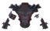
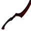
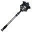
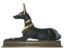
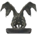
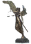

# ⚔️ PHẦN 14 — Eternal Legends: Pantheon Gods & Divine Equipment

## ⚔️ Eternal Legends — Pantheon Gods & Divine Equipment

*Mod: Eternal Legends v1.0.4 — 3 bộ giáp thần thánh, 14 vũ khí, 4 nguyên liệu, Trail Forging + 4 extension.*

### 💎 Nguyên Liệu & Nguồn Drops

#### 💠 Crystal Dualis

Rơi từ **Yagluth** (100%, 1-1). Dùng xây Trail Forging.

#### 🪲 Scarabs (Mistlands)

Cả Solar Scarab và Abyssal Scarab rơi từ mob **Mistlands**:

| Nguyên Liệu | Mob | Tỷ Lệ | Số Lượng |
| --- | --- | --- | --- |
| **Solar Scarab** | **Tick** | 10% | 1-1 |
| **Solar Scarab** | **Seeker** | 15% | 1-1 |
| **Solar Scarab** | **Seeker Brood** | 10% | 1-1 |
| **Solar Scarab** | **Seeker Soldier** | 25% | 1-2 |
| **Solar Scarab** | **Gjall** | 35% | 1-4 |
| **Solar Scarab** | **The Queen** | 100% | 5-8 |
| **Abyssal Scarab** | **Tick** | 10% | 1-1 |
| **Abyssal Scarab** | **Seeker** | 15% | 1-1 |
| **Abyssal Scarab** | **Seeker Brood** | 10% | 1-1 |
| **Abyssal Scarab** | **Seeker Soldier** | 25% | 1-2 |
| **Abyssal Scarab** | **Gjall** | 35% | 1-4 |
| **Abyssal Scarab** | **The Queen** | 100% | 5-8 |

#### 🪶 Feather of Oblivion (Ashlands)

Rơi từ mob **Ashlands** và boss **Fader** (100%, 5-8):

| Mob | Tỷ Lệ | Số Lượng |
| --- | --- | --- |
| **Volture** | 5% | 1-2 |
| **Charred Tick** | 10% | 1-2 |
| **Charred Twitcher** | 10% | 1-2 |
| **Charred Warrior** | 10% | 1-2 |
| **Charred Archer** | 10% | 1-2 |
| **Charred Mage** | 15% | 1-2 |
| **Asksvin** | 10% | 1-2 |
| **Bonemaw Serpent** | 30% | 1-3 |
| **Morgen** | 25% | 1-2 |
| **Fallen Valkyrie** | 35% | 1-3 |
| **Fader** | 100% | 5-8 |

### ☀️ Horus Set — Falcon God / Sun

*Embrace the radiance of the Falcon God and ascend upon the wings of dawn.*

✨ **Set Bonus (4 pieces):** 🛡️ +6 Armor | 🛡️ Block Stamina: -20%

📦 Crafting Level: **1** tại Celestial Forge

#### 🧥 Armor (5 pieces)

| Icon | Tên | Armor | Nguyên Liệu | Nâng Cấp | Level | Mô Tả |
| :---: | --- | --- | --- | --- | --- | --- |
|  | **Horus Helmet** | — | Carapace ×16 ScarabHorusDO ×6 Eitr ×8 Scale Hide ×4 | ScarabHorusDO ×3 Eitr ×4 | Lv.1 | — |
|  | **Horus Chestguard** | — | Carapace ×16 ScarabHorusDO ×6 Eitr ×8 Scale Hide ×4 | ScarabHorusDO ×3 Eitr ×4 | Lv.1 | — |
|  | **Horus Greaves** | — | Carapace ×16 ScarabHorusDO ×6 Eitr ×8 Scale Hide ×4 | ScarabHorusDO ×3 Eitr ×4 | Lv.1 | — |
|  | **Horus Wings** | — | Carapace ×16 ScarabHorusDO ×6 Eitr ×8 Feathers ×16 | ScarabHorusDO ×3 Eitr ×4 | Lv.1 | — |
|  | **Horus Belt** | — | ScarabHorusDO ×10 Black Core ×1 Eitr ×12 Seeker Trophy ×2 | — | Lv.1 | — |

🔮 **$item_horus_cape_DO**: 📦 +50 Carry Weight | 🦘 Jump Stamina: -20% | ⬇️ Fall Damage: -100%

🔮 **$item_horus_belt_DO**: 📦 +150 Carry Weight | ❤️ HP Regen: +10%

#### ⚔️ Vũ Khí (5)

| Icon | Tên | Nguyên Liệu | Nâng Cấp | Sát Thương | Level | Mô Tả |
| :---: | --- | --- | --- | --- | --- | --- |
| — | **Solar Spear** | ScarabHorusDO ×6 Black Metal ×18 Yggdrasil Wood ×16 | ScarabHorusDO ×3 Yggdrasil Wood ×8 | — | Lv.1 | — |
| — | **Khopesh of Dawn** | ScarabHorusDO ×6 Black Metal ×24 Linen Thread ×8 | ScarabHorusDO ×3 Black Metal ×12 | — | Lv.1 | — |
| — | **Pharaoh's Guardian** | ScarabHorusDO ×4 Black Metal ×12 Linen Thread ×4 | ScarabHorusDO ×2 Black Metal ×6 | — | Lv.1 | — |
| — | **Pharaoh's Blade** | ScarabHorusDO ×4 Black Metal ×12 Linen Thread ×4 | ScarabHorusDO ×2 Black Metal ×6 | — | Lv.1 | — |
| — | **Royal Judgment** | ScarabHorusDO ×6 Black Metal ×26 Linen Thread ×6 | ScarabHorusDO ×3 Black Metal ×13 | — | Lv.1 | — |

### 🐺 Anubis Set — Jackal God / Death

*Embrace the might of the Jackal God and walk the path between life and death.*

✨ **Set Bonus (4 pieces):** ⚔️ Attack Stamina: -10%

📦 Crafting Level: **1** tại Celestial Forge

#### 🧥 Armor (5 pieces)

| Icon | Tên | Armor | Nguyên Liệu | Nâng Cấp | Level | Mô Tả |
| :---: | --- | --- | --- | --- | --- | --- |
|  | **Anubis Helm** | — | Carapace ×16 ScarabAnubisDO ×6 Eitr ×8 Scale Hide ×4 | ScarabAnubisDO ×3 Eitr ×4 | Lv.1 | — |
|  | **Anubis Chestguard** | — | Carapace ×16 ScarabAnubisDO ×6 Eitr ×8 Scale Hide ×4 | ScarabAnubisDO ×3 Eitr ×4 | Lv.1 | — |
|  | **Anubis Greaves** | — | Carapace ×16 ScarabAnubisDO ×6 Eitr ×8 Scale Hide ×4 | ScarabAnubisDO ×3 Eitr ×4 | Lv.1 | — |
|  | **Anubis Mantle** | — | Carapace ×16 ScarabAnubisDO ×6 Eitr ×8 Giant Blood Sack ×16 | ScarabAnubisDO ×3 Eitr ×4 | Lv.1 | — |
|  | **Anubis Ring** | — | ScarabAnubisDO ×10 Black Core ×1 Eitr ×12 Gjall Trophy ×1 | — | Lv.1 | — |

🔮 **$item_anubis_cape_DO**: 🏃 Speed: +7% | ❤️ +1 HP / 0s | 🌬️ Wind Movement: +25% | 🌬️ Wind Run Stamina: immune | 🏃 Run Stamina: -10%

🔮 **$item_anubis_belt_DO**: 📦 +150 Carry Weight | ⚡ Stamina Regen: +10%

#### ⚔️ Vũ Khí (5)

| Icon | Tên | Nguyên Liệu | Nâng Cấp | Sát Thương | Level | Mô Tả |
| :---: | --- | --- | --- | --- | --- | --- |
| — | **Anubis Fang** | ScarabAnubisDO ×4 Black Metal ×12 Linen Thread ×4 | ScarabAnubisDO ×2 Black Metal ×6 | — | Lv.1 | — |
| — | **Twilight Blades** | ScarabAnubisDO ×6 Black Metal ×20 Linen Thread ×8 | ScarabAnubisDO ×3 Black Metal ×10 | — | Lv.1 | — |
| — | **Circle of Judgment** | ScarabAnubisDO ×6 Black Metal ×30 Linen Thread ×8 | ScarabAnubisDO ×3 Black Metal ×15 | — | Lv.1 | — |
| — | **Soulreaper Claws** | ScarabAnubisDO ×6 Black Metal ×20 Linen Thread ×8 | ScarabAnubisDO ×3 Black Metal ×10 | — | Lv.1 | — |
|  | **Crimson Pact** | ScarabAnubisDO ×6 Black Metal ×30 Linen Thread ×8 | ScarabAnubisDO ×3 Black Metal ×15 | — | Lv.1 | — |

### 💀 Thanatos Set — Deathbringer

*Embrace the stillness of the Deathbringer and tread the path where all journeys end.*

✨ **Set Bonus (4 pieces):** ❤️ HP Regen: +15% | ⚔️ Attack Stamina: -15%

📦 Crafting Level: **2** tại Celestial Forge

#### 🧥 Armor (4 pieces)

| Icon | Tên | Armor | Nguyên Liệu | Nâng Cấp | Level | Mô Tả |
| :---: | --- | --- | --- | --- | --- | --- |
| — | **Thanatos Helm** | — | Flametal ×25 FeatherThanatosDO ×8 Eitr ×10 Ask Hide ×12 | FeatherThanatosDO ×4 Flametal ×12 | Lv.2 | — |
| — | **Thanatos Chestguard** | — | Flametal ×25 FeatherThanatosDO ×8 Eitr ×10 Ask Hide ×12 | FeatherThanatosDO ×4 Flametal ×12 | Lv.2 | — |
| — | **Thanatos Greaves** | — | Flametal ×25 FeatherThanatosDO ×8 Eitr ×10 Ask Hide ×12 | FeatherThanatosDO ×4 Flametal ×12 | Lv.2 | — |
| — | **Thanatos Wings** | — | Flametal ×12 FeatherThanatosDO ×10 Eitr ×12 Volture Trophy ×2 | FeatherThanatosDO ×5 Eitr ×6 | Lv.2 | — |

🔮 **$item_thanatos_cape_DO**: ⚡ Stamina Regen: +10% | ⬇️ Fall Damage: -100% | ❤️ +2 HP / 0s

💀 **Debuff on enemies:** 🏃 Speed: -35% | ⏱️ 5s

#### ⚔️ Vũ Khí (4)

| Icon | Tên | Nguyên Liệu | Nâng Cấp | Sát Thương | Level | Mô Tả |
| :---: | --- | --- | --- | --- | --- | --- |
|  | **Final Testament** | FeatherThanatosDO ×6 Flametal ×24 Ask Hide ×8 | FeatherThanatosDO ×3 Flametal ×12 | — | Lv.2 | — |
|  | **Three-Faced Hammer** | FeatherThanatosDO ×6 Flametal ×16 Ask Hide ×8 | FeatherThanatosDO ×3 Flametal ×8 | — | Lv.2 | — |
|  | **Aegis of Faces** | FeatherThanatosDO ×6 Flametal ×14 Blackwood ×8 | FeatherThanatosDO ×3 Flametal ×7 | — | Lv.2 | — |
|  | **Twilight Oath** | FeatherThanatosDO ×6 Flametal ×24 Ask Hide ×8 | FeatherThanatosDO ×3 Flametal ×12 | — | Lv.2 | — |

### 📊 Tổng Nguyên Liệu Cần Thiết (craft all)

☀️ **Horus:** Black Core ×1; Black Metal ×129; Carapace ×64; Eitr ×60; Feathers ×16; Linen Thread ×22; Scale Hide ×12; ScarabHorusDO ×85; Seeker Trophy ×2; Yggdrasil Wood ×24

🐺 **Anubis:** Black Core ×1; Black Metal ×168; Carapace ×64; Eitr ×60; Giant Blood Sack ×16; Linen Thread ×36; Scale Hide ×12; ScarabAnubisDO ×88; Gjall Trophy ×1

💀 **Thanatos:** Ask Hide ×60; Blackwood ×8; Eitr ×48; FeatherThanatosDO ×87; Flametal ×240; Volture Trophy ×2

### 🔨 Trail Forging & Extensions

| Icon | Tên | Trạm | Nguyên Liệu |
| :---: | --- | --- | --- |
|  | **Trail Forging** | ⚒️ Forge | CrystalDualisDO ×1 Bronze ×20 Black Marble ×20 Eitr ×6 |
|  | **Extension 1** | — | Black Core ×1 Black Metal ×30 Black Marble ×20 Bronze ×6 |
|  | **Extension 2** | — | Red Gemstone ×1 Grausten ×40 Sulfur Stone ×6 Morgen Trophy ×1 |
|  | **Extension 3** | — | Green Gemstone ×1 Flametal ×10 Morgen Sinew ×2 CelestialFeather ×2 |
|  | **Extension 4** | — | Blue Gemstone ×1 Flametal ×14 Charcoal Resin ×8 Molten Core ×4 |
