# 📜 PHẦN 15 — Historical Heritage: Forge of Ages & Distant Origins

## 📜 Historical Heritage — Forge of Ages & Distant Origins

*Mod: Historical Heritage v2.1.5 — 9 armor sets, 54 weapons, 8 crafting materials, Forge of Ages + 6 extensions, Galleon ship, Naval Workshop, and decorative pieces.*

⚔️ **Historical Heritage** brings the weapons and armor of 9 great civilizations to Valheim. Each armor set is themed around a historical era or culture, with unique weapons, crafting materials, and the **Forge of Ages** — a tiered crafting station that unlocks as you progress.

#### 📋 Materials Overview

| Icon | Material | Recipe | Craft Amt |
| :---: | --- | --- | --- |
| 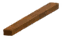 | **Resin-Treated Wood** | Wood ×10 Resin ×10 | ×10 |
| 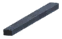 | **Tar-Treated Wood** | Fine Wood ×1 Tar ×1 | — |
|  | **Bronze Fittings** | Bronze ×1 | ×5 |
|  | **Iron Fittings** | Iron ×1 | ×5 |
|  | **Silver Fittings** | Silver ×1 | ×5 |
|  | **Blackmetal Fittings** | Black Metal ×1 | ×5 |
|  | **Flametal Fittings** | Flametal ×1 | ×5 |
|  | **Smithing Chronicle** | *Craftable / Tradeable* | — |

#### 🗡️ Armor Set Overview

| Set | Theme | Material | Lv | Armor | Weapons | Signature |
| --- | --- | --- | --- | --- | --- | --- |
| **⛏️ Miner** | *Deep Earth / Mining* | Bronze | 1 | 5 | 5 | *Dual Pickaxes* |
| **☠️ Plague Doctor** | *Plague / Alchemy* | Iron | 1 | 5 | 5 | *Syringe / Scalpel / Bomb* |
| **⚓ Sailor** | *Sea / Exploration* | Iron | 1 | 5 | 1 | *Boarding Axe* |
| **🎋 Gunjang** | *Korean Martial / Honor* | Silver | 2 | 5 | 6 | *Hwando / Samingeom / Gakgung* |
| **🚢 Captain** | *Naval Command / Authority* | BlackMetal | 3 | 6 | 3 | *Cutlass / Dual Cutlasses* |
| **🗡️ Bashrad** | *Persian / Desert Warfare* | BlackMetal | 3 | 5 | 8 | *Zanfar / Shamshirain / Tabarzin* |
| **✝️ Crusader** | *Holy Knight / Faith* | BlackMetal | 3 | 5 | 9 | *Halberd / Bastard / Morgenstern* |
| **🐉 Daowei** | *Chinese Martial / Empire* | Carapace | 3 | 5 | 8 | *Jian / Guandao / Chui* |
| **🏯 Shogun** | *Japanese Samurai / Discipline* | Flametal | 4 | 5 | 9 | *Katana / Naginata / Kanabo* |

### 💎 Materials & Crafting Components

All 8 crafting components used across the mod's recipes. These are crafted at the **Forge of Ages** and serve as universal intermediates for armor and weapons.

| Icon | Name | Prefab | Station | Recipe | Craft Amt |
| :---: | --- | --- | --- | --- | --- |
|  | **Resin-Treated Wood** | `WoodResinDO` | ForgeOfAgesDO | Wood ×10 Resin ×10 | ×10 |
|  | **Tar-Treated Wood** | `WoodTarDO` | ForgeOfAgesDO | Fine Wood ×1 Tar ×1 | ×1 |
|  | **Bronze Fittings** | `FittingsBronzeDO` | ForgeOfAgesDO | Bronze ×1 | ×5 |
|  | **Iron Fittings** | `FittingsIronDO` | ForgeOfAgesDO | Iron ×1 | ×5 |
|  | **Silver Fittings** | `FittingsSilverDO` | ForgeOfAgesDO | Silver ×1 | ×5 |
|  | **Blackmetal Fittings** | `FittingsBlackmetalDO` | ForgeOfAgesDO | Black Metal ×1 | ×5 |
|  | **Flametal Fittings** | `FittingsFlametalDO` | ForgeOfAgesDO | Flametal ×1 | ×5 |
|  | **Smithing Chronicle** | `BookSmithingDO` | — | — | ×1 |

#### 📖 Material Descriptions

**Smithing Chronicle**: | Trade: **Haldor** — 100 coins

### ⚔️ Armor Sets

9 armor sets, each with 5-6 pieces. Craft at **Forge of Ages** at the appropriate level. All armor is upgradeable.

#### ⛏️ Miner — Deep Earth / Mining

*Forged in the dust of a thousand mines, the Miner set empowers those who delve beneath stone and shadow to claim the earth's hidden wealth.*

📦 Tier: **Bronze** | Crafting Level: **1** | Primary Material: **Bronze** | Signature: **Dual Pickaxes**

**Armor (5 pieces):**

| Icon | Name | Slot | Station | Recipe | Armor | Upgrade |
| :---: | --- | --- | --- | --- | --- | --- |
| 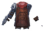 | **Miner's Chestguard** | 🦺 Chest | ForgeOfAgesDO | Bronze ×6 Deer Hide ×3 FittingsBronzeDO ×10 | 🛡️ 8 +2/lv | Bronze ×3 Deer Hide ×1 |
|  | **Miner's Leggings** | 👖 Legs | ForgeOfAgesDO | Bronze ×6 Deer Hide ×3 FittingsBronzeDO ×10 | 🛡️ 8 +2/lv | Bronze ×3 Deer Hide ×1 |
|  | **Miner's Helm** | 🪖 Helmet | ForgeOfAgesDO | Bronze ×6 Deer Hide ×3 FittingsBronzeDO ×10 | 🛡️ 8 +2/lv | Bronze ×3 Deer Hide ×1 |
|  | **Miner's Pack Frame** | 🧣 Cape | ForgeOfAgesDO | Bronze ×6 Round Log ×20 Deer Hide ×3 FittingsBronzeDO ×15 | 🛡️ 4 +1/lv | Bronze ×3 Round Log ×10 |
|  | **Miner's Belt** | 📿 Belt | ForgeOfAgesDO | PickaxeDualMinerBronzeDO ×1 Bronze ×6 Deer Hide ×6 FittingsBronzeDO ×20 | 🛡️ 10 +1/lv | — |

#### ☠️ Plague Doctor — Plague / Alchemy

*Healer and killer alike, the Plague Doctor walks between life and death. His patients never forget him — and neither do his victims.*

📦 Tier: **Iron** | Crafting Level: **1** | Primary Material: **Iron** | Signature: **Syringe / Scalpel / Bomb**

**Armor (5 pieces):**

| Icon | Name | Slot | Station | Recipe | Armor | Upgrade |
| :---: | --- | --- | --- | --- | --- | --- |
| 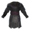 | **Plague Doctor's Garb** | 🦺 Chest | ForgeOfAgesDO | Troll Hide ×10 Leather Scraps ×10 FittingsIronDO ×25 | — | Troll Hide ×5 Leather Scraps ×5 |
|  | **Plague Doctor's Boots** | 👖 Legs | ForgeOfAgesDO | Troll Hide ×10 Leather Scraps ×10 FittingsIronDO ×25 | — | Troll Hide ×5 Leather Scraps ×5 |
|  | **Plague Doctor's Mask** | 🪖 Helmet | ForgeOfAgesDO | Troll Hide ×10 Leather Scraps ×10 Ruby ×2 FittingsIronDO ×25 | — | Troll Hide ×5 Leather Scraps ×5 |
|  | **Plague Doctor's Cloak** | 🧣 Cape | ForgeOfAgesDO | Troll Hide ×6 Leather Scraps ×6 FittingsIronDO ×15 | — | Troll Hide ×3 Leather Scraps ×3 |
|  | **Lost Cause Pouch** | 📿 Belt | ForgeOfAgesDO | MeadPoisonResist ×13 Yellow Mushroom ×20 Leather Scraps ×10 FittingsIronDO ×30 | — | — |

#### ⚓ Sailor — Sea / Exploration

*The sea tempers body and spirit. Wind and labor leave their marks. A true sailor is ready for anything — rope, blade, or storm.*

📦 Tier: **Iron** | Crafting Level: **1** | Primary Material: **Iron** | Signature: **Boarding Axe**

**Armor (5 pieces):**

| Icon | Name | Slot | Station | Recipe | Armor | Upgrade |
| :---: | --- | --- | --- | --- | --- | --- |
|  | **Sailor's Shirt** | 🦺 Chest | ForgeOfAgesDO | Deer Hide ×6 Leather Scraps ×12 FittingsIronDO ×25 | 🛡️ 10 +2/lv | Deer Hide ×2 Leather Scraps ×6 |
| 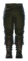 | **Sailor's Trousers** | 👖 Legs | ForgeOfAgesDO | Deer Hide ×6 Leather Scraps ×12 FittingsIronDO ×25 | 🛡️ 10 +2/lv | Deer Hide ×2 Leather Scraps ×6 |
|  | **Sailor's Headband** | 🪖 Helmet | ForgeOfAgesDO | Deer Hide ×6 Leather Scraps ×12 FittingsIronDO ×25 | 🛡️ 10 +2/lv | Deer Hide ×2 Leather Scraps ×6 |
|  | **Sailor's Shoulder Strap** | 🧣 Cape | ForgeOfAgesDO | Deer Hide ×4 Leather Scraps ×8 FittingsIronDO ×15 | 🛡️ 2 +1/lv | Deer Hide ×2 Leather Scraps ×4 |
|  | **Sailor's Belt** | 📿 Belt | ForgeOfAgesDO | Leech Trophy ×2 Iron ×6 Troll Hide ×10 FittingsIronDO ×30 | 🛡️ 10 +1/lv | — |

#### 🎋 Gunjang — Korean Martial / Honor

*The commander's will is proven not by words but by unbreakable force. Honor, spirit, and the blade walk the same path.*

📦 Tier: **Silver** | Crafting Level: **2** | Primary Material: **Silver** | Signature: **Hwando / Samingeom / Gakgung**

**Armor (5 pieces):**

| Icon | Name | Slot | Station | Recipe | Armor | Upgrade |
| :---: | --- | --- | --- | --- | --- | --- |
| 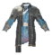 | **Gunjang Combat Garb** | 🦺 Chest | ForgeOfAgesDO Lv.2 | Silver ×18 Wolf Pelt ×10 FittingsSilverDO ×20 | 🛡️ 18 +2/lv | Silver ×4 Wolf Pelt ×3 |
|  | **Gunjang Trousers** | 👖 Legs | ForgeOfAgesDO Lv.2 | Silver ×18 Wolf Pelt ×10 FittingsSilverDO ×20 | 🛡️ 18 +2/lv | Silver ×4 Wolf Pelt ×3 |
|  | **Gunjang Topknot** | 🪖 Helmet | ForgeOfAgesDO Lv.2 | Silver ×18 Wolf Pelt ×10 Obsidian ×6 FittingsSilverDO ×20 | 🛡️ 18 +2/lv | Silver ×4 Wolf Pelt ×3 |
|  | **Dragon Scabbard** | 🧣 Cape | ForgeOfAgesDO Lv.2 | Silver ×10 Wolf Pelt ×4 FittingsSilverDO ×25 | 🛡️ 4 +1/lv | Silver ×4 Wolf Pelt ×2 |
|  | **Honor Scabbard** | 📿 Belt | ForgeOfAgesDO Lv.2 | SwordGunjangSamingeomDO ×1 Silver ×6 Wolf Pelt ×12 FittingsSilverDO ×15 | 🛡️ 2 +1/lv | — |

#### 🚢 Captain — Naval Command / Authority

*Years of voyaging forge a calm that commands respect. The Captain's cutlass speaks before any order is given.*

📦 Tier: **BlackMetal** | Crafting Level: **3** | Primary Material: **BlackMetal** | Signature: **Cutlass / Dual Cutlasses**

**Armor (6 pieces):**

| Icon | Name | Slot | Station | Recipe | Armor | Upgrade |
| :---: | --- | --- | --- | --- | --- | --- |
|  | **Captain's Greatcoat** | 🦺 Chest | ForgeOfAgesDO Lv.3 | Carapace ×4 Scale Hide ×4 Linen Thread ×30 FittingsBlackmetalDO ×30 | 🛡️ 28 +2/lv | Carapace ×2 Linen Thread ×10 |
|  | **Captain's Trousers** | 👖 Legs | ForgeOfAgesDO Lv.3 | Carapace ×4 Scale Hide ×4 Linen Thread ×30 FittingsBlackmetalDO ×30 | 🛡️ 28 +2/lv | Carapace ×2 Linen Thread ×10 |
|  | **Captain's Tricorne** | 🪖 Helmet | ForgeOfAgesDO Lv.3 | Carapace ×4 Scale Hide ×4 Linen Thread ×30 FittingsBlackmetalDO ×30 | 🛡️ 28 +2/lv | Carapace ×2 Linen Thread ×10 |
|  | **Captain's Shoulder Belt** | 🧣 Cape | ForgeOfAgesDO Lv.3 | Iron ×4 Scale Hide ×4 Linen Thread ×10 FittingsBlackmetalDO ×30 | 🛡️ 3 +1/lv | Iron ×2 Scale Hide ×2 |
| 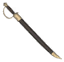 | **Captain's Scabbard** | 📿 Belt | ForgeOfAgesDO | SwordCaptainCutlassDO ×1 Scale Hide ×6 Linen Thread ×20 FittingsBlackmetalDO ×40 | 🛡️ 10 +1/lv | — |
|  | **Captain's Amulet** | 🔮 Trinket | ForgeOfAgesDO | Serpent Trophy ×1 Linen Thread ×10 Silver Necklace ×1 FittingsBlackmetalDO ×20 | 🛡️ 10 +1/lv | — |

#### 🗡️ Bashrad — Persian / Desert Warfare

*Steady step, careful word. The Bashrad warrior answers only to those worthy of a response, wielding blades curved by desert winds.*

📦 Tier: **BlackMetal** | Crafting Level: **3** | Primary Material: **BlackMetal** | Signature: **Zanfar / Shamshirain / Tabarzin**

**Armor (5 pieces):**

| Icon | Name | Slot | Station | Recipe | Armor | Upgrade |
| :---: | --- | --- | --- | --- | --- | --- |
| 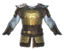 | **Bashrad Lamellar Armor** | 🦺 Chest | ForgeOfAgesDO Lv.3 | Black Metal ×25 Linen Thread ×20 FittingsBlackmetalDO ×30 | 🛡️ 24 +2/lv | Black Metal ×10 Linen Thread ×10 |
|  | **Bashrad Trousers** | 👖 Legs | ForgeOfAgesDO Lv.3 | Black Metal ×25 Linen Thread ×20 FittingsBlackmetalDO ×30 | 🛡️ 24 +2/lv | Black Metal ×10 Linen Thread ×10 |
|  | **Bashrad Turban** | 🪖 Helmet | ForgeOfAgesDO Lv.3 | Black Metal ×25 Linen Thread ×20 FittingsBlackmetalDO ×30 | 🛡️ 24 +2/lv | Black Metal ×10 Linen Thread ×10 |
|  | **Bashrad Cloak** | 🧣 Cape | ForgeOfAgesDO Lv.3 | Lox Pelt ×6 Linen Thread ×14 FittingsBlackmetalDO ×15 | 🛡️ 2 +1/lv | Lox Pelt ×3 Linen Thread ×7 |
|  | **Bashrad Scabbard** | 📿 Belt | ForgeOfAgesDO Lv.3 | SwordDualBashradDO ×1 Black Metal ×20 Linen Thread ×30 FittingsBlackmetalDO ×30 | 🛡️ 10 +1/lv | — |

#### ✝️ Crusader — Holy Knight / Faith

*God's sword, tempered by faith, sent by grace to cleave where the light must fall. The Crusader's arsenal spans every weapon of war.*

📦 Tier: **BlackMetal** | Crafting Level: **3** | Primary Material: **BlackMetal** | Signature: **Halberd / Bastard / Morgenstern**

**Armor (5 pieces):**

| Icon | Name | Slot | Station | Recipe | Armor | Upgrade |
| :---: | --- | --- | --- | --- | --- | --- |
|  | **Crusader Cuirass** | 🦺 Chest | ForgeOfAgesDO Lv.3 | Black Metal ×25 Linen Thread ×20 FittingsBlackmetalDO ×30 | 🛡️ 28 +2/lv | Black Metal ×10 Linen Thread ×10 |
|  | **Crusader Chain Chausses** | 👖 Legs | ForgeOfAgesDO Lv.3 | Black Metal ×25 Linen Thread ×20 FittingsBlackmetalDO ×30 | 🛡️ 28 +2/lv | Black Metal ×10 Linen Thread ×10 |
|  | **Crusader Great Helm** | 🪖 Helmet | ForgeOfAgesDO Lv.3 | Black Metal ×25 Linen Thread ×20 FittingsBlackmetalDO ×30 | 🛡️ 28 +2/lv | Black Metal ×10 Linen Thread ×10 |
| 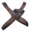 | **Crusader Harness** | 🧣 Cape | ForgeOfAgesDO Lv.3 | Lox Pelt ×10 Linen Thread ×10 FittingsBlackmetalDO ×15 | 🛡️ 2 +1/lv | Lox Pelt ×4 Linen Thread ×5 |
| 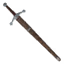 | **Templar Scabbard** | 📿 Belt | ForgeOfAgesDO Lv.3 | SwordCrusaderDO ×1 Black Metal ×20 Linen Thread ×30 FittingsBlackmetalDO ×30 | 🛡️ 2 +1/lv | — |

#### 🐉 Daowei — Chinese Martial / Empire

*A thousand battles have tempered steel that holds the memories of the fallen and the glory of the living. The empire's spirit flows within.*

📦 Tier: **BlackMetal/Carapace** | Crafting Level: **3** | Primary Material: **Carapace** | Signature: **Jian / Guandao / Chui**

**Armor (5 pieces):**

| Icon | Name | Slot | Station | Recipe | Armor | Upgrade |
| :---: | --- | --- | --- | --- | --- | --- |
|  | **Daowei Cuirass** | 🦺 Chest | ForgeOfAgesDO Lv.3 | Carapace ×16 Scale Hide ×4 Linen Thread ×25 FittingsBlackmetalDO ×30 | 🛡️ 34 +2/lv | Carapace ×8 Scale Hide ×2 |
|  | **Daowei Greaves** | 👖 Legs | ForgeOfAgesDO Lv.3 | Carapace ×16 Scale Hide ×4 Linen Thread ×25 FittingsBlackmetalDO ×30 | 🛡️ 34 +2/lv | Carapace ×8 Scale Hide ×2 |
|  | **Daowei Helmet** | 🪖 Helmet | ForgeOfAgesDO Lv.3 | Carapace ×16 Scale Hide ×4 Feathers ×2 FittingsBlackmetalDO ×30 | 🛡️ 34 +2/lv | Carapace ×8 Scale Hide ×2 |
|  | **Daowei Mantle** | 🧣 Cape | ForgeOfAgesDO Lv.3 | Carapace ×10 Linen Thread ×30 FittingsBlackmetalDO ×15 | 🛡️ 2 +1/lv | Carapace ×5 Linen Thread ×15 |
| 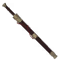 | **Quiet Steel Scabbard** | 📿 Belt | ForgeOfAgesDO Lv.3 | SwordDaoweiJianDO ×1 Carapace ×10 Linen Thread ×30 FittingsBlackmetalDO ×30 | 🛡️ 2 +1/lv | — |

#### 🏯 Shogun — Japanese Samurai / Discipline

*The Shogun's unbreakable will strengthens the spirit, granting clarity and resolve even in the face of overwhelming adversity.*

📦 Tier: **Flametal** | Crafting Level: **4** | Primary Material: **Flametal** | Signature: **Katana / Naginata / Kanabo**

**Armor (5 pieces):**

| Icon | Name | Slot | Station | Recipe | Armor | Upgrade |
| :---: | --- | --- | --- | --- | --- | --- |
|  | **Shogun Do Chest** | 🦺 Chest | ForgeOfAgesDO Lv.4 | Flametal ×22 Linen Thread ×20 Scale Hide ×4 FittingsFlametalDO ×20 | 🛡️ 40 +2/lv | Flametal ×10 Linen Thread ×10 |
|  | **Shogun Suneate Greaves** | 👖 Legs | ForgeOfAgesDO Lv.4 | Flametal ×22 Linen Thread ×20 Scale Hide ×4 FittingsFlametalDO ×20 | 🛡️ 40 +2/lv | Flametal ×10 Linen Thread ×10 |
|  | **Shogun Kabuto Helm** | 🪖 Helmet | ForgeOfAgesDO Lv.4 | Flametal ×22 Linen Thread ×20 Hard Antler ×2 FittingsFlametalDO ×20 | 🛡️ 40 +2/lv | Flametal ×10 Linen Thread ×10 |
| 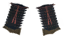 | **Shogun Sode Pauldrons** | 🧣 Cape | ForgeOfAgesDO Lv.4 | Flametal ×8 Scale Hide ×6 FittingsFlametalDO ×10 | 🛡️ 14 +2/lv | Flametal ×1 Scale Hide ×3 |
| 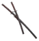 | **Shogun Scabbard** | 📿 Belt | ForgeOfAgesDO Lv.4 | BastardShogunKatanaDO ×1 SwordShogunWakizashiDO ×1 Linen Thread ×15 FittingsFlametalDO ×30 | 🛡️ 10 +1/lv | — |

### 🗡️ Weapons

54 weapons across all sets. Grouped by set. Craft at **Forge of Ages** and upgrade at the same station.

#### ⛏️ Miner Weapons (5) — *Tier Bronze*

| Icon | Name | Type | Station | Recipe | Damage | Upgrade |
| :---: | --- | --- | --- | --- | --- | --- |
|  | **Twin Bronze Pickaxes** | 🪓 Axe | ForgeOfAgesDO | Bronze ×12 Round Log ×6 FittingsBronzeDO ×10 | — | Bronze ×6 Round Log ×3 |
| 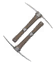 | **Twin Iron Pickaxes** | 🪓 Axe | ForgeOfAgesDO | Iron ×24 Fine Wood ×6 FittingsIronDO ×15 | — | Iron ×12 Fine Wood ×3 |
| 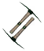 | **Twin Blackmetal Pickaxes** | 🪓 Axe | ForgeOfAgesDO | Black Metal ×32 Yggdrasil Wood ×6 FittingsBlackmetalDO ×20 | — | Black Metal ×16 Yggdrasil Wood ×3 |
| 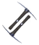 | **Twin Flametal Pickaxes** | 🪓 Axe | ForgeOfAgesDO | Flametal ×16 Blackwood ×20 FittingsFlametalDO ×15 | — | Flametal ×8 Blackwood ×10 |
|  | **Mining Dynamite** | 💣 Bomb | ForgeOfAgesDO | Surtling Core ×2 Coal ×20 Flint ×3 | — | — |

#### ☠️ Plague Doctor Weapons (5) — *Tier Iron*

| Icon | Name | Type | Station | Recipe | Damage | Upgrade |
| :---: | --- | --- | --- | --- | --- | --- |
| 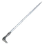 | **Delicate Solution** | ⚔️ Sword | ForgeOfAgesDO | Iron ×24 Elder Bark ×10 FittingsIronDO ×15 | — | Iron ×10 Elder Bark ×5 |
|  | **Final Syringe** | 🗡️ Dagger | ForgeOfAgesDO | Iron ×14 Guck ×12 FittingsIronDO ×15 | — | Iron ×6 Guck ×6 |
| 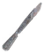 | **Contagious Scalpel** | 🗡️ Dagger | ForgeOfAgesDO | Iron ×18 FittingsIronDO ×15 | — | Iron ×8 |
| 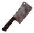 | **Excess Remover** | 🪓 Axe | ForgeOfAgesDO | Iron ×22 WoodResinDO ×6 FittingsIronDO ×15 | — | Iron ×10 WoodResinDO ×3 |
| 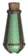 | **Healing Roulette** | 💣 Bomb | ForgeOfAgesDO | Ooze ×4 Yellow Mushroom ×5 Thistle ×6 | — | — |

#### ⚓ Sailor Weapons (1) — *Tier Iron*

| Icon | Name | Type | Station | Recipe | Damage | Upgrade |
| :---: | --- | --- | --- | --- | --- | --- |
| 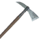 | **Boarding Axe** | 🪓 Axe | ForgeOfAgesDO | Iron ×24 FittingsIronDO ×15 WoodResinDO ×10 | — | Iron ×10 WoodResinDO ×5 |

#### 🎋 Gunjang Weapons (6) — *Tier Silver*

| Icon | Name | Type | Station | Recipe | Damage | Upgrade |
| :---: | --- | --- | --- | --- | --- | --- |
| 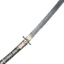 | **Ssangsudo** | ⚔️ Bastard Sword | ForgeOfAgesDO Lv.2 | Silver ×32 WoodResinDO ×12 FittingsSilverDO ×15 | — | Silver ×12 WoodResinDO ×6 |
| 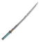 | **Hwando** | ⚔️ Sword | ForgeOfAgesDO Lv.2 | Silver ×30 WoodResinDO ×8 FittingsSilverDO ×15 | — | Silver ×12 WoodResinDO ×4 |
| 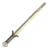 | **Samingeom** | ⚔️ Sword | ForgeOfAgesDO Lv.2 | Silver ×26 WoodResinDO ×8 FittingsSilverDO ×20 | — | Silver ×12 WoodResinDO ×4 |
|  | **Gakgung Bow** | 🏹 Bow | ForgeOfAgesDO Lv.2 | WoodResinDO ×15 Silver ×10 FittingsSilverDO ×15 | — | Silver ×5 WoodResinDO ×7 |
|  | **Dragon Triple-Shot Crossbow** | 🏹 Bow | ForgeOfAgesDO Lv.2 | BowGunjangDO ×1 WoodResinDO ×30 FittingsSilverDO ×10 | — | Silver ×5 WoodResinDO ×15 |
| 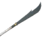 | **Woldo** | 🔱 Atgeir | ForgeOfAgesDO Lv.2 | Silver ×30 WoodResinDO ×12 FittingsSilverDO ×15 | — | Silver ×12 WoodResinDO ×6 |

#### 🚢 Captain Weapons (3) — *Tier BlackMetal*

| Icon | Name | Type | Station | Recipe | Damage | Upgrade |
| :---: | --- | --- | --- | --- | --- | --- |
| 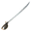 | **Captain's Cutlass** | ⚔️ Sword | ForgeOfAgesDO Lv.3 | Iron ×16 Bronze ×10 WoodTarDO ×8 FittingsBlackmetalDO ×40 | — | Iron ×8 WoodTarDO ×4 |
|  | **Twin Wave Blades** | ⚔️ Dual Wield | ForgeOfAgesDO Lv.3 | Iron ×24 Bronze ×12 WoodTarDO ×12 FittingsBlackmetalDO ×40 | — | Iron ×12 WoodTarDO ×6 |
| 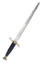 | **Commander's Dirk** | 🗡️ Dagger | ForgeOfAgesDO Lv.3 | Iron ×12 Bronze ×6 WoodTarDO ×6 FittingsBlackmetalDO ×40 | — | Iron ×6 WoodTarDO ×3 |

#### 🗡️ Bashrad Weapons (8) — *Tier BlackMetal*

| Icon | Name | Type | Station | Recipe | Damage | Upgrade |
| :---: | --- | --- | --- | --- | --- | --- |
| 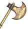 | **Tabarzin** | 🪓 Axe | ForgeOfAgesDO Lv.3 | Black Metal ×28 Linen Thread ×6 FittingsBlackmetalDO ×20 | — | Black Metal ×12 Linen Thread ×3 |
| 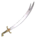 | **Zanfar** | ⚔️ Sword | ForgeOfAgesDO Lv.3 | Black Metal ×24 Lox Pelt ×4 Ruby ×4 FittingsBlackmetalDO ×20 | — | Black Metal ×11 Lox Pelt ×2 |
|  | **Shamshirain** | ⚔️ Dual Wield | ForgeOfAgesDO Lv.3 | Black Metal ×36 WoodTarDO ×8 Linen Thread ×10 FittingsBlackmetalDO ×20 | — | Black Metal ×14 Linen Thread ×5 |
| 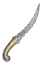 | **Julhar** | 🗡️ Dagger | ForgeOfAgesDO Lv.3 | Black Metal ×16 WoodTarDO ×6 Linen Thread ×6 FittingsBlackmetalDO ×20 | — | Black Metal ×7 Linen Thread ×3 |
|  | **Zahraein** | 🗡️ Dagger | ForgeOfAgesDO Lv.3 | Black Metal ×28 WoodTarDO ×8 Linen Thread ×8 FittingsBlackmetalDO ×20 | — | Black Metal ×12 Linen Thread ×4 |
| — | **Ramaya** | 🗡️ Throwing | — | — | — | — |
|  | **Sipar** | 🛡️ Shield | ForgeOfAgesDO Lv.3 | Black Metal ×20 FittingsBlackmetalDO ×20 | — | Black Metal ×10 |
|  | **Hilaloon** | 🗡️ Dagger | ForgeOfAgesDO Lv.3 | Black Metal ×16 WoodTarDO ×6 Lox Pelt ×4 FittingsBlackmetalDO ×20 | — | Black Metal ×7 Lox Pelt ×2 |

#### ✝️ Crusader Weapons (9) — *Tier BlackMetal*

| Icon | Name | Type | Station | Recipe | Damage | Upgrade |
| :---: | --- | --- | --- | --- | --- | --- |
|  | **Halberd** | 🔱 Atgeir | ForgeOfAgesDO Lv.3 | Black Metal ×34 WoodTarDO ×10 Linen Thread ×6 FittingsBlackmetalDO ×20 | — | Black Metal ×14 WoodTarDO ×5 |
| 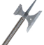 | **Pollaxe** | 🪓 Battleaxe | ForgeOfAgesDO Lv.3 | Black Metal ×34 WoodTarDO ×8 Linen Thread ×6 FittingsBlackmetalDO ×20 | — | Black Metal ×14 WoodTarDO ×4 |
| 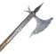 | **Crusader Axe** | 🪓 Axe | ForgeOfAgesDO Lv.3 | Black Metal ×22 WoodTarDO ×6 Linen Thread ×6 FittingsBlackmetalDO ×20 | — | Black Metal ×12 WoodTarDO ×3 |
| 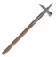 | **Bec de Corbin** | 🔨 Mace | ForgeOfAgesDO Lv.3 | Black Metal ×20 WoodTarDO ×4 Linen Thread ×6 FittingsBlackmetalDO ×20 | — | Black Metal ×10 WoodTarDO ×2 |
|  | **Morgenstern** | 🔨 Mace | ForgeOfAgesDO Lv.3 | Black Metal ×20 WoodTarDO ×4 Needle ×6 FittingsBlackmetalDO ×20 | — | Black Metal ×10 WoodTarDO ×2 |
| 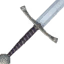 | **Crusader Longsword** | ⚔️ Bastard Sword | ForgeOfAgesDO Lv.3 | Black Metal ×32 WoodTarDO ×4 Lox Pelt ×6 FittingsBlackmetalDO ×20 | — | Black Metal ×14 WoodTarDO ×2 |
|  | **Crusader Kite Shield** | 🛡️ Shield | ForgeOfAgesDO Lv.3 | Black Metal ×16 WoodTarDO ×10 Lox Pelt ×3 FittingsIronDO ×15 | — | Black Metal ×8 WoodTarDO ×5 |
| 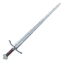 | **Crusader Sword** | ⚔️ Sword | ForgeOfAgesDO Lv.3 | Black Metal ×22 WoodTarDO ×2 Lox Pelt ×4 FittingsBlackmetalDO ×20 | — | Black Metal ×10 WoodTarDO ×1 |
| 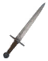 | **Crusader Dagger** | 🗡️ Dagger | ForgeOfAgesDO Lv.3 | Black Metal ×14 WoodTarDO ×6 Lox Pelt ×6 FittingsBlackmetalDO ×20 | — | Black Metal ×7 Linen Thread ×4 |

#### 🐉 Daowei Weapons (8) — *Tier BlackMetal/Carapace*

| Icon | Name | Type | Station | Recipe | Damage | Upgrade |
| :---: | --- | --- | --- | --- | --- | --- |
| 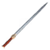 | **Jian** | ⚔️ Sword | ForgeOfAgesDO Lv.3 | Iron ×16 Yggdrasil Wood ×8 Scale Hide ×3 FittingsBlackmetalDO ×40 | — | Iron ×8 Yggdrasil Wood ×4 |
| 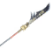 | **Guandao** | 🔱 Atgeir | ForgeOfAgesDO Lv.3 | Iron ×14 Yggdrasil Wood ×12 Scale Hide ×3 FittingsBlackmetalDO ×40 | — | Iron ×7 Yggdrasil Wood ×6 |
|  | **Fangtian Ji** | 🔱 Atgeir | ForgeOfAgesDO Lv.3 | Iron ×14 Yggdrasil Wood ×15 Bronze ×6 FittingsBlackmetalDO ×40 | — | Iron ×7 Yggdrasil Wood ×5 |
|  | **Huapu** | 🪓 Battleaxe | ForgeOfAgesDO Lv.3 | Iron ×32 Yggdrasil Wood ×15 Scale Hide ×4 FittingsBlackmetalDO ×40 | — | Iron ×16 Yggdrasil Wood ×5 |
| 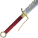 | **Jiuhuan Dao** | ⚔️ Bastard Sword | ForgeOfAgesDO Lv.3 | Iron ×32 Yggdrasil Wood ×15 Scale Hide ×4 FittingsBlackmetalDO ×40 | — | Iron ×16 Yggdrasil Wood ×5 |
| 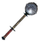 | **Chui** | 🔨 Mace | ForgeOfAgesDO Lv.3 | Iron ×16 Yggdrasil Wood ×8 Carapace ×6 FittingsBlackmetalDO ×40 | — | Iron ×8 Yggdrasil Wood ×4 |
|  | **Twin Chui** | ⚔️ Dual Wield | ForgeOfAgesDO Lv.3 | Iron ×24 Yggdrasil Wood ×12 Carapace ×9 FittingsBlackmetalDO ×40 | — | Iron ×12 Yggdrasil Wood ×6 |
|  | **Tengpai** | 🛡️ Shield | ForgeOfAgesDO Lv.3 | Carapace ×8 Yggdrasil Wood ×12 FittingsBlackmetalDO ×40 | — | Carapace ×4 Yggdrasil Wood ×6 |

#### 🏯 Shogun Weapons (9) — *Tier Flametal*

| Icon | Name | Type | Station | Recipe | Damage | Upgrade |
| :---: | --- | --- | --- | --- | --- | --- |
| 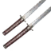 | **Daisho Twin Blades** | ⚔️ Dual Wield | ForgeOfAgesDO Lv.4 | Flametal ×35 WoodTarDO ×8 Ask Hide ×6 FittingsFlametalDO ×15 | — | Flametal ×10 Ask Hide ×3 |
| 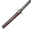 | **Crimson Katana** | ⚔️ Bastard Sword | ForgeOfAgesDO Lv.4 | Flametal ×25 WoodTarDO ×6 Ask Hide ×4 FittingsFlametalDO ×15 | — | Flametal ×10 Ask Hide ×2 |
| 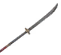 | **Blood Naginata** | 🔱 Atgeir | ForgeOfAgesDO Lv.4 | Flametal ×15 WoodTarDO ×10 Ask Hide ×4 FittingsFlametalDO ×15 | — | Flametal ×10 Ask Hide ×2 |
| 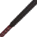 | **Obsidian Kanabo** | 🔨 Mace | ForgeOfAgesDO Lv.4 | Flametal ×10 WoodTarDO ×16 Ask Hide ×4 FittingsFlametalDO ×15 | — | Flametal ×5 WoodTarDO ×8 |
| 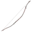 | **Crimson Yumi Bow** | 🏹 Bow | ForgeOfAgesDO Lv.4 | Flametal ×15 WoodTarDO ×10 Ask Hide ×4 FittingsFlametalDO ×15 | — | Flametal ×7 WoodTarDO ×5 |
| 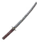 | **Crimson Wakizashi** | ⚔️ Sword | ForgeOfAgesDO Lv.4 | Flametal ×15 WoodTarDO ×4 Ask Hide ×4 FittingsFlametalDO ×15 | — | Flametal ×7 Ask Hide ×2 |
|  | **Imperial Tanto** | 🗡️ Dagger | ForgeOfAgesDO Lv.4 | Flametal ×10 WoodTarDO ×4 Ask Hide ×4 FittingsFlametalDO ×15 | — | Flametal ×5 Ask Hide ×2 |
|  | **Resolve Yari** | 🔱 Atgeir | ForgeOfAgesDO Lv.4 | Flametal ×15 WoodTarDO ×10 Ask Hide ×4 FittingsFlametalDO ×15 | — | Flametal ×7 Ask Hide ×2 |
| 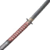 | **Fearless Nagamaki** | ⚔️ Bastard Sword | ForgeOfAgesDO Lv.4 | Flametal ×35 WoodTarDO ×8 Ask Hide ×6 FittingsFlametalDO ×15 | — | Flametal ×10 Ask Hide ×3 |

### ⚓ Galleon Ship & Upgrades

The **Galleon** is a large ship built at the **Naval Workshop**. It supports 16 upgrades (Blueprints → installed at the Naval Workshop) and 3 repair kits.

#### 🚢 Galleon — Build Recipe

Built as a ship (placed on water). Recipe:

Iron Nails ×200 WoodResinDO ×100 ShipRopeDO ×12 ShipParrotDO ×1

#### 🪝 Ship Accessories

| Icon | Item | Source | Recipe |
| :---: | --- | --- | --- |
|  | **Exotic Parrot** | Trade: Haldor (250 coins) | — |
|  | **Ship Wheel** | Drop: The Elder (100%) | — |
|  | **Rigging Rope** | Drop: Serpent (50%) | — |

#### 🔧 Ship Repair Kits

| Icon | Kit | Station | Recipe |
| :---: | --- | --- | --- |
| 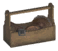 | **Small Ship Repair Kit** | — | *Craftable* |
| 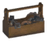 | **Medium Ship Repair Kit** | — | *Craftable* |
| 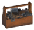 | **Large Ship Repair Kit** | — | *Craftable* |

#### ⬆️ 16 Galleon Upgrades

Each upgrade has a **Blueprint** (DraughtShip*) and an **installed upgrade** (UpgradeShipGalleon*). Craft the Blueprint at **Naval Workshop**, then install.

| Blueprint | Upgrade | Upgrade Icon | Blueprint Recipe | Upgrade Recipe |
| --- | --- | :---: | --- | --- |
|  | **Hull** |  | *No recipe* | DraughtShipHullDO ×1 Ceramic Plate ×30 WoodTarDO ×30 Iron Nails ×60 |
|  | **Sail** |  | *No recipe* | DraughtShipSailDO ×1 Linen Thread ×40 Red Jute ×12 ShipRopeDO ×6 |
|  | **Cannon** |  | *No recipe* | DraughtShipCannonDO ×1 Iron ×32 WoodResinDO ×32 Chain ×8 |
|  | **Crow's Nest** |  | *No recipe* | DraughtShipNestDO ×1 WoodTarDO ×15 Bronze Nails ×40 ShipRopeDO ×4 |
|  | **Lantern** |  | *No recipe* | DraughtShipLanternDO ×1 Lantern ×6 FittingsBronzeDO ×20 |
|  | **Ship Brazier** |  | *No recipe* | DraughtShipBrazierDO ×1 Iron ×3 Bronze ×6 Resin ×9 |
|  | **Ship Bell** |  | *No recipe* | DraughtShipBellDO ×1 Iron ×3 Iron Nails ×10 ShipRopeDO ×1 |
|  | **Ale Barrel** |  | *No recipe* | DraughtShipBarrelDO ×1 WoodResinDO ×10 Barrel Rings ×6 Barley ×20 |
|  | **Ship Anvil** |  | *No recipe* | DraughtShipAnvilDO ×1 Iron ×8 Round Log ×12 FittingsSilverDO ×10 |
|  | **Cartography** |  | *No recipe* | DraughtShipCartographyDO ×1 WoodResinDO ×10 Coal ×4 Feathers ×1 |
|  | **Anchor** |  | *No recipe* | DraughtShipAnchorDO ×1 Iron ×16 FittingsIronDO ×10 ShipRopeDO ×3 |
|  | **Seating** |  | *No recipe* | DraughtShipSeatingDO ×1 WoodResinDO ×12 Iron ×4 Bronze Nails ×20 |
|  | **Crew Quarters** |  | *No recipe* | DraughtShipQuartersDO ×1 WoodTarDO ×12 Black Metal ×6 Linen Thread ×10 |
|  | **Boarding Rope** |  | *No recipe* | DraughtShipBoardingDO ×1 WoodResinDO ×6 Bronze ×4 ShipRopeDO ×2 |
|  | **Mist Beacon** |  | *No recipe* | DraughtShipMistDO ×1 Linen Thread ×10 Black Metal ×6 Wisp ×3 |
|  | **Emergency Repair** |  | *No recipe* | DraughtShipRepairDO ×1 Fine Wood ×40 FittingsIronDO ×30 Bronze Nails ×120 |

#### 📡 Boarding Signal

 **Boarding Signal** — Iron ×3 Round Log ×6 Resin ×10

### 💣 Naval Workshop, Cannonballs & Shipwrecks

#### 🔧 Naval Workshop

 **Naval Workshop** — Station for building the Galleon, blueprints, upgrades, and cannonballs.

**Build Recipe:** Iron ×10 Elder Bark ×20 Iron Nails ×40 ShipWheelDO ×1

#### 💣 Cannonballs

| Icon | Cannonball | Station | Recipe | Craft Amt |
| :---: | --- | --- | --- | --- |
|  | **Stone Cannonball** | NavalWorkshopDO | Stone ×25 | ×50 |
|  | **Iron Cannonball** | NavalWorkshopDO | Iron ×2 Coal ×10 | ×50 |
|  | **Blackmetal Cannonball** | NavalWorkshopDO | Black Metal ×3 Coal ×10 | ×50 |
|  | **Grausten Cannonball** | NavalWorkshopDO | Grausten ×50 | ×50 |
|  | **Explosive Charge** | NavalWorkshopDO | Iron ×1 Surtling Core ×5 Tar ×3 Coal ×40 | ×10 |

#### 🏴‍☠️ Shipwrecks

Shipwrecks can be found in the ocean. They yield valuable materials and may contain special loot. The Naval Workshop is used to process shipwreck salvage into usable components.

### 🔨 Stations, Utility & Decor

#### ⚒️ Forge of Ages & 6 Extensions

The **Forge of Ages** is the central crafting station. Each extension unlocks new crafting capabilities:

| Icon | Station | Function | Level | Build Recipe |
| :---: | --- | --- | --- | --- |
|  | **Forge of Ages** | ⚒️ Forge — Main Station | Lv.1-4 (progressive) | Bronze ×10 Stone ×30 Bronze Nails ×40 Coal ×15 |
|  | **Blueprint Desk** | *Lv.1 — Schematic crafting* | Ext 1 | Wood ×15 Bronze ×3 BookSmithingDO ×1 |
|  | **Weapon Assembly** | *Lv.2 — Advanced weapons* | Ext 2 | Round Log ×15 Iron ×8 Iron Nails ×20 |
|  | **Armor Stand** | *Lv.3 — Silver-tier armor* | Ext 3 | WoodResinDO ×10 Silver ×8 FittingsSilverDO ×10 |
|  | **Weapon Rack** | *Lv.3 — Blackmetal weapons* | Ext 4 | WoodTarDO ×8 Black Metal ×16 FittingsIronDO ×10 |
|  | **Weaving Loom** | *Lv.3 — Linen & textiles* | Ext 5 | Yggdrasil Wood ×20 Linen Thread ×14 Iron ×4 |
|  | **Casting Smelter** | *Lv.4 — Flametal crafting* | Ext 6 | Flametal ×8 Grausten ×60 Sulfur Stone ×10 Surtling Core ×10 |

#### 🔧 Naval Workshop

 **Naval Workshop** — Builds Galleon, blueprints, upgrades, cannonballs, repair kits, and boarding tools.

Build: Iron ×10 Elder Bark ×20 Iron Nails ×40 ShipWheelDO ×1

#### 🏗️ Utility Structures

| Icon | Name | Prefab | Recipe |
| :---: | --- | --- | --- |
|  | **Cargo Crane** | `CraneCargoDO` | WoodResinDO ×40 Iron ×8 Iron Nails ×40 ShipRopeDO ×5 |
|  | **Cargo Cart** | `CartCargoDO` | WoodResinDO ×15 Iron ×2 Iron Nails ×20 |

#### 🎨 Decorative Pieces

| Icon | Name | Prefab | Recipe |
| :---: | --- | --- | --- |
|  | **Hookah** | `HookahDO` | Bronze ×1 Fine Wood ×2 Crystal ×2 Coal ×3 |
|  | **Persian Bed** | `BedPersianDO` | Fine Wood ×40 Linen Thread ×3 Lox Pelt ×6 Red Jute ×6 |
|  | **Throne Toilet** | `ThroneToiletDO` | Wood ×12 Iron ×1 Bronze Nails ×20 |
|  | **Taiko Drum** | `DrumTaikoDO` | Fine Wood ×10 Bronze ×1 Deer Hide ×2 |
|  | **Folding Screen** | `ScreenFoldingDO` | Fine Wood ×6 Deer Hide ×2 |

#### 🟫 Persian Carpets (8 variants)

4 floor patterns + 4 wall patterns, all crafted from Red Jute. All share the same build piece `piece_carpet_persian_DO` but differ in variant texture.

| Icon | Variant | Prefab | Recipe |
| :---: | --- | --- | --- |
|  | **Floor V1** | `CarpetPersianFloorV1DO` | Red Jute ×4 |
|  | **Floor V2** | `CarpetPersianFloorV2DO` | Red Jute ×4 |
|  | **Floor V3** | `CarpetPersianFloorV3DO` | Red Jute ×4 |
|  | **Floor V4** | `CarpetPersianFloorV4DO` | Red Jute ×4 |
|  | **Wall V1** | `CarpetPersianWallV1DO` | Red Jute ×4 |
|  | **Wall V2** | `CarpetPersianWallV2DO` | Red Jute ×4 |
|  | **Wall V3** | `CarpetPersianWallV3DO` | Red Jute ×4 |
|  | **Wall V4** | `CarpetPersianWallV4DO` | Red Jute ×4 |
